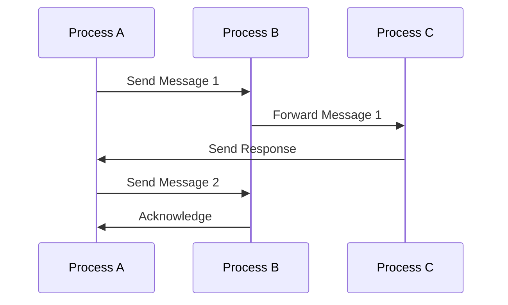

## 4.1 The Actor Model and Erlang Processes

Concurrency is a cornerstone of modern software development, enabling applications to perform multiple tasks simultaneously. Erlang, a language designed for building scalable and fault-tolerant systems, leverages the Actor Model to achieve concurrency. In this section, we will explore the principles of the Actor Model, how Erlang processes embody these principles, and the advantages of using this model for concurrent programming.

### Understanding the Actor Model

The Actor Model is a conceptual model for dealing with concurrent computation. It was first introduced by Carl Hewitt in 1973 and has since become a foundational concept in concurrent programming. The Actor Model treats "actors" as the fundamental units of computation. Each actor can:

- **Receive messages**: Actors communicate with each other through message passing.
- **Process messages**: Upon receiving a message, an actor can perform computations, change its state, or send messages to other actors.
- **Create new actors**: Actors can spawn new actors to handle specific tasks.

This model abstracts away the complexities of thread management and synchronization, making it easier to reason about concurrent systems.

### Erlang Processes: Lightweight and Isolated

Erlang implements the Actor Model through its lightweight processes. Unlike operating system threads, Erlang processes are extremely lightweight, allowing thousands or even millions of processes to run concurrently on a single machine. Key characteristics of Erlang processes include:

- **Isolation**: Each process has its own memory space, ensuring that processes do not share state. This isolation prevents issues such as race conditions and makes fault tolerance easier to achieve.
- **Lightweight**: Erlang processes consume minimal resources, enabling the creation of a large number of processes without significant overhead.
- **Message Passing**: Processes communicate through asynchronous message passing, which decouples the sender and receiver and enhances system scalability.

### Spawning Processes in Erlang

To illustrate the creation and management of processes in Erlang, let's explore some code examples. Erlang provides the `spawn` function to create new processes. Here's a simple example:

```erlang
-module(actor_example).
-export([start/0, actor/0]).

start() ->
    % Spawn a new process running the actor function
    Pid = spawn(actor_example, actor, []),
    % Send a message to the new process
    Pid ! {self(), "Hello, Actor"},
    % Receive a response from the actor
    receive
        {Pid, Response} ->
            io:format("Received response: ~p~n", [Response])
    end.

actor() ->
    receive
        {Sender, Message} ->
            io:format("Actor received message: ~p~n", [Message]),
            % Send a response back to the sender
            Sender ! {self(), "Message received"}
    end.
```

In this example, we define a module `actor_example` with two functions: `start/0` and `actor/0`. The `start/0` function spawns a new process running the `actor/0` function and sends it a message. The actor process receives the message, prints it, and sends a response back to the sender.

### Advantages of the Actor Model in Erlang

The Actor Model offers several advantages for concurrent programming, particularly in Erlang:

1. **Scalability**: The lightweight nature of Erlang processes allows systems to scale horizontally by distributing processes across multiple nodes.
2. **Fault Tolerance**: Process isolation and the "let it crash" philosophy enable systems to recover from failures gracefully. Supervisors can monitor processes and restart them if they fail.
3. **Simplified Concurrency**: By abstracting away low-level concurrency primitives like locks and semaphores, the Actor Model simplifies the development of concurrent applications.
4. **Decoupled Components**: Message passing decouples components, making it easier to modify and extend systems without affecting other parts.

### Differences Between Erlang's Approach and Other Models

Erlang's implementation of the Actor Model differs from other concurrency models in several ways:

- **Shared State vs. Message Passing**: Traditional thread-based models often rely on shared state and synchronization mechanisms, leading to complexity and potential errors. Erlang's message-passing approach avoids these pitfalls.
- **Preemptive vs. Cooperative Scheduling**: Erlang uses preemptive scheduling, allowing the runtime system to manage process execution efficiently. This contrasts with cooperative scheduling, where processes must yield control explicitly.
- **Fault Tolerance**: Erlang's built-in support for fault tolerance, through features like supervisors and process monitoring, sets it apart from other models that require additional libraries or frameworks.

### Visualizing Erlang Processes and Message Passing

To better understand how Erlang processes interact, let's visualize the process and message flow using a Mermaid.js diagram:



**Diagram Description**: This sequence diagram illustrates the message flow between three processes: A, B, and C. Process A sends a message to Process B, which forwards it to Process C. Process C then sends a response back to Process A. Additionally, Process A sends another message to Process B, which acknowledges receipt.

### Try It Yourself

To deepen your understanding of Erlang processes and the Actor Model, try modifying the code example above. Here are some suggestions:

- **Add more processes**: Create additional processes and experiment with different message-passing patterns.
- **Implement error handling**: Introduce intentional errors and observe how the system behaves. Consider adding a supervisor to manage process failures.
- **Explore process links**: Use `link/1` and `unlink/1` to create links between processes and handle process termination.

### Key Takeaways

- The Actor Model provides a robust framework for building concurrent systems by treating actors as independent units of computation.
- Erlang processes are lightweight, isolated, and communicate through message passing, making them ideal for scalable and fault-tolerant applications.
- The Actor Model simplifies concurrency by abstracting away low-level synchronization mechanisms and promoting decoupled components.
- Erlang's approach to concurrency, with its emphasis on fault tolerance and process isolation, offers distinct advantages over traditional thread-based models.

### Further Reading

For more information on the Actor Model and Erlang processes, consider exploring the following resources:

- [Erlang's Official Documentation](https://www.erlang.org/doc/)
- [Learn You Some Erlang for Great Good!](http://learnyousomeerlang.com/)
- [The Actor Model (Wikipedia)](https://en.wikipedia.org/wiki/Actor_model)

## Quiz: The Actor Model and Erlang Processes



### What is the primary unit of computation in the Actor Model?

- [x] Actor
- [ ] Thread
- [ ] Process
- [ ] Function

> **Explanation:** In the Actor Model, the primary unit of computation is the actor, which can receive messages, process them, and send messages to other actors.

### How do Erlang processes communicate with each other?

- [x] Message passing
- [ ] Shared memory
- [ ] Global variables
- [ ] Direct function calls

> **Explanation:** Erlang processes communicate through asynchronous message passing, which decouples the sender and receiver.

### What is a key advantage of Erlang processes over traditional threads?

- [x] Lightweight and isolated
- [ ] Faster execution
- [ ] Shared state
- [ ] Built-in GUI support

> **Explanation:** Erlang processes are lightweight and isolated, allowing for a large number of concurrent processes without significant overhead.

### What scheduling method does Erlang use for processes?

- [x] Preemptive scheduling
- [ ] Cooperative scheduling
- [ ] Round-robin scheduling
- [ ] Priority scheduling

> **Explanation:** Erlang uses preemptive scheduling, allowing the runtime system to manage process execution efficiently.

### What philosophy does Erlang embrace for handling process failures?

- [x] Let it crash
- [ ] Catch and log
- [ ] Retry until success
- [ ] Ignore and continue

> **Explanation:** Erlang embraces the "let it crash" philosophy, allowing processes to fail and be restarted by supervisors.

### Which of the following is NOT a characteristic of Erlang processes?

- [ ] Isolation
- [ ] Lightweight
- [x] Shared state
- [ ] Message passing

> **Explanation:** Erlang processes do not share state; they are isolated and communicate through message passing.

### What is the role of a supervisor in Erlang?

- [x] Monitor and restart failed processes
- [ ] Execute high-priority tasks
- [ ] Manage memory allocation
- [ ] Handle user input

> **Explanation:** A supervisor in Erlang monitors processes and restarts them if they fail, ensuring system reliability.

### How does Erlang's approach to concurrency differ from traditional models?

- [x] Uses message passing instead of shared state
- [ ] Relies on global variables
- [ ] Requires manual thread management
- [ ] Uses cooperative scheduling

> **Explanation:** Erlang uses message passing instead of shared state, simplifying concurrency and avoiding synchronization issues.

### What is a common use case for the Actor Model in Erlang?

- [x] Building scalable and fault-tolerant systems
- [ ] Developing graphical user interfaces
- [ ] Writing low-level device drivers
- [ ] Creating static websites

> **Explanation:** The Actor Model is commonly used in Erlang to build scalable and fault-tolerant systems, leveraging process isolation and message passing.

### True or False: Erlang processes can share memory directly.

- [ ] True
- [x] False

> **Explanation:** Erlang processes cannot share memory directly; they are isolated and communicate through message passing.



Remember, this is just the beginning. As you progress, you'll build more complex and interactive systems using Erlang's powerful concurrency model. Keep experimenting, stay curious, and enjoy the journey!
