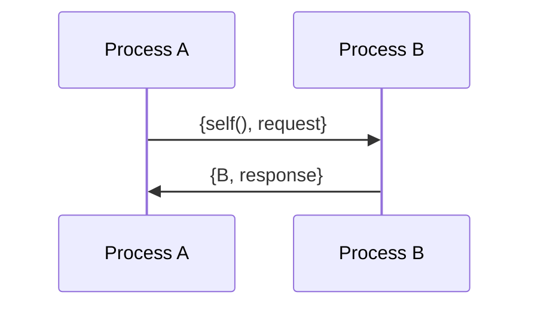

## 4.2 Message Passing and Process Communication

In Erlang, message passing is the primary mechanism for communication between processes. This approach is central to Erlang's concurrency model, allowing processes to interact without sharing memory. In this section, we will delve into the syntax and semantics of message passing, explore process communication patterns, and address common issues such as message ordering and selective receive. We will also emphasize the importance of designing robust communication protocols.

### Understanding Erlang Processes

Erlang processes are lightweight and isolated, running concurrently within the Erlang runtime system. Each process has its own memory space, and the only way to communicate with other processes is through message passing. This design eliminates the need for locks and other synchronization mechanisms, reducing the risk of concurrency-related bugs.

### Sending and Receiving Messages

#### Sending Messages

To send a message to a process, you use the `!` operator. The syntax is straightforward:

```erlang
Pid ! Message
```

- **Pid**: The process identifier of the recipient.
- **Message**: The message being sent, which can be any Erlang term.

#### Receiving Messages

To receive messages, a process uses the `receive` block. The basic syntax is:

```erlang
receive
    Pattern1 -> 
        % Actions for Pattern1
    Pattern2 -> 
        % Actions for Pattern2
    ...
end
```

- **Pattern**: A pattern that the incoming message is matched against.
- **Actions**: The code to execute when a pattern is matched.

### Example: Basic Message Passing

Let's look at a simple example where one process sends a message to another:

```erlang
-module(message_passing).
-export([start/0, receiver/0]).

start() ->
    ReceiverPid = spawn(?MODULE, receiver, []),
    ReceiverPid ! {self(), "Hello, Erlang!"}.

receiver() ->
    receive
        {Sender, Message} ->
            io:format("Received message: ~p from ~p~n", [Message, Sender]),
            Sender ! {self(), "Message received"}
    end.
```

- **Explanation**: In this example, the `start/0` function spawns a new process running the `receiver/0` function. It then sends a message to the receiver process. The receiver process waits for a message, prints it, and sends a confirmation back to the sender.

### Process Communication Patterns

Erlang's message passing allows for various communication patterns. Here are some common ones:

#### Request-Response Pattern

In this pattern, a process sends a request and waits for a response. This is useful for synchronous interactions.

```erlang
request_response(Sender, Receiver) ->
    Receiver ! {self(), request},
    receive
        {Receiver, response} ->
            io:format("Received response from ~p~n", [Receiver])
    end.
```

#### Publish-Subscribe Pattern

In this pattern, a process broadcasts messages to multiple subscribers.

```erlang
publish(Topic, Message, Subscribers) ->
    lists:foreach(fun(Subscriber) -> Subscriber ! {Topic, Message} end, Subscribers).
```

### Message Ordering and Selective Receive

#### Message Ordering

Erlang guarantees that messages sent from one process to another are received in the order they were sent. However, messages from different processes may be interleaved.

#### Selective Receive

Selective receive allows a process to handle messages out of order by specifying patterns in the `receive` block. This can be useful for prioritizing certain messages.

```erlang
receive
    {priority, Msg} ->
        handle_priority(Msg);
    {normal, Msg} ->
        handle_normal(Msg)
after 5000 ->
    io:format("Timeout waiting for messages~n")
end.
```

- **Explanation**: In this example, messages with the `priority` tag are handled before `normal` messages, even if they arrive later.

### Designing Robust Communication Protocols

When designing communication protocols in Erlang, consider the following:

- **Message Structure**: Define clear and consistent message formats.
- **Error Handling**: Implement mechanisms to handle unexpected messages or errors.
- **Timeouts**: Use timeouts to avoid blocking indefinitely.
- **Backpressure**: Implement strategies to handle high message volumes.

### Common Issues and Solutions

#### Deadlocks

Deadlocks can occur if processes wait indefinitely for messages. To avoid this, use timeouts and ensure that all messages are eventually handled.

#### Message Overload

If a process receives messages faster than it can handle them, it may become overloaded. Consider using load balancing or backpressure mechanisms.

### Visualizing Message Passing

Below is a sequence diagram illustrating a simple request-response interaction between two processes:



- **Explanation**: Process A sends a request to Process B and waits for a response. Process B processes the request and sends a response back to Process A.

### Try It Yourself

Experiment with the code examples provided. Try modifying the message structures or implementing additional communication patterns, such as a round-robin dispatcher or a load balancer.

### References and Further Reading

- [Erlang Documentation on Processes](https://erlang.org/doc/reference_manual/processes.html)
- [Learn You Some Erlang for Great Good!](http://learnyousomeerlang.com/)
- [Erlang Programming: A Concurrent Approach to Software Development](https://www.oreilly.com/library/view/erlang-programming/9780596518189/)

### Knowledge Check

- What is the primary mechanism for communication between Erlang processes?
- How does Erlang ensure message ordering between processes?
- What is selective receive, and why is it useful?

### Embrace the Journey

Remember, mastering message passing and process communication in Erlang is a journey. As you experiment and build more complex systems, you'll gain a deeper understanding of Erlang's powerful concurrency model. Keep exploring, stay curious, and enjoy the process!

## Quiz: Message Passing and Process Communication



### What is the primary mechanism for communication between Erlang processes?

- [x] Message passing
- [ ] Shared memory
- [ ] Global variables
- [ ] Direct function calls

> **Explanation:** Erlang processes communicate exclusively through message passing, ensuring isolation and concurrency.

### How does Erlang ensure message ordering between processes?

- [x] Messages from one process to another are received in the order sent.
- [ ] Messages are received in random order.
- [ ] Messages are sorted by priority.
- [ ] Messages are received based on sender's process ID.

> **Explanation:** Erlang guarantees that messages sent from one process to another are received in the order they were sent.

### What is selective receive in Erlang?

- [x] The ability to handle messages out of order based on patterns.
- [ ] Receiving messages in the order they were sent.
- [ ] Ignoring certain messages.
- [ ] Prioritizing messages based on size.

> **Explanation:** Selective receive allows processes to match and handle messages based on specific patterns, enabling out-of-order processing.

### What is a common pattern for synchronous interactions between processes?

- [x] Request-response pattern
- [ ] Publish-subscribe pattern
- [ ] Observer pattern
- [ ] Singleton pattern

> **Explanation:** The request-response pattern is used for synchronous interactions, where a process sends a request and waits for a response.

### What is a potential issue if a process receives messages faster than it can handle them?

- [x] Message overload
- [ ] Deadlock
- [ ] Race condition
- [ ] Memory leak

> **Explanation:** Message overload occurs when a process cannot keep up with the incoming message rate, potentially leading to performance issues.

### How can deadlocks be avoided in Erlang message passing?

- [x] Use timeouts and ensure all messages are handled.
- [ ] Use shared memory.
- [ ] Increase process priority.
- [ ] Use global variables.

> **Explanation:** Timeouts and proper message handling help prevent deadlocks by ensuring processes do not wait indefinitely.

### What is the syntax for sending a message to a process in Erlang?

- [x] Pid ! Message
- [ ] send(Pid, Message)
- [ ] Message -> Pid
- [ ] Pid <- Message

> **Explanation:** The `!` operator is used to send messages to a process in Erlang.

### What is the purpose of the `receive` block in Erlang?

- [x] To receive and handle messages sent to a process.
- [ ] To send messages to other processes.
- [ ] To create new processes.
- [ ] To terminate a process.

> **Explanation:** The `receive` block is used to match and handle incoming messages in a process.

### What is the benefit of using the publish-subscribe pattern?

- [x] Allows broadcasting messages to multiple subscribers.
- [ ] Ensures messages are received in order.
- [ ] Prioritizes messages based on sender.
- [ ] Reduces message size.

> **Explanation:** The publish-subscribe pattern enables a process to broadcast messages to multiple subscribers, facilitating one-to-many communication.

### True or False: Erlang processes share memory for communication.

- [ ] True
- [x] False

> **Explanation:** Erlang processes do not share memory; they communicate exclusively through message passing, ensuring isolation and concurrency.




