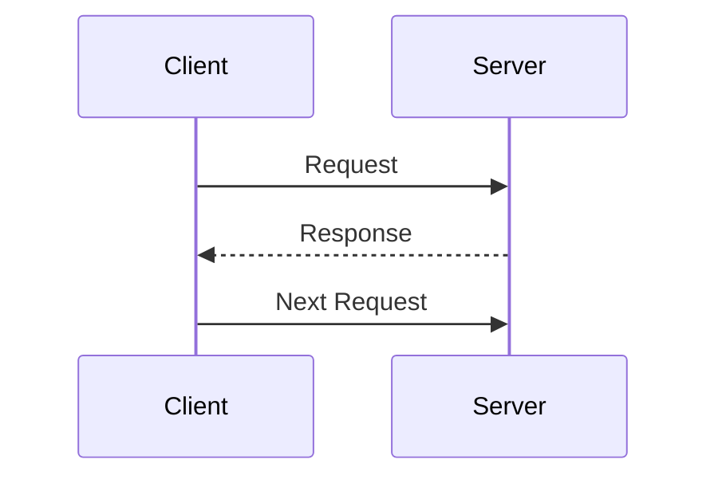
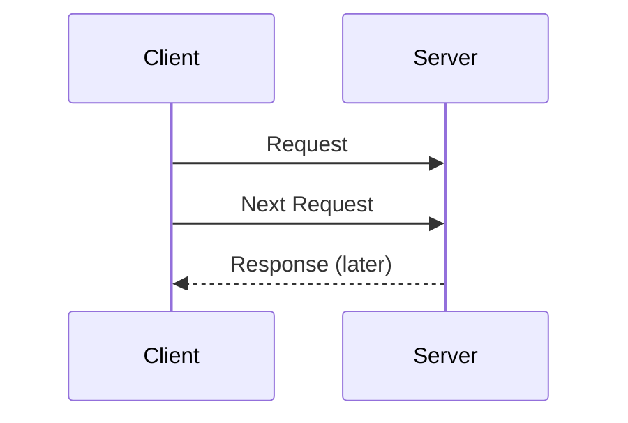

## 4.3 Synchronous vs. Asynchronous Messaging

In the world of concurrent programming, messaging is a fundamental concept that allows processes to communicate and coordinate with each other. Erlang, with its robust concurrency model, provides powerful primitives for both synchronous and asynchronous messaging. Understanding the differences between these two types of messaging is crucial for designing efficient and responsive systems.

### Understanding Synchronous and Asynchronous Communication

**Synchronous Communication** involves a direct interaction where the sender waits for a response from the receiver before proceeding. This is akin to a phone call where one party waits for the other to respond before continuing the conversation.

**Asynchronous Communication**, on the other hand, allows the sender to continue its execution without waiting for a response. This is similar to sending an email, where the sender can move on to other tasks while waiting for a reply.

### Implementing Synchronous Messaging in Erlang

In Erlang, synchronous messaging is typically implemented using the `gen_server` behavior, which provides a framework for building server processes. The `gen_server` module supports synchronous calls through the `call` function, which waits for a reply from the server.

#### Example: Synchronous Messaging with `gen_server`

Let's explore how to implement synchronous messaging using `gen_server`.

```erlang
-module(sync_server).
-behaviour(gen_server).

%% API
-export([start_link/0, get_data/0]).

%% gen_server callbacks
-export([init/1, handle_call/3, handle_cast/2, handle_info/2, terminate/2, code_change/3]).

%% Start the server
start_link() ->
    gen_server:start_link({local, ?MODULE}, ?MODULE, [], []).

%% Client API
get_data() ->
    gen_server:call(?MODULE, get_data).

%% gen_server callbacks
init([]) ->
    {ok, #{data => "Hello, World!"}}.

handle_call(get_data, _From, State) ->
    {reply, maps:get(data, State), State};

handle_call(_Request, _From, State) ->
    {reply, {error, unknown_request}, State}.

handle_cast(_Msg, State) ->
    {noreply, State}.

handle_info(_Info, State) ->
    {noreply, State}.

terminate(_Reason, _State) ->
    ok.

code_change(_OldVsn, State, _Extra) ->
    {ok, State}.
```

In this example, we define a `sync_server` module that implements the `gen_server` behavior. The `get_data/0` function sends a synchronous call to the server, which waits for a response before proceeding. The `handle_call/3` function processes the request and returns the data.

### Implementing Asynchronous Messaging in Erlang

Asynchronous messaging in Erlang is achieved using the `cast` function in the `gen_server` module. This allows the sender to send a message and continue execution without waiting for a response.

#### Example: Asynchronous Messaging with `gen_server`

Let's see how to implement asynchronous messaging using `gen_server`.

```erlang
-module(async_server).
-behaviour(gen_server).

%% API
-export([start_link/0, update_data/1]).

%% gen_server callbacks
-export([init/1, handle_call/3, handle_cast/2, handle_info/2, terminate/2, code_change/3]).

%% Start the server
start_link() ->
    gen_server:start_link({local, ?MODULE}, ?MODULE, [], []).

%% Client API
update_data(NewData) ->
    gen_server:cast(?MODULE, {update_data, NewData}).

%% gen_server callbacks
init([]) ->
    {ok, #{data => "Initial Data"}}.

handle_cast({update_data, NewData}, State) ->
    io:format("Data updated to: ~p~n", [NewData]),
    {noreply, maps:put(data, NewData, State)}.

handle_call(_Request, _From, State) ->
    {reply, {error, unknown_request}, State}.

handle_info(_Info, State) ->
    {noreply, State}.

terminate(_Reason, _State) ->
    ok.

code_change(_OldVsn, State, _Extra) ->
    {ok, State}.
```

In this example, the `async_server` module uses the `cast` function to send an asynchronous message to update the server's data. The `handle_cast/2` function processes the message without blocking the sender.

### Use Cases for Synchronous and Asynchronous Messaging

**Synchronous Messaging** is ideal for scenarios where a response is required before proceeding. This is useful in situations where the result of the operation is needed immediately, such as querying a database or performing a calculation.

**Asynchronous Messaging** is suitable for tasks that can be performed independently of the sender's execution flow. This is beneficial in scenarios like logging, notifications, or updating a cache, where the sender does not need to wait for the operation to complete.

### Considerations for Choosing the Appropriate Method

When deciding between synchronous and asynchronous messaging, consider the following factors:

- **Response Time**: If immediate feedback is necessary, synchronous messaging is preferred.
- **System Load**: Asynchronous messaging can help distribute load by allowing processes to continue without waiting.
- **Complexity**: Synchronous messaging is simpler to implement but can lead to bottlenecks if not managed properly.
- **Error Handling**: Asynchronous messaging requires careful handling of failures and retries, as the sender does not wait for a response.

### Visualizing Synchronous vs. Asynchronous Messaging

To better understand the flow of synchronous and asynchronous messaging, let's visualize these concepts using Mermaid.js diagrams.

#### Synchronous Messaging Flow



In synchronous messaging, the client waits for a response from the server before sending the next request.

#### Asynchronous Messaging Flow



In asynchronous messaging, the client sends multiple requests without waiting for responses, which are processed later by the server.

### Try It Yourself

Experiment with the provided code examples by modifying the server's behavior or adding new message types. Try implementing a scenario where both synchronous and asynchronous messaging are used together to achieve a specific task.

### References and Further Reading

- [Erlang Official Documentation](https://www.erlang.org/doc/)
- [Learn You Some Erlang for Great Good!](https://learnyousomeerlang.com/)
- [Erlang and OTP in Action](https://www.manning.com/books/erlang-and-otp-in-action)

### Knowledge Check

- What are the key differences between synchronous and asynchronous messaging?
- How does the `gen_server` behavior facilitate synchronous communication?
- In what scenarios would you prefer asynchronous messaging over synchronous?

### Embrace the Journey

Remember, mastering messaging patterns in Erlang is a journey. As you continue to explore and experiment, you'll gain a deeper understanding of how to build efficient and scalable systems. Keep pushing the boundaries, stay curious, and enjoy the process!

## Quiz: Synchronous vs. Asynchronous Messaging



### What is the main difference between synchronous and asynchronous messaging?

- [x] Synchronous messaging waits for a response, while asynchronous does not.
- [ ] Asynchronous messaging waits for a response, while synchronous does not.
- [ ] Both require waiting for a response.
- [ ] Neither requires waiting for a response.

> **Explanation:** Synchronous messaging involves waiting for a response before proceeding, whereas asynchronous messaging allows the sender to continue without waiting.

### Which Erlang behavior is commonly used for implementing synchronous messaging?

- [x] gen_server
- [ ] gen_event
- [ ] gen_statem
- [ ] supervisor

> **Explanation:** The `gen_server` behavior is used for implementing synchronous messaging through its `call` function.

### In which scenario is asynchronous messaging more beneficial?

- [x] Logging operations
- [ ] Database queries
- [ ] Calculations requiring immediate results
- [ ] User authentication

> **Explanation:** Asynchronous messaging is beneficial for operations like logging, where the sender does not need to wait for a response.

### What function is used in `gen_server` for asynchronous messaging?

- [x] cast
- [ ] call
- [ ] send
- [ ] reply

> **Explanation:** The `cast` function in `gen_server` is used for asynchronous messaging, allowing the sender to continue without waiting for a response.

### What is a potential drawback of synchronous messaging?

- [x] It can lead to bottlenecks if not managed properly.
- [ ] It is too complex to implement.
- [ ] It cannot handle errors effectively.
- [ ] It is not suitable for any real-world applications.

> **Explanation:** Synchronous messaging can lead to bottlenecks if the server takes too long to respond, blocking the sender.

### Which of the following is a key consideration when choosing between synchronous and asynchronous messaging?

- [x] System load
- [ ] Color of the server
- [ ] Number of developers
- [ ] Type of database used

> **Explanation:** System load is a key consideration, as asynchronous messaging can help distribute load by allowing processes to continue without waiting.

### How does the `gen_server` behavior handle synchronous requests?

- [x] Through the `handle_call/3` function
- [ ] Through the `handle_cast/2` function
- [ ] Through the `handle_info/2` function
- [ ] Through the `terminate/2` function

> **Explanation:** The `handle_call/3` function in `gen_server` is used to process synchronous requests.

### What is a common use case for synchronous messaging?

- [x] Querying a database
- [ ] Sending notifications
- [ ] Logging events
- [ ] Updating a cache

> **Explanation:** Synchronous messaging is commonly used for querying a database where immediate feedback is required.

### True or False: Asynchronous messaging always requires a response from the server.

- [ ] True
- [x] False

> **Explanation:** Asynchronous messaging does not require a response from the server, allowing the sender to continue without waiting.

### Which function in `gen_server` is used to start the server process?

- [x] start_link
- [ ] init
- [ ] handle_call
- [ ] terminate

> **Explanation:** The `start_link` function is used to start the server process in `gen_server`.


