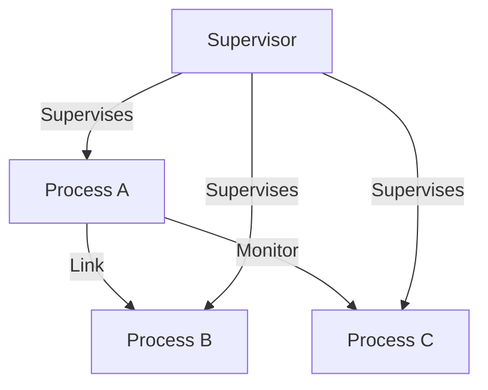

## 4.4 Process Lifecycle Management

In the world of Erlang, processes are the fundamental units of concurrency. Understanding how to manage the lifecycle of these processes is crucial for building robust and fault-tolerant applications. In this section, we will delve into the intricacies of process lifecycle management, covering process creation, monitoring, termination, and the role of supervisors in maintaining system stability.

### Understanding Erlang Processes

Erlang processes are lightweight and isolated, allowing for massive concurrency. Each process has its own memory and does not share state with others, which eliminates the need for locks and makes concurrency easier to manage.

### Spawning Processes and Assigning PIDs

To create a new process in Erlang, we use the `spawn` function. This function takes a module, function, and arguments, and returns a process identifier (PID), which uniquely identifies the process.

```erlang
-module(process_example).
-export([start/0, loop/0]).

start() ->
    % Spawning a new process
    PID = spawn(?MODULE, loop, []),
    io:format("Spawned process with PID: ~p~n", [PID]).

loop() ->
    receive
        stop ->
            io:format("Stopping process~n");
        _ ->
            io:format("Process is running~n"),
            loop()
    end.
```

In this example, the `start/0` function spawns a new process that runs the `loop/0` function. The `loop/0` function listens for messages and continues running until it receives a `stop` message.

### Linking and Monitoring Processes

Erlang provides mechanisms to link and monitor processes, which are essential for managing their lifecycles.

#### Linking Processes

Linking is a way to create a bidirectional connection between two processes. If one process terminates, the other receives an exit signal. This is useful for ensuring that related processes terminate together.

```erlang
link_processes() ->
    PID1 = spawn(fun() -> process1() end),
    PID2 = spawn(fun() -> process2() end),
    link(PID1),
    link(PID2).

process1() ->
    receive
        {exit, Reason} ->
            io:format("Process 1 exiting due to: ~p~n", [Reason])
    end.

process2() ->
    exit(self(), normal).
```

In this example, `process1` and `process2` are linked. When `process2` exits normally, `process1` receives an exit signal.

#### Monitoring Processes

Monitoring is a unidirectional mechanism that allows a process to be notified when another process terminates, without affecting the monitored process.

```erlang
monitor_process() ->
    PID = spawn(fun() -> process3() end),
    Ref = erlang:monitor(process, PID),
    receive
        {'DOWN', Ref, process, PID, Reason} ->
            io:format("Process ~p terminated with reason: ~p~n", [PID, Reason])
    end.

process3() ->
    exit(self(), normal).
```

Here, `monitor_process` monitors `process3`. When `process3` terminates, a `'DOWN'` message is received with the reason for termination.

### Handling Process Termination

Processes can terminate normally or abnormally. It's important to handle both cases to ensure system stability.

#### Normal Termination

A process terminates normally when it completes its execution or explicitly calls `exit(normal)`.

```erlang
normal_termination() ->
    PID = spawn(fun() -> exit(normal) end),
    io:format("Process ~p terminated normally~n", [PID]).
```

#### Abnormal Termination

Abnormal termination occurs when a process crashes due to an error or receives an exit signal with a reason other than `normal`.

```erlang
abnormal_termination() ->
    PID = spawn(fun() -> exit({error, "Something went wrong"}) end),
    io:format("Process ~p terminated abnormally~n", [PID]).
```

### Cleaning Up Resources and Avoiding Orphaned Processes

When a process terminates, it's crucial to clean up resources to prevent memory leaks and orphaned processes. This can be achieved by:

- Using `after` clauses in `receive` blocks to ensure cleanup code runs regardless of how the process terminates.
- Implementing proper supervision strategies to restart or terminate related processes.

```erlang
cleanup_example() ->
    PID = spawn(fun() -> cleanup_process() end),
    io:format("Started process ~p~n", [PID]).

cleanup_process() ->
    try
        % Simulate work
        timer:sleep(1000),
        exit(normal)
    after
        % Cleanup resources
        io:format("Cleaning up resources~n")
    end.
```

### The Role of Supervisors in Process Lifecycle Management

Supervisors are special processes designed to monitor and manage other processes. They automatically restart child processes when they terminate abnormally, ensuring system resilience.

#### Creating a Supervisor

To create a supervisor, define a module that implements the `supervisor` behavior and specifies a supervision strategy.

```erlang
-module(my_supervisor).
-behaviour(supervisor).

-export([start_link/0, init/1]).

start_link() ->
    supervisor:start_link({local, ?MODULE}, ?MODULE, []).

init([]) ->
    % Define child processes and restart strategy
    {ok, {{one_for_one, 5, 10},
          [{child1, {process_example, start, []},
            permanent, 5000, worker, [process_example]}]}}.
```

In this example, `my_supervisor` supervises `process_example` using a `one_for_one` strategy, meaning if a child process terminates, only that process is restarted.

### Visualizing Process Lifecycle Management

To better understand the process lifecycle, let's visualize the interactions between processes, links, monitors, and supervisors.



This diagram illustrates how Process A is linked to Process B and monitors Process C. A supervisor oversees all three processes, ensuring they are restarted if necessary.

### Strategies for Effective Process Lifecycle Management

1. **Use Links for Related Processes**: Link processes that should terminate together to prevent orphaned processes.
2. **Monitor Critical Processes**: Monitor processes that are crucial to your application's functionality to receive notifications of their termination.
3. **Implement Supervisors**: Use supervisors to manage process restarts and maintain system stability.
4. **Clean Up Resources**: Ensure that resources are cleaned up when processes terminate to avoid memory leaks.
5. **Handle All Termination Scenarios**: Prepare for both normal and abnormal terminations to ensure graceful shutdowns and restarts.

### Try It Yourself

Experiment with the code examples provided. Try modifying the `loop/0` function to handle different messages, or change the supervision strategy in `my_supervisor` to see how it affects process management.

### Knowledge Check

- How do you spawn a new process in Erlang?
- What is the difference between linking and monitoring processes?
- How can you ensure resources are cleaned up when a process terminates?
- What role do supervisors play in process lifecycle management?

### Summary

In this section, we've explored the essentials of process lifecycle management in Erlang. By understanding how to create, monitor, and terminate processes, and leveraging supervisors, you can build robust and fault-tolerant applications. Remember, this is just the beginning. As you progress, you'll gain deeper insights into Erlang's powerful concurrency model. Keep experimenting, stay curious, and enjoy the journey!

## Quiz: Process Lifecycle Management



### How do you spawn a new process in Erlang?

- [x] Using the `spawn` function
- [ ] Using the `start` function
- [ ] Using the `init` function
- [ ] Using the `create` function

> **Explanation:** The `spawn` function is used to create a new process in Erlang.

### What does linking processes achieve?

- [x] It creates a bidirectional connection where both processes receive exit signals.
- [ ] It allows one process to monitor another without affecting it.
- [ ] It merges two processes into one.
- [ ] It duplicates the process state.

> **Explanation:** Linking creates a bidirectional connection between processes, causing them to receive exit signals from each other.

### What is the purpose of monitoring a process?

- [x] To receive a notification when the monitored process terminates
- [ ] To prevent the process from terminating
- [ ] To merge the process with another
- [ ] To duplicate the process state

> **Explanation:** Monitoring allows a process to receive a notification when another process terminates.

### How can you handle abnormal process termination?

- [x] By using supervisors to restart the process
- [ ] By ignoring the termination
- [ ] By merging the process with another
- [ ] By duplicating the process state

> **Explanation:** Supervisors can automatically restart processes that terminate abnormally.

### What is the role of a supervisor in Erlang?

- [x] To manage and restart child processes
- [ ] To merge processes
- [ ] To duplicate process states
- [ ] To prevent processes from terminating

> **Explanation:** Supervisors manage and restart child processes to maintain system stability.

### How do you clean up resources when a process terminates?

- [x] Use an `after` clause in a `receive` block
- [ ] Use a `before` clause in a `receive` block
- [ ] Use a `finally` clause in a `receive` block
- [ ] Use a `catch` clause in a `receive` block

> **Explanation:** An `after` clause in a `receive` block ensures cleanup code runs regardless of how the process terminates.

### What happens when a linked process terminates?

- [x] The linked process receives an exit signal
- [ ] The linked process merges with another
- [ ] The linked process duplicates its state
- [ ] The linked process prevents termination

> **Explanation:** When a linked process terminates, the other process receives an exit signal.

### What is a PID in Erlang?

- [x] A unique identifier for a process
- [ ] A unique identifier for a module
- [ ] A unique identifier for a function
- [ ] A unique identifier for a variable

> **Explanation:** A PID is a unique identifier for a process in Erlang.

### How do you ensure a process is restarted after abnormal termination?

- [x] Use a supervisor with a restart strategy
- [ ] Use a monitor with a restart strategy
- [ ] Use a link with a restart strategy
- [ ] Use a PID with a restart strategy

> **Explanation:** Supervisors with restart strategies ensure processes are restarted after abnormal termination.

### True or False: Monitoring a process affects its execution.

- [x] False
- [ ] True

> **Explanation:** Monitoring a process does not affect its execution; it only notifies the monitoring process of termination.


