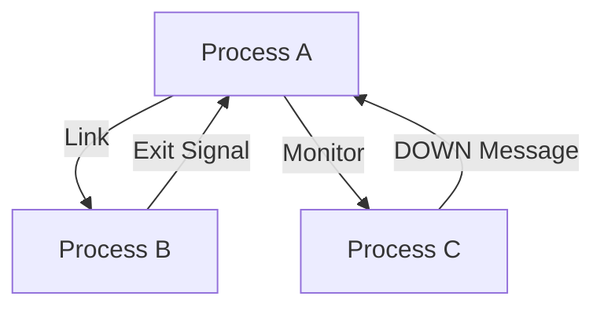

## 4.5 Process Linking and Monitoring

In the world of concurrent programming, managing processes effectively is crucial for building robust and fault-tolerant systems. Erlang, with its unique concurrency model, provides powerful tools for process management, namely **process linking** and **monitoring**. These mechanisms are integral to the design of resilient systems, especially within the OTP (Open Telecom Platform) framework.

### Understanding Process Linking and Monitoring

Before diving into the specifics, let's clarify the fundamental differences between linking and monitoring processes in Erlang.

- **Linking**: Establishes a bidirectional relationship between two processes. If one process terminates, the other receives an exit signal, potentially causing it to terminate as well. This is useful for creating tightly coupled processes that should fail together.
  
- **Monitoring**: Sets up a unidirectional relationship where one process (the monitor) receives a message if the monitored process terminates. This allows for more flexible error handling without the risk of the monitoring process being terminated.

### Establishing Links Between Processes

To establish a link between two processes, we use the `link/1` function. This function creates a bidirectional link, meaning that if either process terminates, the other will receive an exit signal.

```erlang
% Start two processes
Pid1 = spawn(fun() -> process1() end),
Pid2 = spawn(fun() -> process2() end),

% Link the processes
link(Pid1),
link(Pid2).
```

In this example, `Pid1` and `Pid2` are linked. If either process crashes, the other will receive an exit signal. By default, this will cause the receiving process to terminate unless it is trapping exits.

### Handling Exit Signals

When processes are linked, they can handle exit signals by trapping exits. This is done by setting the process flag `trap_exit` to `true`.

```erlang
% Process function with exit trapping
process1() ->
    process_flag(trap_exit, true),
    receive
        {'EXIT', From, Reason} ->
            io:format("Process ~p exited with reason: ~p~n", [From, Reason])
    end.
```

In this code, `process1` is set to trap exits. When a linked process terminates, it receives an `{'EXIT', From, Reason}` message, allowing it to handle the termination gracefully.

### Monitoring Processes

Monitoring is established using the `erlang:monitor/2` function. Unlike linking, monitoring is unidirectional and does not affect the monitor's lifecycle.

```erlang
% Start a process and monitor it
Pid = spawn(fun() -> process3() end),
Ref = erlang:monitor(process, Pid).

% Handle the DOWN message
receive
    {'DOWN', Ref, process, Pid, Reason} ->
        io:format("Process ~p terminated with reason: ~p~n", [Pid, Reason])
end.
```

Here, `process3` is monitored by the calling process. If `process3` terminates, the monitoring process receives a `{'DOWN', Ref, process, Pid, Reason}` message, allowing it to react accordingly.

### Process Linking and Monitoring in OTP

In OTP, linking and monitoring are extensively used in behaviors like `gen_server`, `supervisor`, and `gen_statem`. These behaviors abstract the complexity of process management, providing robust fault-tolerance mechanisms.

#### Linking in OTP

OTP behaviors often use linking to ensure that related processes fail together. For example, a `supervisor` process is linked to its child processes. If a child process crashes, the supervisor receives an exit signal and can decide whether to restart the child.

#### Monitoring in OTP

Monitoring is used in OTP to track the state of processes without risking the monitor's termination. For instance, a `gen_server` can monitor external processes to handle their termination gracefully.

### Best Practices for Resilient Systems

1. **Use Linking for Tightly Coupled Processes**: When processes are interdependent and should fail together, use linking to ensure coordinated termination.

2. **Use Monitoring for Loose Coupling**: When you need to track a process without risking your own termination, use monitoring. This is especially useful for external resources or services.

3. **Trap Exits When Necessary**: Only trap exits when you need to handle termination explicitly. Trapping exits can complicate error handling, so use it judiciously.

4. **Leverage OTP Behaviors**: Use OTP behaviors to manage processes. They provide built-in support for linking and monitoring, simplifying the development of fault-tolerant systems.

5. **Design for Failure**: Embrace Erlang's "let it crash" philosophy. Design your system to recover from failures rather than trying to prevent them entirely.

### Visualizing Process Linking and Monitoring

To better understand the relationships between processes, let's visualize the linking and monitoring mechanisms using Mermaid.js diagrams.



**Diagram Description**: In this diagram, Process A is linked to Process B and monitors Process C. If Process B crashes, it sends an exit signal to Process A. If Process C terminates, it sends a DOWN message to Process A.

### Try It Yourself

Experiment with the code examples provided. Try modifying the processes to see how linking and monitoring affect their behavior. For instance, try trapping exits in different processes or changing the order of linking and monitoring.

### References and Further Reading

- [Erlang Documentation on Processes](https://www.erlang.org/doc/reference_manual/processes.html)
- [Learn You Some Erlang for Great Good!](http://learnyousomeerlang.com/)
- [OTP Design Principles](https://www.erlang.org/doc/design_principles/des_princ.html)

### Knowledge Check

- What is the difference between linking and monitoring in Erlang?
- How do you trap exits in a process?
- When should you use linking versus monitoring?
- How do OTP behaviors utilize linking and monitoring?

### Summary

In this section, we've explored the powerful mechanisms of process linking and monitoring in Erlang. By understanding and effectively using these tools, you can build robust, fault-tolerant systems that embrace Erlang's concurrency model. Remember, the key to resilience is designing for failure and leveraging the strengths of Erlang's process management capabilities.

## Quiz: Process Linking and Monitoring



### What is the primary difference between linking and monitoring in Erlang?

- [x] Linking is bidirectional, while monitoring is unidirectional.
- [ ] Linking is unidirectional, while monitoring is bidirectional.
- [ ] Linking and monitoring are both bidirectional.
- [ ] Linking and monitoring are both unidirectional.

> **Explanation:** Linking creates a bidirectional relationship, meaning both processes are aware of each other's termination. Monitoring is unidirectional, where only the monitoring process is notified of the monitored process's termination.

### How do you establish a link between two processes in Erlang?

- [x] Using the `link/1` function.
- [ ] Using the `monitor/2` function.
- [ ] Using the `spawn/1` function.
- [ ] Using the `exit/2` function.

> **Explanation:** The `link/1` function is used to establish a bidirectional link between two processes.

### What message does a process receive when a linked process terminates?

- [x] `{'EXIT', From, Reason}`
- [ ] `{'DOWN', Ref, process, Pid, Reason}`
- [ ] `{'EXIT', Pid, Reason}`
- [ ] `{'DOWN', From, Reason}`

> **Explanation:** When a linked process terminates, the other process receives an `{'EXIT', From, Reason}` message.

### How can a process handle exit signals from linked processes?

- [x] By setting the process flag `trap_exit` to `true`.
- [ ] By using the `monitor/2` function.
- [ ] By using the `spawn/1` function.
- [ ] By using the `exit/2` function.

> **Explanation:** A process can handle exit signals by setting the `trap_exit` flag to `true`, allowing it to receive exit signals as messages.

### What is the purpose of monitoring a process in Erlang?

- [x] To receive a message when the monitored process terminates.
- [ ] To terminate the monitored process.
- [ ] To link the monitored process with another process.
- [ ] To prevent the monitored process from terminating.

> **Explanation:** Monitoring allows a process to receive a message when the monitored process terminates, without affecting the monitor's lifecycle.

### Which OTP behavior uses linking to manage child processes?

- [x] `supervisor`
- [ ] `gen_server`
- [ ] `gen_statem`
- [ ] `gen_event`

> **Explanation:** The `supervisor` behavior uses linking to manage its child processes, ensuring they fail together if necessary.

### How does monitoring differ from linking in terms of process lifecycle?

- [x] Monitoring does not affect the monitor's lifecycle.
- [ ] Monitoring affects both the monitor and monitored process lifecycle.
- [ ] Monitoring affects only the monitored process lifecycle.
- [ ] Monitoring terminates the monitor if the monitored process terminates.

> **Explanation:** Monitoring does not affect the monitor's lifecycle; it only receives a message if the monitored process terminates.

### What message does a monitoring process receive when the monitored process terminates?

- [x] `{'DOWN', Ref, process, Pid, Reason}`
- [ ] `{'EXIT', From, Reason}`
- [ ] `{'DOWN', Pid, Reason}`
- [ ] `{'EXIT', Ref, process, Pid, Reason}`

> **Explanation:** The monitoring process receives a `{'DOWN', Ref, process, Pid, Reason}` message when the monitored process terminates.

### When should you use monitoring over linking?

- [x] When you need to track a process without risking termination.
- [ ] When processes are tightly coupled and should fail together.
- [ ] When you want to prevent a process from terminating.
- [ ] When you need to establish a bidirectional relationship.

> **Explanation:** Monitoring is used when you need to track a process without risking the monitor's termination, providing more flexible error handling.

### True or False: In Erlang, linking is always preferred over monitoring for process management.

- [ ] True
- [x] False

> **Explanation:** False. Linking and monitoring serve different purposes. Linking is used for tightly coupled processes, while monitoring is used for loose coupling and flexible error handling.



Remember, this is just the beginning. As you progress, you'll build more complex and resilient systems. Keep experimenting, stay curious, and enjoy the journey!
