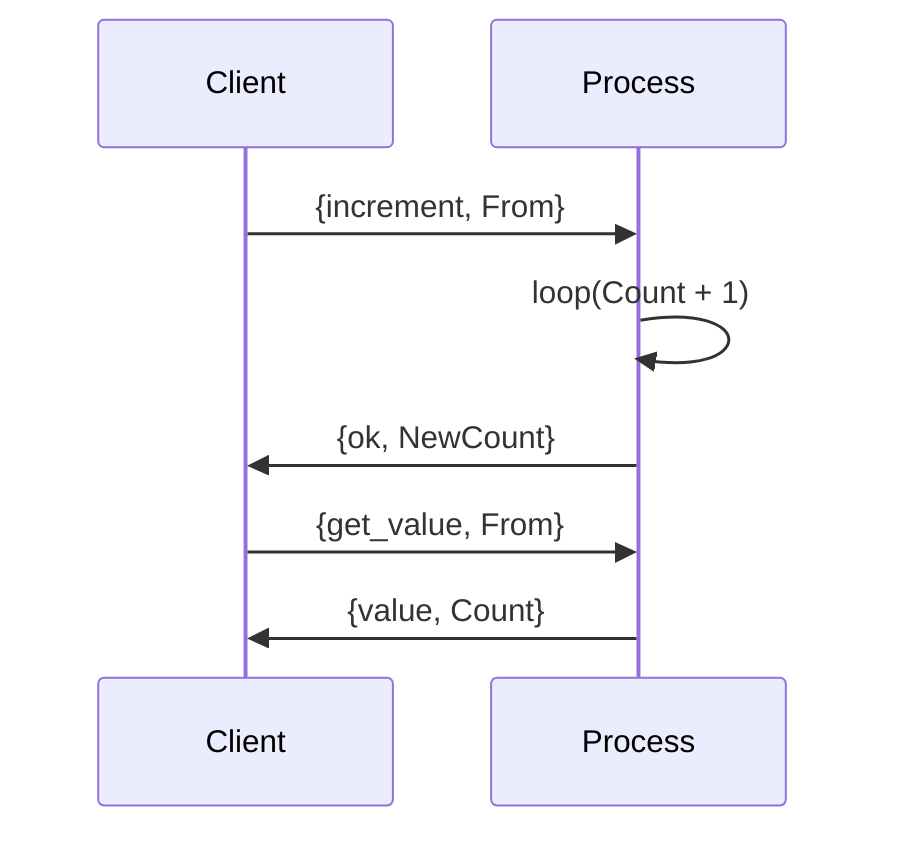

## 4.6 Handling State in Concurrent Systems

In the world of concurrent programming, managing state is a critical challenge. Erlang, with its unique approach to concurrency, offers powerful tools to handle state effectively. In this section, we will explore how Erlang manages state in concurrent systems, the problems associated with shared mutable state, and how Erlang's processes can maintain their own state. We will also delve into patterns like the server loop and state passing, and emphasize the benefits of immutable data in concurrent environments.

### Why Shared Mutable State is Problematic

Shared mutable state is a common source of bugs and inefficiencies in concurrent systems. When multiple threads or processes access and modify the same data, it can lead to race conditions, deadlocks, and other synchronization issues. These problems arise because:

- **Race Conditions**: When two or more processes attempt to modify shared data simultaneously, the final state of the data can depend on the timing of the processes, leading to unpredictable behavior.
- **Deadlocks**: Processes waiting indefinitely for resources held by each other can cause the system to freeze.
- **Complexity**: Synchronizing access to shared state often requires locks or other mechanisms, which can complicate the code and reduce performance.

Erlang avoids these issues by adopting a different model: each process maintains its own state, and processes communicate via message passing.

### Processes and State in Erlang

In Erlang, processes are lightweight and isolated, each with its own memory space. This isolation means that processes do not share state directly. Instead, they communicate by sending messages to each other. This model simplifies state management and eliminates the need for locks or other synchronization mechanisms.

#### Maintaining State with Recursive Functions

A common pattern in Erlang for maintaining state within a process is using recursive functions. Each recursive call represents a new state of the process. Let's look at an example:

```erlang
-module(counter).
-export([start/0, increment/1, get_value/1]).

start() ->
    spawn(fun() -> loop(0) end).

loop(Count) ->
    receive
        {increment, From} ->
            NewCount = Count + 1,
            From ! {ok, NewCount},
            loop(NewCount);
        {get_value, From} ->
            From ! {value, Count},
            loop(Count)
    end.
```

In this example, the `loop/1` function maintains the state of a counter. The state is represented by the `Count` variable, which is updated with each recursive call. The process listens for messages to either increment the count or retrieve the current value.

#### Server Loop Pattern

The server loop pattern is a common way to handle state in Erlang processes. It involves a process repeatedly receiving messages, updating its state, and calling itself recursively with the new state. This pattern is evident in the `loop/1` function above.

The server loop pattern provides several benefits:

- **Isolation**: Each process manages its own state, reducing the risk of interference from other processes.
- **Simplicity**: The recursive structure is straightforward and easy to understand.
- **Concurrency**: Processes can run concurrently without the need for locks or other synchronization mechanisms.

### State Passing

State passing is another technique used in Erlang to manage state in concurrent systems. Instead of modifying shared state, processes pass state information to each other through messages. This approach leverages Erlang's message-passing capabilities to maintain consistency and avoid conflicts.

Consider the following example:

```erlang
-module(state_passing).
-export([start/0, send_message/2]).

start() ->
    Pid = spawn(fun() -> loop([]) end),
    Pid.

loop(State) ->
    receive
        {add, Item, From} ->
            NewState = [Item | State],
            From ! {ok, NewState},
            loop(NewState);
        {get_state, From} ->
            From ! {state, State},
            loop(State)
    end.

send_message(Pid, Message) ->
    Pid ! Message.
```

In this example, the `loop/1` function maintains a list as its state. The state is updated by adding new items to the list, and the updated state is passed back to the caller. This pattern ensures that state changes are explicit and controlled.

### Benefits of Immutable Data

Immutable data is a cornerstone of functional programming and plays a crucial role in Erlang's approach to concurrency. Immutable data structures cannot be modified after they are created, which offers several advantages:

- **Predictability**: Since data cannot change, functions that operate on immutable data are easier to reason about and test.
- **Concurrency**: Immutable data can be safely shared between processes without the risk of race conditions or data corruption.
- **Simplicity**: Code that uses immutable data is often simpler and more concise, as there is no need to manage state changes explicitly.

### Visualizing State Management in Erlang

To better understand how Erlang manages state in concurrent systems, let's visualize the process using a sequence diagram.



This diagram illustrates the interaction between a client and a process managing a counter. The client sends messages to increment the counter and retrieve its value, while the process maintains the state internally.

### Try It Yourself

Experiment with the code examples provided in this section. Try modifying the `counter` module to add new operations, such as decrementing the counter or resetting it to zero. Observe how the state is managed within the process and how message passing facilitates communication between processes.

### Knowledge Check

- Why is shared mutable state problematic in concurrent systems?
- How does Erlang's process model help manage state effectively?
- What are the benefits of using recursive functions to maintain state in Erlang?
- How does the server loop pattern simplify state management?
- What role does immutable data play in Erlang's concurrency model?

### Summary

In this section, we've explored how Erlang handles state in concurrent systems. We've seen how processes maintain their own state using recursive functions and the server loop pattern. We've also discussed the benefits of immutable data and how it simplifies concurrency. By leveraging these techniques, Erlang provides a robust and efficient model for managing state in concurrent applications.

### References and Further Reading

- [Erlang Documentation](https://www.erlang.org/docs)
- [Learn You Some Erlang for Great Good!](http://learnyousomeerlang.com/)
- [Programming Erlang: Software for a Concurrent World](https://pragprog.com/titles/jaerlang2/programming-erlang/)

## Quiz: Handling State in Concurrent Systems



### Why is shared mutable state problematic in concurrent systems?

- [x] It can lead to race conditions and deadlocks.
- [ ] It simplifies code complexity.
- [ ] It enhances performance.
- [ ] It is easy to manage.

> **Explanation:** Shared mutable state can cause race conditions and deadlocks, making it difficult to manage in concurrent systems.

### How does Erlang's process model help manage state effectively?

- [x] By isolating state within each process.
- [ ] By using global variables.
- [ ] By sharing state across processes.
- [ ] By using locks for synchronization.

> **Explanation:** Erlang's process model isolates state within each process, avoiding the need for locks and synchronization.

### What is a benefit of using recursive functions to maintain state in Erlang?

- [x] They provide a clear and simple way to manage state.
- [ ] They require complex synchronization mechanisms.
- [ ] They increase the risk of race conditions.
- [ ] They are difficult to implement.

> **Explanation:** Recursive functions offer a clear and simple way to manage state within a process.

### How does the server loop pattern simplify state management?

- [x] By using recursive calls to maintain state.
- [ ] By sharing state across multiple processes.
- [ ] By using global variables.
- [ ] By requiring complex synchronization.

> **Explanation:** The server loop pattern uses recursive calls to maintain state, simplifying state management.

### What role does immutable data play in Erlang's concurrency model?

- [x] It prevents race conditions and data corruption.
- [ ] It complicates state management.
- [ ] It requires additional synchronization.
- [ ] It is not used in Erlang.

> **Explanation:** Immutable data prevents race conditions and data corruption, making it ideal for concurrent systems.

### What is a common pattern for maintaining state in Erlang processes?

- [x] Server loop pattern.
- [ ] Global variables.
- [ ] Shared memory.
- [ ] Locks and synchronization.

> **Explanation:** The server loop pattern is a common way to maintain state in Erlang processes.

### How do processes communicate in Erlang?

- [x] By sending messages.
- [ ] By sharing memory.
- [ ] By using global variables.
- [ ] By using locks.

> **Explanation:** Processes in Erlang communicate by sending messages to each other.

### What is a benefit of using immutable data structures?

- [x] They are easier to reason about and test.
- [ ] They require complex synchronization.
- [ ] They increase the risk of race conditions.
- [ ] They are difficult to implement.

> **Explanation:** Immutable data structures are easier to reason about and test, as they cannot be modified.

### How does Erlang avoid the need for locks in concurrent systems?

- [x] By isolating state within processes and using message passing.
- [ ] By using global variables.
- [ ] By sharing memory.
- [ ] By using complex synchronization mechanisms.

> **Explanation:** Erlang isolates state within processes and uses message passing, avoiding the need for locks.

### True or False: Erlang processes share state directly.

- [ ] True
- [x] False

> **Explanation:** Erlang processes do not share state directly; they communicate via message passing.



Remember, this is just the beginning. As you progress, you'll build more complex and interactive systems. Keep experimenting, stay curious, and enjoy the journey!
