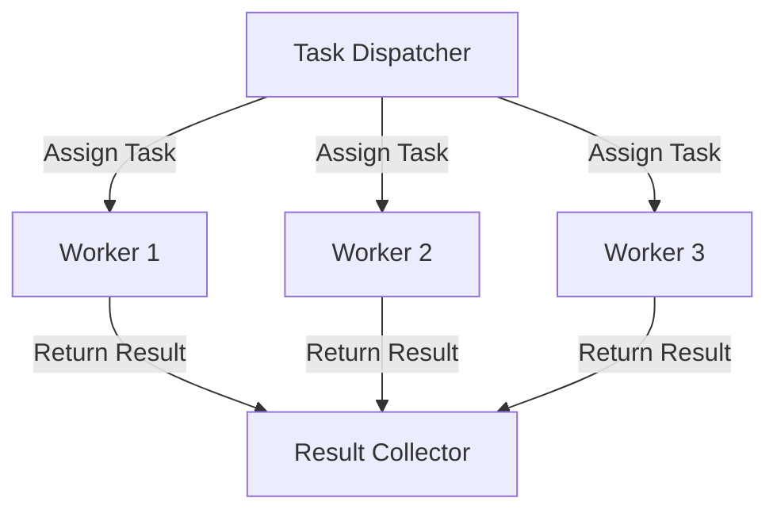

## 4.7 Designing Concurrent Applications

Designing concurrent applications in Erlang is a journey into the heart of the language's strengths: its ability to handle numerous processes simultaneously, its robust fault-tolerance mechanisms, and its elegant message-passing model. In this section, we will delve into the principles of concurrent design, explore strategies for identifying concurrency opportunities, and provide practical examples of structuring processes and message flows. We will also discuss common concurrency patterns, such as worker pools, and emphasize the importance of scalability and maintainability.

### Principles of Concurrent Design

#### Decoupling and Process Isolation

One of the core principles of concurrent design in Erlang is decoupling. Decoupling involves separating different parts of an application so that they can operate independently. This is achieved through process isolation, where each process runs in its own memory space and communicates with other processes via message passing. This isolation ensures that a failure in one process does not directly affect others, enhancing the application's fault tolerance.

**Key Benefits of Process Isolation:**

- **Fault Tolerance:** Isolated processes can fail without bringing down the entire system.
- **Scalability:** Independent processes can be distributed across multiple nodes.
- **Maintainability:** Changes in one process do not necessitate changes in others.

#### Identifying Concurrency Opportunities

To effectively leverage concurrency, it is crucial to identify parts of the application that can be executed concurrently. Look for tasks that are independent and can be performed in parallel. Common candidates include:

- **I/O Operations:** Such as reading from or writing to a database or file system.
- **Network Requests:** Handling multiple client connections simultaneously.
- **Data Processing:** Performing computations on large datasets.

### Structuring Processes and Message Flows

#### Designing Process Architectures

When designing process architectures, consider the following strategies:

- **Hierarchical Process Structures:** Use supervision trees to manage process lifecycles and handle failures gracefully.
- **Modular Design:** Break down the application into smaller, manageable modules, each responsible for a specific task.

#### Message Passing and Communication

Erlang's message-passing model is central to its concurrency capabilities. Processes communicate by sending and receiving messages, which are placed in a process's mailbox. This model allows for asynchronous communication and decouples the sender and receiver.

**Example of Message Passing:**

```erlang
% Sender Process
send_message(ReceiverPid, Message) ->
    ReceiverPid ! {self(), Message}.

% Receiver Process
receive_message() ->
    receive
        {SenderPid, Message} ->
            io:format("Received message: ~p from ~p~n", [Message, SenderPid]),
            SenderPid ! {self(), ack}
    end.
```

### Common Concurrency Patterns

#### Worker Pools

Worker pools are a common pattern used to manage a pool of worker processes that perform tasks concurrently. This pattern is useful for distributing workload and improving resource utilization.

**Implementing a Worker Pool:**

1. **Create a Pool Supervisor:** Manage the lifecycle of worker processes.
2. **Distribute Tasks:** Use a load balancer to assign tasks to available workers.
3. **Handle Results:** Collect and process results from workers.

**Example Code:**

```erlang
-module(worker_pool).
-export([start_pool/1, assign_task/2]).

start_pool(NumWorkers) ->
    Pids = [spawn(fun worker/0) || _ <- lists:seq(1, NumWorkers)],
    {ok, Pids}.

worker() ->
    receive
        {Task, From} ->
            Result = perform_task(Task),
            From ! {self(), Result},
            worker()
    end.

assign_task(Pids, Task) ->
    Pid = lists:nth(random:uniform(length(Pids)), Pids),
    Pid ! {Task, self()},
    receive
        {Pid, Result} ->
            io:format("Task result: ~p~n", [Result])
    end.

perform_task(Task) ->
    % Simulate task processing
    Task * 2.
```

### Scalability and Maintainability

#### Designing for Scalability

Scalability is the ability of an application to handle increased load by adding resources. In Erlang, this often involves distributing processes across multiple nodes. Consider the following strategies:

- **Horizontal Scaling:** Add more nodes to distribute the load.
- **Load Balancing:** Use a load balancer to distribute tasks evenly across nodes.

#### Ensuring Maintainability

Maintainability is about making the application easy to understand, modify, and extend. Achieve this by:

- **Using Clear Naming Conventions:** Make code self-explanatory.
- **Documenting Code:** Use comments and documentation tools like EDoc.
- **Writing Tests:** Ensure code correctness and facilitate refactoring.

### Visualizing Concurrent Architectures

To better understand the flow of messages and the structure of processes, let's visualize a simple concurrent architecture using a worker pool.



**Diagram Description:** This diagram illustrates a task dispatcher assigning tasks to a pool of workers. Each worker processes the task and returns the result to a result collector.

### Try It Yourself

Experiment with the worker pool example by modifying the number of workers or the task complexity. Observe how the system handles different loads and consider how you might scale the architecture for larger applications.

### References and Further Reading

- [Erlang's Concurrency Model](https://erlang.org/doc/reference_manual/processes.html)
- [Designing for Scalability with Erlang/OTP](https://learnyousomeerlang.com/designing-a-concurrent-application)
- [Erlang and OTP in Action](https://www.manning.com/books/erlang-and-otp-in-action)

### Knowledge Check

- What are the benefits of process isolation in Erlang?
- How can you identify tasks that can be executed concurrently?
- What is the role of message passing in Erlang's concurrency model?
- Describe the worker pool pattern and its advantages.

### Embrace the Journey

Remember, designing concurrent applications in Erlang is an iterative process. As you gain experience, you'll discover new patterns and techniques to enhance your applications. Keep experimenting, stay curious, and enjoy the journey!

## Quiz: Designing Concurrent Applications



### What is a key benefit of process isolation in Erlang?

- [x] Fault tolerance
- [ ] Increased memory usage
- [ ] Slower execution
- [ ] Complex code structure

> **Explanation:** Process isolation ensures that a failure in one process does not affect others, enhancing fault tolerance.

### Which of the following is a common concurrency pattern in Erlang?

- [x] Worker pool
- [ ] Singleton
- [ ] Factory
- [ ] Adapter

> **Explanation:** Worker pools are used to manage a pool of worker processes that perform tasks concurrently.

### How do Erlang processes communicate?

- [x] Message passing
- [ ] Shared memory
- [ ] Direct function calls
- [ ] Global variables

> **Explanation:** Erlang processes communicate via message passing, which involves sending and receiving messages.

### What is a strategy for designing scalable applications in Erlang?

- [x] Horizontal scaling
- [ ] Vertical scaling
- [ ] Monolithic architecture
- [ ] Single-threaded execution

> **Explanation:** Horizontal scaling involves adding more nodes to distribute the load, enhancing scalability.

### What is the role of a supervisor in a worker pool pattern?

- [x] Manage the lifecycle of worker processes
- [ ] Perform tasks
- [ ] Collect results
- [ ] Balance load

> **Explanation:** The supervisor manages the lifecycle of worker processes, ensuring they are started and restarted as needed.

### Which of the following is NOT a principle of concurrent design?

- [ ] Decoupling
- [ ] Process isolation
- [x] Shared state
- [ ] Asynchronous communication

> **Explanation:** Shared state is not a principle of concurrent design in Erlang, which emphasizes process isolation and message passing.

### What is a benefit of using message passing in Erlang?

- [x] Asynchronous communication
- [ ] Synchronous execution
- [ ] Shared memory access
- [ ] Direct function calls

> **Explanation:** Message passing allows for asynchronous communication between processes.

### How can you ensure maintainability in Erlang applications?

- [x] Use clear naming conventions
- [ ] Avoid documentation
- [ ] Write complex code
- [ ] Use global variables

> **Explanation:** Clear naming conventions and documentation enhance maintainability by making code easier to understand and modify.

### What is a common use case for concurrency in applications?

- [x] Handling multiple client connections
- [ ] Single-threaded computation
- [ ] Sequential processing
- [ ] Static data storage

> **Explanation:** Concurrency is often used to handle multiple client connections simultaneously.

### True or False: Erlang processes share memory.

- [ ] True
- [x] False

> **Explanation:** Erlang processes do not share memory; they communicate via message passing.


