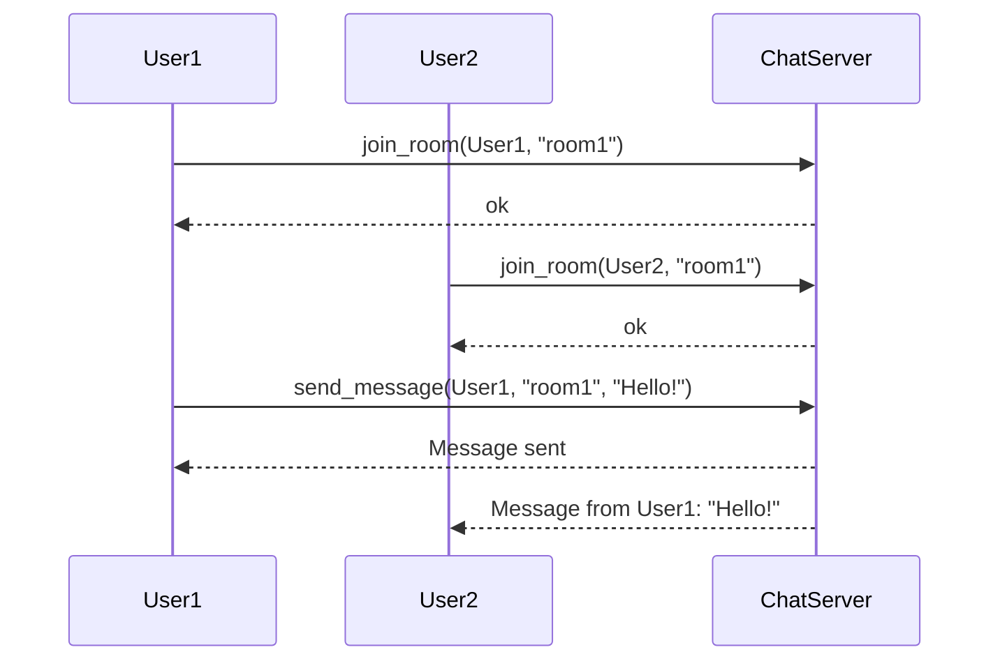

## 4.8 Concurrency Best Practices

Concurrency is a core strength of Erlang, enabling developers to build scalable and fault-tolerant systems. In this section, we will explore best practices for writing efficient and reliable concurrent code in Erlang. We'll cover minimizing process communication overhead, avoiding common pitfalls like deadlocks and race conditions, and provide tips for testing and debugging concurrent applications. We'll also emphasize the importance of clear communication protocols and encourage continuous learning and application of concurrency patterns.

### Understanding Erlang's Concurrency Model

Erlang's concurrency model is based on the Actor Model, where each actor is an independent process that communicates with others via message passing. This model provides a robust framework for building concurrent applications, but it requires careful consideration to avoid common pitfalls.

### Best Practices for Concurrency in Erlang

#### 1. Minimize Process Communication Overhead

- **Use Asynchronous Messaging**: Prefer asynchronous message passing over synchronous calls to avoid blocking processes. This allows processes to continue executing while waiting for a response, improving overall system throughput.

- **Batch Messages**: When possible, batch multiple messages into a single message to reduce the number of communications between processes. This can significantly reduce overhead and improve performance.

- **Avoid Excessive Message Passing**: Design your system to minimize the need for frequent message passing. Consider co-locating processes that frequently communicate or using shared data structures like ETS for read-heavy operations.

#### 2. Avoid Common Concurrency Pitfalls

- **Prevent Deadlocks**: Design your process interactions to avoid circular dependencies that can lead to deadlocks. Use timeouts for synchronous calls to prevent processes from waiting indefinitely.

- **Mitigate Race Conditions**: Ensure that shared resources are accessed in a controlled manner. Use locks or atomic operations where necessary, but prefer designing your system to minimize shared state.

- **Handle Process Failures Gracefully**: Embrace Erlang's "let it crash" philosophy by designing supervisors to restart failed processes. Ensure that your system can recover from process failures without data loss or inconsistency.

#### 3. Testing and Debugging Concurrent Applications

- **Use EUnit and Common Test**: Leverage Erlang's testing frameworks to write unit and integration tests for your concurrent code. Focus on testing process interactions and message passing.

- **Simulate Concurrent Scenarios**: Use tools like QuickCheck or PropEr to generate random concurrent scenarios and test your system's behavior under different conditions.

- **Debug with Observer and Redbug**: Utilize Erlang's debugging tools to monitor process behavior and message passing. Observer provides a graphical interface for visualizing process trees, while Redbug allows for tracing specific processes.

#### 4. Design Clear Communication Protocols

- **Define Message Formats**: Clearly define the structure and content of messages exchanged between processes. Use records or maps to encapsulate message data and ensure consistency.

- **Document Protocols**: Maintain comprehensive documentation of your system's communication protocols. This helps new developers understand the system and ensures consistency across different parts of the application.

- **Use Pattern Matching**: Leverage Erlang's pattern matching capabilities to handle different message types and ensure robust message processing.

#### 5. Continuous Learning and Application of Concurrency Patterns

- **Study Erlang's Concurrency Patterns**: Familiarize yourself with common concurrency patterns in Erlang, such as the GenServer pattern, to build robust and maintainable systems.

- **Participate in the Erlang Community**: Engage with the Erlang community through forums, mailing lists, and conferences to learn from others' experiences and share your own.

- **Experiment with New Techniques**: Continuously explore new concurrency techniques and tools to improve your system's performance and reliability.

### Code Example: Implementing a Simple Chat System

Let's implement a simple chat system to demonstrate some of these best practices. We'll create a chat server that manages chat rooms and allows users to send messages to each other.

```erlang
-module(chat_server).
-behaviour(gen_server).

%% API
-export([start_link/0, join_room/2, leave_room/2, send_message/3]).

%% gen_server callbacks
-export([init/1, handle_call/3, handle_cast/2, handle_info/2, terminate/2, code_change/3]).

-record(state, {rooms = #{}}).

%% Start the chat server
start_link() ->
    gen_server:start_link({local, ?MODULE}, ?MODULE, [], []).

%% Join a chat room
join_room(User, Room) ->
    gen_server:call(?MODULE, {join, User, Room}).

%% Leave a chat room
leave_room(User, Room) ->
    gen_server:call(?MODULE, {leave, User, Room}).

%% Send a message to a chat room
send_message(User, Room, Message) ->
    gen_server:cast(?MODULE, {send, User, Room, Message}).

%% gen_server callbacks
init([]) ->
    {ok, #state{}}.

handle_call({join, User, Room}, _From, State) ->
    Rooms = State#state.rooms,
    UpdatedRooms = maps:update_with(Room, fun(Users) -> [User | Users] end, [User], Rooms),
    {reply, ok, State#state{rooms = UpdatedRooms}};

handle_call({leave, User, Room}, _From, State) ->
    Rooms = State#state.rooms,
    UpdatedRooms = maps:update_with(Room, fun(Users) -> lists:delete(User, Users) end, [], Rooms),
    {reply, ok, State#state{rooms = UpdatedRooms}};

handle_cast({send, User, Room, Message}, State) ->
    Rooms = State#state.rooms,
    case maps:get(Room, Rooms, undefined) of
        undefined ->
            {noreply, State};
        Users ->
            lists:foreach(fun(U) -> io:format("~p received message from ~p: ~s~n", [U, User, Message]) end, Users),
            {noreply, State}
    end.

handle_info(_Info, State) ->
    {noreply, State}.

terminate(_Reason, _State) ->
    ok.

code_change(_OldVsn, State, _Extra) ->
    {ok, State}.
```

### Visualizing Process Communication

Below is a sequence diagram illustrating the process communication in our chat system:



### Try It Yourself

Experiment with the chat server by adding more features, such as private messaging or message history. Try modifying the code to handle more complex scenarios, such as user authentication or message encryption.

### Key Takeaways

- **Minimize Communication Overhead**: Use asynchronous messaging and batch messages to reduce overhead.
- **Avoid Concurrency Pitfalls**: Design your system to prevent deadlocks and race conditions.
- **Test and Debug Effectively**: Use Erlang's testing and debugging tools to ensure your concurrent code is robust.
- **Design Clear Protocols**: Define and document clear communication protocols for your processes.
- **Continuously Learn**: Engage with the Erlang community and explore new concurrency patterns and techniques.

### References and Further Reading

- [Erlang Programming Language](https://www.erlang.org/)
- [Learn You Some Erlang for Great Good!](http://learnyousomeerlang.com/)
- [Erlang and OTP in Action](https://www.manning.com/books/erlang-and-otp-in-action)

## Quiz: Concurrency Best Practices



### What is the primary concurrency model used in Erlang?

- [x] Actor Model
- [ ] Thread Model
- [ ] Coroutine Model
- [ ] Fiber Model

> **Explanation:** Erlang uses the Actor Model for concurrency, where each actor is an independent process that communicates via message passing.

### Which of the following is a best practice for minimizing process communication overhead?

- [x] Use asynchronous messaging
- [ ] Use synchronous messaging
- [ ] Increase the number of messages
- [ ] Avoid batching messages

> **Explanation:** Asynchronous messaging allows processes to continue executing without waiting for a response, reducing communication overhead.

### How can you prevent deadlocks in Erlang?

- [x] Avoid circular dependencies
- [ ] Use more processes
- [ ] Increase message passing
- [ ] Use synchronous calls

> **Explanation:** Avoiding circular dependencies in process interactions helps prevent deadlocks.

### What tool can be used to visualize process trees in Erlang?

- [x] Observer
- [ ] Dialyzer
- [ ] EUnit
- [ ] PropEr

> **Explanation:** Observer provides a graphical interface for visualizing process trees in Erlang.

### Which of the following is a common concurrency pitfall?

- [x] Race conditions
- [ ] Asynchronous messaging
- [ ] Clear communication protocols
- [ ] Using pattern matching

> **Explanation:** Race conditions occur when multiple processes access shared resources concurrently without proper synchronization.

### What is the "let it crash" philosophy in Erlang?

- [x] Allow processes to fail and restart them
- [ ] Prevent all process failures
- [ ] Use synchronous messaging to handle errors
- [ ] Avoid using supervisors

> **Explanation:** The "let it crash" philosophy involves allowing processes to fail and using supervisors to restart them, ensuring system robustness.

### How can you handle process failures gracefully in Erlang?

- [x] Use supervisors
- [ ] Ignore failures
- [ ] Use synchronous messaging
- [ ] Avoid using processes

> **Explanation:** Supervisors are used to handle process failures gracefully by restarting failed processes.

### What is the purpose of defining clear message formats in Erlang?

- [x] Ensure consistency in communication
- [ ] Increase message passing
- [ ] Reduce process count
- [ ] Avoid using pattern matching

> **Explanation:** Clear message formats ensure consistency in communication between processes.

### Which tool can be used for property-based testing in Erlang?

- [x] PropEr
- [ ] EUnit
- [ ] Observer
- [ ] Dialyzer

> **Explanation:** PropEr is a tool used for property-based testing in Erlang.

### True or False: Erlang's concurrency model is based on shared memory.

- [ ] True
- [x] False

> **Explanation:** Erlang's concurrency model is based on message passing, not shared memory.



Remember, mastering concurrency in Erlang is a journey. Keep experimenting, stay curious, and enjoy the process of building robust and scalable systems!
