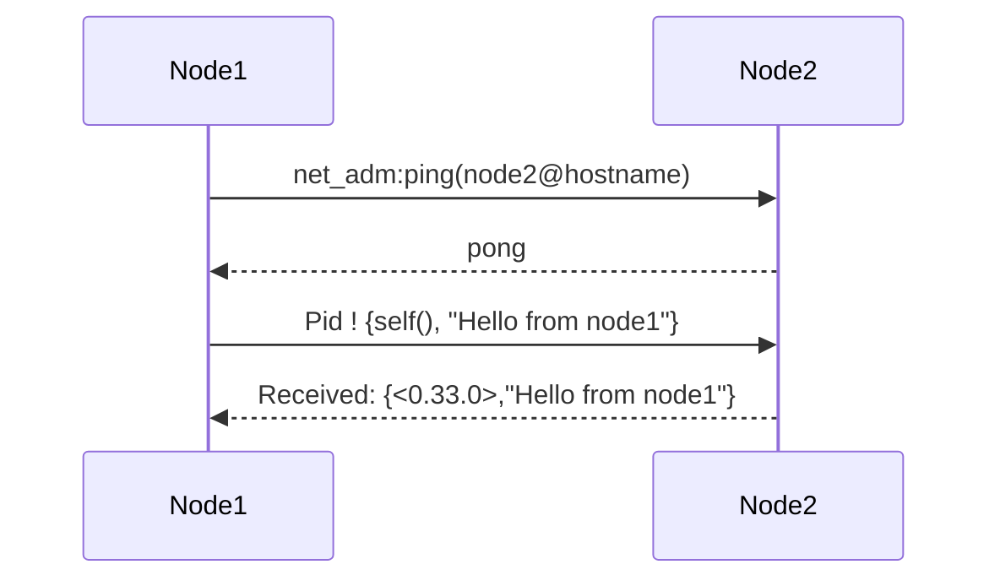

## 5.1 Introduction to Distributed Erlang

In this section, we delve into the world of distributed programming in Erlang, a language renowned for its robust support for building distributed systems. Distributed Erlang allows multiple Erlang nodes to work together seamlessly, leveraging the language's inherent strengths in concurrency and fault tolerance. Let's explore what constitutes a distributed Erlang system, the benefits and challenges of distributed computing, and how Erlang's design facilitates distribution.

### What is a Distributed Erlang System?

A distributed Erlang system consists of multiple Erlang nodes that communicate and collaborate to perform tasks. Each node is an independent Erlang runtime system that can run on the same machine or across different machines connected by a network. The nodes in a distributed system can share data, send messages, and coordinate actions to achieve a common goal.

#### Key Characteristics of Distributed Erlang Systems

- **Node Independence**: Each node operates independently, with its own memory and process space.
- **Communication**: Nodes communicate using message passing, a fundamental concept in Erlang.
- **Scalability**: Distributed systems can scale horizontally by adding more nodes.
- **Fault Tolerance**: Erlang's "let it crash" philosophy and supervision trees enhance fault tolerance in distributed environments.

### Benefits of Distributed Computing

Distributed computing offers several advantages, making it a preferred choice for building scalable and resilient applications.

1. **Scalability**: Distributed systems can handle increased loads by adding more nodes, allowing applications to scale horizontally.
2. **Fault Tolerance**: By distributing tasks across multiple nodes, the system can continue to function even if some nodes fail.
3. **Resource Utilization**: Distributed systems can utilize resources more efficiently by distributing workloads across multiple machines.
4. **Geographic Distribution**: Nodes can be distributed across different geographic locations, reducing latency and improving performance for users in different regions.

### Challenges of Distributed Computing

While distributed computing offers numerous benefits, it also presents challenges that developers must address.

1. **Complexity**: Managing communication and coordination between nodes adds complexity to the system.
2. **Consistency**: Ensuring data consistency across distributed nodes can be challenging, especially in the presence of network partitions.
3. **Latency**: Network communication introduces latency, which can affect the performance of distributed applications.
4. **Security**: Securing communication between nodes and protecting data in transit are critical concerns in distributed systems.

### How Erlang Facilitates Distribution

Erlang's design is inherently suited for distributed computing, thanks to its features and abstractions that simplify the development of distributed systems.

#### Lightweight Processes

Erlang's lightweight processes are a cornerstone of its concurrency model. These processes are isolated and communicate through message passing, making them ideal for distributed environments. Each node can run thousands of processes, enabling efficient parallel execution of tasks.

#### Message Passing

Erlang's message-passing mechanism allows processes to communicate across nodes seamlessly. Messages are sent asynchronously, and processes can receive messages using pattern matching, providing a flexible and powerful communication model.

#### Node Connectivity

Erlang nodes can connect to each other using a simple and efficient mechanism. Once connected, nodes can send messages to processes on other nodes as if they were local, abstracting the complexity of network communication.

#### Fault Tolerance

Erlang's "let it crash" philosophy and supervision trees provide a robust framework for building fault-tolerant distributed systems. Supervisors can monitor processes across nodes, restarting them in case of failures to ensure system reliability.

### Connecting Two Erlang Nodes: A Simple Example

Let's walk through a simple example of connecting two Erlang nodes and sending messages between them. This example demonstrates the basic setup and communication in a distributed Erlang system.

#### Step 1: Start Two Erlang Nodes

First, we need to start two Erlang nodes. Open two terminal windows and execute the following commands:

**Node 1:**

```shell
$ erl -sname node1
```

**Node 2:**

```shell
$ erl -sname node2
```

The `-sname` option assigns a short name to each node, allowing them to communicate on the same network.

#### Step 2: Connect the Nodes

In the Erlang shell of `node1`, connect to `node2` using the `net_adm:ping/1` function:

```erlang
(node1@hostname)1> net_adm:ping(node2@hostname).
pong
```

If the connection is successful, the function returns `pong`.

#### Step 3: Send a Message Between Nodes

Now that the nodes are connected, we can send messages between them. Define a simple process on `node2` to receive messages:

```erlang
% On node2
(node2@hostname)1> Pid = spawn(fun() -> receive Msg -> io:format("Received: ~p~n", [Msg]) end end).
<0.42.0>
```

Send a message from `node1` to the process on `node2`:

```erlang
% On node1
(node1@hostname)2> Pid ! {self(), "Hello from node1"}.
{<0.33.0>,"Hello from node1"}
```

The process on `node2` will print the received message:

```
Received: {<0.33.0>,"Hello from node1"}
```

### Visualizing Node Communication

To better understand how nodes communicate in a distributed Erlang system, let's visualize the process using a sequence diagram.



This diagram illustrates the sequence of actions and messages exchanged between the two nodes.

### Try It Yourself

Now that we've covered the basics, try experimenting with the code examples. Modify the message content, spawn additional processes, or connect more nodes to explore the capabilities of distributed Erlang systems.

### Knowledge Check

- What are the key characteristics of a distributed Erlang system?
- How does Erlang's message-passing mechanism facilitate communication between nodes?
- What are some challenges of distributed computing, and how does Erlang address them?

### Summary

In this section, we've introduced the concept of distributed Erlang systems, highlighting their benefits and challenges. We've explored how Erlang's design facilitates distribution through lightweight processes, message passing, and fault tolerance. By connecting two nodes and exchanging messages, we've demonstrated the simplicity and power of distributed programming in Erlang.

Remember, this is just the beginning. As you progress, you'll discover more advanced techniques and patterns for building robust distributed systems with Erlang. Keep experimenting, stay curious, and enjoy the journey!

## Quiz: Introduction to Distributed Erlang



### What is a distributed Erlang system?

- [x] A system with multiple Erlang nodes communicating and collaborating
- [ ] A single Erlang node running multiple processes
- [ ] An Erlang system running on a single machine
- [ ] A system that does not use message passing

> **Explanation:** A distributed Erlang system consists of multiple Erlang nodes that communicate and collaborate to perform tasks.

### What is a key benefit of distributed computing?

- [x] Scalability
- [ ] Increased complexity
- [ ] Higher latency
- [ ] Reduced fault tolerance

> **Explanation:** Distributed computing allows systems to scale by adding more nodes, handling increased loads efficiently.

### How do Erlang nodes communicate?

- [x] Through message passing
- [ ] By sharing memory
- [ ] Using global variables
- [ ] Through direct function calls

> **Explanation:** Erlang nodes communicate using message passing, a fundamental concept in Erlang's concurrency model.

### What is a challenge of distributed computing?

- [x] Ensuring data consistency
- [ ] Reduced complexity
- [ ] Increased latency
- [ ] Improved fault tolerance

> **Explanation:** Ensuring data consistency across distributed nodes can be challenging, especially in the presence of network partitions.

### How does Erlang facilitate fault tolerance in distributed systems?

- [x] Through the "let it crash" philosophy and supervision trees
- [ ] By using shared memory
- [ ] Through global variables
- [ ] By avoiding message passing

> **Explanation:** Erlang's "let it crash" philosophy and supervision trees provide a robust framework for building fault-tolerant distributed systems.

### What command is used to start an Erlang node with a short name?

- [x] erl -sname
- [ ] erl -name
- [ ] erl -node
- [ ] erl -start

> **Explanation:** The `-sname` option assigns a short name to an Erlang node, allowing it to communicate on the same network.

### How do you connect two Erlang nodes?

- [x] Using net_adm:ping/1
- [ ] By sharing memory
- [ ] Through global variables
- [ ] Using direct function calls

> **Explanation:** The `net_adm:ping/1` function is used to connect two Erlang nodes.

### What is the return value of a successful node connection using net_adm:ping/1?

- [x] pong
- [ ] ping
- [ ] connected
- [ ] success

> **Explanation:** If the connection is successful, the `net_adm:ping/1` function returns `pong`.

### What is the primary communication model in Erlang?

- [x] Message passing
- [ ] Shared memory
- [ ] Global variables
- [ ] Direct function calls

> **Explanation:** Erlang uses message passing as its primary communication model, allowing processes to communicate asynchronously.

### True or False: Erlang nodes can only run on the same machine.

- [ ] True
- [x] False

> **Explanation:** Erlang nodes can run on the same machine or across different machines connected by a network.


