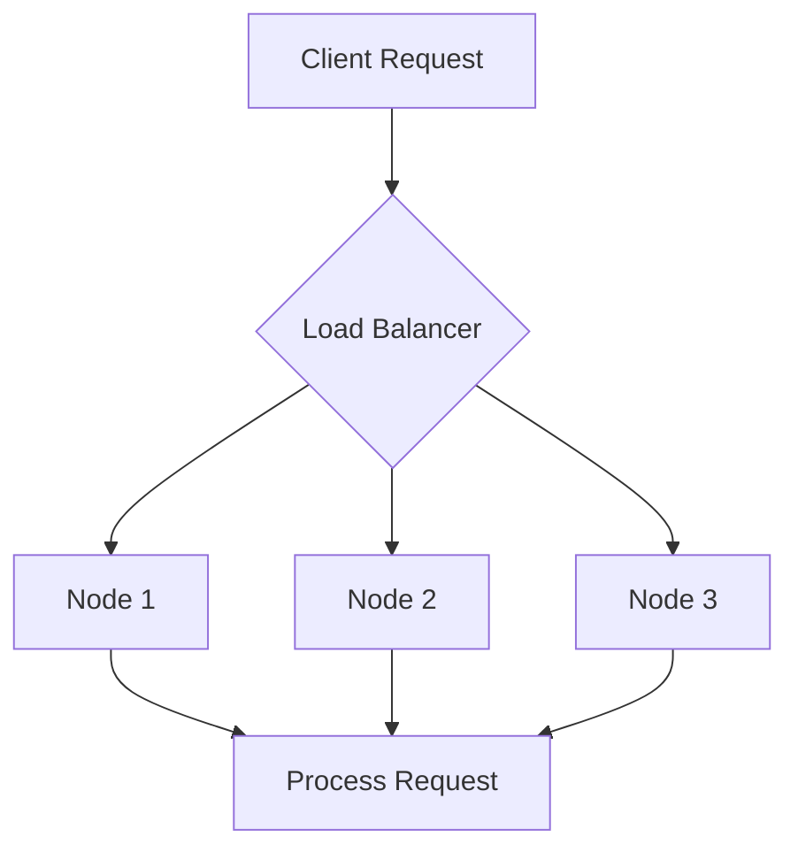

## 5.10 Scaling and Load Balancing in Distributed Environments

In the realm of distributed systems, scaling and load balancing are crucial for maintaining performance and reliability. Erlang, with its robust concurrency model and lightweight processes, is well-suited for building scalable applications. In this section, we will delve into the concepts of scaling, load balancing, and the strategies you can employ to distribute workloads effectively across multiple nodes.

### Understanding Scaling in Distributed Systems

Scaling is the process of increasing the capacity of a system to handle more load. It can be achieved through two primary methods: vertical scaling and horizontal scaling.

#### Vertical Scaling

Vertical scaling, or scaling up, involves adding more resources to a single node, such as increasing CPU, memory, or storage. While this can be effective for certain applications, it has limitations in terms of cost and the maximum capacity of a single machine.

#### Horizontal Scaling

Horizontal scaling, or scaling out, involves adding more nodes to a system. This approach is more flexible and cost-effective, allowing systems to handle increased load by distributing it across multiple nodes. Erlang's distributed nature makes it particularly well-suited for horizontal scaling.

### Elasticity in Distributed Systems

Elasticity refers to the ability of a system to dynamically adjust its resources based on current demand. In a distributed Erlang environment, this means adding or removing nodes as needed to handle varying workloads. Elasticity is crucial for maintaining performance and cost-efficiency in cloud-based applications.

### Load Balancing Strategies

Load balancing is the process of distributing workloads across multiple nodes to ensure no single node is overwhelmed. Several strategies can be employed to achieve effective load balancing in Erlang.

#### Round-Robin Load Balancing

Round-robin is a simple load balancing strategy where requests are distributed evenly across all available nodes in a cyclic order. This approach is easy to implement and works well when all nodes have similar capacity and performance.

```erlang
-module(round_robin_balancer).
-export([start/1, distribute/2]).

start(Nodes) ->
    {ok, #state{nodes = Nodes, index = 0}}.

distribute(Request, #state{nodes = Nodes, index = Index} = State) ->
    Node = lists:nth(Index + 1, Nodes),
    % Send the request to the selected node
    Node ! {self(), Request},
    % Update the index for the next request
    NewIndex = (Index + 1) rem length(Nodes),
    {ok, State#state{index = NewIndex}}.
```

#### Consistent Hashing

Consistent hashing is a more advanced strategy that maps requests to nodes based on a hash function. This approach minimizes the redistribution of requests when nodes are added or removed, making it ideal for systems with dynamic node membership.

```erlang
-module(consistent_hash_balancer).
-export([hash/1, get_node/2]).

hash(Key) ->
    % Simple hash function
    erlang:phash2(Key).

get_node(Key, Nodes) ->
    Hash = hash(Key),
    % Find the node with the closest hash value
    lists:keyfind(Hash rem length(Nodes), 1, Nodes).
```

### Use Cases for Scaling and Load Balancing

Scaling and load balancing are beneficial in various scenarios, including:

- **High Traffic Web Applications**: Distribute incoming requests across multiple servers to handle high traffic volumes.
- **Real-Time Messaging Systems**: Ensure messages are processed efficiently by distributing them across multiple nodes.
- **Data Processing Pipelines**: Scale out processing nodes to handle large volumes of data in parallel.

### Challenges in Scaling Distributed Systems

While scaling offers numerous benefits, it also presents challenges, particularly in state management and consistency.

#### State Management

Managing state in a distributed system can be complex, especially when scaling out. Strategies such as state partitioning and replication can help manage state effectively across nodes.

#### Consistency and Coordination

Ensuring consistency across distributed nodes is challenging. Techniques like eventual consistency and consensus algorithms (e.g., Paxos, Raft) can be employed to maintain data integrity.

### Visualizing Load Balancing in Erlang

To better understand how load balancing works in a distributed Erlang environment, let's visualize the process using a Mermaid.js diagram.



**Diagram Description**: The diagram illustrates a load balancer distributing client requests across three nodes. Each node processes the request independently.

### Try It Yourself

Experiment with the provided code examples by modifying the number of nodes or the hash function. Observe how these changes affect the distribution of requests and the system's performance.

### References and Further Reading

- [Erlang Documentation](https://www.erlang.org/doc/)
- [Consistent Hashing](https://en.wikipedia.org/wiki/Consistent_hashing)
- [Load Balancing Techniques](https://www.nginx.com/resources/glossary/load-balancing/)

### Knowledge Check

- What are the differences between vertical and horizontal scaling?
- How does consistent hashing improve load balancing in dynamic environments?
- What challenges might arise when managing state in a distributed system?

### Embrace the Journey

Remember, scaling and load balancing are ongoing processes that require continuous monitoring and adjustment. As you implement these strategies, keep experimenting and learning to optimize your distributed Erlang applications.

## Quiz: Scaling and Load Balancing in Distributed Environments



### What is the primary advantage of horizontal scaling over vertical scaling?

- [x] Flexibility and cost-effectiveness
- [ ] Simplicity of implementation
- [ ] Requires fewer nodes
- [ ] Increases the capacity of a single node

> **Explanation:** Horizontal scaling involves adding more nodes, which provides flexibility and cost-effectiveness compared to vertical scaling, which adds resources to a single node.

### Which load balancing strategy minimizes request redistribution when nodes are added or removed?

- [ ] Round-robin
- [x] Consistent hashing
- [ ] Random selection
- [ ] Least connections

> **Explanation:** Consistent hashing minimizes request redistribution by mapping requests to nodes based on a hash function, making it ideal for dynamic environments.

### What is a key challenge in scaling distributed systems?

- [x] State management
- [ ] Increasing CPU resources
- [ ] Reducing network latency
- [ ] Simplifying code

> **Explanation:** Managing state across distributed nodes is a complex challenge, especially when scaling out.

### What does elasticity in distributed systems refer to?

- [x] The ability to dynamically adjust resources based on demand
- [ ] The use of elastic data structures
- [ ] The flexibility of programming languages
- [ ] The resilience of network connections

> **Explanation:** Elasticity refers to the system's ability to adjust resources dynamically to meet current demand.

### Which Erlang feature is particularly well-suited for horizontal scaling?

- [x] Lightweight processes
- [ ] Strong typing
- [ ] Pattern matching
- [ ] Immutable data

> **Explanation:** Erlang's lightweight processes make it well-suited for horizontal scaling, allowing efficient distribution of workloads.

### What is the role of a load balancer in a distributed system?

- [x] Distributing workloads across multiple nodes
- [ ] Increasing the speed of a single node
- [ ] Reducing the number of nodes
- [ ] Managing database connections

> **Explanation:** A load balancer distributes workloads across multiple nodes to ensure no single node is overwhelmed.

### How does round-robin load balancing distribute requests?

- [x] Evenly across all nodes in a cyclic order
- [ ] Based on the least connections
- [ ] Randomly across nodes
- [ ] Based on node capacity

> **Explanation:** Round-robin distributes requests evenly across all nodes in a cyclic order.

### What is a potential drawback of vertical scaling?

- [x] Limited by the maximum capacity of a single machine
- [ ] Requires more nodes
- [ ] Increases network complexity
- [ ] Reduces system flexibility

> **Explanation:** Vertical scaling is limited by the maximum capacity of a single machine, making it less flexible than horizontal scaling.

### True or False: Consistent hashing is ideal for systems with static node membership.

- [ ] True
- [x] False

> **Explanation:** Consistent hashing is ideal for systems with dynamic node membership, as it minimizes request redistribution when nodes change.

### What is a common use case for scaling and load balancing?

- [x] High traffic web applications
- [ ] Small-scale desktop applications
- [ ] Single-threaded programs
- [ ] Static websites

> **Explanation:** High traffic web applications benefit from scaling and load balancing to handle large volumes of requests efficiently.


