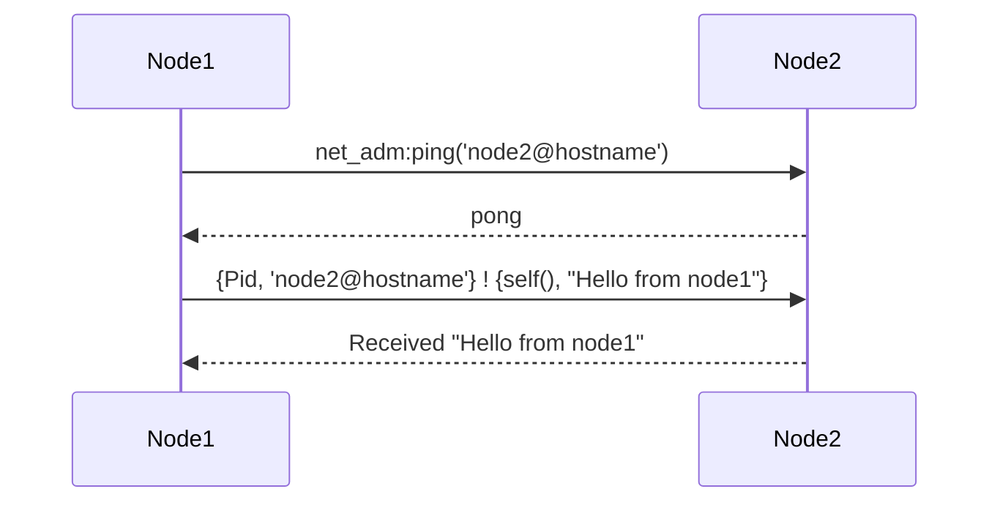

## 5.2 Node Communication and Connectivity

In the world of distributed programming, Erlang stands out for its robust support for building scalable and fault-tolerant systems. A key aspect of this capability is the seamless communication between nodes. In this section, we will delve into the mechanics of node communication and connectivity in Erlang, covering node naming, connection methods, message passing, and security considerations.

### Understanding Node Names

Erlang nodes are individual instances of the Erlang runtime system that can communicate with each other. Each node is identified by a unique name, which is crucial for establishing connections and sending messages.

#### Short and Long Node Names

Erlang supports two types of node names: short and long.

- **Short Names**: These are suitable for local networks where nodes are on the same subnet. A short name is specified using the `-sname` flag when starting the node. For example, `erl -sname mynode` starts a node with the name `mynode@hostname`.

- **Long Names**: These are used for nodes on different subnets or across the internet. A long name is specified using the `-name` flag. For example, `erl -name mynode@mydomain.com` starts a node with the name `mynode@mydomain.com`.

#### Starting Nodes with Names

To start an Erlang node with a specific name, use the following commands:

```shell
# Starting a node with a short name
erl -sname mynode

# Starting a node with a long name
erl -name mynode@mydomain.com
```

### Connecting Nodes

Once nodes are named, they can be connected to form a distributed system. Erlang provides both manual and automatic methods for connecting nodes.

#### Manual Connection

To manually connect nodes, use the `net_adm:ping/1` function. This function sends a ping message to another node, establishing a connection if the node is reachable.

```erlang
% On node1
net_adm:ping('node2@hostname').

% On node2
net_adm:ping('node1@hostname').
```

If the connection is successful, `pong` is returned; otherwise, `pang` is returned.

#### Automatic Connection

For automatic connection, Erlang provides the `-connect_all false` flag, which can be used to automatically connect to all nodes listed in the `nodes()` function.

```shell
erl -sname mynode -connect_all false
```

### Sending Messages Between Nodes

Once nodes are connected, processes on different nodes can communicate by sending messages. Erlang's message-passing model allows processes to send messages to any process on any connected node.

#### Example: Sending Messages

Consider two nodes, `node1` and `node2`. We will demonstrate sending a message from a process on `node1` to a process on `node2`.

```erlang
% On node2, start a process that waits for messages
Pid = spawn(fun() -> receive
    {From, Msg} ->
        io:format("Received ~p from ~p~n", [Msg, From])
end end).

% On node1, send a message to the process on node2
{Pid, 'node2@hostname'} ! {self(), "Hello from node1"}.
```

### Security Considerations

Security is a critical aspect of node communication. Erlang uses a cookie-based authentication system to ensure that only authorized nodes can connect.

#### Erlang Cookie System

Each node has a cookie, a shared secret that nodes must have in common to communicate. The cookie is stored in a file named `.erlang.cookie` in the user's home directory.

- **Setting the Cookie**: Use the `-setcookie` flag to specify the cookie when starting a node.

```shell
erl -sname mynode -setcookie mysecretcookie
```

- **Checking the Cookie**: Ensure that the `.erlang.cookie` file has the same content on all nodes that need to communicate.

### Visualizing Node Communication

To better understand the flow of communication between nodes, consider the following sequence diagram:



This diagram illustrates the process of establishing a connection and sending a message between two nodes.

### Try It Yourself

Experiment with the code examples provided. Try changing the node names, using different message formats, or adding more nodes to see how the system behaves. This hands-on approach will deepen your understanding of Erlang's distributed capabilities.

### Knowledge Check

- What are the differences between short and long node names?
- How can you manually connect two Erlang nodes?
- What role does the Erlang cookie play in node communication?

### Summary

In this section, we explored the essentials of node communication and connectivity in Erlang. We covered node naming, connection methods, message passing, and security considerations. Understanding these concepts is crucial for building robust distributed systems in Erlang.

Remember, this is just the beginning. As you progress, you'll build more complex and interactive distributed applications. Keep experimenting, stay curious, and enjoy the journey!

## Quiz: Node Communication and Connectivity



### What is the primary purpose of node names in Erlang?

- [x] To uniquely identify each node for communication
- [ ] To determine the node's processing power
- [ ] To specify the node's IP address
- [ ] To set the node's memory limit

> **Explanation:** Node names uniquely identify each node, allowing them to communicate with each other.

### How do you start an Erlang node with a short name?

- [x] erl -sname mynode
- [ ] erl -name mynode
- [ ] erl -shortname mynode
- [ ] erl -nodename mynode

> **Explanation:** The `-sname` flag is used to start a node with a short name.

### Which function is used to manually connect two Erlang nodes?

- [x] net_adm:ping/1
- [ ] net_adm:connect/1
- [ ] net_adm:link/1
- [ ] net_adm:join/1

> **Explanation:** The `net_adm:ping/1` function is used to manually connect nodes by sending a ping message.

### What does the Erlang cookie system ensure?

- [x] Only authorized nodes can connect
- [ ] Nodes have the same IP address
- [ ] Nodes run the same version of Erlang
- [ ] Nodes have the same amount of memory

> **Explanation:** The cookie system ensures that only nodes with the same cookie can connect, providing a layer of security.

### What is returned if a node connection is successful using net_adm:ping/1?

- [x] pong
- [ ] ping
- [ ] success
- [ ] connected

> **Explanation:** If the connection is successful, `pong` is returned.

### How can you specify a cookie when starting an Erlang node?

- [x] erl -setcookie mysecretcookie
- [ ] erl -cookie mysecretcookie
- [ ] erl -auth mysecretcookie
- [ ] erl -key mysecretcookie

> **Explanation:** The `-setcookie` flag is used to specify a cookie when starting a node.

### What is the file name where Erlang stores the cookie?

- [x] .erlang.cookie
- [ ] .cookie
- [ ] .erlang_auth
- [ ] .node_cookie

> **Explanation:** The cookie is stored in a file named `.erlang.cookie`.

### What type of message passing model does Erlang use?

- [x] Asynchronous message passing
- [ ] Synchronous message passing
- [ ] Blocking message passing
- [ ] Direct message passing

> **Explanation:** Erlang uses an asynchronous message-passing model.

### What is the purpose of the -connect_all false flag?

- [x] To automatically connect to all nodes listed in the nodes() function
- [ ] To prevent any node connections
- [ ] To connect only to nodes with the same cookie
- [ ] To connect to nodes with the same IP address

> **Explanation:** The `-connect_all false` flag is used to automatically connect to all nodes listed in the `nodes()` function.

### True or False: Erlang nodes can only communicate if they are on the same subnet.

- [ ] True
- [x] False

> **Explanation:** Erlang nodes can communicate across different subnets using long node names.




