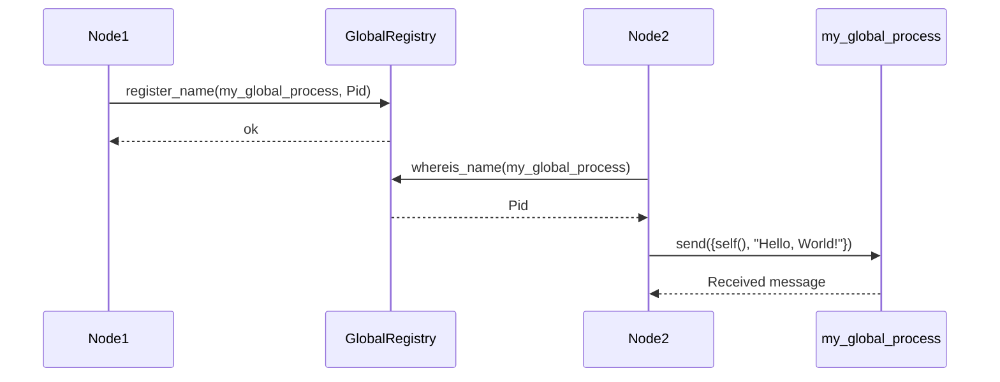

## 5.3 Global Name Registration and Discovery

In distributed systems, managing and locating processes across different nodes is a critical task. Erlang, with its robust support for concurrency and distribution, provides mechanisms to register processes globally, allowing them to be discovered and communicated with across a distributed network. In this section, we will delve into the `global` module, which facilitates global name registration and discovery in Erlang.

### Introduction to the `global` Module

The `global` module in Erlang is a built-in library that provides functions for registering and discovering processes globally across a distributed Erlang system. This module allows processes to be registered with a unique name that can be accessed from any node within the distributed system.

#### Key Functions of the `global` Module

- **`global:register_name/2`**: Registers a process with a global name.
- **`global:unregister_name/1`**: Unregisters a globally registered process.
- **`global:whereis_name/1`**: Locates the process registered with a given name.
- **`global:registered_names/0`**: Lists all globally registered names.
- **`global:send/2`**: Sends a message to a globally registered process.

### Registering a Process Globally

To register a process globally, you use the `global:register_name/2` function. This function takes two arguments: the name you want to register and the process identifier (PID) of the process you wish to register.

```erlang
% Start a process and register it globally
start_and_register() ->
    Pid = spawn(fun() -> loop() end),
    global:register_name(my_global_process, Pid).

% A simple loop function for the process
loop() ->
    receive
        {From, Message} ->
            io:format("Received message: ~p from ~p~n", [Message, From]),
            loop()
    end.
```

In this example, we start a new process and register it globally with the name `my_global_process`. The process runs a simple loop that waits for messages and prints them.

### Locating and Communicating with Globally Registered Processes

Once a process is registered globally, it can be located and communicated with from any node in the distributed system using the `global:whereis_name/1` and `global:send/2` functions.

```erlang
% Locate a globally registered process and send a message
send_message_to_global_process() ->
    case global:whereis_name(my_global_process) of
        undefined ->
            io:format("Process not found~n");
        Pid ->
            global:send(my_global_process, {self(), "Hello, World!"})
    end.
```

In this code snippet, we locate the process registered as `my_global_process` and send it a message. If the process is not found, we print an error message.

### Trade-offs of Using Global Registration

While global registration provides a convenient way to locate and communicate with processes across nodes, it comes with certain trade-offs:

- **Scalability**: Global registration can become a bottleneck in large systems, as it requires coordination across nodes to maintain consistency.
- **Complexity**: Managing globally registered names can add complexity, especially in systems with dynamic node membership or frequent process restarts.
- **Single Point of Failure**: If the node managing the global registry fails, it can disrupt the entire system.

### Alternative Approaches

In scenarios where global registration may not be suitable, consider the following alternatives:

- **Local Registration with Node Discovery**: Register processes locally on each node and use a separate service for node discovery and communication.
- **Distributed Hash Tables (DHTs)**: Use a DHT to distribute the responsibility of name registration and discovery across nodes.
- **Service Discovery Tools**: Leverage external service discovery tools like Consul or etcd to manage process discovery.

### Visualizing Global Name Registration

To better understand the concept of global name registration and discovery, let's visualize the process using a sequence diagram.



This diagram illustrates the sequence of interactions involved in registering a process globally, locating it, and sending a message.

### Try It Yourself

Experiment with the code examples provided by modifying the process logic or the messages being sent. Try registering multiple processes with different names and observe how they can be located and communicated with from different nodes.

### Key Takeaways

- The `global` module in Erlang provides functions for global name registration and discovery.
- Global registration allows processes to be located and communicated with across nodes.
- Consider the trade-offs of using global registration, such as scalability and complexity.
- Explore alternative approaches like local registration with node discovery or using service discovery tools.

### References and Further Reading

- [Erlang Official Documentation: global Module](https://www.erlang.org/doc/man/global.html)
- [Distributed Systems Concepts and Design](https://www.amazon.com/Distributed-Systems-Concepts-Design-5th/dp/0132143011)
- [Service Discovery in Microservices](https://microservices.io/patterns/service-discovery/)

## Quiz: Global Name Registration and Discovery



### What is the primary purpose of the `global` module in Erlang?

- [x] To register and discover processes globally across a distributed system
- [ ] To manage local process registration within a single node
- [ ] To handle file I/O operations in Erlang
- [ ] To provide cryptographic functions

> **Explanation:** The `global` module is specifically designed for global name registration and discovery in distributed Erlang systems.

### Which function is used to register a process globally in Erlang?

- [x] `global:register_name/2`
- [ ] `global:unregister_name/1`
- [ ] `global:whereis_name/1`
- [ ] `global:send/2`

> **Explanation:** The `global:register_name/2` function is used to register a process with a global name.

### What is a potential drawback of using global registration in large systems?

- [x] Scalability issues due to coordination across nodes
- [ ] Increased memory usage on individual nodes
- [ ] Lack of support for message passing
- [ ] Inability to unregister processes

> **Explanation:** Global registration can become a bottleneck in large systems due to the need for coordination across nodes.

### How can you locate a globally registered process in Erlang?

- [x] Using `global:whereis_name/1`
- [ ] Using `global:send/2`
- [ ] Using `global:unregister_name/1`
- [ ] Using `global:registered_names/0`

> **Explanation:** The `global:whereis_name/1` function is used to locate a globally registered process.

### What is an alternative to global registration for process discovery?

- [x] Using service discovery tools like Consul
- [ ] Using the `file` module for process registration
- [ ] Using the `crypto` module for secure registration
- [ ] Using the `http` module for web-based discovery

> **Explanation:** Service discovery tools like Consul can be used as an alternative to global registration for process discovery.

### Which function sends a message to a globally registered process?

- [x] `global:send/2`
- [ ] `global:register_name/2`
- [ ] `global:unregister_name/1`
- [ ] `global:whereis_name/1`

> **Explanation:** The `global:send/2` function is used to send a message to a globally registered process.

### What is the role of `global:unregister_name/1`?

- [x] To remove a process from the global registry
- [ ] To register a process globally
- [ ] To locate a globally registered process
- [ ] To send a message to a process

> **Explanation:** The `global:unregister_name/1` function is used to remove a process from the global registry.

### What does `global:registered_names/0` return?

- [x] A list of all globally registered names
- [ ] The PID of a specific process
- [ ] The status of the global registry
- [ ] A list of all local processes

> **Explanation:** The `global:registered_names/0` function returns a list of all globally registered names.

### True or False: Global registration is always the best choice for process discovery in distributed systems.

- [ ] True
- [x] False

> **Explanation:** Global registration is not always the best choice due to potential scalability and complexity issues. Alternative approaches may be more suitable in certain scenarios.

### Which of the following is a benefit of using global registration?

- [x] Simplifies process discovery across nodes
- [ ] Reduces memory usage on nodes
- [ ] Eliminates the need for message passing
- [ ] Increases the speed of local process registration

> **Explanation:** Global registration simplifies process discovery across nodes by providing a consistent naming mechanism.



Remember, mastering global name registration and discovery is just one step in building robust distributed systems with Erlang. Keep exploring and experimenting with different approaches to find the best fit for your specific use case. Happy coding!
