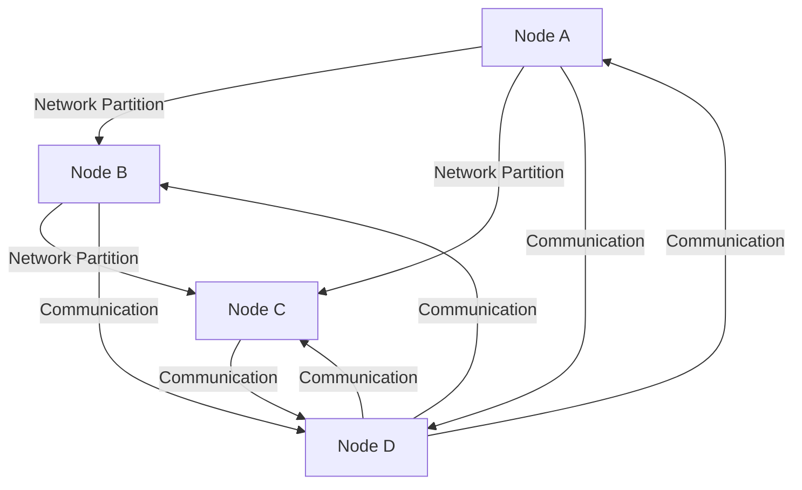

## 5.4 Handling Network Partitions and Net Splits

In the realm of distributed systems, network partitions, often referred to as net splits, are inevitable challenges that can significantly impact the reliability and performance of applications. In this section, we will delve into the intricacies of network partitions, explore Erlang's behavior during such events, and discuss strategies for detecting and recovering from net splits. We will also provide practical examples of designing applications that can handle partitions gracefully, highlighting the importance of considering partitions in system design.

### Understanding Network Partitions and Net Splits

**Network Partitions** occur when a network is divided into two or more segments that cannot communicate with each other. This can happen due to various reasons, such as hardware failures, network congestion, or configuration errors. In distributed systems, network partitions can lead to inconsistencies, data loss, or service unavailability.

**Net Splits** specifically refer to the scenario where a distributed system is split into isolated sub-networks. Each sub-network continues to operate independently, but without knowledge of the other segments. This can lead to challenges in maintaining data consistency and ensuring system reliability.

#### Impact on Distributed Systems

Network partitions can have several adverse effects on distributed systems:

- **Data Inconsistency**: Different segments may have conflicting data due to lack of synchronization.
- **Service Unavailability**: Some parts of the system may become inaccessible, leading to partial or complete service outages.
- **Increased Latency**: Attempts to communicate across partitions can result in timeouts and increased response times.

### Erlang's Behavior During Network Partitions

Erlang is designed with fault tolerance and distributed computing in mind. Its lightweight processes and robust concurrency model make it well-suited for handling network partitions. However, understanding Erlang's behavior during such events is crucial for designing resilient systems.

#### Process Isolation and Fault Tolerance

Erlang processes are isolated and communicate via message passing. This isolation ensures that a failure in one process does not directly affect others. During a network partition, processes in different segments may continue to operate independently, but communication between them will be disrupted.

#### Node Connectivity and Monitoring

Erlang nodes use a distributed hash table for node discovery and communication. When a network partition occurs, nodes may lose connectivity with each other. Erlang provides mechanisms for monitoring node status, allowing applications to detect and respond to changes in connectivity.

### Strategies for Detecting and Recovering from Net Splits

Detecting and recovering from network partitions requires a combination of monitoring, fault detection, and recovery strategies. Here are some approaches to consider:

#### 1. Node Monitoring and Heartbeats

Implement node monitoring using Erlang's built-in capabilities. Nodes can send periodic heartbeats to each other to detect connectivity issues. If a node fails to receive a heartbeat within a specified interval, it can assume a partition has occurred.

```erlang
% Example of a simple heartbeat mechanism
-module(heartbeat).
-export([start/0, monitor/1]).

start() ->
    spawn(fun() -> monitor(self()) end).

monitor(Node) ->
    case net_adm:ping(Node) of
        pong -> 
            io:format("Node ~p is alive~n", [Node]),
            timer:sleep(5000),
            monitor(Node);
        pang -> 
            io:format("Node ~p is unreachable~n", [Node])
    end.
```

#### 2. Consensus Algorithms

Use consensus algorithms like Paxos or Raft to maintain consistency across partitions. These algorithms help ensure that a majority of nodes agree on the state of the system, even in the presence of partitions.

#### 3. Quorum-Based Systems

Design systems that require a quorum (a majority of nodes) to make decisions. This approach helps maintain consistency by ensuring that only a majority of nodes can commit changes.

#### 4. Eventual Consistency

Adopt an eventual consistency model, where updates are propagated asynchronously, and consistency is achieved over time. This approach is suitable for applications where immediate consistency is not critical.

#### 5. Partition Tolerance

Design applications to tolerate partitions by allowing them to operate independently during a split. Once connectivity is restored, the system can reconcile differences and synchronize data.

### Designing Applications to Handle Partitions Gracefully

When designing distributed applications, it is essential to consider network partitions as a fundamental aspect of system architecture. Here are some best practices:

#### 1. Decouple Components

Design components to be loosely coupled, allowing them to operate independently during partitions. Use message queues or event streams to buffer communication between components.

#### 2. Implement Retry Logic

Incorporate retry logic for network operations to handle transient failures. Use exponential backoff to avoid overwhelming the network during recovery.

#### 3. Use Circuit Breakers

Implement circuit breakers to prevent cascading failures. A circuit breaker monitors network operations and temporarily halts requests if failures exceed a threshold.

#### 4. Graceful Degradation

Design applications to degrade gracefully during partitions. For example, provide read-only access to data or limit certain features until connectivity is restored.

#### 5. Monitor and Alert

Set up monitoring and alerting for network partitions. Use tools like Prometheus or Grafana to visualize network metrics and receive alerts when partitions occur.

### Importance of Considering Partitions in System Design

Considering network partitions in system design is crucial for building robust and reliable distributed applications. By anticipating and planning for partitions, you can:

- **Enhance Fault Tolerance**: Ensure that your system can continue to operate despite connectivity issues.
- **Improve User Experience**: Minimize service disruptions and maintain a consistent user experience.
- **Reduce Downtime**: Quickly detect and recover from partitions, reducing the impact on your application.

### Visualizing Network Partitions

To better understand the concept of network partitions, let's visualize a simple distributed system experiencing a net split.



**Diagram Description**: This diagram illustrates a distributed system with four nodes (A, B, C, D). Nodes A, B, and C are experiencing a network partition, preventing them from communicating with each other. Node D remains connected to all nodes, acting as a bridge for communication.

### Try It Yourself

Experiment with the provided code examples by modifying the heartbeat interval or simulating network partitions. Observe how the system behaves and consider implementing additional strategies for handling partitions.

### References and Further Reading

- [Erlang Documentation on Distributed Systems](https://www.erlang.org/doc/reference_manual/distributed.html)
- [CAP Theorem and Its Implications](https://en.wikipedia.org/wiki/CAP_theorem)
- [Paxos Consensus Algorithm](https://lamport.azurewebsites.net/pubs/paxos-simple.pdf)

### Knowledge Check

- What are network partitions, and how do they affect distributed systems?
- How does Erlang handle network partitions?
- What strategies can be used to detect and recover from net splits?
- Why is it important to consider network partitions in system design?

### Embrace the Journey

Remember, handling network partitions is just one aspect of building resilient distributed systems. As you continue to explore Erlang and distributed programming, you'll gain a deeper understanding of how to design applications that can withstand the challenges of real-world environments. Keep experimenting, stay curious, and enjoy the journey!

## Quiz: Handling Network Partitions and Net Splits



### What is a network partition?

- [x] A division of a network into isolated segments
- [ ] A complete network failure
- [ ] A temporary network slowdown
- [ ] A type of network protocol

> **Explanation:** A network partition occurs when a network is divided into isolated segments that cannot communicate with each other.

### How does Erlang handle network partitions?

- [x] By using isolated processes and message passing
- [ ] By halting all processes until the partition is resolved
- [ ] By merging all processes into a single node
- [ ] By discarding all messages during the partition

> **Explanation:** Erlang uses isolated processes and message passing, allowing processes to continue operating independently during a partition.

### Which strategy helps maintain consistency across partitions?

- [x] Consensus algorithms like Paxos or Raft
- [ ] Disabling all network communications
- [ ] Using a single central server
- [ ] Ignoring partitions and focusing on performance

> **Explanation:** Consensus algorithms like Paxos or Raft help maintain consistency by ensuring a majority of nodes agree on the system state.

### What is the purpose of a circuit breaker in distributed systems?

- [x] To prevent cascading failures
- [ ] To increase network speed
- [ ] To enhance data encryption
- [ ] To simplify code deployment

> **Explanation:** A circuit breaker monitors network operations and temporarily halts requests if failures exceed a threshold, preventing cascading failures.

### Why is it important to consider network partitions in system design?

- [x] To enhance fault tolerance and reduce downtime
- [ ] To increase the complexity of the system
- [ ] To focus solely on performance optimization
- [ ] To avoid using distributed systems

> **Explanation:** Considering network partitions in system design enhances fault tolerance and reduces downtime by anticipating and planning for connectivity issues.

### What is a quorum-based system?

- [x] A system that requires a majority of nodes to make decisions
- [ ] A system that operates with a single central node
- [ ] A system that ignores network partitions
- [ ] A system that uses only one node for all operations

> **Explanation:** A quorum-based system requires a majority of nodes to make decisions, helping maintain consistency during partitions.

### How can applications degrade gracefully during partitions?

- [x] By providing read-only access to data
- [ ] By shutting down completely
- [ ] By ignoring all network operations
- [ ] By increasing the number of nodes

> **Explanation:** Applications can degrade gracefully by providing read-only access to data or limiting certain features until connectivity is restored.

### What is the role of monitoring and alerting in handling network partitions?

- [x] To detect partitions and receive alerts when they occur
- [ ] To increase network speed
- [ ] To simplify code deployment
- [ ] To enhance data encryption

> **Explanation:** Monitoring and alerting help detect network partitions and receive alerts when they occur, enabling quick response and recovery.

### What is eventual consistency?

- [x] A model where updates are propagated asynchronously, achieving consistency over time
- [ ] A model where all nodes are always consistent
- [ ] A model that ignores consistency
- [ ] A model that requires immediate consistency

> **Explanation:** Eventual consistency is a model where updates are propagated asynchronously, and consistency is achieved over time.

### True or False: Network partitions can lead to data inconsistency and service unavailability.

- [x] True
- [ ] False

> **Explanation:** Network partitions can lead to data inconsistency and service unavailability due to lack of synchronization and communication disruptions.




