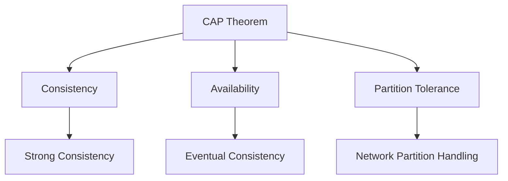

## 5.5 Consistency Models and Trade-Offs

In the realm of distributed systems, consistency models define the rules for how data is read and written across multiple nodes. Understanding these models is crucial for designing robust and efficient distributed applications, especially in a language like Erlang, which is inherently designed for concurrency and distributed computing. In this section, we will delve into the CAP theorem, explore various consistency models, and discuss how Erlang applications can be architected to leverage these models effectively.

### Understanding the CAP Theorem

The CAP theorem, introduced by Eric Brewer, is a fundamental principle that describes the trade-offs inherent in distributed systems. It states that a distributed data store can only provide two out of the following three guarantees at any given time:

- **Consistency**: Every read receives the most recent write or an error.
- **Availability**: Every request receives a (non-error) response, without the guarantee that it contains the most recent write.
- **Partition Tolerance**: The system continues to operate despite an arbitrary number of messages being dropped (or delayed) by the network between nodes.

#### Implications of the CAP Theorem

The CAP theorem implies that in the presence of a network partition, a distributed system must choose between consistency and availability. This trade-off is crucial in determining the behavior of your application under failure conditions.

- **CP Systems (Consistency and Partition Tolerance)**: These systems prioritize consistency over availability. In the event of a network partition, they may become unavailable to ensure that all nodes see the same data.
- **AP Systems (Availability and Partition Tolerance)**: These systems prioritize availability over consistency. They continue to operate even if some nodes have stale data.

### Consistency Models

Consistency models define the expected behavior of a distributed system in terms of how data is read and written. Let's explore some of the most common models:

#### Strong Consistency

Strong consistency ensures that any read operation returns the most recent write. This model is akin to the consistency found in traditional single-node databases. In a strongly consistent system, once a write is acknowledged, all subsequent reads will reflect that write.

**Example in Erlang:**

```erlang
-module(strong_consistency).
-export([write/2, read/1]).

% Simulated database
-define(DB, ets:new(db, [named_table, public])).

% Write operation
write(Key, Value) ->
    ets:insert(?DB, {Key, Value}).

% Read operation
read(Key) ->
    case ets:lookup(?DB, Key) of
        [{_, Value}] -> {ok, Value};
        [] -> {error, not_found}
    end.
```

In this example, we use Erlang's ETS (Erlang Term Storage) to simulate a strongly consistent database. Every read operation retrieves the most recent write.

#### Eventual Consistency

Eventual consistency is a weaker consistency model where the system guarantees that, given enough time without new updates, all nodes will converge to the same state. This model is often used in systems where availability is prioritized over immediate consistency.

**Example in Erlang:**

```erlang
-module(eventual_consistency).
-export([write/2, read/1, sync/0]).

% Simulated distributed database
-define(DB, ets:new(db, [named_table, public])).

% Write operation
write(Node, {Key, Value}) ->
    % Simulate network delay
    timer:sleep(random:uniform(1000)),
    ets:insert(?DB, {Node, Key, Value}).

% Read operation
read(Node, Key) ->
    case ets:lookup(?DB, {Node, Key}) of
        [{_, _, Value}] -> {ok, Value};
        [] -> {error, not_found}
    end.

% Synchronization process
sync() ->
    % Simulate eventual consistency
    timer:sleep(5000),
    % Logic to synchronize data across nodes
    ok.
```

Here, we simulate a distributed database where writes may not be immediately visible to all nodes. The `sync/0` function represents a background process that eventually reconciles differences between nodes.

### Designing Erlang Applications with Consistency Models

When designing Erlang applications, it's essential to choose a consistency model that aligns with your application's requirements. Consider the following factors:

- **Data Criticality**: For applications where data accuracy is paramount (e.g., financial transactions), strong consistency may be necessary.
- **System Availability**: If your application must remain available at all times (e.g., social media platforms), eventual consistency might be more appropriate.
- **Network Conditions**: Consider the likelihood of network partitions and how your system should behave in such scenarios.

### Trade-Offs in Consistency Choices

Choosing a consistency model involves trade-offs that impact your application's performance, availability, and user experience. Let's explore these trade-offs:

#### Performance vs. Consistency

Strong consistency often requires coordination between nodes, which can introduce latency. In contrast, eventual consistency allows for faster writes and reads at the cost of temporary data divergence.

#### Availability vs. Consistency

As per the CAP theorem, achieving both high availability and strong consistency is impossible in the presence of network partitions. You must decide which aspect is more critical for your application.

#### Complexity vs. Simplicity

Implementing strong consistency can be complex, requiring sophisticated algorithms like consensus protocols. Eventual consistency, while simpler, may require additional logic to handle data reconciliation.

### Examples of Consistency Choices in Erlang

Let's consider a few scenarios where different consistency models might be applied in Erlang applications:

#### Scenario 1: Financial Transactions

For a banking application, strong consistency is crucial to ensure that all transactions are accurately recorded and visible to all nodes immediately. In this case, using Erlang's Mnesia database with transaction support can help achieve strong consistency.

#### Scenario 2: Social Media Updates

In a social media application, availability is often more critical than immediate consistency. Users expect to post updates and see them reflected quickly, even if some nodes have slightly stale data. Here, eventual consistency is a suitable choice.

#### Scenario 3: Real-Time Analytics

For real-time analytics, where data is continuously ingested and processed, a balance between consistency and availability is necessary. Using a combination of strong consistency for critical data and eventual consistency for less critical data can be effective.

### Encouraging Thoughtful Consistency Selection

When designing distributed systems in Erlang, it's essential to thoughtfully select a consistency model based on your application's specific needs. Consider the following guidelines:

- **Evaluate Requirements**: Assess the criticality of data consistency and availability for your application.
- **Understand Trade-Offs**: Be aware of the trade-offs between consistency, availability, and performance.
- **Leverage Erlang's Features**: Utilize Erlang's concurrency and fault-tolerance capabilities to implement your chosen consistency model effectively.
- **Test and Iterate**: Continuously test your system under different conditions to ensure it meets your consistency and availability goals.

### Visualizing Consistency Models

To better understand the differences between consistency models, let's visualize the trade-offs using a diagram.



**Diagram Description**: This diagram illustrates the CAP theorem and the trade-offs between consistency, availability, and partition tolerance. It highlights the choice between strong and eventual consistency in distributed systems.

### Conclusion

Consistency models are a critical aspect of distributed system design, and understanding their trade-offs is essential for building robust and efficient applications. By leveraging Erlang's unique features and carefully selecting a consistency model that aligns with your application's requirements, you can create systems that balance consistency, availability, and performance effectively.

Remember, this is just the beginning. As you progress in your journey with Erlang and distributed systems, you'll encounter more complex scenarios and challenges. Keep experimenting, stay curious, and enjoy the journey!

## Quiz: Consistency Models and Trade-Offs



### What does the CAP theorem state about distributed systems?

- [x] A distributed data store can only provide two out of three guarantees: consistency, availability, and partition tolerance.
- [ ] A distributed data store can provide all three guarantees: consistency, availability, and partition tolerance.
- [ ] A distributed data store must choose between consistency and availability.
- [ ] A distributed data store can never achieve partition tolerance.

> **Explanation:** The CAP theorem states that a distributed data store can only provide two out of three guarantees: consistency, availability, and partition tolerance.

### Which consistency model ensures that any read operation returns the most recent write?

- [x] Strong Consistency
- [ ] Eventual Consistency
- [ ] Weak Consistency
- [ ] Causal Consistency

> **Explanation:** Strong consistency ensures that any read operation returns the most recent write.

### What is a key trade-off when choosing eventual consistency over strong consistency?

- [x] Increased availability at the cost of temporary data divergence.
- [ ] Decreased availability with immediate data consistency.
- [ ] Increased latency with immediate data consistency.
- [ ] Decreased latency with temporary data divergence.

> **Explanation:** Eventual consistency offers increased availability at the cost of temporary data divergence.

### In the presence of a network partition, which system prioritizes availability over consistency?

- [x] AP System
- [ ] CP System
- [ ] CA System
- [ ] AC System

> **Explanation:** An AP system prioritizes availability over consistency in the presence of a network partition.

### Which Erlang feature can be used to achieve strong consistency in a distributed system?

- [x] Mnesia with transaction support
- [ ] ETS with eventual consistency
- [ ] Erlang processes with message passing
- [ ] GenServer for state management

> **Explanation:** Mnesia with transaction support can be used to achieve strong consistency in a distributed system.

### What is the primary benefit of using eventual consistency in a social media application?

- [x] High availability and quick updates
- [ ] Immediate consistency and accuracy
- [ ] Reduced network latency
- [ ] Simplified data reconciliation

> **Explanation:** Eventual consistency provides high availability and quick updates, which is beneficial for social media applications.

### How does strong consistency impact system performance?

- [x] It can introduce latency due to coordination between nodes.
- [ ] It reduces latency by avoiding coordination between nodes.
- [ ] It improves performance by allowing stale data.
- [ ] It has no impact on system performance.

> **Explanation:** Strong consistency can introduce latency due to the need for coordination between nodes.

### What is a common use case for strong consistency in distributed systems?

- [x] Financial transactions
- [ ] Social media updates
- [ ] Real-time analytics
- [ ] Content delivery networks

> **Explanation:** Strong consistency is commonly used in financial transactions to ensure data accuracy.

### Which consistency model is more suitable for real-time analytics?

- [x] A combination of strong and eventual consistency
- [ ] Strong consistency only
- [ ] Eventual consistency only
- [ ] Weak consistency only

> **Explanation:** A combination of strong and eventual consistency is suitable for real-time analytics to balance consistency and availability.

### True or False: The CAP theorem implies that achieving both high availability and strong consistency is impossible in the presence of network partitions.

- [x] True
- [ ] False

> **Explanation:** The CAP theorem implies that achieving both high availability and strong consistency is impossible in the presence of network partitions.


