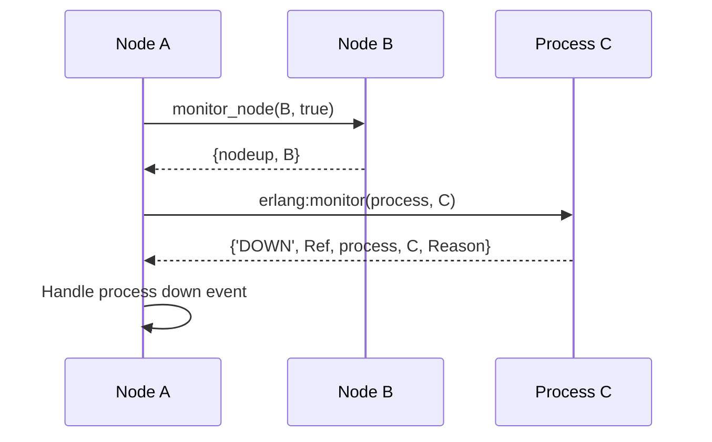

## 5.6 Distributed Process Monitoring

In the realm of distributed systems, monitoring and managing processes across nodes is crucial for maintaining system reliability and performance. Erlang, with its robust concurrency and fault-tolerance features, provides powerful tools for distributed process monitoring. In this section, we will delve into the mechanisms provided by Erlang for monitoring processes across nodes, focusing on `monitor_node` and `erlang:monitor/2`. We will also explore best practices for handling node and process down events, ensuring system reliability, and discuss any limitations or considerations in distributed monitoring.

### Introduction to Distributed Process Monitoring

Distributed process monitoring involves tracking the status and health of processes running on different nodes within a distributed system. This is essential for detecting failures, ensuring system resilience, and maintaining seamless operation across the network. Erlang's concurrency model, based on lightweight processes and message passing, makes it an ideal choice for building distributed systems that require robust monitoring capabilities.

### Using `monitor_node` to Track Node Status

The `monitor_node` function in Erlang is a powerful tool for tracking the status of nodes in a distributed system. It allows you to receive notifications when a node goes up or down, enabling you to react to changes in the network topology.

#### Syntax and Usage

```erlang
monitor_node(Node, Flag) -> boolean()
```

- **Node**: The name of the node you want to monitor.
- **Flag**: A boolean value (`true` or `false`). Setting it to `true` starts monitoring the node, while `false` stops monitoring.

#### Example: Monitoring Node Status

Let's consider an example where we monitor a node named `node1@host`.

```erlang
-module(node_monitor).
-export([start_monitoring/1]).

start_monitoring(Node) ->
    monitor_node(Node, true),
    receive
        {nodedown, Node} ->
            io:format("Node ~p is down~n", [Node]);
        {nodeup, Node} ->
            io:format("Node ~p is up~n", [Node])
    end.
```

In this example, we start monitoring `node1@host`. When the node goes down or comes up, a message is received, and we print the status to the console.

### Process Monitoring Across Nodes Using `erlang:monitor/2`

While `monitor_node` is useful for tracking node status, `erlang:monitor/2` is used for monitoring individual processes, even if they reside on remote nodes. This function provides a way to receive notifications when a monitored process terminates.

#### Syntax and Usage

```erlang
erlang:monitor(Type, Item) -> reference()
```

- **Type**: The type of entity to monitor, typically `process`.
- **Item**: The process identifier (PID) or registered name of the process to monitor.

#### Example: Monitoring a Remote Process

Consider a scenario where we want to monitor a process running on a remote node.

```erlang
-module(process_monitor).
-export([monitor_remote_process/1]).

monitor_remote_process(RemotePid) ->
    Ref = erlang:monitor(process, RemotePid),
    receive
        {'DOWN', Ref, process, RemotePid, Reason} ->
            io:format("Process ~p is down. Reason: ~p~n", [RemotePid, Reason])
    end.
```

In this example, we monitor a remote process identified by `RemotePid`. If the process terminates, we receive a `DOWN` message with the reason for termination.

### Handling Node and Process Down Events

Handling node and process down events is crucial for maintaining system reliability. When a node or process goes down, it is essential to have strategies in place to recover from failures and ensure continued operation.

#### Node Down Events

When a node goes down, it may affect multiple processes and services. Here are some strategies for handling node down events:

- **Failover Mechanisms**: Implement failover mechanisms to transfer responsibilities to other nodes.
- **Redundancy**: Ensure redundancy in your system design to minimize the impact of node failures.
- **Logging and Alerts**: Log node down events and set up alerts to notify administrators.

#### Process Down Events

When a monitored process goes down, you can take the following actions:

- **Restart Processes**: Use supervisors to automatically restart failed processes.
- **Log Failures**: Log the reason for process termination for further analysis.
- **Notify Stakeholders**: Send notifications to relevant stakeholders about process failures.

### Best Practices for Maintaining System Reliability

To ensure system reliability in a distributed Erlang environment, consider the following best practices:

- **Use Supervisors**: Leverage Erlang's OTP framework and supervisors to manage process lifecycles and recover from failures.
- **Design for Fault Tolerance**: Design your system with fault tolerance in mind, using redundancy and failover strategies.
- **Monitor Continuously**: Continuously monitor nodes and processes to detect and react to failures promptly.
- **Test Failure Scenarios**: Regularly test failure scenarios to ensure your system can handle unexpected events.

### Limitations and Considerations in Distributed Monitoring

While Erlang provides robust tools for distributed monitoring, there are some limitations and considerations to keep in mind:

- **Network Partitions**: Network partitions can lead to false positives in node down events. Implement strategies to handle such scenarios.
- **Scalability**: As the number of nodes and processes increases, monitoring overhead may become significant. Optimize monitoring strategies to minimize impact.
- **Security**: Ensure secure communication between nodes to prevent unauthorized access and monitoring.

### Visualizing Distributed Process Monitoring

To better understand the flow of distributed process monitoring, let's visualize the interaction between nodes and processes using a sequence diagram.



In this diagram, Node A monitors Node B and Process C. When Node B comes up, Node A receives a notification. Similarly, if Process C goes down, Node A handles the event.

### Try It Yourself

To deepen your understanding of distributed process monitoring, try modifying the examples provided:

- **Experiment with Different Nodes**: Monitor multiple nodes and observe how the system reacts to changes in node status.
- **Simulate Process Failures**: Create scenarios where monitored processes fail and implement recovery strategies.
- **Optimize Monitoring**: Explore ways to optimize monitoring for large-scale distributed systems.

### Conclusion

Distributed process monitoring in Erlang is a powerful capability that ensures system reliability and resilience. By leveraging tools like `monitor_node` and `erlang:monitor/2`, you can effectively track and manage processes across nodes. Remember to implement best practices for fault tolerance and continuously monitor your system to detect and handle failures promptly.

## Quiz: Distributed Process Monitoring



### What function is used to monitor the status of nodes in Erlang?

- [x] monitor_node
- [ ] erlang:monitor/2
- [ ] node_status
- [ ] process_monitor

> **Explanation:** The `monitor_node` function is used to track the status of nodes in a distributed Erlang system.

### Which function is used to monitor individual processes across nodes?

- [ ] monitor_node
- [x] erlang:monitor/2
- [ ] process_status
- [ ] node_monitor

> **Explanation:** The `erlang:monitor/2` function is used to monitor individual processes, even if they reside on remote nodes.

### What message is received when a monitored node goes down?

- [x] {nodedown, Node}
- [ ] {nodeup, Node}
- [ ] {'DOWN', Ref, process, Pid, Reason}
- [ ] {node_status, Node, down}

> **Explanation:** When a monitored node goes down, the message `{nodedown, Node}` is received.

### What is a common strategy for handling node down events?

- [x] Implement failover mechanisms
- [ ] Ignore the event
- [ ] Restart the node immediately
- [ ] Log the event and do nothing

> **Explanation:** Implementing failover mechanisms is a common strategy to handle node down events and ensure system reliability.

### What is a limitation of distributed monitoring in Erlang?

- [x] Network partitions can lead to false positives
- [ ] It cannot monitor remote processes
- [ ] It does not support node monitoring
- [ ] It is only available in OTP

> **Explanation:** Network partitions can lead to false positives in node down events, which is a limitation of distributed monitoring.

### What is the purpose of using supervisors in Erlang?

- [x] Manage process lifecycles and recover from failures
- [ ] Monitor network traffic
- [ ] Handle user authentication
- [ ] Optimize database queries

> **Explanation:** Supervisors in Erlang are used to manage process lifecycles and recover from failures, ensuring system reliability.

### How can you optimize monitoring for large-scale distributed systems?

- [x] Minimize monitoring overhead
- [ ] Increase the number of monitored nodes
- [ ] Use more complex monitoring strategies
- [ ] Monitor only local processes

> **Explanation:** Minimizing monitoring overhead is essential for optimizing monitoring in large-scale distributed systems.

### What message is received when a monitored process goes down?

- [ ] {nodedown, Node}
- [ ] {nodeup, Node}
- [x] {'DOWN', Ref, process, Pid, Reason}
- [ ] {process_status, Pid, down}

> **Explanation:** When a monitored process goes down, the message `{'DOWN', Ref, process, Pid, Reason}` is received.

### What is a best practice for maintaining system reliability in Erlang?

- [x] Continuously monitor nodes and processes
- [ ] Monitor only critical nodes
- [ ] Use manual monitoring
- [ ] Ignore node down events

> **Explanation:** Continuously monitoring nodes and processes is a best practice for maintaining system reliability in Erlang.

### Is it true that `erlang:monitor/2` can be used to monitor processes on remote nodes?

- [x] True
- [ ] False

> **Explanation:** `erlang:monitor/2` can indeed be used to monitor processes on remote nodes, making it a versatile tool for distributed process monitoring.



Remember, distributed process monitoring is a journey. As you continue to explore and experiment, you'll gain deeper insights into building resilient and reliable distributed systems with Erlang. Keep experimenting, stay curious, and enjoy the journey!
