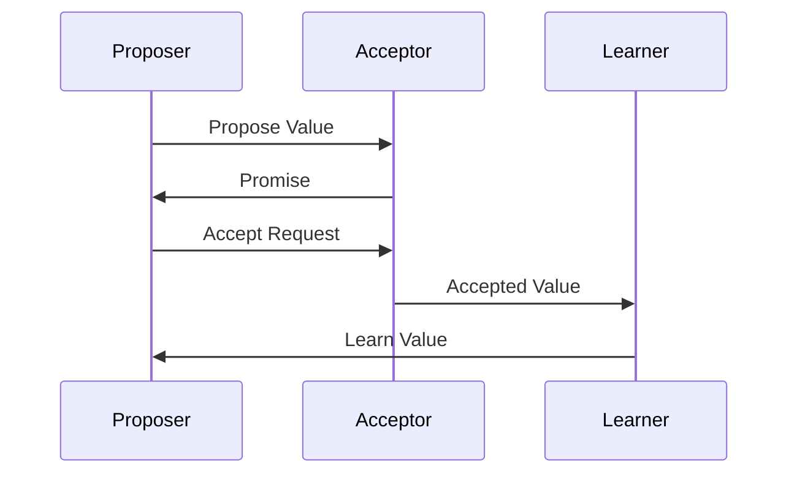

## 5.7 Implementing Consensus Algorithms

In the realm of distributed systems, achieving consensus among distributed nodes is a fundamental challenge. Consensus algorithms are crucial for ensuring data consistency and reliability across nodes, especially in environments where nodes may fail or messages may be delayed. In this section, we will delve into the intricacies of implementing consensus algorithms in Erlang, a language renowned for its concurrency and fault-tolerance capabilities.

### Understanding Consensus Algorithms

Consensus algorithms are protocols that help multiple nodes in a distributed system agree on a single data value. This agreement is essential for maintaining consistency across the system, especially when nodes can fail or network partitions occur. Two of the most well-known consensus algorithms are Paxos and Raft.

#### Why Consensus Algorithms Matter

- **Data Consistency**: Ensures that all nodes in a distributed system have the same data, which is crucial for applications like databases and distributed ledgers.
- **Fault Tolerance**: Allows the system to continue operating correctly even if some nodes fail.
- **Coordination**: Facilitates coordination among distributed components, enabling them to work together seamlessly.

### Common Consensus Algorithms

#### Paxos

Paxos is a family of protocols for solving consensus in a network of unreliable processors. It is known for its robustness and is widely used in distributed systems.

- **Key Concepts**: Paxos involves roles such as proposers, acceptors, and learners. Proposers suggest values, acceptors agree on values, and learners learn the chosen value.
- **Phases**: Paxos operates in phases, including the prepare phase, promise phase, and accept phase, to ensure agreement.

#### Raft

Raft is another consensus algorithm designed to be more understandable than Paxos while providing similar guarantees.

- **Leader Election**: Raft elects a leader to manage the log replication process, simplifying the consensus process.
- **Log Replication**: The leader replicates log entries to follower nodes, ensuring consistency.
- **Safety and Liveness**: Raft guarantees that only one leader can exist at a time and that the system can make progress even if some nodes fail.

### Challenges of Implementing Consensus

Implementing consensus algorithms in distributed systems presents several challenges:

- **Network Partitions**: Nodes may become isolated due to network issues, complicating consensus.
- **Node Failures**: Nodes can fail or restart, requiring the algorithm to handle such scenarios gracefully.
- **Message Delays**: Messages can be delayed or lost, necessitating robust communication protocols.

### Leveraging Erlang for Consensus

Erlang's features make it well-suited for implementing consensus algorithms:

- **Concurrency**: Erlang's lightweight processes allow for efficient handling of multiple nodes and messages.
- **Fault Tolerance**: The "let it crash" philosophy and supervision trees help manage node failures.
- **Message Passing**: Erlang's message-passing model is ideal for implementing communication between nodes.

#### Erlang Code Example: Basic Consensus Mechanism

Let's explore a simple Erlang implementation of a consensus mechanism using message passing:

```erlang
-module(consensus).
-export([start/0, propose/1, accept/1, learn/0]).

start() ->
    spawn(fun() -> loop([]) end).

propose(Value) ->
    %% Propose a value to the acceptors
    io:format("Proposing value: ~p~n", [Value]),
    %% Send proposal to acceptors
    %% ...

accept(Value) ->
    %% Accept a proposed value
    io:format("Accepting value: ~p~n", [Value]),
    %% Send acceptance to learners
    %% ...

learn() ->
    %% Learn the accepted value
    receive
        {accepted, Value} ->
            io:format("Learned value: ~p~n", [Value])
    end.

loop(State) ->
    receive
        {propose, Value} ->
            %% Handle proposal
            accept(Value),
            loop(State);
        {accept, Value} ->
            %% Handle acceptance
            learn(),
            loop(State)
    end.
```

### Utilizing Erlang Libraries for Consensus

Erlang's ecosystem includes libraries that simplify the implementation of consensus algorithms. One such library is [ra](https://github.com/rabbitmq/ra), which provides a Raft-based consensus mechanism.

#### Using the `ra` Library

The `ra` library offers a robust implementation of the Raft consensus algorithm. Here's how you can use it in your Erlang application:

1. **Add Dependency**: Include the `ra` library in your project's dependencies.
2. **Configure Nodes**: Set up the nodes in your distributed system to participate in the Raft consensus.
3. **Implement Logic**: Use the library's API to implement your application's logic, leveraging Raft for consensus.

### Visualizing Consensus Algorithms

To better understand how consensus algorithms work, let's visualize the process using a sequence diagram:



**Diagram Description**: This sequence diagram illustrates the interaction between proposers, acceptors, and learners in a consensus algorithm. The proposer suggests a value, the acceptor promises to consider it, and upon acceptance, the learner learns the value.

### Key Considerations for Implementing Consensus

- **Network Reliability**: Ensure your system can handle unreliable networks and node failures.
- **Scalability**: Design your consensus mechanism to scale with the number of nodes.
- **Performance**: Optimize message passing and state management for performance.

### Erlang Unique Features

Erlang's unique features, such as its lightweight process model and robust error handling, make it an excellent choice for implementing consensus algorithms. The language's ability to handle thousands of concurrent processes efficiently is particularly beneficial for distributed systems.

### Differences and Similarities with Other Patterns

Consensus algorithms share similarities with other distributed patterns, such as leader election and state replication. However, they are distinct in their focus on achieving agreement among nodes.

### Try It Yourself

Experiment with the provided Erlang code example by modifying the proposal and acceptance logic. Try implementing a simple leader election mechanism or extending the consensus process to handle more complex scenarios.

### Further Reading

For more information on consensus algorithms and their implementation, consider exploring the following resources:

- [Paxos Made Simple](https://lamport.azurewebsites.net/pubs/paxos-simple.pdf) by Leslie Lamport
- [In Search of an Understandable Consensus Algorithm (Raft)](https://raft.github.io/raft.pdf) by Diego Ongaro and John Ousterhout

### Knowledge Check

- What are the key roles in the Paxos consensus algorithm?
- How does Raft simplify the consensus process compared to Paxos?
- What challenges do network partitions pose for consensus algorithms?

### Summary

Implementing consensus algorithms in Erlang allows you to leverage the language's strengths in concurrency and fault tolerance. By understanding the principles of Paxos and Raft, and utilizing Erlang's features, you can build robust distributed systems that maintain data consistency across nodes.

## Quiz: Implementing Consensus Algorithms



### What is the primary purpose of consensus algorithms in distributed systems?

- [x] To ensure data consistency across nodes
- [ ] To increase the speed of data processing
- [ ] To reduce the number of nodes in a system
- [ ] To simplify the network architecture

> **Explanation:** Consensus algorithms are designed to ensure that all nodes in a distributed system agree on a single data value, maintaining consistency.

### Which of the following is a key concept in the Paxos algorithm?

- [x] Proposers, Acceptors, and Learners
- [ ] Leaders and Followers
- [ ] Producers and Consumers
- [ ] Clients and Servers

> **Explanation:** Paxos involves roles such as proposers, acceptors, and learners to achieve consensus.

### How does Raft differ from Paxos in terms of leader election?

- [x] Raft explicitly elects a leader to manage log replication
- [ ] Raft does not use a leader
- [ ] Raft uses multiple leaders simultaneously
- [ ] Raft elects a leader only during network partitions

> **Explanation:** Raft simplifies the consensus process by electing a single leader to manage log replication.

### What Erlang feature is particularly beneficial for implementing consensus algorithms?

- [x] Lightweight processes
- [ ] Object-oriented programming
- [ ] Static typing
- [ ] Synchronous communication

> **Explanation:** Erlang's lightweight processes allow for efficient handling of multiple nodes and messages in a distributed system.

### Which Erlang library provides a Raft-based consensus mechanism?

- [x] ra
- [ ] cowboy
- [ ] mochiweb
- [ ] rebar3

> **Explanation:** The `ra` library offers a robust implementation of the Raft consensus algorithm in Erlang.

### What is a common challenge when implementing consensus algorithms in distributed systems?

- [x] Network partitions
- [ ] High memory usage
- [ ] Lack of concurrency
- [ ] Excessive logging

> **Explanation:** Network partitions can isolate nodes, complicating the consensus process.

### How can Erlang's "let it crash" philosophy aid in implementing consensus algorithms?

- [x] By allowing processes to fail and restart without affecting the overall system
- [ ] By preventing any process from crashing
- [ ] By ensuring all processes run synchronously
- [ ] By reducing the number of processes needed

> **Explanation:** Erlang's "let it crash" philosophy helps manage node failures by allowing processes to fail and restart gracefully.

### What role does the learner play in the Paxos algorithm?

- [x] Learns the chosen value
- [ ] Proposes values
- [ ] Accepts proposals
- [ ] Rejects invalid values

> **Explanation:** In Paxos, learners learn the value that has been chosen by the acceptors.

### Which of the following is a benefit of using Erlang for consensus algorithms?

- [x] Concurrency and fault tolerance
- [ ] Object-oriented design
- [ ] Static type checking
- [ ] Synchronous communication

> **Explanation:** Erlang's concurrency and fault tolerance features make it well-suited for implementing consensus algorithms.

### True or False: Raft guarantees that only one leader can exist at a time.

- [x] True
- [ ] False

> **Explanation:** Raft ensures that only one leader can exist at a time, which simplifies the consensus process and ensures consistency.



Remember, this is just the beginning. As you progress, you'll build more complex and interactive distributed systems. Keep experimenting, stay curious, and enjoy the journey!
