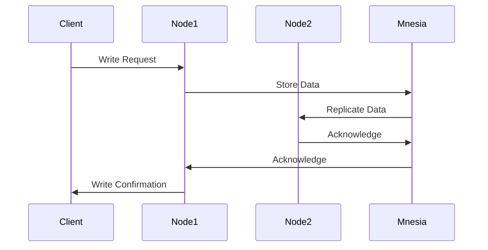

## 5.8 Data Replication and Synchronization

In the realm of distributed systems, data replication and synchronization are crucial for ensuring data availability, fault tolerance, and consistency across multiple nodes. Erlang, with its robust concurrency and distribution capabilities, provides powerful tools to manage data replication effectively. In this section, we will delve into the need for data replication, explore how Erlang's Mnesia database facilitates replication, and discuss strategies for handling data conflicts and synchronization issues.

### The Need for Data Replication

Data replication involves maintaining copies of data across different nodes in a distributed system. This practice is essential for several reasons:

- **Fault Tolerance**: By replicating data, systems can continue to operate even if some nodes fail. This redundancy ensures that data is not lost and services remain available.
- **Load Balancing**: Distributing data across multiple nodes allows for better load distribution, improving system performance and responsiveness.
- **Data Locality**: Replication can bring data closer to where it is needed, reducing latency and improving access times.
- **High Availability**: Ensures that data is accessible even during network partitions or node failures.

### Mnesia: Erlang's Distributed Database

Mnesia is a distributed database management system built into Erlang, designed specifically for telecommunications applications. It supports both in-memory and disk-based storage, making it versatile for various use cases. Mnesia's ability to replicate data across nodes is one of its standout features.

#### Setting Up Replicated Tables in Mnesia

To replicate data in Mnesia, you need to define tables with a replication strategy. Here's a step-by-step guide to setting up replicated tables:

1. **Define the Schema**: Start by defining the schema for your tables. Specify the attributes and types for each table.

2. **Create Tables with Replication**: Use the `mnesia:create_table/2` function to create tables with replication. You can specify the nodes where the table should be replicated.

```erlang
% Define the schema
-record(person, {id, name, age}).

% Create a replicated table
mnesia:create_table(person, [
    {attributes, record_info(fields, person)},
    {disc_copies, [node1@host, node2@host]}
]).
```

3. **Start Mnesia on All Nodes**: Ensure that Mnesia is started on all nodes involved in the replication.

```erlang
% Start Mnesia on each node
mnesia:start().
```

4. **Add Nodes to the Schema**: Use `mnesia:change_config/2` to add nodes to the schema for replication.

```erlang
% Add a node to the schema
mnesia:change_config(extra_db_nodes, [node2@host]).
```

5. **Verify Replication**: Check the table info to verify that replication is set up correctly.

```erlang
% Verify table info
mnesia:table_info(person, all).
```

### Handling Data Conflicts and Synchronization Issues

In distributed systems, data conflicts can arise due to concurrent updates on different nodes. Handling these conflicts is crucial to maintain data consistency.

#### Conflict Resolution Strategies

1. **Last-Write-Wins (LWW)**: This strategy resolves conflicts by accepting the most recent write operation. It's simple but may lead to data loss if not used carefully.

2. **Version Vectors**: Use version vectors to track changes and resolve conflicts based on the causal history of updates.

3. **Custom Conflict Resolution**: Implement custom logic to merge conflicting updates based on application-specific requirements.

4. **Quorum-Based Approaches**: Require a majority of nodes to agree on updates, ensuring consistency at the cost of increased latency.

### Choosing the Right Replication Model

Selecting the appropriate replication model depends on the application's requirements for consistency, availability, and partition tolerance (CAP theorem). Here are some considerations:

- **Strong Consistency**: If consistency is critical, opt for synchronous replication with mechanisms like two-phase commit.
- **Eventual Consistency**: For applications that can tolerate temporary inconsistencies, asynchronous replication with eventual consistency may be suitable.
- **Hybrid Approaches**: Combine different models to balance consistency and availability based on specific use cases.

### Visualizing Data Replication in Erlang

To better understand the flow of data replication in Erlang, let's visualize the process using a sequence diagram.



**Diagram Description**: This sequence diagram illustrates the process of writing data to a node in a distributed Erlang system using Mnesia. The data is stored on Node1 and replicated to Node2, ensuring redundancy and fault tolerance.

### Try It Yourself

Experiment with the Mnesia setup by modifying the replication strategy or adding more nodes. Observe how changes affect data availability and consistency.

### Key Takeaways

- Data replication is essential for fault tolerance, load balancing, and high availability in distributed systems.
- Erlang's Mnesia database provides robust support for data replication across nodes.
- Handling data conflicts requires careful consideration of resolution strategies.
- Choosing the right replication model involves balancing consistency, availability, and partition tolerance.

### References and Further Reading

- [Erlang Mnesia Documentation](https://erlang.org/doc/man/mnesia.html)
- [CAP Theorem Explained](https://en.wikipedia.org/wiki/CAP_theorem)
- [Distributed Systems: Principles and Paradigms](https://www.amazon.com/Distributed-Systems-Principles-Andrew-Tanenbaum/dp/0132392273)

## Quiz: Data Replication and Synchronization



### What is the primary purpose of data replication in distributed systems?

- [x] To ensure data availability and fault tolerance
- [ ] To reduce data size
- [ ] To increase data complexity
- [ ] To eliminate the need for backups

> **Explanation:** Data replication ensures that data is available even if some nodes fail, providing fault tolerance and high availability.

### Which Erlang feature is primarily used for data replication?

- [x] Mnesia
- [ ] ETS
- [ ] GenServer
- [ ] Supervisor

> **Explanation:** Mnesia is Erlang's distributed database system that supports data replication across nodes.

### What is a common strategy for resolving data conflicts in distributed systems?

- [x] Last-Write-Wins
- [ ] First-Write-Wins
- [ ] Random-Write-Wins
- [ ] No-Write-Wins

> **Explanation:** Last-Write-Wins is a simple strategy where the most recent write operation is accepted to resolve conflicts.

### What does the CAP theorem stand for?

- [x] Consistency, Availability, Partition tolerance
- [ ] Consistency, Accuracy, Performance
- [ ] Capacity, Availability, Performance
- [ ] Consistency, Accessibility, Partition tolerance

> **Explanation:** The CAP theorem states that a distributed system can only guarantee two out of the three: Consistency, Availability, and Partition tolerance.

### Which replication model is suitable for applications that can tolerate temporary inconsistencies?

- [x] Eventual Consistency
- [ ] Strong Consistency
- [ ] Immediate Consistency
- [ ] Delayed Consistency

> **Explanation:** Eventual consistency allows for temporary inconsistencies, which are resolved over time, making it suitable for certain applications.

### How can you verify that a table is replicated correctly in Mnesia?

- [x] Use `mnesia:table_info/2`
- [ ] Use `mnesia:delete_table/1`
- [ ] Use `mnesia:stop/0`
- [ ] Use `mnesia:clear_table/1`

> **Explanation:** The `mnesia:table_info/2` function provides information about the table, including its replication status.

### What is a disadvantage of the Last-Write-Wins conflict resolution strategy?

- [x] Potential data loss
- [ ] Increased complexity
- [ ] Reduced performance
- [ ] Increased latency

> **Explanation:** Last-Write-Wins can lead to data loss if important updates are overwritten by more recent but less important ones.

### Which Erlang function is used to create a replicated table in Mnesia?

- [x] `mnesia:create_table/2`
- [ ] `mnesia:delete_table/1`
- [ ] `mnesia:stop/0`
- [ ] `mnesia:clear_table/1`

> **Explanation:** The `mnesia:create_table/2` function is used to create tables with specified replication strategies.

### What is the role of version vectors in conflict resolution?

- [x] To track changes and resolve conflicts based on causal history
- [ ] To increase data size
- [ ] To reduce data complexity
- [ ] To eliminate the need for backups

> **Explanation:** Version vectors help track the causal history of updates, aiding in conflict resolution by understanding the sequence of changes.

### True or False: Mnesia can only store data in-memory.

- [ ] True
- [x] False

> **Explanation:** Mnesia supports both in-memory and disk-based storage, providing flexibility for different use cases.



Remember, this is just the beginning. As you progress, you'll build more complex and interactive distributed systems. Keep experimenting, stay curious, and enjoy the journey!
