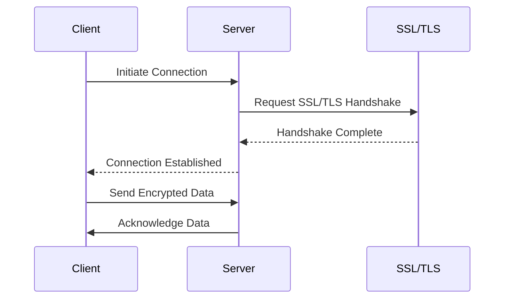

## 5.9 Security in Distributed Systems

In the realm of distributed systems, security is paramount. As applications span across multiple nodes, ensuring secure communication and data integrity becomes increasingly complex. In this section, we will delve into the security risks inherent in distributed systems, explore Erlang's cookie-based authentication mechanism, and provide guidance on configuring secure communication channels using SSL/TLS. We will also discuss best practices for maintaining security in distributed environments.

### Understanding Security Risks in Distributed Systems

Distributed systems are susceptible to a variety of security threats, including unauthorized access, data interception, and denial of service attacks. These risks arise due to the inherent nature of distributed architectures, where multiple components communicate over potentially insecure networks. To mitigate these risks, it is crucial to implement robust security measures.

#### Common Security Threats

1. **Unauthorized Access**: Attackers may attempt to gain unauthorized access to system resources, potentially compromising sensitive data.
2. **Data Interception**: Without proper encryption, data transmitted between nodes can be intercepted and read by malicious actors.
3. **Denial of Service (DoS)**: Attackers may flood the system with requests, overwhelming resources and causing service disruptions.
4. **Man-in-the-Middle (MitM) Attacks**: Attackers intercept and potentially alter communication between nodes, posing a significant threat to data integrity.

### Erlang's Cookie-Based Authentication Mechanism

Erlang employs a simple yet effective cookie-based authentication mechanism to secure communication between nodes. Each node in an Erlang cluster is assigned a "magic cookie," a shared secret that must match for nodes to communicate.

#### How Cookie-Based Authentication Works

1. **Cookie Generation**: Each Erlang node is assigned a cookie, typically stored in the `.erlang.cookie` file in the user's home directory.
2. **Node Connection**: When a node attempts to connect to another, it sends its cookie as part of the connection request.
3. **Cookie Verification**: The receiving node verifies the cookie against its own. If the cookies match, the connection is established; otherwise, it is rejected.

#### Configuring Cookies

To configure cookies in Erlang, ensure that the `.erlang.cookie` file is present and contains the same cookie value on all nodes that need to communicate. The file should have appropriate permissions to prevent unauthorized access.

```shell
# Set the cookie value
echo "my_secret_cookie" > ~/.erlang.cookie
# Set file permissions to read/write for the owner only
chmod 400 ~/.erlang.cookie
```

### Configuring Secure Communication Channels

While cookie-based authentication provides a basic level of security, it is essential to encrypt data transmitted between nodes to prevent interception. Erlang supports SSL/TLS for secure communication.

#### Implementing SSL/TLS in Erlang

SSL/TLS provides encryption and ensures data integrity during transmission. Erlang's `ssl` module facilitates the implementation of SSL/TLS.

1. **Generate SSL Certificates**: Use tools like OpenSSL to generate SSL certificates for your nodes.

```shell
# Generate a private key
openssl genrsa -out server.key 2048

# Generate a certificate signing request (CSR)
openssl req -new -key server.key -out server.csr

# Generate a self-signed certificate
openssl x509 -req -days 365 -in server.csr -signkey server.key -out server.crt
```

2. **Configure SSL in Erlang**: Use the `ssl` module to set up secure communication.

```erlang
% Start the SSL application
ssl:start().

% Define SSL options
SslOptions = [
    {certfile, "path/to/server.crt"},
    {keyfile, "path/to/server.key"},
    {cacertfile, "path/to/ca.crt"},
    {verify, verify_peer},
    {fail_if_no_peer_cert, true}
].

% Establish a secure connection
{ok, Socket} = ssl:connect("remote_host", 443, SslOptions).
```

### Best Practices for Security in Distributed Systems

1. **Regular Security Audits**: Conduct regular security audits to identify and address vulnerabilities.
2. **Use Strong Authentication**: Implement strong authentication mechanisms, such as multi-factor authentication, to enhance security.
3. **Encrypt Data**: Always encrypt sensitive data, both at rest and in transit, to protect against unauthorized access.
4. **Monitor and Log Activity**: Continuously monitor and log system activity to detect and respond to security incidents promptly.
5. **Keep Software Updated**: Regularly update software and dependencies to patch known vulnerabilities.
6. **Limit Access**: Implement the principle of least privilege, granting users and processes only the access necessary for their function.

### Visualizing Secure Communication in Distributed Systems

To better understand the flow of secure communication in distributed systems, let's visualize the process using a sequence diagram.



**Diagram Description**: This sequence diagram illustrates the process of establishing a secure connection between a client and a server using SSL/TLS. The client initiates the connection, the server requests an SSL/TLS handshake, and upon successful completion, encrypted data is transmitted securely.

### Knowledge Check

Before we conclude, let's reinforce our understanding with a few questions:

- What are the key security risks in distributed systems?
- How does Erlang's cookie-based authentication work?
- Why is it important to encrypt data in distributed systems?
- What are some best practices for maintaining security in distributed environments?

### Embrace the Journey

Securing distributed systems is a continuous process that requires vigilance and adherence to best practices. Remember, this is just the beginning. As you progress, you'll build more secure and resilient applications. Keep experimenting, stay curious, and enjoy the journey!

## Quiz: Security in Distributed Systems



### What is a common security threat in distributed systems?

- [x] Unauthorized Access
- [ ] Data Compression
- [ ] Load Balancing
- [ ] High Availability

> **Explanation:** Unauthorized access is a common security threat where attackers attempt to gain access to system resources without permission.

### How does Erlang's cookie-based authentication work?

- [x] By matching a shared secret cookie between nodes
- [ ] By using public key encryption
- [ ] By verifying IP addresses
- [ ] By using a password

> **Explanation:** Erlang uses a shared secret cookie to authenticate nodes. If the cookies match, communication is allowed.

### Why is SSL/TLS important in distributed systems?

- [x] It encrypts data to prevent interception
- [ ] It compresses data for faster transmission
- [ ] It balances load across servers
- [ ] It provides high availability

> **Explanation:** SSL/TLS encrypts data, ensuring that it cannot be intercepted or read by unauthorized parties during transmission.

### What is the principle of least privilege?

- [x] Granting only necessary access to users and processes
- [ ] Allowing all users full access
- [ ] Disabling all security features
- [ ] Encrypting all data

> **Explanation:** The principle of least privilege involves granting users and processes only the access necessary for their function, reducing the risk of unauthorized access.

### Which of the following is a best practice for maintaining security?

- [x] Regular security audits
- [ ] Ignoring software updates
- [ ] Disabling encryption
- [ ] Allowing unrestricted access

> **Explanation:** Regular security audits help identify and address vulnerabilities, ensuring the system remains secure.

### What is a man-in-the-middle attack?

- [x] Intercepting and altering communication between nodes
- [ ] Compressing data for faster transmission
- [ ] Balancing load across servers
- [ ] Providing high availability

> **Explanation:** A man-in-the-middle attack involves intercepting and potentially altering communication between nodes, posing a threat to data integrity.

### How can you secure communication between Erlang nodes?

- [x] By using SSL/TLS encryption
- [ ] By disabling all network connections
- [ ] By using plain text communication
- [ ] By ignoring security best practices

> **Explanation:** SSL/TLS encryption secures communication by encrypting data, preventing unauthorized access.

### What should be done with the `.erlang.cookie` file?

- [x] Set appropriate permissions to prevent unauthorized access
- [ ] Share it publicly
- [ ] Delete it after use
- [ ] Ignore its existence

> **Explanation:** The `.erlang.cookie` file should have appropriate permissions to ensure that only authorized users can access it.

### What is the purpose of monitoring and logging system activity?

- [x] To detect and respond to security incidents
- [ ] To compress data
- [ ] To balance load
- [ ] To provide high availability

> **Explanation:** Monitoring and logging system activity help detect and respond to security incidents promptly, maintaining system security.

### True or False: Encryption is only necessary for data at rest.

- [ ] True
- [x] False

> **Explanation:** Encryption is necessary for both data at rest and in transit to ensure comprehensive security.


