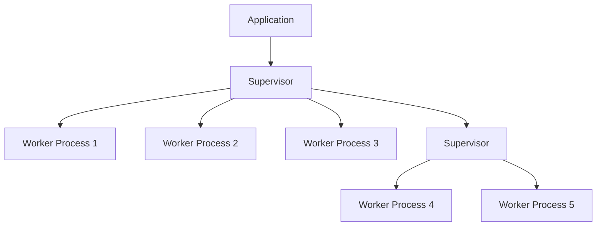

## 6.1 Introduction to OTP

The Open Telecom Platform (OTP) is a cornerstone of the Erlang ecosystem, providing a comprehensive set of libraries and design principles that enable developers to build robust, fault-tolerant, and scalable applications. Originally developed by Ericsson for telecommunication systems, OTP has evolved into a general-purpose framework that is widely used in various industries. In this section, we will delve into the significance of OTP, its components, and how it can be leveraged to enhance the reliability and scalability of your Erlang applications.

### What is OTP?

OTP stands for Open Telecom Platform, and it is a collection of middleware, libraries, and tools designed to support the development of concurrent, distributed, and fault-tolerant software systems. OTP is built on top of the Erlang programming language and provides a standardized framework for building applications that can handle complex, real-world requirements.

#### Significance of OTP in the Erlang Ecosystem

OTP is integral to the Erlang ecosystem for several reasons:

- **Standardization**: OTP provides a standardized way to structure applications, making it easier for developers to understand and maintain codebases.
- **Fault Tolerance**: With built-in support for error handling and recovery, OTP applications can continue to operate even in the face of failures.
- **Concurrency**: OTP leverages Erlang's lightweight process model to handle thousands of concurrent activities efficiently.
- **Scalability**: Applications built with OTP can scale horizontally across multiple nodes, making it suitable for large-scale systems.

### The Framework of OTP

OTP offers a rich set of components that facilitate the development of complex systems. Let's explore some of the key components:

#### Behaviors

Behaviors in OTP are design patterns that encapsulate common patterns of concurrent programming. They provide a template for defining processes that follow a specific lifecycle. The most commonly used behaviors include:

- **`gen_server`**: A generic server behavior for implementing server processes.
- **`gen_statem`**: A generic state machine behavior for implementing state machines.
- **`gen_event`**: A generic event manager behavior for handling events.
- **`supervisor`**: A behavior for defining supervision trees that manage process lifecycles.

#### Supervision Trees

Supervision trees are a hierarchical structure of processes where supervisors monitor and manage worker processes. This architecture ensures that if a process fails, it can be restarted automatically, thereby maintaining system stability.

```erlang
-module(simple_supervisor).
-behaviour(supervisor).

%% API
-export([start_link/0]).

%% Supervisor callbacks
-export([init/1]).

start_link() ->
    supervisor:start_link({local, ?MODULE}, ?MODULE, []).

init([]) ->
    {ok, {{one_for_one, 5, 10},
          [{worker1, {worker_module, start_link, []}, permanent, 5000, worker, [worker_module]},
           {worker2, {worker_module, start_link, []}, permanent, 5000, worker, [worker_module]}]}}.
```

In the code above, we define a simple supervisor that manages two worker processes. The `one_for_one` strategy indicates that if a worker process terminates, only that process is restarted.

#### Applications

An OTP application is a component that can be started and stopped as a unit. It consists of a collection of modules and resources that work together to perform a specific task. Applications are the building blocks of OTP systems and can be composed to form larger systems.

### Benefits of Using OTP

The adoption of OTP in Erlang projects brings several benefits:

- **Reliability**: OTP's supervision trees and fault-tolerance mechanisms ensure that applications can recover from errors gracefully.
- **Maintainability**: The standardized structure provided by OTP makes it easier to manage and extend applications.
- **Scalability**: OTP's concurrency model allows applications to scale efficiently across multiple nodes.
- **Reusability**: OTP behaviors promote code reuse by providing generic implementations of common patterns.

### Encouraging Adoption of OTP Principles

To fully leverage the power of Erlang, it is essential to adopt OTP principles in your projects. Here are some tips to get started:

- **Start with Behaviors**: Use OTP behaviors to implement common patterns such as servers and state machines.
- **Design with Supervision in Mind**: Structure your applications using supervision trees to ensure fault tolerance.
- **Modularize Your Code**: Break down your application into smaller, reusable components that can be managed independently.
- **Embrace Concurrency**: Take advantage of Erlang's process model to handle concurrent tasks efficiently.

### Visualizing OTP Components

To better understand the architecture of OTP, let's visualize the relationship between its components using a Mermaid.js diagram.



**Diagram Description**: This diagram illustrates a typical OTP application structure. The application consists of a top-level supervisor that manages multiple worker processes and a nested supervisor. This hierarchical structure ensures that failures in worker processes can be isolated and managed effectively.

### Try It Yourself

To deepen your understanding of OTP, try modifying the simple supervisor example provided earlier. Experiment with different supervision strategies, such as `one_for_all` or `rest_for_one`, and observe how they affect the behavior of your application.

### Knowledge Check

- **What are OTP behaviors, and why are they important?**
- **How do supervision trees contribute to fault tolerance in OTP applications?**
- **What are the benefits of using OTP in terms of scalability and reliability?**

### Summary

In this section, we introduced the Open Telecom Platform (OTP) and explored its significance in the Erlang ecosystem. We discussed the key components of OTP, including behaviors, supervision trees, and applications, and highlighted the benefits of adopting OTP principles in your projects. By leveraging OTP, you can build robust, scalable, and maintainable applications that can withstand the challenges of real-world environments.

Remember, this is just the beginning. As you progress, you'll discover more advanced OTP techniques and patterns that will further enhance your ability to build high-quality Erlang applications. Keep experimenting, stay curious, and enjoy the journey!

## Quiz: Introduction to OTP



### What does OTP stand for in the context of Erlang?

- [x] Open Telecom Platform
- [ ] Open Technology Protocol
- [ ] Operational Telecommunication Process
- [ ] Optimized Telephony Program

> **Explanation:** OTP stands for Open Telecom Platform, a set of libraries and design principles in Erlang.

### Which OTP behavior is used for implementing server processes?

- [x] `gen_server`
- [ ] `gen_statem`
- [ ] `gen_event`
- [ ] `supervisor`

> **Explanation:** `gen_server` is the OTP behavior used for implementing server processes.

### What is the purpose of a supervision tree in OTP?

- [x] To manage and monitor worker processes
- [ ] To handle network communication
- [ ] To optimize memory usage
- [ ] To compile Erlang code

> **Explanation:** Supervision trees manage and monitor worker processes to ensure fault tolerance.

### Which strategy restarts all child processes if one fails?

- [ ] `one_for_one`
- [x] `one_for_all`
- [ ] `rest_for_one`
- [ ] `simple_one_for_one`

> **Explanation:** The `one_for_all` strategy restarts all child processes if one fails.

### What is an OTP application?

- [x] A component that can be started and stopped as a unit
- [ ] A single Erlang module
- [ ] A network protocol
- [ ] A database management system

> **Explanation:** An OTP application is a component that can be started and stopped as a unit, consisting of modules and resources.

### What is the primary benefit of using OTP behaviors?

- [x] Code reuse and standardization
- [ ] Faster execution speed
- [ ] Reduced memory usage
- [ ] Enhanced graphical user interfaces

> **Explanation:** OTP behaviors promote code reuse and provide a standardized way to implement common patterns.

### How does OTP contribute to scalability?

- [x] By leveraging Erlang's concurrency model
- [ ] By reducing code complexity
- [ ] By optimizing database queries
- [ ] By enhancing graphical rendering

> **Explanation:** OTP contributes to scalability by leveraging Erlang's concurrency model to handle concurrent tasks efficiently.

### What is the role of a supervisor in OTP?

- [x] To monitor and restart worker processes
- [ ] To compile Erlang code
- [ ] To manage network connections
- [ ] To optimize memory usage

> **Explanation:** A supervisor monitors and restarts worker processes to ensure system stability.

### Which OTP behavior is used for implementing state machines?

- [ ] `gen_server`
- [x] `gen_statem`
- [ ] `gen_event`
- [ ] `supervisor`

> **Explanation:** `gen_statem` is the OTP behavior used for implementing state machines.

### True or False: OTP is only used in telecommunication systems.

- [ ] True
- [x] False

> **Explanation:** False. While OTP was originally developed for telecommunication systems, it is now used in various industries for building robust applications.


