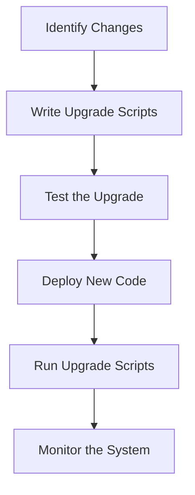

## 6.10 Hot Code Upgrades and `release_handler`

In the world of software development, maintaining uptime while deploying new features or bug fixes is crucial. Erlang, with its robust concurrency model and fault-tolerant design, offers a unique capability known as hot code upgrades. This feature allows developers to update a running system without stopping it, ensuring continuous service availability. In this section, we will delve into the concept of hot code upgrades, explore the role of the `release_handler` module, and provide a comprehensive guide to executing these upgrades effectively.

### Understanding Hot Code Upgrades

Hot code upgrades in Erlang refer to the process of updating a running application with new code without stopping the system. This capability is particularly valuable in systems that require high availability, such as telecommunications, financial services, and online platforms.

#### Key Concepts

- **Module Versioning**: Erlang supports multiple versions of a module running simultaneously. This allows the system to transition from an old version to a new one seamlessly.
- **Code Replacement**: The Erlang runtime system can replace old code with new code while processes are running, ensuring minimal disruption.
- **State Preservation**: During an upgrade, the state of processes must be carefully managed to ensure continuity.

### The Role of `release_handler`

The `release_handler` module in Erlang is a critical component for managing hot code upgrades. It provides the necessary infrastructure to handle the complexities of upgrading a live system.

#### Features of `release_handler`

- **Release Management**: Manages different versions of the application, ensuring that upgrades are applied in a controlled manner.
- **Script Execution**: Executes upgrade scripts that define the steps needed to transition from one version to another.
- **Error Handling**: Provides mechanisms to handle errors during the upgrade process, ensuring system stability.

### Preparing for a Hot Code Upgrade

Before executing a hot code upgrade, thorough preparation is essential. This involves planning the upgrade process, writing upgrade scripts, and testing the upgrade in a controlled environment.

#### Steps for Preparation

1. **Identify Changes**: Determine the changes that need to be made in the new version of the application.
2. **Write Upgrade Scripts**: Create scripts that define the steps for upgrading the application. These scripts should handle state transitions and ensure compatibility between old and new code.
3. **Test the Upgrade**: Conduct tests in a staging environment to ensure that the upgrade process works as expected without causing disruptions.

### Executing a Hot Code Upgrade

Once preparation is complete, the actual upgrade process can be executed. This involves deploying the new code, running upgrade scripts, and monitoring the system for any issues.

#### Steps for Execution

1. **Deploy New Code**: Load the new version of the code into the system.
2. **Run Upgrade Scripts**: Execute the upgrade scripts using the `release_handler` module. These scripts will handle the transition from the old version to the new one.
3. **Monitor the System**: Keep a close eye on the system during the upgrade to detect and address any issues that may arise.

### Challenges and Limitations

While hot code upgrades offer significant benefits, they also come with challenges and limitations that must be addressed.

#### Common Challenges

- **Complexity**: Managing state transitions and ensuring compatibility between old and new code can be complex.
- **Testing**: Thorough testing is required to ensure that the upgrade process does not introduce new issues.
- **Error Handling**: Proper error handling mechanisms must be in place to address any issues that arise during the upgrade.

### Importance of Planning and Testing

The success of a hot code upgrade largely depends on careful planning and thorough testing. By anticipating potential issues and testing the upgrade process in a controlled environment, developers can minimize the risk of disruptions during the upgrade.

### Code Example: Hot Code Upgrade with `release_handler`

Let's walk through a simple example of performing a hot code upgrade using the `release_handler` module.

```erlang
-module(my_app_upgrade).
-export([upgrade/1]).

%% Upgrade function to transition from version 1 to version 2
upgrade(FromVersion) ->
    case FromVersion of
        "1.0" ->
            %% Perform necessary state transformations
            io:format("Upgrading from version 1.0 to 2.0~n"),
            %% Example: Transform state data
            transform_state(),
            %% Load new module version
            code:load_file(my_app),
            ok;
        _ ->
            {error, "Unsupported version"}
    end.

%% Example function to transform state data
transform_state() ->
    %% Logic to transform state
    io:format("Transforming state data~n").
```

### Visualizing the Hot Code Upgrade Process

To better understand the hot code upgrade process, let's visualize the steps involved using a flowchart.



### Try It Yourself

To gain hands-on experience with hot code upgrades, try modifying the code example provided. Experiment with different state transformations and observe how the system behaves during the upgrade process.

### References and Further Reading

- [Erlang Documentation on Hot Code Upgrades](https://www.erlang.org/doc/man/release_handler.html)
- [Learn You Some Erlang for Great Good!](http://learnyousomeerlang.com/relups)

### Knowledge Check

To reinforce your understanding of hot code upgrades and the `release_handler` module, consider the following questions:

- What are the key benefits of hot code upgrades in Erlang?
- How does the `release_handler` module facilitate the upgrade process?
- What are some common challenges associated with hot code upgrades?

### Embrace the Journey

Remember, mastering hot code upgrades is a journey. As you gain experience, you'll develop a deeper understanding of the intricacies involved in maintaining high-availability systems. Keep experimenting, stay curious, and enjoy the process!

## Quiz: Hot Code Upgrades and `release_handler`



### What is the primary benefit of hot code upgrades in Erlang?

- [x] Updating a running system without stopping it
- [ ] Improving code readability
- [ ] Reducing memory usage
- [ ] Enhancing security

> **Explanation:** Hot code upgrades allow for updating a running system without downtime, ensuring continuous service availability.

### Which module in Erlang is used for managing hot code upgrades?

- [ ] gen_server
- [x] release_handler
- [ ] supervisor
- [ ] gen_event

> **Explanation:** The `release_handler` module is responsible for managing hot code upgrades in Erlang.

### What is a key challenge of hot code upgrades?

- [x] Managing state transitions
- [ ] Increasing code complexity
- [ ] Reducing code size
- [ ] Enhancing performance

> **Explanation:** Managing state transitions and ensuring compatibility between old and new code is a key challenge in hot code upgrades.

### What should be done before executing a hot code upgrade?

- [x] Thorough testing in a staging environment
- [ ] Reducing code size
- [ ] Increasing system load
- [ ] Enhancing security features

> **Explanation:** Thorough testing in a staging environment is crucial to ensure the upgrade process works as expected.

### Which of the following is NOT a feature of the `release_handler` module?

- [ ] Release management
- [ ] Script execution
- [x] Memory optimization
- [ ] Error handling

> **Explanation:** Memory optimization is not a feature of the `release_handler` module; it focuses on managing releases and executing upgrade scripts.

### What is the role of upgrade scripts in hot code upgrades?

- [x] Define steps for transitioning from one version to another
- [ ] Reduce code complexity
- [ ] Enhance security
- [ ] Improve performance

> **Explanation:** Upgrade scripts define the steps needed to transition from one version to another during a hot code upgrade.

### How does Erlang support multiple versions of a module?

- [x] By allowing multiple versions to run simultaneously
- [ ] By reducing code size
- [ ] By enhancing performance
- [ ] By increasing memory usage

> **Explanation:** Erlang supports multiple versions of a module running simultaneously, allowing for seamless transitions during upgrades.

### What is the first step in preparing for a hot code upgrade?

- [x] Identify changes needed in the new version
- [ ] Reduce code size
- [ ] Increase system load
- [ ] Enhance security features

> **Explanation:** Identifying changes needed in the new version is the first step in preparing for a hot code upgrade.

### True or False: Hot code upgrades eliminate the need for testing.

- [ ] True
- [x] False

> **Explanation:** False. Thorough testing is essential to ensure the upgrade process does not introduce new issues.

### What is the purpose of monitoring the system during a hot code upgrade?

- [x] To detect and address any issues that may arise
- [ ] To reduce code complexity
- [ ] To enhance security
- [ ] To improve performance

> **Explanation:** Monitoring the system during a hot code upgrade helps detect and address any issues that may arise, ensuring a smooth transition.




