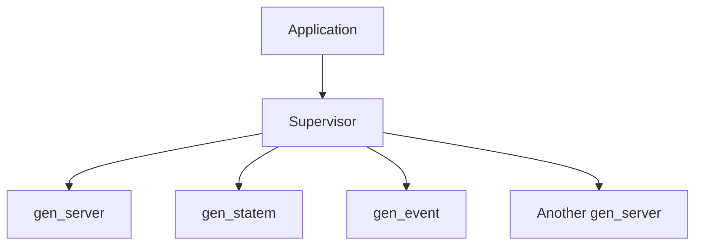

## 6.2 OTP Behaviors: `gen_server`, `gen_statem`, `gen_event`, `supervisor`, `application`

Erlang's Open Telecom Platform (OTP) is a set of libraries and design principles that provide a framework for building robust, fault-tolerant applications. At the heart of OTP are behaviors, which are generic modules that implement common patterns like servers, state machines, event handlers, supervisors, and applications. These behaviors abstract common patterns, allowing developers to focus on the specific logic of their applications while ensuring consistency and reliability.

### What Are OTP Behaviors?

OTP behaviors are predefined modules that encapsulate common patterns of concurrent programming. They provide a standardized way to implement processes that handle specific tasks, such as managing state, handling events, or supervising other processes. By using OTP behaviors, developers can leverage tried-and-tested solutions, reducing the likelihood of errors and increasing the maintainability of their code.

### `gen_server`: Generic Server Implementation

The `gen_server` behavior is one of the most commonly used OTP behaviors. It provides a framework for implementing server processes that handle synchronous and asynchronous requests, manage state, and perform background tasks.

#### Key Features of `gen_server`

- **Synchronous and Asynchronous Calls**: `gen_server` supports both synchronous (`call`) and asynchronous (`cast`) message handling.
- **State Management**: It maintains state across calls, allowing for complex stateful operations.
- **Fault Tolerance**: By integrating with OTP's supervision trees, `gen_server` processes can be automatically restarted in case of failure.

#### Implementing a `gen_server`

Let's implement a simple counter server using `gen_server`.

```erlang
-module(counter).
-behaviour(gen_server).

%% API
-export([start_link/0, increment/0, get_count/0]).

%% gen_server callbacks
-export([init/1, handle_call/3, handle_cast/2, handle_info/2, terminate/2, code_change/3]).

%% API
start_link() ->
    gen_server:start_link({local, ?MODULE}, ?MODULE, 0, []).

increment() ->
    gen_server:cast(?MODULE, increment).

get_count() ->
    gen_server:call(?MODULE, get_count).

%% gen_server callbacks
init(InitialCount) ->
    {ok, InitialCount}.

handle_call(get_count, _From, Count) ->
    {reply, Count, Count};

handle_cast(increment, Count) ->
    {noreply, Count + 1}.

handle_info(_Info, State) ->
    {noreply, State}.

terminate(_Reason, _State) ->
    ok.

code_change(_OldVsn, State, _Extra) ->
    {ok, State}.
```

In this example, we define a `counter` module that implements the `gen_server` behavior. The server maintains a count, which can be incremented asynchronously or retrieved synchronously.

#### Try It Yourself

Experiment with the `counter` module by starting the server and calling `increment/0` and `get_count/0`. Try modifying the code to add a decrement function or reset the counter.

### `gen_statem`: Generic State Machine

The `gen_statem` behavior is used to implement state machines, which are processes that transition between different states based on events. This behavior is particularly useful for modeling complex workflows and protocols.

#### Key Features of `gen_statem`

- **State Transitions**: Define transitions between states based on events.
- **Event Handling**: Handle events synchronously or asynchronously.
- **State-Dependent Logic**: Execute different logic depending on the current state.

#### Implementing a `gen_statem`

Let's implement a simple traffic light controller using `gen_statem`.

```erlang
-module(traffic_light).
-behaviour(gen_statem).

%% API
-export([start_link/0, change/0]).

%% gen_statem callbacks
-export([init/1, callback_mode/0, handle_event/4, terminate/3, code_change/4]).

%% API
start_link() ->
    gen_statem:start_link({local, ?MODULE}, ?MODULE, [], []).

change() ->
    gen_statem:cast(?MODULE, change).

%% gen_statem callbacks
init([]) ->
    {ok, red, []}.

callback_mode() ->
    state_functions.

handle_event(cast, change, red, Data) ->
    {next_state, green, Data};

handle_event(cast, change, green, Data) ->
    {next_state, yellow, Data};

handle_event(cast, change, yellow, Data) ->
    {next_state, red, Data}.

terminate(_Reason, _State, _Data) ->
    ok.

code_change(_OldVsn, State, Data, _Extra) ->
    {ok, State, Data}.
```

In this example, the `traffic_light` module implements a simple state machine with three states: red, green, and yellow. The `change/0` function triggers a transition to the next state.

#### Try It Yourself

Start the `traffic_light` server and call `change/0` to cycle through the states. Modify the code to add a timer that automatically transitions between states after a certain period.

### `gen_event`: Generic Event Handling

The `gen_event` behavior is used to implement event handling systems. It allows multiple event handlers to be attached to a single event manager, enabling a publish-subscribe pattern.

#### Key Features of `gen_event`

- **Multiple Handlers**: Attach multiple handlers to a single event manager.
- **Dynamic Handler Management**: Add or remove handlers at runtime.
- **Event Broadcasting**: Broadcast events to all attached handlers.

#### Implementing a `gen_event`

Let's implement a simple logging system using `gen_event`.

```erlang
-module(logger).
-behaviour(gen_event).

%% API
-export([start_link/0, add_handler/1, log/1]).

%% gen_event callbacks
-export([init/1, handle_event/2, handle_call/2, handle_info/2, terminate/2, code_change/3]).

%% API
start_link() ->
    gen_event:start_link({local, ?MODULE}).

add_handler(Handler) ->
    gen_event:add_handler(?MODULE, Handler, []).

log(Message) ->
    gen_event:notify(?MODULE, Message).

%% gen_event callbacks
init([]) ->
    {ok, []}.

handle_event(Message, State) ->
    io:format("Log: ~p~n", [Message]),
    {ok, State}.

handle_call(_Request, State) ->
    {ok, ok, State}.

handle_info(_Info, State) ->
    {ok, State}.

terminate(_Reason, _State) ->
    ok.

code_change(_OldVsn, State, _Extra) ->
    {ok, State}.
```

In this example, the `logger` module implements a simple event manager that logs messages to the console. Additional handlers can be added to process events differently.

#### Try It Yourself

Start the `logger` event manager and add custom handlers to process log messages. Experiment with broadcasting different types of events.

### `supervisor`: Process Supervision for Fault Tolerance

The `supervisor` behavior is used to implement supervision trees, which are hierarchical structures of processes that monitor and restart each other in case of failure. This behavior is key to building fault-tolerant systems.

#### Key Features of `supervisor`

- **Process Monitoring**: Monitor child processes and restart them if they fail.
- **Restart Strategies**: Define strategies for restarting processes (e.g., one-for-one, one-for-all).
- **Fault Isolation**: Isolate faults to prevent cascading failures.

#### Implementing a `supervisor`

Let's implement a simple supervisor that monitors a `counter` server.

```erlang
-module(counter_sup).
-behaviour(supervisor).

%% API
-export([start_link/0]).

%% supervisor callbacks
-export([init/1]).

%% API
start_link() ->
    supervisor:start_link({local, ?MODULE}, ?MODULE, []).

%% supervisor callbacks
init([]) ->
    Counter = {counter, {counter, start_link, []}, permanent, 5000, worker, [counter]},
    {ok, {{one_for_one, 5, 10}, [Counter]}}.
```

In this example, the `counter_sup` module implements a supervisor that starts and monitors a `counter` server. If the server crashes, the supervisor will restart it.

#### Try It Yourself

Start the `counter_sup` supervisor and simulate a crash in the `counter` server. Observe how the supervisor restarts the server automatically.

### `application`: Packaging and Starting Erlang Applications

The `application` behavior is used to define and manage the lifecycle of Erlang applications. It provides a way to package related modules and resources into a single unit that can be started and stopped as a whole.

#### Key Features of `application`

- **Lifecycle Management**: Define start and stop procedures for applications.
- **Configuration**: Specify application-specific configuration parameters.
- **Dependency Management**: Declare dependencies on other applications.

#### Implementing an `application`

Let's define an application that includes the `counter` server and its supervisor.

```erlang
-module(counter_app).
-behaviour(application).

%% API
-export([start/2, stop/1]).

%% application callbacks
-export([start/2, stop/1]).

%% application callbacks
start(_StartType, _StartArgs) ->
    counter_sup:start_link().

stop(_State) ->
    ok.
```

In this example, the `counter_app` module defines an application that starts the `counter_sup` supervisor. The application can be started and stopped as a single unit.

#### Try It Yourself

Define an application resource file (`.app`) for `counter_app` and start the application using the Erlang shell. Experiment with adding additional modules to the application.

### Promoting Code Reuse and Consistency

OTP behaviors promote code reuse and consistency by providing standardized patterns for common tasks. By using these behaviors, developers can focus on the specific logic of their applications while leveraging the robustness and reliability of OTP.

### Visualizing OTP Behaviors



This diagram illustrates a typical OTP application structure, where an application manages a supervisor, which in turn supervises various processes implementing different behaviors.

### Further Reading

For more information on OTP behaviors, refer to the [Erlang OTP Behaviors](http://erlang.org/doc/design_principles/des_princ.html) documentation.

### Knowledge Check

- What are OTP behaviors, and why are they important?
- How does `gen_server` handle synchronous and asynchronous calls?
- What is the purpose of a `supervisor` in an OTP application?
- How can `gen_event` be used to implement a publish-subscribe pattern?
- What are the benefits of using the `application` behavior?

### Embrace the Journey

Remember, mastering OTP behaviors is a journey. As you progress, you'll build more complex and fault-tolerant applications. Keep experimenting, stay curious, and enjoy the journey!

## Quiz: OTP Behaviors: `gen_server`, `gen_statem`, `gen_event`, `supervisor`, `application`



### What is the primary purpose of `gen_server` in Erlang?

- [x] To provide a generic server implementation for handling requests
- [ ] To manage application lifecycle
- [ ] To implement state machines
- [ ] To supervise other processes

> **Explanation:** `gen_server` is used to implement generic server processes that handle requests and manage state.

### Which OTP behavior is best suited for implementing state machines?

- [ ] `gen_server`
- [x] `gen_statem`
- [ ] `gen_event`
- [ ] `supervisor`

> **Explanation:** `gen_statem` is specifically designed for implementing state machines with state transitions.

### How does `gen_event` facilitate event handling?

- [x] By allowing multiple handlers to be attached to a single event manager
- [ ] By managing application lifecycle
- [ ] By supervising processes
- [ ] By implementing state machines

> **Explanation:** `gen_event` allows multiple handlers to be attached to an event manager, enabling a publish-subscribe pattern.

### What is the role of a `supervisor` in an OTP application?

- [x] To monitor and restart child processes in case of failure
- [ ] To handle synchronous and asynchronous requests
- [ ] To implement state machines
- [ ] To manage application lifecycle

> **Explanation:** A `supervisor` monitors child processes and restarts them if they fail, ensuring fault tolerance.

### Which OTP behavior is used for packaging and starting Erlang applications?

- [ ] `gen_server`
- [ ] `gen_statem`
- [ ] `gen_event`
- [x] `application`

> **Explanation:** The `application` behavior is used to define and manage the lifecycle of Erlang applications.

### Can `gen_server` handle both synchronous and asynchronous requests?

- [x] Yes
- [ ] No

> **Explanation:** `gen_server` can handle both synchronous (`call`) and asynchronous (`cast`) requests.

### What is a key feature of `gen_statem`?

- [x] State transitions based on events
- [ ] Handling synchronous requests
- [ ] Supervising processes
- [ ] Managing application lifecycle

> **Explanation:** `gen_statem` allows defining state transitions based on events, making it suitable for state machines.

### How does `gen_event` support dynamic handler management?

- [x] By allowing handlers to be added or removed at runtime
- [ ] By managing application lifecycle
- [ ] By supervising processes
- [ ] By implementing state machines

> **Explanation:** `gen_event` supports dynamic handler management by allowing handlers to be added or removed at runtime.

### What is the primary benefit of using OTP behaviors?

- [x] Promoting code reuse and consistency
- [ ] Managing application lifecycle
- [ ] Implementing state machines
- [ ] Supervising processes

> **Explanation:** OTP behaviors promote code reuse and consistency by providing standardized patterns for common tasks.

### True or False: `supervisor` can define different restart strategies for child processes.

- [x] True
- [ ] False

> **Explanation:** `supervisor` can define different restart strategies, such as one-for-one or one-for-all, for managing child processes.


