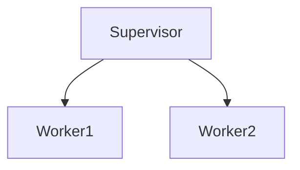

## 6.3 Designing Fault-Tolerant Systems with Supervisors

In the world of concurrent and distributed systems, failures are inevitable. Designing systems that can gracefully handle these failures is crucial for building robust applications. Erlang, with its Open Telecom Platform (OTP), provides a powerful mechanism for fault tolerance through the use of supervisors. In this section, we will delve into the concept of supervisors, explore various supervision strategies, and provide practical examples and best practices for designing fault-tolerant systems.

### Understanding Supervisors in OTP

A **supervisor** in the context of OTP is a process responsible for starting, stopping, and monitoring its child processes. Supervisors are a fundamental part of the OTP framework, designed to ensure that applications can recover from failures automatically. They form the backbone of Erlang's "let it crash" philosophy, where processes are allowed to fail and restart without affecting the overall system stability.

#### Key Characteristics of Supervisors

- **Process Management**: Supervisors manage a set of child processes, which can be workers or other supervisors.
- **Fault Recovery**: They automatically restart child processes when they fail, based on predefined strategies.
- **Isolation**: Supervisors isolate failures to prevent them from propagating throughout the system.

### Supervision Strategies

OTP provides several supervision strategies to define how supervisors should handle failures of their child processes. These strategies determine the behavior of the supervisor when one or more child processes terminate unexpectedly.

#### One-for-One Strategy

In the **one_for_one** strategy, if a child process terminates, only that process is restarted. This strategy is suitable when child processes operate independently of each other.

```erlang
{one_for_one, MaxRestarts, MaxTime}
```

- **MaxRestarts**: Maximum number of restarts allowed within a given time frame.
- **MaxTime**: Time frame in seconds for counting restarts.

#### One-for-All Strategy

With the **one_for_all** strategy, if a child process terminates, all other child processes are terminated and then restarted. This strategy is useful when child processes are interdependent and need to be in a consistent state.

```erlang
{one_for_all, MaxRestarts, MaxTime}
```

#### Rest-for-One Strategy

The **rest_for_one** strategy restarts the terminated child process and all child processes started after it. This strategy is appropriate when processes started later depend on the earlier ones.

```erlang
{rest_for_one, MaxRestarts, MaxTime}
```

#### Simple-One-for-One Strategy

The **simple_one_for_one** strategy is a specialized version of one_for_one, designed for managing a dynamic number of identical child processes. It is often used for managing a pool of worker processes.

```erlang
{simple_one_for_one, MaxRestarts, MaxTime}
```

### Setting Up Supervision Trees

A supervision tree is a hierarchical structure of supervisors and workers. It is a powerful design pattern in Erlang for building fault-tolerant systems. Let's explore how to set up a basic supervision tree.

#### Example: Creating a Supervision Tree

Consider a simple application with a supervisor managing two worker processes.

```erlang
-module(my_supervisor).
-behaviour(supervisor).

-export([start_link/0, init/1]).

start_link() ->
    supervisor:start_link({local, ?MODULE}, ?MODULE, []).

init([]) ->
    ChildSpecs = [
        {worker1, {worker1, start_link, []}, permanent, 5000, worker, [worker1]},
        {worker2, {worker2, start_link, []}, permanent, 5000, worker, [worker2]}
    ],
    {ok, {{one_for_one, 3, 10}, ChildSpecs}}.
```

In this example, `my_supervisor` is a supervisor module that starts and monitors two worker processes, `worker1` and `worker2`. The supervision strategy is `one_for_one`, meaning if one worker fails, only that worker is restarted.

### Restarting Child Processes

Supervisors restart child processes based on their restart intensity and strategy. The restart intensity is defined by two parameters: `MaxRestarts` and `MaxTime`. If the number of restarts exceeds `MaxRestarts` within `MaxTime` seconds, the supervisor itself will terminate, allowing its parent supervisor to handle the failure.

#### Example: Worker Process

Here's an example of a simple worker process that can be managed by a supervisor.

```erlang
-module(worker1).
-behaviour(gen_server).

-export([start_link/0, init/1, handle_call/3, handle_cast/2, handle_info/2, terminate/2, code_change/3]).

start_link() ->
    gen_server:start_link({local, ?MODULE}, ?MODULE, [], []).

init([]) ->
    {ok, #state{}}.

handle_call(_Request, _From, State) ->
    {reply, ok, State}.

handle_cast(_Msg, State) ->
    {noreply, State}.

handle_info(_Info, State) ->
    {noreply, State}.

terminate(_Reason, _State) ->
    ok.

code_change(_OldVsn, State, _Extra) ->
    {ok, State}.
```

### Best Practices for Designing Robust Supervision Hierarchies

Designing effective supervision hierarchies is crucial for building resilient systems. Here are some best practices to consider:

- **Keep It Simple**: Design supervision trees that are easy to understand and maintain. Avoid overly complex hierarchies.
- **Use Appropriate Strategies**: Choose the right supervision strategy based on the dependencies between child processes.
- **Limit Restart Intensity**: Set reasonable limits for restart intensity to prevent endless restart loops.
- **Isolate Failures**: Use supervisors to isolate failures and prevent them from affecting unrelated parts of the system.
- **Monitor and Log**: Implement monitoring and logging to track process failures and restarts for debugging and analysis.

### Visualizing Supervision Trees

To better understand supervision trees, let's visualize a simple supervision hierarchy using Mermaid.js.



**Diagram Description**: This diagram represents a basic supervision tree with a single supervisor managing two worker processes, Worker1 and Worker2.

### Try It Yourself

Experiment with the provided code examples by modifying the supervision strategy or adding additional worker processes. Observe how changes affect the system's behavior in response to failures.

### Further Reading

For more information on OTP supervisors and fault tolerance, consider exploring the following resources:

- [Erlang OTP Documentation](https://erlang.org/doc/design_principles/sup_princ.html)
- [Learn You Some Erlang for Great Good!](http://learnyousomeerlang.com/supervisors)

### Knowledge Check

- What is the primary role of a supervisor in OTP?
- How does the one_for_all strategy differ from the one_for_one strategy?
- What is the purpose of the simple_one_for_one strategy?
- How can you limit the restart intensity of a supervisor?

### Summary

In this section, we've explored the concept of supervisors in OTP and their role in building fault-tolerant systems. We've examined various supervision strategies and provided examples of setting up supervision trees. By following best practices, you can design robust supervision hierarchies that enhance the resilience of your Erlang applications.

Remember, this is just the beginning. As you progress, you'll build more complex and interactive systems. Keep experimenting, stay curious, and enjoy the journey!

## Quiz: Designing Fault-Tolerant Systems with Supervisors



### What is the primary role of a supervisor in OTP?

- [x] To manage and monitor child processes
- [ ] To execute business logic
- [ ] To handle user input
- [ ] To perform database operations

> **Explanation:** A supervisor's main role is to manage and monitor child processes, ensuring fault tolerance by restarting them when necessary.

### Which supervision strategy restarts all child processes if one fails?

- [ ] one_for_one
- [x] one_for_all
- [ ] rest_for_one
- [ ] simple_one_for_one

> **Explanation:** The one_for_all strategy restarts all child processes if one fails, ensuring consistency among interdependent processes.

### What is the simple_one_for_one strategy used for?

- [ ] Managing a single child process
- [ ] Restarting all processes
- [x] Managing a dynamic number of identical child processes
- [ ] Handling complex dependencies

> **Explanation:** The simple_one_for_one strategy is designed for managing a dynamic number of identical child processes, such as a pool of workers.

### How can you limit the restart intensity of a supervisor?

- [x] By setting MaxRestarts and MaxTime
- [ ] By using a different supervision strategy
- [ ] By reducing the number of child processes
- [ ] By increasing the number of supervisors

> **Explanation:** Restart intensity is limited by setting MaxRestarts and MaxTime, which define the maximum number of restarts allowed within a specific time frame.

### Which strategy restarts the failed process and all processes started after it?

- [ ] one_for_one
- [ ] one_for_all
- [x] rest_for_one
- [ ] simple_one_for_one

> **Explanation:** The rest_for_one strategy restarts the failed process and all processes that were started after it, maintaining dependencies.

### What is a key benefit of using supervisors in Erlang?

- [x] Fault isolation and recovery
- [ ] Faster execution of code
- [ ] Simplified user interfaces
- [ ] Enhanced graphics rendering

> **Explanation:** Supervisors provide fault isolation and recovery, allowing systems to handle failures gracefully without affecting the entire application.

### What should you consider when designing supervision hierarchies?

- [x] Simplicity and maintainability
- [ ] Complex dependencies
- [ ] Maximum number of child processes
- [ ] Use of global variables

> **Explanation:** Supervision hierarchies should be simple and maintainable, avoiding unnecessary complexity to ensure robustness and ease of understanding.

### What is the "let it crash" philosophy in Erlang?

- [x] Allowing processes to fail and restart automatically
- [ ] Preventing any process from failing
- [ ] Manually handling all errors
- [ ] Avoiding the use of supervisors

> **Explanation:** The "let it crash" philosophy involves allowing processes to fail and restart automatically, leveraging supervisors for fault tolerance.

### What is a supervision tree?

- [x] A hierarchical structure of supervisors and workers
- [ ] A data structure for storing process states
- [ ] A graphical representation of process dependencies
- [ ] A method for optimizing code execution

> **Explanation:** A supervision tree is a hierarchical structure of supervisors and workers, designed to manage and recover from process failures.

### True or False: Supervisors can only manage worker processes.

- [ ] True
- [x] False

> **Explanation:** Supervisors can manage both worker processes and other supervisors, forming a hierarchical supervision tree.


