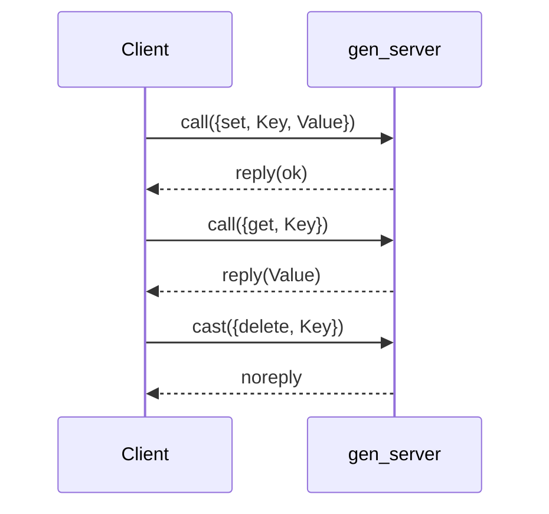

## 6.4 Implementing Servers with `gen_server`

In this section, we delve into the `gen_server` behavior, a cornerstone of Erlang's OTP framework. The `gen_server` module abstracts the complexities of process management, allowing developers to focus on the business logic of their applications. By the end of this guide, you'll be equipped to implement robust, stateful servers using `gen_server`.

### Understanding `gen_server` Behavior

The `gen_server` behavior is a generic server implementation that simplifies the creation of concurrent processes. It handles the boilerplate code for message passing, state management, and error handling, allowing developers to concentrate on the specific logic of their applications.

#### Key Concepts

- **Behavior**: In Erlang, a behavior is a design pattern that defines a set of callback functions. The `gen_server` behavior provides a framework for implementing server processes.
- **Callback Functions**: These are user-defined functions that handle specific events, such as incoming messages or state changes.

### Creating a `gen_server` Module

Let's walk through the process of creating a `gen_server` module. We'll start by defining the module and implementing the necessary callback functions.

#### Step 1: Define the Module

Create a new Erlang module and include the `gen_server` behavior.

```erlang
-module(my_server).
-behaviour(gen_server).

%% API
-export([start_link/0, stop/0, call/1, cast/1]).

%% gen_server callbacks
-export([init/1, handle_call/3, handle_cast/2, handle_info/2, terminate/2, code_change/3]).
```

#### Step 2: Implement the `init/1` Callback

The `init/1` function initializes the server's state. It is called when the server starts.

```erlang
init([]) ->
    %% Initialize state
    {ok, #{}}.
```

#### Step 3: Handle Synchronous Messages with `handle_call/3`

The `handle_call/3` function processes synchronous requests. It receives a request, the caller's PID, and the current state.

```erlang
handle_call({get, Key}, _From, State) ->
    %% Retrieve value from state
    Value = maps:get(Key, State, undefined),
    {reply, Value, State};

handle_call({set, Key, Value}, _From, State) ->
    %% Update state
    NewState = maps:put(Key, Value, State),
    {reply, ok, NewState}.
```

#### Step 4: Handle Asynchronous Messages with `handle_cast/2`

The `handle_cast/2` function processes asynchronous requests. It receives a request and the current state.

```erlang
handle_cast({delete, Key}, State) ->
    %% Remove key from state
    NewState = maps:remove(Key, State),
    {noreply, NewState}.
```

#### Step 5: Handle Other Messages with `handle_info/2`

The `handle_info/2` function processes all other messages that are not handled by `handle_call/3` or `handle_cast/2`.

```erlang
handle_info(_Info, State) ->
    %% Ignore unexpected messages
    {noreply, State}.
```

#### Step 6: Implement the `terminate/2` Callback

The `terminate/2` function is called when the server is about to shut down.

```erlang
terminate(_Reason, _State) ->
    %% Perform cleanup
    ok.
```

#### Step 7: Implement the `code_change/3` Callback

The `code_change/3` function handles code upgrades.

```erlang
code_change(_OldVsn, State, _Extra) ->
    {ok, State}.
```

### Starting and Stopping the Server

To start the server, we use the `start_link/0` function. To stop it, we use the `stop/0` function.

```erlang
start_link() ->
    gen_server:start_link({local, ?MODULE}, ?MODULE, [], []).

stop() ->
    gen_server:stop(?MODULE).
```

### Interacting with the Server

We can interact with the server using the `call/1` and `cast/1` functions.

```erlang
call(Request) ->
    gen_server:call(?MODULE, Request).

cast(Request) ->
    gen_server:cast(?MODULE, Request).
```

### Managing State within a `gen_server`

Managing state is a critical aspect of implementing a `gen_server`. The state is typically represented as a map or a record, and it is passed to each callback function. The state can be modified in response to incoming messages, and the updated state is returned to the `gen_server` framework.

### Common Use Cases and Best Practices

#### Use Cases

- **Stateful Services**: `gen_server` is ideal for services that need to maintain state across requests, such as a cache or a session manager.
- **Resource Management**: It can manage resources like database connections or file handles.
- **Background Processing**: `gen_server` can be used for tasks that run in the background, such as data processing or monitoring.

#### Best Practices

- **Keep State Simple**: Use simple data structures for the state to make it easy to understand and modify.
- **Handle Errors Gracefully**: Use the `terminate/2` callback to clean up resources in case of errors.
- **Avoid Blocking Calls**: Ensure that `handle_call/3` and `handle_cast/2` do not perform blocking operations, as this can degrade performance.

### Example: A Simple Key-Value Store

Let's implement a simple key-value store using `gen_server`.

```erlang
-module(kv_store).
-behaviour(gen_server).

%% API
-export([start_link/0, stop/0, get/1, set/2, delete/1]).

%% gen_server callbacks
-export([init/1, handle_call/3, handle_cast/2, handle_info/2, terminate/2, code_change/3]).

%% API Functions
start_link() ->
    gen_server:start_link({local, ?MODULE}, ?MODULE, [], []).

stop() ->
    gen_server:stop(?MODULE).

get(Key) ->
    gen_server:call(?MODULE, {get, Key}).

set(Key, Value) ->
    gen_server:call(?MODULE, {set, Key, Value}).

delete(Key) ->
    gen_server:cast(?MODULE, {delete, Key}).

%% gen_server Callbacks
init([]) ->
    {ok, #{}}.

handle_call({get, Key}, _From, State) ->
    Value = maps:get(Key, State, undefined),
    {reply, Value, State};

handle_call({set, Key, Value}, _From, State) ->
    NewState = maps:put(Key, Value, State),
    {reply, ok, NewState}.

handle_cast({delete, Key}, State) ->
    NewState = maps:remove(Key, State),
    {noreply, NewState}.

handle_info(_Info, State) ->
    {noreply, State}.

terminate(_Reason, _State) ->
    ok.

code_change(_OldVsn, State, _Extra) ->
    {ok, State}.
```

### Try It Yourself

Experiment with the key-value store by adding new operations or modifying existing ones. For example, try implementing a `clear/0` function that removes all keys from the store.

### Visualizing `gen_server` Workflow

Below is a sequence diagram that illustrates the interaction between a client and a `gen_server`.



### Knowledge Check

- **What is the purpose of the `gen_server` behavior?**
- **How do you handle synchronous and asynchronous messages in a `gen_server`?**
- **What are some common use cases for `gen_server`?**

### Summary

In this section, we explored the `gen_server` behavior, a powerful tool for implementing stateful servers in Erlang. We covered the essential callback functions, managing state, and best practices for using `gen_server`. Remember, this is just the beginning. As you progress, you'll build more complex and interactive applications. Keep experimenting, stay curious, and enjoy the journey!

## Quiz: Implementing Servers with `gen_server`



### What is the primary purpose of the `gen_server` behavior in Erlang?

- [x] To simplify the creation of concurrent processes by handling message passing and state management.
- [ ] To provide a graphical user interface for Erlang applications.
- [ ] To manage database connections exclusively.
- [ ] To replace the need for any other Erlang behaviors.

> **Explanation:** The `gen_server` behavior abstracts the complexities of process management, allowing developers to focus on the business logic of their applications.

### Which function is used to initialize the state of a `gen_server`?

- [x] init/1
- [ ] handle_call/3
- [ ] handle_cast/2
- [ ] terminate/2

> **Explanation:** The `init/1` function is called when the server starts and is used to initialize the server's state.

### How do you handle synchronous messages in a `gen_server`?

- [x] Using the handle_call/3 function.
- [ ] Using the handle_cast/2 function.
- [ ] Using the handle_info/2 function.
- [ ] Using the terminate/2 function.

> **Explanation:** The `handle_call/3` function processes synchronous requests in a `gen_server`.

### What is the role of the handle_cast/2 function?

- [x] To process asynchronous requests.
- [ ] To initialize the server's state.
- [ ] To handle unexpected messages.
- [ ] To perform cleanup during server shutdown.

> **Explanation:** The `handle_cast/2` function processes asynchronous requests in a `gen_server`.

### Which function is called when a `gen_server` is about to shut down?

- [x] terminate/2
- [ ] init/1
- [ ] handle_call/3
- [ ] handle_cast/2

> **Explanation:** The `terminate/2` function is called when the server is about to shut down, allowing for cleanup operations.

### What is a common use case for `gen_server`?

- [x] Managing stateful services like a cache or session manager.
- [ ] Rendering HTML pages.
- [ ] Compiling Erlang code.
- [ ] Sending emails.

> **Explanation:** `gen_server` is ideal for services that need to maintain state across requests, such as a cache or a session manager.

### How should you handle errors in a `gen_server`?

- [x] Use the terminate/2 callback to clean up resources.
- [ ] Ignore them and hope they don't occur.
- [ ] Use the init/1 function to handle errors.
- [ ] Use the handle_info/2 function to handle errors.

> **Explanation:** The `terminate/2` callback is used to clean up resources in case of errors.

### What should you avoid in `handle_call/3` and `handle_cast/2` functions?

- [x] Performing blocking operations.
- [ ] Initializing the server's state.
- [ ] Sending asynchronous messages.
- [ ] Logging messages.

> **Explanation:** Blocking operations can degrade performance, so they should be avoided in `handle_call/3` and `handle_cast/2`.

### What is the purpose of the code_change/3 function?

- [x] To handle code upgrades.
- [ ] To process synchronous requests.
- [ ] To initialize the server's state.
- [ ] To perform cleanup during server shutdown.

> **Explanation:** The `code_change/3` function handles code upgrades in a `gen_server`.

### True or False: The `gen_server` behavior can only be used for stateful services.

- [x] True
- [ ] False

> **Explanation:** While `gen_server` is ideal for stateful services, it can also be used for other purposes like resource management and background processing.




