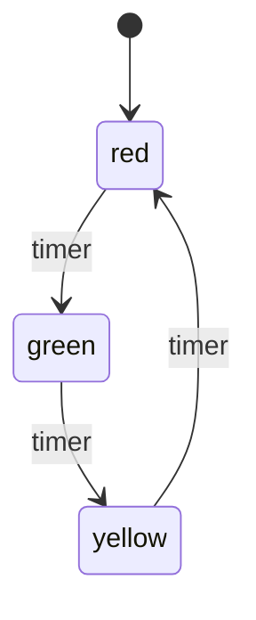

## 6.5 State Machines with `gen_statem`

State machines are a powerful concept used to model systems that can be in one of a finite number of states at any given time. They are particularly useful in scenarios where the system's behavior is dependent on its current state and the events it receives. In Erlang, the `gen_statem` behavior provides a robust framework for implementing finite state machines (FSMs) in a concurrent and distributed environment.

### Introduction to Finite State Machines

A finite state machine (FSM) is a computational model used to design both computer programs and sequential logic circuits. It is composed of a finite number of states, transitions between these states, and actions that result from state changes. FSMs are used to model the behavior of systems where the output is determined by the current state and the input.

#### Key Components of FSMs

- **States**: Distinct modes or conditions in which the system can exist.
- **Transitions**: Rules that define how the system moves from one state to another based on events.
- **Events**: Inputs or occurrences that trigger state transitions.
- **Actions**: Operations that are executed as a result of state transitions.

### Understanding `gen_statem` in Erlang

The `gen_statem` behavior in Erlang is an advanced OTP behavior designed for implementing state machines. It offers several advantages over its predecessor, `gen_fsm`, including more flexible state transition handling and better support for complex stateful logic.

#### Advantages of `gen_statem` over `gen_fsm`

- **Unified Event Handling**: `gen_statem` allows for a unified approach to handling events, making it easier to manage complex state transitions.
- **State Data Management**: It provides a more structured way to manage state data, reducing the likelihood of errors.
- **Extended State Machine (ESM) Support**: `gen_statem` supports both finite state machines and extended state machines, allowing for more complex logic.
- **Improved Debugging and Tracing**: Enhanced support for debugging and tracing makes it easier to diagnose issues in state machine implementations.

### Implementing a State Machine with `gen_statem`

Let's walk through an example of implementing a simple state machine using `gen_statem`. We'll create a state machine that models a traffic light system with three states: `red`, `yellow`, and `green`.

#### Defining the State Machine

First, we need to define the states and transitions for our traffic light system:

- **States**: `red`, `yellow`, `green`
- **Transitions**:
  - `red` to `green` on a `timer` event
  - `green` to `yellow` on a `timer` event
  - `yellow` to `red` on a `timer` event

#### Code Example

Below is the Erlang code for implementing the traffic light state machine using `gen_statem`:

```erlang
-module(traffic_light).
-behaviour(gen_statem).

%% API
-export([start_link/0, change_light/1]).

%% gen_statem callbacks
-export([init/1, callback_mode/0, handle_event/4]).

-record(state, {color = red}).

%%% API Functions %%%

start_link() ->
    gen_statem:start_link({local, ?MODULE}, ?MODULE, [], []).

change_light(Pid) ->
    gen_statem:cast(Pid, timer).

%%% gen_statem Callbacks %%%

init([]) ->
    {ok, red, #state{}}.

callback_mode() ->
    state_functions.

handle_event(cast, timer, red, State) ->
    io:format("Changing from red to green~n"),
    {next_state, green, State};

handle_event(cast, timer, green, State) ->
    io:format("Changing from green to yellow~n"),
    {next_state, yellow, State};

handle_event(cast, timer, yellow, State) ->
    io:format("Changing from yellow to red~n"),
    {next_state, red, State}.
```

#### Explanation of the Code

- **Module Declaration**: We declare the module `traffic_light` and specify that it implements the `gen_statem` behavior.
- **API Functions**: We export two functions: `start_link/0` to start the state machine and `change_light/1` to trigger state transitions.
- **State Record**: We define a record `state` to hold the current state of the traffic light.
- **Initialization**: The `init/1` callback initializes the state machine in the `red` state.
- **Callback Mode**: We specify `state_functions` as the callback mode, allowing us to define state-specific event handlers.
- **Event Handling**: The `handle_event/4` function handles `timer` events and transitions the state machine between `red`, `green`, and `yellow` states.

### Event Handling and State Transitions

In `gen_statem`, events can be handled in two modes: `state_functions` and `handle_event_function`. The `state_functions` mode allows for defining separate functions for each state, while the `handle_event_function` mode uses a single function to handle all events.

#### State Functions Mode

In the state functions mode, each state has its own function to handle events. This approach provides a clear separation of logic for each state, making the code easier to understand and maintain.

```erlang
handle_event(cast, timer, red, State) ->
    io:format("Changing from red to green~n"),
    {next_state, green, State};
```

#### Handle Event Function Mode

In the handle event function mode, a single function handles all events, and the current state is passed as an argument. This mode is useful for simpler state machines where the logic is not heavily state-dependent.

### Actions and Side Effects

Actions in a state machine are operations that occur as a result of state transitions. In `gen_statem`, actions can be specified in the return value of the event handler functions.

#### Example: Logging State Transitions

In our traffic light example, we log state transitions using `io:format/2`. This is a simple form of action that provides feedback on the state machine's behavior.

```erlang
io:format("Changing from red to green~n"),
```

### Encouraging the Use of `gen_statem`

The `gen_statem` behavior is a powerful tool for implementing complex stateful logic in Erlang applications. Its flexibility and support for both finite and extended state machines make it an ideal choice for scenarios where state management is critical.

#### Use Cases for `gen_statem`

- **Protocol Implementations**: `gen_statem` is well-suited for implementing communication protocols that require precise state management.
- **User Interface Logic**: State machines can be used to manage the state of user interfaces, ensuring consistent behavior across different states.
- **Workflow Management**: Complex workflows with multiple stages can be effectively modeled using state machines.

### Visualizing State Transitions

To better understand the flow of our traffic light state machine, let's visualize the state transitions using a state diagram.



**Diagram Description**: The state diagram illustrates the transitions between the `red`, `green`, and `yellow` states in response to `timer` events.

### Key Takeaways

- **State Machines**: A powerful model for systems with finite states and transitions.
- **`gen_statem`**: An advanced OTP behavior for implementing state machines in Erlang.
- **Event Handling**: Flexible modes for handling events and managing state transitions.
- **Actions**: Operations that occur as a result of state transitions, enhancing the state machine's functionality.

### Try It Yourself

Experiment with the traffic light state machine by modifying the code to add new states or transitions. Consider implementing a pedestrian crossing state or adding a countdown timer for each light.

### Further Reading

For more information on `gen_statem` and state machines in Erlang, check out the [Erlang/OTP documentation](https://www.erlang.org/doc/man/gen_statem.html).

## Quiz: State Machines with `gen_statem`



### What is a finite state machine (FSM)?

- [x] A computational model with a finite number of states, transitions, and actions.
- [ ] A model with infinite states and transitions.
- [ ] A model used only for sequential logic circuits.
- [ ] A model that does not involve any states.

> **Explanation:** A finite state machine is a computational model used to design systems with a finite number of states, transitions, and actions.

### What is the primary advantage of `gen_statem` over `gen_fsm`?

- [x] Unified event handling and better support for complex logic.
- [ ] Simpler syntax and fewer lines of code.
- [ ] Faster execution speed.
- [ ] Automatic state transitions without events.

> **Explanation:** `gen_statem` provides unified event handling and better support for complex stateful logic compared to `gen_fsm`.

### In the traffic light example, what event triggers state transitions?

- [x] timer
- [ ] light
- [ ] change
- [ ] switch

> **Explanation:** The `timer` event triggers state transitions in the traffic light state machine.

### Which mode allows for defining separate functions for each state in `gen_statem`?

- [x] state_functions
- [ ] handle_event_function
- [ ] event_mode
- [ ] state_mode

> **Explanation:** The `state_functions` mode allows for defining separate functions for each state in `gen_statem`.

### What is an action in a state machine?

- [x] An operation that occurs as a result of a state transition.
- [ ] A state that does not change.
- [ ] An event that triggers a transition.
- [ ] A transition that does not involve any states.

> **Explanation:** An action is an operation that occurs as a result of a state transition in a state machine.

### What is the initial state of the traffic light state machine?

- [x] red
- [ ] green
- [ ] yellow
- [ ] blue

> **Explanation:** The initial state of the traffic light state machine is `red`.

### Which of the following is a use case for `gen_statem`?

- [x] Protocol implementations
- [ ] Simple arithmetic calculations
- [ ] Static web page rendering
- [ ] File compression

> **Explanation:** `gen_statem` is well-suited for protocol implementations that require precise state management.

### What does the `callback_mode` function specify in `gen_statem`?

- [x] The mode for handling events and state transitions.
- [ ] The initial state of the state machine.
- [ ] The list of events to be handled.
- [ ] The actions to be performed.

> **Explanation:** The `callback_mode` function specifies the mode for handling events and state transitions in `gen_statem`.

### What is the purpose of the `start_link/0` function in the traffic light example?

- [x] To start the state machine process.
- [ ] To change the state of the traffic light.
- [ ] To handle events in the state machine.
- [ ] To log state transitions.

> **Explanation:** The `start_link/0` function is used to start the state machine process in the traffic light example.

### True or False: `gen_statem` can only be used for finite state machines.

- [ ] True
- [x] False

> **Explanation:** `gen_statem` supports both finite state machines and extended state machines, allowing for more complex logic.



Remember, mastering state machines with `gen_statem` is just the beginning. As you continue to explore Erlang, you'll discover even more powerful tools and techniques for building robust and scalable applications. Keep experimenting, stay curious, and enjoy the journey!
