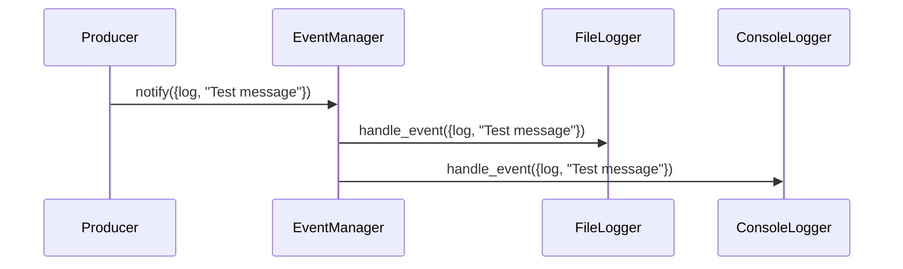

## 6.6 Event Handling with `gen_event`

In this section, we delve into the `gen_event` behavior in Erlang, a powerful tool for managing event-driven architectures. The `gen_event` module provides a framework for creating event manager processes that can handle notifications from multiple sources, making it an essential component for building scalable and maintainable systems.

### Understanding `gen_event`

The `gen_event` behavior is part of the Open Telecom Platform (OTP) in Erlang, designed to facilitate event handling by decoupling event producers from event consumers. This decoupling allows for flexible and dynamic management of event handlers, which can be added or removed at runtime without affecting the event producers.

#### Key Concepts

- **Event Manager**: A process that receives events and dispatches them to registered event handlers.
- **Event Handler**: A module that implements the `gen_event` behavior to process events.
- **Decoupling**: Separating the event producers from consumers, allowing for independent development and maintenance.

### Creating an Event Manager

To create an event manager, you can use the `gen_event:start_link/0` or `gen_event:start/0` functions. These functions start a new event manager process, which can then manage multiple event handlers.

```erlang
% Start an event manager
{ok, EventManager} = gen_event:start_link().
```

### Implementing Event Handlers

Event handlers are modules that implement the `gen_event` behavior. They must define a set of callback functions to handle events and manage their state.

#### Callback Functions

- **init/1**: Initializes the handler state.
- **handle_event/2**: Processes incoming events.
- **handle_call/2**: Handles synchronous calls.
- **handle_info/2**: Manages other messages.
- **terminate/2**: Cleans up before the handler is terminated.
- **code_change/3**: Handles code upgrades.

Here's a simple example of an event handler:

```erlang
-module(my_event_handler).
-behaviour(gen_event).

-export([init/1, handle_event/2, handle_call/2, handle_info/2, terminate/2, code_change/3]).

init([]) ->
    {ok, #state{}}.

handle_event(Event, State) ->
    io:format("Received event: ~p~n", [Event]),
    {ok, State}.

handle_call(Request, State) ->
    {reply, ok, State}.

handle_info(Info, State) ->
    {ok, State}.

terminate(Reason, State) ->
    io:format("Terminating with reason: ~p~n", [Reason]),
    ok.

code_change(OldVsn, State, Extra) ->
    {ok, State}.
```

### Adding and Removing Event Handlers

Event handlers can be dynamically added to or removed from an event manager, providing flexibility in handling events.

#### Adding an Event Handler

Use `gen_event:add_handler/3` to add an event handler to an event manager.

```erlang
% Add an event handler
ok = gen_event:add_handler(EventManager, my_event_handler, []).
```

#### Removing an Event Handler

Use `gen_event:delete_handler/2` to remove an event handler from an event manager.

```erlang
% Remove an event handler
ok = gen_event:delete_handler(EventManager, my_event_handler, []).
```

### Use Cases for `gen_event`

The `gen_event` behavior is particularly useful in scenarios where multiple consumers need to process events from a single producer. Some common use cases include:

- **Logging**: Centralized logging systems can use `gen_event` to manage different log handlers, such as writing logs to files, sending them to remote servers, or displaying them on a console.
- **Monitoring**: System monitoring tools can use `gen_event` to handle various metrics and alerts, allowing for dynamic configuration of monitoring strategies.
- **Notification Systems**: Applications can use `gen_event` to manage notifications, sending alerts to different channels like email, SMS, or push notifications.

### Decoupling Producers and Consumers

One of the main advantages of using `gen_event` is the decoupling of event producers and consumers. This separation allows for:

- **Independent Development**: Producers and consumers can be developed and maintained independently, reducing complexity.
- **Scalability**: New consumers can be added without modifying the producers, making the system more scalable.
- **Flexibility**: Consumers can be dynamically added or removed, allowing for flexible event handling strategies.

### Example: Logging System

Let's build a simple logging system using `gen_event`. We'll create an event manager to handle log messages and two event handlers: one for writing logs to a file and another for displaying them on the console.

#### File Logger Handler

```erlang
-module(file_logger).
-behaviour(gen_event).

-export([init/1, handle_event/2, handle_call/2, handle_info/2, terminate/2, code_change/3]).

init(FileName) ->
    {ok, File} = file:open(FileName, [write]),
    {ok, File}.

handle_event({log, Message}, File) ->
    io:format(File, "~s~n", [Message]),
    {ok, File};
handle_event(_, File) ->
    {ok, File}.

handle_call(_Request, File) ->
    {reply, ok, File}.

handle_info(_Info, File) ->
    {ok, File}.

terminate(_Reason, File) ->
    file:close(File),
    ok.

code_change(_OldVsn, File, _Extra) ->
    {ok, File}.
```

#### Console Logger Handler

```erlang
-module(console_logger).
-behaviour(gen_event).

-export([init/1, handle_event/2, handle_call/2, handle_info/2, terminate/2, code_change/3]).

init([]) ->
    {ok, []}.

handle_event({log, Message}, State) ->
    io:format("Console log: ~s~n", [Message]),
    {ok, State};
handle_event(_, State) ->
    {ok, State}.

handle_call(_Request, State) ->
    {reply, ok, State}.

handle_info(_Info, State) ->
    {ok, State}.

terminate(_Reason, State) ->
    ok.

code_change(_OldVsn, State, _Extra) ->
    {ok, State}.
```

#### Setting Up the Logging System

```erlang
% Start the event manager
{ok, LogManager} = gen_event:start_link().

% Add the file logger handler
ok = gen_event:add_handler(LogManager, file_logger, "logfile.txt").

% Add the console logger handler
ok = gen_event:add_handler(LogManager, console_logger, []).

% Send a log message
gen_event:notify(LogManager, {log, "This is a test log message"}).
```

### Visualizing Event Handling with `gen_event`

To better understand the flow of events in a `gen_event` system, let's visualize the process using a sequence diagram.



**Diagram Description**: This sequence diagram illustrates how an event is propagated from a producer to the event manager, which then dispatches the event to both the file logger and console logger handlers.

### Design Considerations

When using `gen_event`, consider the following:

- **Concurrency**: Event handlers run in the same process as the event manager, so long-running handlers can block other handlers. Consider offloading heavy tasks to separate processes.
- **Error Handling**: If an event handler crashes, it will be removed from the event manager. Ensure handlers are robust and handle errors gracefully.
- **State Management**: Event handlers can maintain state, but be mindful of state consistency and potential race conditions.

### Erlang Unique Features

Erlang's lightweight processes and message-passing capabilities make it particularly well-suited for implementing event-driven architectures. The `gen_event` behavior leverages these features to provide a robust framework for managing events.

### Differences and Similarities

The `gen_event` behavior is similar to the observer pattern in object-oriented programming, where observers (event handlers) register with a subject (event manager) to receive updates. However, `gen_event` provides more flexibility in dynamically managing handlers and is optimized for Erlang's concurrent environment.

### Try It Yourself

Experiment with the logging system example by adding a new event handler that sends log messages to a remote server. Modify the existing handlers to filter messages based on severity levels (e.g., info, warning, error).

### Knowledge Check

- What are the key components of the `gen_event` behavior?
- How does `gen_event` facilitate decoupling between event producers and consumers?
- What are some common use cases for `gen_event` in Erlang applications?

### Summary

In this section, we've explored the `gen_event` behavior in Erlang, a powerful tool for managing event-driven systems. By decoupling event producers and consumers, `gen_event` provides flexibility, scalability, and maintainability in handling events. With practical examples and visualizations, you now have a solid foundation to implement event handling in your Erlang applications.

Remember, mastering `gen_event` is just one step in your journey to becoming an expert in Erlang's functional and concurrent programming paradigms. Keep experimenting, stay curious, and enjoy the process!

## Quiz: Event Handling with `gen_event`



### What is the primary purpose of the `gen_event` behavior in Erlang?

- [x] To manage event-driven architectures by decoupling event producers from consumers
- [ ] To handle synchronous communication between processes
- [ ] To implement distributed systems
- [ ] To manage database connections

> **Explanation:** The `gen_event` behavior is designed to facilitate event handling by decoupling event producers from consumers, allowing for flexible and dynamic management of event handlers.

### Which function is used to start an event manager in Erlang?

- [x] gen_event:start_link/0
- [ ] gen_event:start_handler/0
- [ ] gen_event:init/0
- [ ] gen_event:notify/0

> **Explanation:** The `gen_event:start_link/0` function is used to start a new event manager process.

### What is a key advantage of using `gen_event` for event handling?

- [x] Decoupling of event producers and consumers
- [ ] Synchronous message passing
- [ ] Direct process communication
- [ ] Static event handler management

> **Explanation:** One of the main advantages of using `gen_event` is the decoupling of event producers and consumers, which allows for independent development and maintenance.

### Which callback function is used to process incoming events in an event handler?

- [x] handle_event/2
- [ ] init/1
- [ ] handle_call/2
- [ ] terminate/2

> **Explanation:** The `handle_event/2` callback function is used to process incoming events in an event handler.

### How can event handlers be dynamically managed in a `gen_event` system?

- [x] By adding and removing handlers at runtime
- [ ] By compiling handlers into the event manager
- [ ] By using static configuration files
- [ ] By restarting the event manager

> **Explanation:** Event handlers can be dynamically added or removed at runtime, providing flexibility in handling events.

### What is a common use case for `gen_event` in Erlang applications?

- [x] Logging and monitoring
- [ ] Database management
- [ ] User authentication
- [ ] File I/O operations

> **Explanation:** `gen_event` is commonly used for logging and monitoring, where multiple consumers need to process events from a single producer.

### What happens if an event handler crashes in a `gen_event` system?

- [x] It is removed from the event manager
- [ ] The entire event manager crashes
- [ ] All event handlers are restarted
- [ ] The event manager stops processing events

> **Explanation:** If an event handler crashes, it will be removed from the event manager, but the event manager itself continues to run.

### Which function is used to remove an event handler from an event manager?

- [x] gen_event:delete_handler/2
- [ ] gen_event:remove_handler/2
- [ ] gen_event:stop_handler/2
- [ ] gen_event:terminate_handler/2

> **Explanation:** The `gen_event:delete_handler/2` function is used to remove an event handler from an event manager.

### How does `gen_event` handle concurrency?

- [x] Event handlers run in the same process as the event manager
- [ ] Each event handler runs in a separate process
- [ ] Events are processed synchronously
- [ ] Concurrency is not supported

> **Explanation:** Event handlers run in the same process as the event manager, so long-running handlers can block other handlers.

### True or False: `gen_event` is similar to the observer pattern in object-oriented programming.

- [x] True
- [ ] False

> **Explanation:** The `gen_event` behavior is similar to the observer pattern, where observers (event handlers) register with a subject (event manager) to receive updates.


