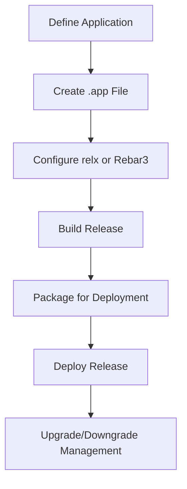

## 6.7 Applications and Release Handling

In this section, we delve into the essential concepts of defining applications in Erlang and managing releases for deployment. Understanding these concepts is crucial for building scalable, maintainable, and robust systems. We will explore what constitutes an Erlang application, how to define it using an `.app` file, and the process of creating releases with tools like `relx` and Rebar3. Additionally, we will provide examples of packaging applications for deployment and discuss considerations for upgrading and downgrading releases.

### Understanding Erlang Applications

An Erlang application is a component of a system that can be started and stopped as a unit. It typically consists of a collection of modules, processes, and resources that work together to perform a specific function or set of functions. Applications are the building blocks of larger systems in Erlang, and they are managed by the Open Telecom Platform (OTP) framework.

#### Components of an Erlang Application

1. **Modules**: The basic building blocks of an application, containing functions and logic.
2. **Processes**: Concurrent entities that execute code and communicate via message passing.
3. **Resources**: Files, configurations, and other assets needed by the application.
4. **Application Callback Module**: A module that implements the `application` behavior, defining start and stop functions.
5. **Configuration Files**: Files that provide runtime configuration for the application.

### Defining an Application with an `.app` File

The `.app` file is a key component in defining an Erlang application. It is a configuration file that describes the application and its properties. This file is typically named `my_app.app` and is written in Erlang's term format.

#### Structure of an `.app` File

```erlang
{application, my_app,
 [
  {description, "My Sample Application"},
  {vsn, "1.0.0"},
  {modules, [my_app_module1, my_app_module2]},
  {registered, [my_app_process]},
  {applications, [kernel, stdlib]},
  {mod, {my_app_module, []}},
  {env, [{key1, value1}, {key2, value2}]}
 ]}.
```

- **`description`**: A brief description of the application.
- **`vsn`**: The version of the application.
- **`modules`**: A list of modules included in the application.
- **`registered`**: A list of registered processes.
- **`applications`**: Dependencies required by the application.
- **`mod`**: The application callback module and its arguments.
- **`env`**: Environment variables and their values.

### Creating Releases with `relx` and Rebar3

Releases in Erlang are self-contained packages that include one or more applications, along with the Erlang runtime system. They are used to deploy applications in a consistent and manageable way. Tools like `relx` and Rebar3 simplify the process of creating releases.

#### Using `relx` for Release Management

`relx` is a tool for building releases in Erlang. It automates the process of assembling applications, dependencies, and the Erlang runtime into a single package.

##### Basic `relx` Configuration

Create a `relx.config` file in your project directory:

```erlang
{release, {my_app, "1.0.0"},
 [{my_app, "1.0.0"},
  {other_app, "2.0.0"}]}.

{dev_mode, true}.
{include_erts, false}.
{extended_start_script, true}.
```

- **`release`**: Defines the release name and version, along with included applications.
- **`dev_mode`**: If `true`, the release will use the source code directly, useful for development.
- **`include_erts`**: If `false`, the Erlang runtime is not included, assuming it is installed on the target system.
- **`extended_start_script`**: Generates a more comprehensive start script.

##### Building the Release

Run the following command to build the release:

```shell
$ rebar3 release
```

This command compiles the application and creates a release package in the `_build/default/rel` directory.

#### Using Rebar3 for Release Management

Rebar3 is a build tool and package manager for Erlang. It provides a convenient way to manage dependencies, compile code, and create releases.

##### Setting Up Rebar3

Create a `rebar.config` file in your project directory:

```erlang
{erl_opts, [debug_info]}.
{deps, []}.
{relx, [{release, {my_app, "1.0.0"},
         [my_app]},
        {dev_mode, true},
        {include_erts, false},
        {extended_start_script, true}]}.
```

##### Building the Release with Rebar3

Run the following command to build the release:

```shell
$ rebar3 release
```

This command compiles the application and creates a release package similar to `relx`.

### Packaging Applications for Deployment

Once a release is built, it can be packaged for deployment. This involves creating a tarball or zip file that contains the release and any necessary scripts or configurations.

#### Creating a Tarball

Navigate to the release directory and create a tarball:

```shell
$ cd _build/default/rel/my_app
$ tar -czf my_app-1.0.0.tar.gz .
```

This command creates a compressed tarball of the release directory.

#### Deploying the Release

Transfer the tarball to the target system and extract it:

```shell
$ tar -xzf my_app-1.0.0.tar.gz
$ cd my_app
$ ./bin/my_app start
```

This sequence of commands extracts the release and starts the application.

### Considerations for Upgrading and Downgrading Releases

Managing upgrades and downgrades is a critical aspect of release handling. Erlang provides mechanisms for performing hot code upgrades, allowing applications to be updated without downtime.

#### Hot Code Upgrades

Hot code upgrades involve replacing modules in a running system. This requires careful planning and testing to ensure compatibility and stability.

##### Creating Upgrade Files

Upgrade files define the changes between versions and how to apply them. They are typically named `my_app-1.0.0-1.1.0.relup`.

```erlang
{"1.0.0", "1.1.0", [
  {load_module, my_app_module},
  {apply, {my_app_module, upgrade, []}}
]}.
```

- **`load_module`**: Specifies modules to be loaded.
- **`apply`**: Calls a function to perform upgrade tasks.

##### Applying the Upgrade

Use the `release_handler` module to apply the upgrade:

```erlang
release_handler:install_release("1.1.0").
```

This command installs the new release and applies the upgrade.

#### Downgrading Releases

Downgrading involves reverting to a previous version. This can be necessary if an upgrade introduces issues.

##### Creating Downgrade Files

Downgrade files are similar to upgrade files but define the reverse process.

```erlang
{"1.1.0", "1.0.0", [
  {load_module, my_app_module},
  {apply, {my_app_module, downgrade, []}}
]}.
```

##### Applying the Downgrade

Use the `release_handler` module to apply the downgrade:

```erlang
release_handler:install_release("1.0.0").
```

This command reverts the system to the previous version.

### Visualizing the Release Process

To better understand the release process, let's visualize it using a flowchart.



**Figure 1**: Flowchart of the Erlang Release Process

### Key Takeaways

- An Erlang application is a self-contained unit with modules, processes, and resources.
- The `.app` file defines the application's properties and dependencies.
- Tools like `relx` and Rebar3 facilitate release creation and management.
- Packaging and deploying releases involve creating tarballs and starting applications.
- Hot code upgrades and downgrades require careful planning and testing.

### Try It Yourself

Experiment with creating a simple Erlang application and defining it using an `.app` file. Use Rebar3 to build a release and package it for deployment. Try performing a hot code upgrade by modifying a module and applying the changes.

### Further Reading

- [Erlang Documentation on Applications](https://www.erlang.org/doc/design_principles/applications.html)
- [Rebar3 User Guide](https://rebar3.org/docs)
- [relx Documentation](https://github.com/erlware/relx)

## Quiz: Applications and Release Handling



### What is an Erlang application?

- [x] A self-contained unit with modules, processes, and resources
- [ ] A single module in Erlang
- [ ] A process that runs in the background
- [ ] A configuration file for Erlang

> **Explanation:** An Erlang application is a self-contained unit that includes modules, processes, and resources.

### What is the purpose of the `.app` file in Erlang?

- [x] To define the application's properties and dependencies
- [ ] To store runtime data
- [ ] To compile Erlang code
- [ ] To manage process communication

> **Explanation:** The `.app` file defines the application's properties, such as modules, version, and dependencies.

### Which tool is used for building releases in Erlang?

- [x] relx
- [ ] Dialyzer
- [ ] EDoc
- [ ] Observer

> **Explanation:** `relx` is a tool used for building releases in Erlang.

### What is the role of the `release_handler` module?

- [x] To manage upgrades and downgrades of releases
- [ ] To compile Erlang code
- [ ] To monitor processes
- [ ] To handle errors

> **Explanation:** The `release_handler` module manages upgrades and downgrades of releases.

### What does the `dev_mode` option in `relx.config` do?

- [x] Uses source code directly for development
- [ ] Includes the Erlang runtime in the release
- [ ] Generates a start script
- [ ] Compiles the application

> **Explanation:** The `dev_mode` option uses source code directly, which is useful for development.

### How can you package an Erlang release for deployment?

- [x] By creating a tarball of the release directory
- [ ] By compiling the source code
- [ ] By writing a shell script
- [ ] By using the Erlang shell

> **Explanation:** Packaging involves creating a tarball of the release directory for deployment.

### What is a hot code upgrade in Erlang?

- [x] Replacing modules in a running system without downtime
- [ ] Compiling code with optimizations
- [ ] Restarting the Erlang VM
- [ ] Debugging a running application

> **Explanation:** A hot code upgrade involves replacing modules in a running system without downtime.

### What is included in a release package?

- [x] Applications, dependencies, and the Erlang runtime
- [ ] Only the source code
- [ ] Only the compiled modules
- [ ] Only the configuration files

> **Explanation:** A release package includes applications, dependencies, and the Erlang runtime.

### What is the purpose of the `mod` attribute in an `.app` file?

- [x] To specify the application callback module
- [ ] To define environment variables
- [ ] To list registered processes
- [ ] To describe the application

> **Explanation:** The `mod` attribute specifies the application callback module and its arguments.

### True or False: Downgrading a release is not possible in Erlang.

- [ ] True
- [x] False

> **Explanation:** Downgrading a release is possible in Erlang by using downgrade files and the `release_handler` module.



Remember, this is just the beginning. As you progress, you'll build more complex and interactive applications. Keep experimenting, stay curious, and enjoy the journey!
