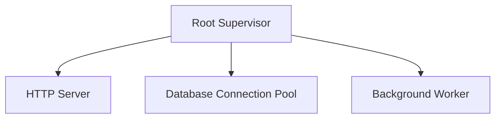

## 6.8 Designing Effective Supervision Trees

In this section, we delve into the art and science of designing effective supervision trees in Erlang. Supervision trees are a cornerstone of Erlang's fault-tolerance capabilities, allowing developers to build robust, resilient systems. By structuring processes into hierarchies, we can isolate faults, manage failures gracefully, and ensure system reliability. Let's explore the principles, strategies, and best practices for designing supervision trees that enhance system reliability and maintainability.

### Understanding Supervision Trees

Supervision trees are hierarchical structures that organize processes in a way that allows for effective fault management. At the top of the hierarchy is a supervisor process, which is responsible for monitoring its child processes. If a child process fails, the supervisor can take corrective actions, such as restarting the process or escalating the failure.

#### Key Concepts

- **Supervisor**: A process that manages and monitors other processes, known as child processes.
- **Child Process**: A process that is managed by a supervisor. It can be a worker process or another supervisor.
- **Restart Strategy**: The policy that determines how a supervisor responds to child process failures.
- **Supervision Hierarchy**: The tree-like structure formed by supervisors and their child processes.

### Principles for Structuring Supervision Hierarchies

Designing effective supervision trees involves adhering to certain principles that guide the organization of processes and the handling of failures.

#### 1. **Single Responsibility Principle**

Each supervisor should have a clear and specific responsibility. This principle ensures that supervisors are not overloaded with managing unrelated processes, which can complicate fault handling and recovery.

#### 2. **Layered Supervision**

Organize supervisors in layers, where each layer is responsible for a specific aspect of the system's functionality. This approach allows for better fault isolation and simplifies the supervision structure.

#### 3. **Fault Isolation**

Design supervision trees to isolate faults to the smallest possible scope. By containing failures within a specific subtree, you can prevent them from affecting the entire system.

#### 4. **Minimal Impact**

Ensure that the failure of a child process has minimal impact on the rest of the system. This can be achieved by designing processes to be stateless or by using state replication techniques.

#### 5. **Iterative Refinement**

Supervision trees should be refined iteratively as the system evolves. Regularly review and adjust the supervision structure to accommodate new requirements and improve fault tolerance.

### Segmenting Functionality Across Supervisors

To design effective supervision trees, it's crucial to segment functionality across supervisors in a way that aligns with the system's architecture and operational requirements.

#### Functional Segmentation

Divide the system into functional components, each managed by its own supervisor. For example, in a web application, you might have separate supervisors for handling HTTP requests, database interactions, and background tasks.

#### Process Type Segmentation

Differentiate between worker processes and supervisor processes. Worker processes perform specific tasks, while supervisor processes manage and monitor other processes. This distinction helps in organizing the supervision tree and defining appropriate restart strategies.

#### Example: Web Application Supervision Tree

Consider a simple web application with the following components:

- **HTTP Server**: Handles incoming HTTP requests.
- **Database Connection Pool**: Manages connections to the database.
- **Background Worker**: Performs asynchronous tasks.

```erlang
-module(web_app_sup).
-behaviour(supervisor).

%% API
-export([start_link/0]).

%% Supervisor callbacks
-export([init/1]).

start_link() ->
    supervisor:start_link({local, ?MODULE}, ?MODULE, []).

init([]) ->
    {ok, {{one_for_one, 5, 10},
          [
           {http_server, {http_server, start_link, []}, permanent, 5000, worker, [http_server]},
           {db_pool, {db_pool, start_link, []}, permanent, 5000, worker, [db_pool]},
           {background_worker, {background_worker, start_link, []}, permanent, 5000, worker, [background_worker]}
          ]}}.
```

In this example, the `web_app_sup` module defines a supervisor that manages three child processes: `http_server`, `db_pool`, and `background_worker`. Each child process is responsible for a specific aspect of the application's functionality.

### Strategies for Isolating Faults and Minimizing Impact

Fault isolation and impact minimization are critical for building resilient systems. Here are some strategies to achieve these goals:

#### 1. **Use of `one_for_one` Strategy**

The `one_for_one` strategy is suitable when each child process operates independently. If a child process fails, only that process is restarted, minimizing the impact on other processes.

#### 2. **Use of `rest_for_one` Strategy**

The `rest_for_one` strategy is useful when child processes are interdependent. If a process fails, it and all processes started after it are restarted. This ensures that dependent processes are in a consistent state.

#### 3. **Use of `one_for_all` Strategy**

The `one_for_all` strategy is appropriate when all child processes must be restarted together. If one process fails, all are restarted. This is useful when processes share state or resources.

#### 4. **Dynamic Supervision**

In some cases, it may be beneficial to dynamically add or remove child processes based on runtime conditions. This approach allows for flexible resource management and fault handling.

### Complex Supervision Trees

As systems grow in complexity, so do their supervision trees. Designing complex supervision trees requires careful planning and consideration of various factors, such as process dependencies, resource constraints, and fault tolerance requirements.

#### Example: E-commerce Platform Supervision Tree

Consider an e-commerce platform with the following components:

- **User Management**: Handles user authentication and profile management.
- **Product Catalog**: Manages product listings and inventory.
- **Order Processing**: Handles order placement and payment processing.
- **Notification Service**: Sends notifications to users.

```erlang
-module(ecommerce_sup).
-behaviour(supervisor).

%% API
-export([start_link/0]).

%% Supervisor callbacks
-export([init/1]).

start_link() ->
    supervisor:start_link({local, ?MODULE}, ?MODULE, []).

init([]) ->
    {ok, {{one_for_one, 10, 20},
          [
           {user_management_sup, {user_management_sup, start_link, []}, permanent, 5000, supervisor, [user_management_sup]},
           {product_catalog_sup, {product_catalog_sup, start_link, []}, permanent, 5000, supervisor, [product_catalog_sup]},
           {order_processing_sup, {order_processing_sup, start_link, []}, permanent, 5000, supervisor, [order_processing_sup]},
           {notification_service, {notification_service, start_link, []}, permanent, 5000, worker, [notification_service]}
          ]}}.
```

In this example, the `ecommerce_sup` module defines a supervisor that manages four child processes, each responsible for a different aspect of the platform's functionality. Notice that some child processes are themselves supervisors, indicating a layered supervision hierarchy.

### Visualizing Supervision Trees

Visualizing supervision trees can help in understanding their structure and identifying potential areas for improvement. Let's use Mermaid.js to create a diagram of a simple supervision tree.



**Diagram Description**: This diagram represents a simple supervision tree with a root supervisor managing three child processes: an HTTP server, a database connection pool, and a background worker.

### Iterative Refinement of Supervision Structures

Designing supervision trees is an iterative process. As the system evolves, so should the supervision structure. Regularly review and refine the supervision tree to ensure it aligns with the system's architecture and operational requirements.

#### Steps for Iterative Refinement

1. **Review System Requirements**: Regularly review the system's requirements and identify any changes that may impact the supervision structure.
2. **Analyze Fault Patterns**: Analyze fault patterns and identify areas where fault isolation can be improved.
3. **Refactor Supervision Tree**: Refactor the supervision tree to address identified issues and improve fault tolerance.
4. **Test and Validate**: Test the updated supervision structure to ensure it meets the system's reliability and maintainability goals.

### Conclusion

Designing effective supervision trees is a critical aspect of building robust, fault-tolerant systems in Erlang. By adhering to principles such as single responsibility, layered supervision, and fault isolation, we can create supervision trees that enhance system reliability and maintainability. Remember, designing supervision trees is an iterative process that requires regular review and refinement. As you continue to build and evolve your systems, keep experimenting, stay curious, and embrace the journey of designing effective supervision trees.

## Quiz: Designing Effective Supervision Trees



### What is the primary role of a supervisor in a supervision tree?

- [x] To manage and monitor child processes
- [ ] To execute business logic
- [ ] To handle user requests
- [ ] To store application data

> **Explanation:** A supervisor's primary role is to manage and monitor child processes, ensuring system reliability.

### Which restart strategy should be used when child processes are independent?

- [x] one_for_one
- [ ] rest_for_one
- [ ] one_for_all
- [ ] all_for_one

> **Explanation:** The `one_for_one` strategy is used when child processes are independent, allowing only the failed process to be restarted.

### What principle ensures that supervisors are not overloaded with managing unrelated processes?

- [x] Single Responsibility Principle
- [ ] Layered Supervision
- [ ] Fault Isolation
- [ ] Minimal Impact

> **Explanation:** The Single Responsibility Principle ensures that supervisors have a clear and specific responsibility.

### How can you minimize the impact of a child process failure on the rest of the system?

- [x] Design processes to be stateless
- [ ] Use shared state across processes
- [ ] Increase the number of child processes
- [ ] Reduce the number of supervisors

> **Explanation:** Designing processes to be stateless minimizes the impact of a child process failure on the rest of the system.

### Which strategy restarts all child processes if one fails?

- [x] one_for_all
- [ ] one_for_one
- [ ] rest_for_one
- [ ] all_for_one

> **Explanation:** The `one_for_all` strategy restarts all child processes if one fails, ensuring consistency.

### What is the benefit of using layered supervision?

- [x] Better fault isolation
- [ ] Increased complexity
- [ ] Reduced process count
- [ ] Faster execution

> **Explanation:** Layered supervision provides better fault isolation by organizing supervisors in layers.

### What should be done regularly to ensure the supervision structure aligns with system requirements?

- [x] Review and refine the supervision tree
- [ ] Increase the number of supervisors
- [ ] Decrease the number of child processes
- [ ] Add more layers to the supervision tree

> **Explanation:** Regularly reviewing and refining the supervision tree ensures it aligns with system requirements.

### What is a common strategy for handling interdependent child processes?

- [x] rest_for_one
- [ ] one_for_one
- [ ] one_for_all
- [ ] all_for_one

> **Explanation:** The `rest_for_one` strategy is used for interdependent child processes, restarting them in a specific order.

### What is the purpose of iterative refinement in designing supervision trees?

- [x] To improve fault tolerance and align with evolving requirements
- [ ] To increase the number of child processes
- [ ] To reduce system complexity
- [ ] To eliminate the need for supervisors

> **Explanation:** Iterative refinement improves fault tolerance and aligns the supervision tree with evolving requirements.

### True or False: A supervisor can only manage worker processes.

- [ ] True
- [x] False

> **Explanation:** A supervisor can manage both worker processes and other supervisors, forming a hierarchical structure.




