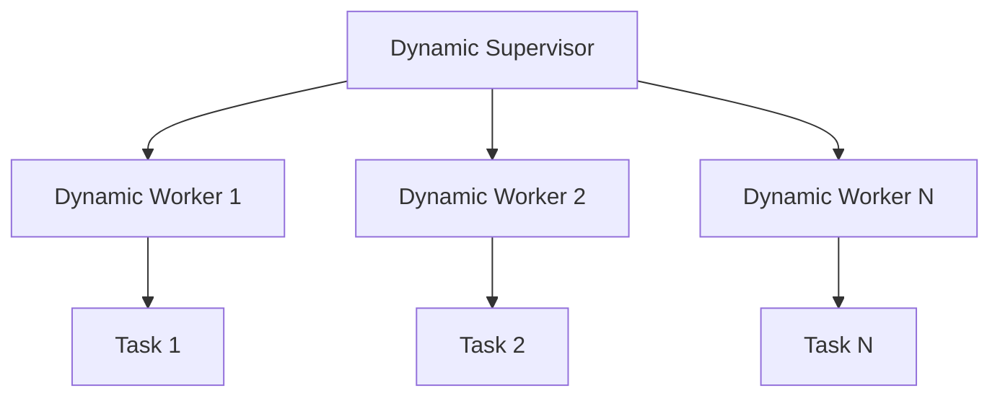

## 6.9 Advanced OTP Techniques

In this section, we delve into advanced OTP (Open Telecom Platform) techniques in Erlang, focusing on custom behaviors, dynamic supervision, complex initialization sequences, and special cases in process management. These advanced concepts will empower you to build more robust, scalable, and maintainable applications using Erlang's powerful concurrency and fault-tolerance features.

### Introduction to Custom Behaviors

Custom behaviors in Erlang allow developers to define reusable patterns for process behavior, similar to the built-in `gen_server`, `gen_statem`, and `gen_event` behaviors. By creating custom behaviors, you can encapsulate common patterns and logic, making your codebase more modular and easier to maintain.

#### Creating a Custom Behavior

To create a custom behavior, you need to define a behavior module that specifies the callback functions required by the behavior. Let's walk through the steps to create a simple custom behavior.

1. **Define the Behavior Module:**

   The behavior module specifies the required callback functions using the `-callback` attribute.

   ```erlang
   -module(my_custom_behavior).
   -callback init(Args :: term()) -> {ok, State :: term()}.
   -callback handle_call(Request :: term(), From :: pid(), State :: term()) -> {reply, Reply :: term(), NewState :: term()}.
   ```

2. **Implement the Behavior:**

   Implement the behavior in a module that uses the `-behaviour` attribute to specify the custom behavior.

   ```erlang
   -module(my_custom_module).
   -behaviour(my_custom_behavior).

   -export([init/1, handle_call/3]).

   init(Args) ->
       {ok, Args}.

   handle_call(Request, _From, State) ->
       {reply, {ok, Request}, State}.
   ```

3. **Using the Custom Behavior:**

   You can now use the custom behavior in your application, similar to how you would use built-in OTP behaviors.

   ```erlang
   start_link(Args) ->
       gen_server:start_link(?MODULE, Args, []).

   init(Args) ->
       my_custom_behavior:init(Args).
   ```

### Dynamic Supervision Patterns

Dynamic supervision is an advanced OTP technique that allows you to manage processes whose lifecycle is not known at compile time. This is particularly useful in scenarios where the number of processes or their configuration may change dynamically.

#### Implementing Dynamic Supervision

1. **Define a Dynamic Supervisor:**

   Use the `simple_one_for_one` supervision strategy to manage a dynamic set of child processes.

   ```erlang
   -module(dynamic_supervisor).
   -behaviour(supervisor).

   -export([start_link/0, init/1]).

   start_link() ->
       supervisor:start_link({local, ?MODULE}, ?MODULE, []).

   init([]) ->
       {ok, {{simple_one_for_one, 5, 10}, [{dynamic_worker, {dynamic_worker, start_link, []}, temporary, 5000, worker, [dynamic_worker]}]}}.
   ```

2. **Start and Stop Dynamic Workers:**

   You can dynamically start and stop worker processes under the supervisor.

   ```erlang
   start_worker(Args) ->
       supervisor:start_child(dynamic_supervisor, [Args]).

   stop_worker(Pid) ->
       supervisor:terminate_child(dynamic_supervisor, Pid).
   ```

### Complex Initialization Sequences

Complex initialization sequences are necessary when a process requires multiple steps to initialize its state or when dependencies between processes need to be managed carefully.

#### Example of a Complex Initialization

1. **Define Initialization Steps:**

   Break down the initialization into discrete steps, each represented by a function.

   ```erlang
   init([]) ->
       case step_one() of
           {ok, Data1} ->
               case step_two(Data1) of
                   {ok, Data2} ->
                       {ok, Data2};
                   {error, Reason} ->
                       {stop, Reason}
               end;
           {error, Reason} ->
               {stop, Reason}
       end.
   ```

2. **Handle Dependencies:**

   Ensure that each step is dependent on the successful completion of the previous step.

   ```erlang
   step_one() ->
       % Perform step one
       {ok, Data1}.

   step_two(Data1) ->
       % Use Data1 to perform step two
       {ok, Data2}.
   ```

### Handling Special Cases in Process Management

Special cases in process management often involve dealing with unexpected conditions or errors. Erlang's "let it crash" philosophy encourages designing systems that can recover from failures gracefully.

#### Techniques for Special Case Handling

1. **Use Supervisors for Fault Recovery:**

   Leverage supervisors to automatically restart failed processes.

   ```erlang
   -module(my_supervisor).
   -behaviour(supervisor).

   -export([start_link/0, init/1]).

   start_link() ->
       supervisor:start_link({local, ?MODULE}, ?MODULE, []).

   init([]) ->
       {ok, {{one_for_one, 5, 10}, [{my_worker, {my_worker, start_link, []}, permanent, 5000, worker, [my_worker]}]}}.
   ```

2. **Implement Custom Error Handling:**

   Use the `handle_info/2` callback to manage unexpected messages or errors.

   ```erlang
   handle_info({error, Reason}, State) ->
       % Handle the error
       {noreply, State};
   handle_info(_Msg, State) ->
       {noreply, State}.
   ```

### Exploring OTP Internals

To gain a deeper understanding of OTP, explore its internals by examining the source code of OTP libraries and experimenting with different configurations and patterns.

#### Tips for Exploring OTP Internals

- **Read the Source Code:** OTP is open-source, and reading the source code can provide insights into its design and implementation.
- **Experiment with Configurations:** Try different supervision strategies and configurations to see how they affect process behavior.
- **Join the Community:** Engage with the Erlang community through forums, mailing lists, and conferences to learn from others' experiences.

### Try It Yourself

Experiment with the concepts discussed in this section by modifying the code examples. Try creating your own custom behavior, implementing dynamic supervision, or designing a complex initialization sequence. This hands-on approach will deepen your understanding of advanced OTP techniques.

### Visualizing Dynamic Supervision

To better understand dynamic supervision, let's visualize the process using a Mermaid.js diagram.



**Diagram Description:** This diagram illustrates a dynamic supervisor managing multiple dynamic workers, each performing different tasks.

### Key Takeaways

- Custom behaviors allow for reusable patterns and modular code.
- Dynamic supervision enables flexible process management.
- Complex initialization sequences manage dependencies and ensure robust startup.
- Special case handling and fault recovery are integral to Erlang's design.
- Exploring OTP internals enhances understanding and proficiency.

## Quiz: Advanced OTP Techniques



### What is a custom behavior in Erlang?

- [x] A reusable pattern for process behavior
- [ ] A built-in OTP behavior
- [ ] A type of supervisor strategy
- [ ] A message passing technique

> **Explanation:** Custom behaviors allow developers to define reusable patterns for process behavior, similar to built-in OTP behaviors.

### How can dynamic supervision be implemented in Erlang?

- [x] Using the `simple_one_for_one` supervision strategy
- [ ] Using the `one_for_all` supervision strategy
- [ ] Using the `rest_for_one` supervision strategy
- [ ] Using the `permanent` restart strategy

> **Explanation:** Dynamic supervision is typically implemented using the `simple_one_for_one` supervision strategy, which allows for dynamic management of child processes.

### What is the purpose of complex initialization sequences?

- [x] To manage dependencies and ensure robust startup
- [ ] To simplify process termination
- [ ] To handle message passing
- [ ] To optimize memory usage

> **Explanation:** Complex initialization sequences are used to manage dependencies and ensure robust startup of processes.

### How does Erlang handle special cases in process management?

- [x] By using supervisors for fault recovery
- [ ] By using complex algorithms
- [ ] By avoiding process crashes
- [ ] By using synchronous messaging

> **Explanation:** Erlang uses supervisors to automatically restart failed processes, handling special cases in process management.

### What is the "let it crash" philosophy?

- [x] A design principle that encourages systems to recover from failures gracefully
- [ ] A method for optimizing performance
- [ ] A technique for message passing
- [ ] A strategy for dynamic supervision

> **Explanation:** The "let it crash" philosophy is a design principle in Erlang that encourages systems to recover from failures gracefully.

### What is the benefit of exploring OTP internals?

- [x] To gain a deeper understanding of OTP's design and implementation
- [ ] To improve message passing speed
- [ ] To reduce memory usage
- [ ] To simplify code syntax

> **Explanation:** Exploring OTP internals provides insights into its design and implementation, enhancing understanding and proficiency.

### What is a key feature of dynamic supervision?

- [x] Managing processes whose lifecycle is not known at compile time
- [ ] Simplifying process termination
- [ ] Optimizing memory usage
- [ ] Handling synchronous messaging

> **Explanation:** Dynamic supervision manages processes whose lifecycle is not known at compile time, providing flexibility in process management.

### How can you create a custom behavior in Erlang?

- [x] By defining a behavior module with required callback functions
- [ ] By using a built-in OTP behavior
- [ ] By implementing a supervisor
- [ ] By using synchronous messaging

> **Explanation:** A custom behavior is created by defining a behavior module that specifies the required callback functions.

### What is the role of the `handle_info/2` callback?

- [x] To manage unexpected messages or errors
- [ ] To initialize process state
- [ ] To handle synchronous messaging
- [ ] To optimize memory usage

> **Explanation:** The `handle_info/2` callback is used to manage unexpected messages or errors in a process.

### True or False: Dynamic supervision is only useful for static process management.

- [ ] True
- [x] False

> **Explanation:** Dynamic supervision is particularly useful for managing processes whose lifecycle is dynamic and not known at compile time.



Remember, mastering advanced OTP techniques is a journey. As you explore these concepts, you'll gain the skills to build more complex and resilient Erlang applications. Keep experimenting, stay curious, and enjoy the journey!
