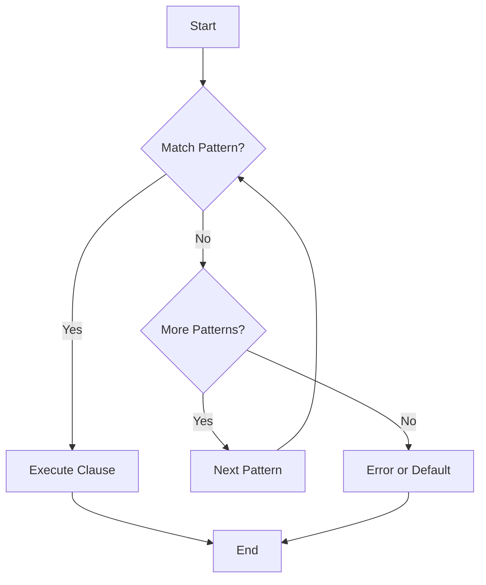

## 7.1 Effective Use of Pattern Matching

Pattern matching is a cornerstone of Erlang programming, offering a powerful mechanism for deconstructing data structures and controlling program flow. In this section, we will delve into the idiomatic use of pattern matching in Erlang, exploring its application in function arguments, case expressions, and receive blocks. We will also discuss strategies for matching complex data structures and provide guidance on writing pattern-matching code that enhances readability and maintainability.

### Understanding Pattern Matching

Pattern matching in Erlang is a declarative way to specify the structure of data you expect and to bind variables to the corresponding parts of that data. It is used extensively throughout Erlang code, from function definitions to control structures, making it a vital skill for any Erlang developer.

#### Key Concepts

- **Pattern**: A pattern is a template that describes the structure of data. It can include literals, variables, and complex data structures.
- **Matching**: Matching occurs when a pattern is compared to a data value. If the data fits the pattern, the match succeeds, and any variables in the pattern are bound to corresponding parts of the data.
- **Failure**: If the data does not fit the pattern, the match fails, and the program may take alternative actions, such as trying another pattern or raising an error.

### Pattern Matching in Function Arguments

One of the most common uses of pattern matching in Erlang is in function arguments. This allows you to define multiple function clauses, each handling different patterns of input data.

```erlang
% Define a function that processes a list of integers
sum_list([]) -> 0;
sum_list([Head | Tail]) -> Head + sum_list(Tail).
```

In the example above, the `sum_list/1` function uses pattern matching to differentiate between an empty list and a non-empty list. The first clause matches an empty list and returns `0`, while the second clause matches a list with a head and tail, recursively summing the elements.

#### Benefits

- **Clarity**: Pattern matching in function arguments makes the code more readable by clearly expressing the intent of each function clause.
- **Safety**: It ensures that all possible input patterns are considered, reducing the likelihood of runtime errors.

### Pattern Matching in Case Expressions

Case expressions in Erlang allow you to perform pattern matching on the result of an expression, enabling complex branching logic based on the structure of data.

```erlang
% Define a function that categorizes a number
categorize_number(N) ->
    case N of
        0 -> zero;
        1 -> one;
        _ -> other
    end.
```

In this example, the `categorize_number/1` function uses a case expression to match the input number against several patterns. The underscore (`_`) is a wildcard pattern that matches any value, providing a default case.

#### Best Practices

- **Exhaustiveness**: Ensure that all possible patterns are covered in a case expression to avoid unexpected errors.
- **Simplicity**: Keep patterns simple and avoid overly complex matching logic within a single case expression.

### Pattern Matching in Receive Blocks

Receive blocks in Erlang are used to handle messages in concurrent processes. Pattern matching is crucial here to determine which messages a process should respond to.

```erlang
% Define a process that handles different types of messages
loop() ->
    receive
        {hello, Name} ->
            io:format("Hello, ~s!~n", [Name]),
            loop();
        {goodbye, Name} ->
            io:format("Goodbye, ~s!~n", [Name]),
            loop();
        stop ->
            io:format("Stopping.~n")
    end.
```

In this example, the `loop/0` function uses a receive block to match incoming messages against different patterns. Each pattern corresponds to a different message type, allowing the process to handle each message appropriately.

#### Considerations

- **Order**: Patterns are matched in the order they are defined, so place more specific patterns before more general ones.
- **Timeouts**: Consider using timeouts in receive blocks to handle cases where no matching message is received.

### Matching Complex Data Structures

Erlang's pattern matching capabilities extend to complex data structures, such as tuples, lists, and maps. This allows you to deconstruct and analyze data in a concise and expressive manner.

```erlang
% Define a function that extracts information from a tuple
extract_info({Name, Age, Address}) ->
    io:format("Name: ~s, Age: ~p, Address: ~s~n", [Name, Age, Address]).
```

In this example, the `extract_info/1` function uses pattern matching to extract elements from a tuple. This approach is both concise and clear, making it easy to understand the structure of the data being processed.

#### Tips for Matching Complex Structures

- **Descriptive Patterns**: Use descriptive variable names in patterns to enhance readability.
- **Nested Patterns**: Take advantage of nested patterns to match deeply nested data structures.

### Writing Readable Pattern-Matching Code

To write pattern-matching code that is both effective and readable, consider the following guidelines:

- **Consistency**: Use consistent naming conventions for variables and patterns.
- **Documentation**: Comment complex patterns to explain their purpose and structure.
- **Refactoring**: Break down complex matching logic into smaller, reusable functions.

### Visualizing Pattern Matching

To better understand how pattern matching works, let's visualize the process using a flowchart. This flowchart represents the decision-making process in a case expression.



**Figure 1**: A flowchart illustrating the pattern matching process in a case expression.

### Try It Yourself

Experiment with the following code examples to deepen your understanding of pattern matching in Erlang:

1. Modify the `sum_list/1` function to handle lists of tuples, where each tuple contains a number and a weight. Sum the weighted numbers.
2. Extend the `categorize_number/1` function to handle negative numbers and categorize them as `negative`.
3. Add a timeout to the `loop/0` function's receive block to print a message if no message is received within a certain period.

### Further Reading

For more information on pattern matching in Erlang, consider exploring the following resources:

- [Erlang Documentation on Pattern Matching](https://www.erlang.org/doc/reference_manual/patterns.html)
- [Learn You Some Erlang for Great Good!](http://learnyousomeerlang.com/)

### Summary

Pattern matching is a powerful feature in Erlang that allows you to write clear, concise, and expressive code. By leveraging pattern matching in function arguments, case expressions, and receive blocks, you can create robust and maintainable Erlang applications. Remember to keep patterns simple, cover all possible cases, and document complex matching logic to enhance readability.

## Quiz: Effective Use of Pattern Matching



### What is pattern matching in Erlang?

- [x] A way to deconstruct data structures and bind variables
- [ ] A method to encrypt data
- [ ] A technique for optimizing performance
- [ ] A tool for debugging code

> **Explanation:** Pattern matching is a fundamental feature in Erlang used to deconstruct data structures and bind variables to data.

### Which of the following is a benefit of using pattern matching in function arguments?

- [x] Clarity
- [x] Safety
- [ ] Complexity
- [ ] Obfuscation

> **Explanation:** Pattern matching in function arguments enhances clarity and safety by clearly expressing intent and ensuring all input patterns are considered.

### In a case expression, what does the underscore (_) pattern represent?

- [x] A wildcard pattern that matches any value
- [ ] A pattern that matches only integers
- [ ] A pattern that matches only strings
- [ ] A pattern that matches only lists

> **Explanation:** The underscore (_) is a wildcard pattern that matches any value, often used as a default case.

### What should you consider when using receive blocks in Erlang?

- [x] Order of patterns
- [x] Timeouts
- [ ] Encryption
- [ ] Compilation time

> **Explanation:** In receive blocks, the order of patterns and the use of timeouts are important considerations for handling messages effectively.

### How can you enhance the readability of pattern-matching code?

- [x] Use consistent naming conventions
- [x] Comment complex patterns
- [ ] Use complex patterns without explanation
- [ ] Avoid refactoring

> **Explanation:** Enhancing readability involves using consistent naming conventions, commenting complex patterns, and refactoring when necessary.

### What is a common use of pattern matching in Erlang?

- [x] Function arguments
- [x] Case expressions
- [x] Receive blocks
- [ ] File I/O

> **Explanation:** Pattern matching is commonly used in function arguments, case expressions, and receive blocks in Erlang.

### What is the purpose of a flowchart in understanding pattern matching?

- [x] To visualize the decision-making process
- [ ] To encrypt data
- [ ] To compile code
- [ ] To debug errors

> **Explanation:** A flowchart helps visualize the decision-making process in pattern matching, aiding understanding.

### What is the benefit of using nested patterns?

- [x] To match deeply nested data structures
- [ ] To increase complexity
- [ ] To reduce readability
- [ ] To obfuscate code

> **Explanation:** Nested patterns allow you to match deeply nested data structures, enhancing expressiveness.

### What is the role of pattern matching in receive blocks?

- [x] To determine which messages a process should respond to
- [ ] To encrypt messages
- [ ] To compile messages
- [ ] To debug messages

> **Explanation:** Pattern matching in receive blocks determines which messages a process should respond to, based on their structure.

### True or False: Pattern matching can only be used with simple data types in Erlang.

- [ ] True
- [x] False

> **Explanation:** False. Pattern matching can be used with both simple and complex data structures in Erlang.



Remember, mastering pattern matching is just the beginning of your journey with Erlang. Keep experimenting, stay curious, and enjoy the process of learning and applying these powerful concepts!
