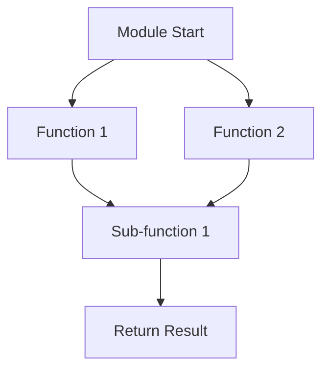

## 7.10 Writing Clear and Expressive Code

Writing clear and expressive code is a cornerstone of effective software development, especially in a language like Erlang, which is known for its concurrency and fault-tolerance capabilities. In this section, we will explore strategies to enhance code readability and expressiveness, ensuring that your Erlang code is not only functional but also easy to understand and maintain.

### Importance of Clear and Expressive Code

Clear and expressive code is essential for several reasons:

- **Readability**: Code is read more often than it is written. Clear code allows others (and your future self) to understand the logic quickly.
- **Maintainability**: Expressive code is easier to modify and extend, reducing the risk of introducing bugs.
- **Collaboration**: In team environments, clear code facilitates better collaboration and knowledge sharing.
- **Debugging**: Well-written code simplifies the debugging process, making it easier to identify and fix issues.

### Tips for Writing Clear Code

#### 1. Use Meaningful Variable Names

Choose variable names that convey the purpose or meaning of the data they hold. Avoid single-letter names or abbreviations unless they are universally understood.

```erlang
% Bad Example
X = 5,
Y = 10,
Z = X + Y.

% Good Example
Width = 5,
Height = 10,
Area = Width * Height.
```

#### 2. Consistent Formatting and Indentation

Adopt a consistent style for formatting and indentation. This includes aligning code blocks, using spaces or tabs consistently, and following a style guide.

```erlang
% Consistent indentation and formatting
-module(example).
-export([calculate_area/2]).

calculate_area(Width, Height) ->
    Area = Width * Height,
    Area.
```

#### 3. Avoid Overly Complex Expressions

Break down complex expressions into smaller, manageable parts. This not only improves readability but also makes debugging easier.

```erlang
% Bad Example
Result = lists:sum([X * X || X <- lists:seq(1, 10)]).

% Good Example
Numbers = lists:seq(1, 10),
Squares = [X * X || X <- Numbers],
Result = lists:sum(Squares).
```

#### 4. Limit Nested Structures

Deeply nested structures can be difficult to follow. Use pattern matching and function decomposition to simplify them.

```erlang
% Bad Example
case lists:keyfind(Key, 1, List) of
    false -> 
        {error, not_found};
    {Key, Value} -> 
        {ok, Value}
end.

% Good Example
find_key(Key, List) ->
    case lists:keyfind(Key, 1, List) of
        false -> {error, not_found};
        {Key, Value} -> {ok, Value}
    end.
```

### Commenting on Non-Obvious Code Sections

While clear code should be self-explanatory, there are times when comments are necessary to explain the intent or logic behind a piece of code. Use comments to clarify complex algorithms, business logic, or any non-obvious sections.

```erlang
% Calculate the factorial of a number using recursion
factorial(0) -> 1; % Base case
factorial(N) when N > 0 -> N * factorial(N - 1). % Recursive case
```

### How Clear Code Aids Collaboration and Maintenance

Clear code is a form of documentation that aids in collaboration and maintenance. It allows team members to quickly understand the codebase, reducing onboarding time and facilitating smoother handovers. Additionally, it minimizes the risk of errors during code modifications.

### Code Examples and Exercises

Let's explore some code examples that demonstrate these principles in action.

#### Example 1: Refactoring for Clarity

Consider the following code snippet:

```erlang
% Original Code
calculate_total(Items) ->
    lists:sum([Item#item.price * Item#item.quantity || Item <- Items]).
```

This code calculates the total price of items in a list. While functional, it can be improved for clarity:

```erlang
% Refactored Code
calculate_total(Items) ->
    Prices = [calculate_item_total(Item) || Item <- Items],
    lists:sum(Prices).

calculate_item_total(Item) ->
    Item#item.price * Item#item.quantity.
```

By breaking down the calculation into a separate function, we improve readability and make the code easier to test and maintain.

#### Example 2: Simplifying Nested Logic

```erlang
% Original Code
process_order(Order) ->
    case validate_order(Order) of
        ok ->
            case check_inventory(Order) of
                ok -> ship_order(Order);
                {error, Reason} -> {error, Reason}
            end;
        {error, Reason} -> {error, Reason}
    end.
```

This code can be refactored to reduce nesting:

```erlang
% Refactored Code
process_order(Order) ->
    case validate_order(Order) of
        ok -> process_inventory(Order);
        {error, Reason} -> {error, Reason}
    end.

process_inventory(Order) ->
    case check_inventory(Order) of
        ok -> ship_order(Order);
        {error, Reason} -> {error, Reason}
    end.
```

### Try It Yourself

Experiment with the examples provided by modifying them:

1. **Variable Naming**: Change variable names to see how it affects readability.
2. **Refactoring**: Break down complex expressions in your codebase.
3. **Commenting**: Add comments to explain the logic behind your code.

### Visualizing Code Structure

To further enhance understanding, let's visualize the structure of a simple Erlang module using Mermaid.js:



**Diagram Description**: This diagram represents the flow of a simple Erlang module, showing how different functions interact and lead to a result.

### References and Further Reading

For more information on writing clear and expressive code, consider the following resources:

- [Erlang Programming Language](https://www.erlang.org/)
- [Erlang Style Guide](https://erlang.org/doc/programming_examples/expressions.html)
- [Clean Code: A Handbook of Agile Software Craftsmanship by Robert C. Martin](https://www.goodreads.com/book/show/3735293-clean-code)

### Knowledge Check

Before we conclude, let's reinforce what we've learned with some questions:

1. Why is clear code important in a collaborative environment?
2. How can meaningful variable names improve code readability?
3. What are the benefits of limiting nested structures in your code?

### Embrace the Journey

Remember, writing clear and expressive code is an ongoing journey. As you continue to develop your skills, you'll find new ways to improve your code's readability and maintainability. Keep experimenting, stay curious, and enjoy the process of crafting beautiful code!

## Quiz: Writing Clear and Expressive Code



### Why is clear code important in a collaborative environment?

- [x] It facilitates better collaboration and knowledge sharing.
- [ ] It makes the code run faster.
- [ ] It reduces the need for testing.
- [ ] It eliminates the need for documentation.

> **Explanation:** Clear code allows team members to understand the codebase quickly, facilitating collaboration and knowledge sharing.

### How can meaningful variable names improve code readability?

- [x] They convey the purpose or meaning of the data they hold.
- [ ] They make the code shorter.
- [ ] They reduce the number of comments needed.
- [ ] They increase the execution speed of the code.

> **Explanation:** Meaningful variable names help convey the purpose or meaning of the data, making the code easier to understand.

### What are the benefits of limiting nested structures in your code?

- [x] It improves readability and simplifies debugging.
- [ ] It makes the code more complex.
- [ ] It increases the number of lines of code.
- [ ] It reduces the need for functions.

> **Explanation:** Limiting nested structures improves readability and simplifies debugging by making the code easier to follow.

### What is a good practice when dealing with complex expressions?

- [x] Break them down into smaller, manageable parts.
- [ ] Combine them into a single line for brevity.
- [ ] Use as many operators as possible.
- [ ] Avoid using functions.

> **Explanation:** Breaking down complex expressions into smaller parts improves readability and makes debugging easier.

### Why should you comment on non-obvious code sections?

- [x] To clarify complex algorithms or business logic.
- [ ] To increase the file size.
- [ ] To make the code run slower.
- [ ] To add unnecessary information.

> **Explanation:** Comments help clarify complex algorithms or business logic, making the code easier to understand.

### What is the impact of consistent formatting and indentation?

- [x] It enhances readability and follows a style guide.
- [ ] It makes the code run faster.
- [ ] It reduces the number of lines of code.
- [ ] It eliminates the need for comments.

> **Explanation:** Consistent formatting and indentation enhance readability and ensure the code follows a style guide.

### How does clear code aid in debugging?

- [x] It simplifies the process of identifying and fixing issues.
- [ ] It makes the code run faster.
- [ ] It reduces the need for testing.
- [ ] It eliminates the need for documentation.

> **Explanation:** Clear code simplifies the debugging process by making it easier to identify and fix issues.

### What is a benefit of breaking down complex expressions?

- [x] It makes the code easier to test and maintain.
- [ ] It increases the number of lines of code.
- [ ] It makes the code run slower.
- [ ] It reduces the need for functions.

> **Explanation:** Breaking down complex expressions makes the code easier to test and maintain by improving readability.

### Why is it important to use a consistent style for formatting?

- [x] It ensures the code is easy to read and maintain.
- [ ] It makes the code run faster.
- [ ] It reduces the number of lines of code.
- [ ] It eliminates the need for comments.

> **Explanation:** A consistent style for formatting ensures the code is easy to read and maintain, following a style guide.

### True or False: Clear code eliminates the need for documentation.

- [ ] True
- [x] False

> **Explanation:** While clear code improves readability, documentation is still necessary to provide context and explain the overall design and architecture.


