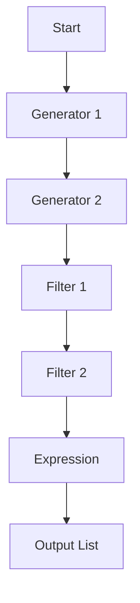

## 7.11 Leveraging List Comprehensions and Generators

List comprehensions and generators are powerful tools in Erlang that allow developers to succinctly express complex data transformations and iterations. In this section, we will delve into advanced usage patterns, explore performance considerations, and encourage creative applications of these constructs.

### Introduction to List Comprehensions

List comprehensions in Erlang provide a concise way to construct lists based on existing lists. They are similar to set comprehensions in mathematics and are inspired by list comprehensions in languages like Haskell and Python.

A basic list comprehension in Erlang has the following syntax:

```erlang
[Expression || Generator, Filter1, Filter2, ...]
```

- **Expression**: The expression to evaluate for each element that satisfies the filters.
- **Generator**: Specifies the list to iterate over, using the syntax `Pattern <- List`.
- **Filters**: Optional conditions that elements must satisfy to be included in the output list.

### Basic Example

Let's start with a simple example that squares each number in a list:

```erlang
1> Numbers = [1, 2, 3, 4, 5].
2> Squares = [X * X || X <- Numbers].
3> io:format("Squares: ~p~n", [Squares]).
```

**Output:**

```
Squares: [1,4,9,16,25]
```

### Advanced Usage with Multiple Generators

List comprehensions can include multiple generators, allowing for the creation of Cartesian products or more complex iterations.

#### Cartesian Product Example

Consider generating all pairs of numbers from two lists:

```erlang
1> List1 = [1, 2, 3].
2> List2 = [a, b, c].
3> Pairs = [{X, Y} || X <- List1, Y <- List2].
4> io:format("Pairs: ~p~n", [Pairs]).
```

**Output:**

```
Pairs: [{1,a},{1,b},{1,c},{2,a},{2,b},{2,c},{3,a},{3,b},{3,c}]
```

In this example, the comprehension iterates over each element of `List1` and `List2`, producing all possible pairs.

### Using Filters for Conditional Logic

Filters in list comprehensions allow for conditional inclusion of elements. They can be used to apply complex logic within the comprehension.

#### Filtering Example

Let's filter out even numbers from a list and square the remaining odd numbers:

```erlang
1> Numbers = [1, 2, 3, 4, 5, 6, 7, 8, 9, 10].
2> OddSquares = [X * X || X <- Numbers, X rem 2 =/= 0].
3> io:format("Odd Squares: ~p~n", [OddSquares]).
```

**Output:**

```
Odd Squares: [1,9,25,49,81]
```

### Combining Generators and Filters

Combining multiple generators and filters can lead to powerful and expressive code. Consider a scenario where we want to find all pairs of numbers from two lists where the sum is even:

```erlang
1> List1 = [1, 2, 3, 4].
2> List2 = [5, 6, 7, 8].
3> EvenSumPairs = [{X, Y} || X <- List1, Y <- List2, (X + Y) rem 2 == 0].
4> io:format("Even Sum Pairs: ~p~n", [EvenSumPairs]).
```

**Output:**

```
Even Sum Pairs: [{1,5},{1,7},{2,6},{2,8},{3,5},{3,7},{4,6},{4,8}]
```

### Performance Considerations

While list comprehensions are elegant and concise, they can have performance implications, especially with large datasets or complex expressions.

#### Memory Usage

List comprehensions generate new lists in memory, which can lead to increased memory usage. Be mindful of this when working with large datasets.

#### Computational Complexity

The computational complexity of a list comprehension depends on the number of generators and filters. Nested generators can lead to exponential growth in the number of iterations.

### Optimization Techniques

To optimize list comprehensions, consider the following techniques:

- **Use Tail Recursion**: When possible, replace list comprehensions with tail-recursive functions for better performance.
- **Limit Generators**: Reduce the number of generators and filters to minimize iterations.
- **Use ETS for Large Data**: For large datasets, consider using Erlang Term Storage (ETS) for efficient data handling.

### Creative Data Transformation

List comprehensions are not just for simple transformations; they can be used creatively to solve complex problems.

#### Example: Matrix Transposition

Transposing a matrix involves swapping rows and columns. Here's how you can achieve this using list comprehensions:

```erlang
1> Matrix = [[1, 2, 3], [4, 5, 6], [7, 8, 9]].
2> Transpose = lists:zipwith(fun lists:zip/1, Matrix).
3> io:format("Transposed Matrix: ~p~n", [Transpose]).
```

**Output:**

```
Transposed Matrix: [[1,4,7],[2,5,8],[3,6,9]]
```

### Visualizing List Comprehensions

To better understand the flow of list comprehensions, let's visualize the process using a diagram.



**Diagram Description**: This flowchart illustrates the process of a list comprehension in Erlang, starting from generators, applying filters, evaluating expressions, and producing the output list.

### Try It Yourself

Experiment with the following code snippet by modifying the lists, filters, and expressions:

```erlang
1> ListA = [2, 4, 6, 8].
2> ListB = [1, 3, 5, 7].
3> Result = [X + Y || X <- ListA, Y <- ListB, (X + Y) rem 3 == 0].
4> io:format("Result: ~p~n", [Result]).
```

### Knowledge Check

- What is the purpose of filters in a list comprehension?
- How can multiple generators be used to create a Cartesian product?
- What are some performance considerations when using list comprehensions?

### Summary

List comprehensions and generators in Erlang offer a powerful way to express data transformations concisely. By understanding their advanced usage patterns and performance implications, you can leverage them effectively in your applications. Remember to experiment and explore creative solutions using these constructs.

## Quiz: Leveraging List Comprehensions and Generators



### What is the primary purpose of a list comprehension in Erlang?

- [x] To construct lists based on existing lists using concise syntax.
- [ ] To perform arithmetic operations on numbers.
- [ ] To manage process communication.
- [ ] To handle error exceptions.

> **Explanation:** List comprehensions are used to construct new lists by iterating over existing lists and applying expressions and filters.

### How can multiple generators in a list comprehension be used?

- [x] To create Cartesian products.
- [ ] To perform arithmetic operations.
- [ ] To manage process communication.
- [ ] To handle error exceptions.

> **Explanation:** Multiple generators allow for the creation of Cartesian products by iterating over multiple lists simultaneously.

### What is a potential downside of using list comprehensions with large datasets?

- [x] Increased memory usage.
- [ ] Faster execution time.
- [ ] Reduced code readability.
- [ ] Improved error handling.

> **Explanation:** List comprehensions generate new lists in memory, which can lead to increased memory usage with large datasets.

### What is a common optimization technique for list comprehensions?

- [x] Use tail recursion for better performance.
- [ ] Increase the number of generators.
- [ ] Avoid using filters.
- [ ] Use more complex expressions.

> **Explanation:** Tail recursion can be used as an optimization technique to improve performance over list comprehensions.

### What is the role of filters in a list comprehension?

- [x] To conditionally include elements in the output list.
- [ ] To perform arithmetic operations.
- [ ] To manage process communication.
- [ ] To handle error exceptions.

> **Explanation:** Filters are used to apply conditions that elements must satisfy to be included in the output list.

### How can list comprehensions be creatively used?

- [x] For complex data transformations like matrix transposition.
- [ ] For simple arithmetic operations.
- [ ] For managing process communication.
- [ ] For handling error exceptions.

> **Explanation:** List comprehensions can be creatively used for complex data transformations, such as matrix transposition.

### What is a performance consideration when using nested generators?

- [x] They can lead to exponential growth in iterations.
- [ ] They improve execution time.
- [ ] They reduce memory usage.
- [ ] They enhance code readability.

> **Explanation:** Nested generators can lead to exponential growth in the number of iterations, affecting performance.

### What is a benefit of using list comprehensions over traditional loops?

- [x] Concise and expressive syntax.
- [ ] Faster execution time.
- [ ] Reduced memory usage.
- [ ] Improved error handling.

> **Explanation:** List comprehensions provide a concise and expressive syntax for iterating over lists and applying transformations.

### What is the syntax for a generator in a list comprehension?

- [x] `Pattern <- List`
- [ ] `List -> Pattern`
- [ ] `Pattern -> List`
- [ ] `List <- Pattern`

> **Explanation:** The syntax for a generator in a list comprehension is `Pattern <- List`.

### True or False: List comprehensions can only be used with lists.

- [x] True
- [ ] False

> **Explanation:** List comprehensions in Erlang are specifically designed to work with lists.



Remember, mastering list comprehensions and generators in Erlang is just the beginning. As you continue to explore and experiment, you'll discover even more powerful ways to transform and manipulate data. Keep pushing the boundaries of what's possible with Erlang's functional programming capabilities!
