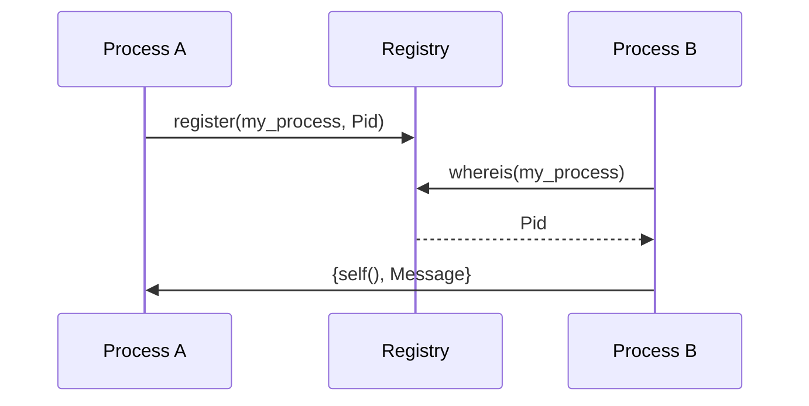

## 7.12 Registry and Named Processes

In Erlang, processes are the fundamental units of concurrency. They are lightweight, isolated, and communicate with each other through message passing. While each process is identified by a unique process identifier (PID), managing PIDs directly can become cumbersome, especially in larger systems. This is where the concept of registry and named processes comes into play, allowing developers to assign human-readable names to processes for easier communication and management.

### Understanding Process Registration

Process registration in Erlang involves associating a name with a process, making it easier to reference and communicate with that process. The Erlang runtime system provides built-in functions like `register/2` and `whereis/1` to facilitate this.

#### Using `register/2`

The `register/2` function is used to associate a name with a process. The syntax is straightforward:

```erlang
register(Name, Pid).
```

- **Name**: An atom representing the name you want to assign to the process.
- **Pid**: The process identifier of the process you want to register.

Once a process is registered, you can use its name instead of its PID to send messages or perform other operations.

#### Example: Registering a Process

Let's consider a simple example where we spawn a process and register it with a name:

```erlang
-module(named_process_example).
-export([start/0, loop/0]).

start() ->
    Pid = spawn(?MODULE, loop, []),
    register(my_process, Pid),
    io:format("Process registered with name ~p~n", [my_process]).

loop() ->
    receive
        {From, Message} ->
            io:format("Received message ~p from ~p~n", [Message, From]),
            loop()
    end.
```

In this example, we spawn a process running the `loop/0` function and register it with the name `my_process`. We can now send messages to this process using its registered name.

#### Using `whereis/1`

The `whereis/1` function is used to retrieve the PID of a registered process by its name. This is useful when you need to interact with a process but only have its name.

```erlang
Pid = whereis(my_process).
```

If the process is registered, `whereis/1` returns its PID; otherwise, it returns `undefined`.

### Trade-offs of Using Registered Names

While registering processes with names can simplify communication, it comes with certain trade-offs:

- **Global Namespace**: Registered names exist in a global namespace, meaning they must be unique across the entire Erlang node. This can lead to naming conflicts if not managed carefully.
- **Single Instance**: A registered name can only be associated with one process at a time. If a process dies and is restarted, it must be re-registered.
- **Overhead**: There is a slight overhead associated with maintaining the registry, although it is generally negligible.

### When to Use Named Processes

Named processes are particularly beneficial in scenarios where:

- **Singleton Processes**: You have processes that should only have a single instance, such as a server or a manager process.
- **Frequent Access**: The process is frequently accessed by multiple other processes, and using a name simplifies the code.
- **System Components**: Core components of your system, like a database connection pool or a logging service, can benefit from being named for easy access.

### Best Practices for Process Registration

To effectively use process registration in Erlang, consider the following best practices:

1. **Use Descriptive Names**: Choose meaningful and descriptive names for your processes to avoid confusion and conflicts.
2. **Handle Process Restarts**: Ensure that processes are re-registered after a restart, especially in fault-tolerant systems.
3. **Limit Registration**: Only register processes that truly benefit from being named. Overusing registration can lead to a cluttered namespace.
4. **Monitor Registered Processes**: Use process monitoring to detect when a registered process dies and take appropriate action.

### Code Example: Named Process Communication

Let's expand our previous example to demonstrate communication with a named process:

```erlang
-module(named_process_communication).
-export([start/0, send_message/1, loop/0]).

start() ->
    Pid = spawn(?MODULE, loop, []),
    register(my_process, Pid),
    io:format("Process registered with name ~p~n", [my_process]).

send_message(Message) ->
    case whereis(my_process) of
        undefined ->
            io:format("Process not found~n");
        Pid ->
            Pid ! {self(), Message},
            io:format("Message sent: ~p~n", [Message])
    end.

loop() ->
    receive
        {From, Message} ->
            io:format("Received message ~p from ~p~n", [Message, From]),
            loop()
    end.
```

In this example, we have a `send_message/1` function that sends a message to the registered process `my_process`. We use `whereis/1` to check if the process is registered before sending the message.

### Visualizing Process Registration

To better understand the concept of process registration and communication, let's visualize it using a sequence diagram:



**Diagram Description**: This sequence diagram illustrates the process of registering a process with a name and then using that name to send a message. Process A registers itself with the name `my_process`. Process B queries the registry to find the PID associated with `my_process` and then sends a message to Process A.

### Try It Yourself

To deepen your understanding, try modifying the code examples:

- **Experiment with Multiple Registrations**: Attempt to register multiple processes with the same name and observe the behavior.
- **Implement Process Monitoring**: Add process monitoring to detect when the registered process dies and automatically restart it.
- **Explore Naming Conflicts**: Create scenarios where naming conflicts occur and devise strategies to resolve them.

### References and Further Reading

- [Erlang Documentation on Process Registration](https://erlang.org/doc/man/erlang.html#register-2)
- [Erlang Programming: A Concurrent Approach to Software Development](https://www.oreilly.com/library/view/erlang-programming/9780596518189/)

### Knowledge Check

Before we conclude, let's reinforce what we've learned with a few questions:

- What are the benefits of using named processes in Erlang?
- How does the `register/2` function work, and what are its limitations?
- When should you avoid using process registration?

### Summary

In this section, we've explored the concept of registry and named processes in Erlang. We've learned how to use `register/2` and `whereis/1` to simplify process communication and management. By understanding the trade-offs and best practices, you can effectively use named processes to build robust and maintainable Erlang applications.

Remember, this is just the beginning. As you progress, you'll discover more advanced techniques and patterns in Erlang. Keep experimenting, stay curious, and enjoy the journey!

## Quiz: Registry and Named Processes



### What function is used to register a process with a name in Erlang?

- [x] register/2
- [ ] whereis/1
- [ ] spawn/1
- [ ] link/1

> **Explanation:** The `register/2` function is used to associate a name with a process in Erlang.

### What does the `whereis/1` function return if a process is not registered?

- [x] undefined
- [ ] an empty list
- [ ] an error
- [ ] the PID of the calling process

> **Explanation:** If a process is not registered, `whereis/1` returns `undefined`.

### Which of the following is a trade-off of using registered names?

- [x] Global namespace conflicts
- [ ] Increased memory usage
- [ ] Slower message passing
- [ ] Reduced process isolation

> **Explanation:** Registered names exist in a global namespace, which can lead to naming conflicts.

### When are named processes particularly beneficial?

- [x] Singleton processes
- [ ] Temporary processes
- [ ] Processes with short lifespans
- [ ] Processes that do not communicate

> **Explanation:** Named processes are beneficial for singleton processes that need to be easily accessible.

### What should you do after a registered process restarts?

- [x] Re-register the process
- [ ] Change its PID
- [ ] Avoid using registered names
- [ ] Use a different name

> **Explanation:** After a registered process restarts, it should be re-registered to maintain its name.

### What is a best practice for naming processes?

- [x] Use descriptive names
- [ ] Use random names
- [ ] Use numeric names
- [ ] Use short names

> **Explanation:** Descriptive names help avoid confusion and conflicts in the global namespace.

### What is the purpose of the `whereis/1` function?

- [x] To retrieve the PID of a registered process
- [ ] To spawn a new process
- [ ] To link two processes
- [ ] To terminate a process

> **Explanation:** `whereis/1` retrieves the PID of a process registered with a given name.

### What happens if you try to register two processes with the same name?

- [x] The second registration fails
- [ ] The first process is unregistered
- [ ] Both processes are registered
- [ ] An error is thrown

> **Explanation:** The second registration fails because names must be unique in the global namespace.

### What is a potential downside of overusing process registration?

- [x] Cluttered namespace
- [ ] Increased CPU usage
- [ ] Reduced fault tolerance
- [ ] Slower process creation

> **Explanation:** Overusing registration can lead to a cluttered namespace with many registered names.

### True or False: Registered names can be used across different Erlang nodes.

- [ ] True
- [x] False

> **Explanation:** Registered names are local to the Erlang node and cannot be used across different nodes.


