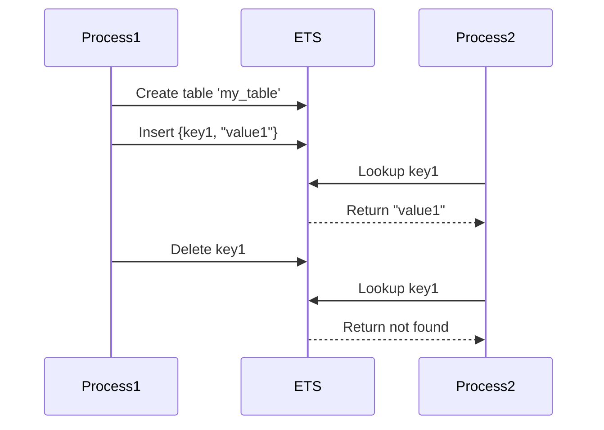

## 7.13 ETS: In-Memory Storage Patterns

Erlang Term Storage (ETS) is a powerful feature of the Erlang programming language, providing a mechanism for storing large amounts of data in-memory. ETS tables are capable of holding millions of records and offer constant time complexity for data access, making them ideal for scenarios requiring high-speed data retrieval and manipulation. In this section, we will delve into the capabilities of ETS, explore patterns for using ETS effectively, and discuss considerations for concurrency and data consistency.

### Understanding ETS

ETS is a built-in feature of Erlang that allows processes to store data in-memory. Unlike process dictionaries, ETS tables are not bound to a single process and can be accessed by multiple processes concurrently. This makes ETS an excellent choice for shared data storage.

#### Key Features of ETS

- **In-Memory Storage**: ETS tables store data in RAM, providing fast access times.
- **Concurrent Access**: Multiple processes can read from and write to ETS tables concurrently.
- **Data Types**: ETS supports various data types, including tuples, lists, and maps.
- **Table Types**: ETS offers different table types, such as set, ordered_set, bag, and duplicate_bag, each with unique characteristics.

### Creating and Accessing ETS Tables

To utilize ETS, you first need to create a table. Let's explore how to create and access ETS tables with some code examples.

#### Creating an ETS Table

```erlang
% Create a new ETS table with the name 'my_table'
Table = ets:new(my_table, [set, public, named_table]).

% Explanation:
% - 'set': Specifies the table type as a set, where each key is unique.
% - 'public': Allows any process to read from and write to the table.
% - 'named_table': Allows the table to be accessed by its name.
```

#### Inserting Data into an ETS Table

```erlang
% Insert a tuple into the ETS table
ets:insert(my_table, {key1, "value1"}).

% Insert another tuple
ets:insert(my_table, {key2, "value2"}).
```

#### Retrieving Data from an ETS Table

```erlang
% Retrieve a value by key
case ets:lookup(my_table, key1) of
    [{key1, Value}] -> io:format("Value: ~p~n", [Value]);
    [] -> io:format("Key not found~n")
end.
```

#### Deleting Data from an ETS Table

```erlang
% Delete a key-value pair
ets:delete(my_table, key1).
```

### ETS Patterns: Caching and Shared Data Storage

ETS is often used for caching and shared data storage in Erlang applications. Let's explore some common patterns.

#### Caching with ETS

Caching is a technique used to store frequently accessed data in memory to reduce access times. ETS is well-suited for caching due to its fast access times and ability to handle large datasets.

##### Example: Implementing a Simple Cache

```erlang
-module(simple_cache).
-export([start/0, get/1, put/2]).

start() ->
    ets:new(cache, [set, public, named_table]).

get(Key) ->
    case ets:lookup(cache, Key) of
        [{Key, Value}] -> {ok, Value};
        [] -> not_found
    end.

put(Key, Value) ->
    ets:insert(cache, {Key, Value}).
```

In this example, we define a simple cache module with functions to start the cache, retrieve a value by key, and insert a key-value pair.

#### Shared Data Storage

ETS can be used to store data that needs to be accessed by multiple processes. This is particularly useful in concurrent applications where processes need to share state.

##### Example: Shared Counter

```erlang
-module(shared_counter).
-export([start/0, increment/0, get_count/0]).

start() ->
    ets:new(counter, [set, public, named_table]),
    ets:insert(counter, {count, 0}).

increment() ->
    ets:update_counter(counter, count, {2, 1}).

get_count() ->
    case ets:lookup(counter, count) of
        [{count, Value}] -> Value;
        [] -> 0
    end.
```

In this example, we create a shared counter that can be incremented by multiple processes. The `increment/0` function uses `ets:update_counter/3` to atomically increment the counter.

### Considerations for Concurrency and Data Consistency

When using ETS in concurrent applications, it's important to consider data consistency and potential race conditions.

#### Concurrency Considerations

- **Atomic Operations**: ETS provides atomic operations like `ets:update_counter/3` to ensure data consistency.
- **Locking**: While ETS itself does not provide locking mechanisms, you can implement your own locking strategies if needed.

#### Data Consistency

- **Read-Write Conflicts**: Be mindful of read-write conflicts when multiple processes access the same data.
- **Consistency Models**: Consider the consistency model of your application and how ETS fits into it.

### Visualizing ETS Operations

To better understand how ETS operations work, let's visualize the process using a sequence diagram.



This diagram illustrates the interaction between processes and an ETS table, showing how data is inserted, retrieved, and deleted.

### Try It Yourself

Now that we've covered the basics of ETS, try experimenting with the code examples. Modify the cache or shared counter examples to suit your needs. For instance, you could:

- Add expiration logic to the cache.
- Implement a more complex data structure using ETS.

### References and Further Reading

- [Erlang Documentation on ETS](https://www.erlang.org/doc/man/ets.html)
- [Learn You Some Erlang for Great Good! - ETS](http://learnyousomeerlang.com/ets)

### Knowledge Check

Before we wrap up, let's reinforce what we've learned with a few questions:

1. What are the different types of ETS tables, and how do they differ?
2. How can you ensure data consistency when multiple processes access an ETS table?
3. What are some common use cases for ETS in Erlang applications?

### Summary

In this section, we've explored ETS, a powerful in-memory storage mechanism in Erlang. We've covered how to create and access ETS tables, discussed patterns for caching and shared data storage, and considered concurrency and data consistency. Remember, ETS is a versatile tool that can greatly enhance the performance and scalability of your Erlang applications. Keep experimenting, stay curious, and enjoy the journey!

## Quiz: ETS: In-Memory Storage Patterns



### What is ETS in Erlang?

- [x] An in-memory storage system
- [ ] A file storage system
- [ ] A database management system
- [ ] A network protocol

> **Explanation:** ETS stands for Erlang Term Storage, which is an in-memory storage system.

### Which of the following is a feature of ETS?

- [x] Concurrent access by multiple processes
- [ ] Persistent storage on disk
- [ ] Built-in encryption
- [ ] Automatic data replication

> **Explanation:** ETS allows concurrent access by multiple processes, making it suitable for shared data storage.

### What is the purpose of the `named_table` option in ETS?

- [x] To allow the table to be accessed by its name
- [ ] To encrypt the table data
- [ ] To make the table persistent
- [ ] To enable automatic backups

> **Explanation:** The `named_table` option allows the ETS table to be accessed by its name.

### How can you ensure atomic updates in ETS?

- [x] Use `ets:update_counter/3`
- [ ] Use `ets:lock/1`
- [ ] Use `ets:transaction/1`
- [ ] Use `ets:sync/1`

> **Explanation:** `ets:update_counter/3` is an atomic operation that ensures data consistency.

### What is a common use case for ETS?

- [x] Caching frequently accessed data
- [ ] Storing large files
- [ ] Managing user sessions on disk
- [ ] Encrypting network traffic

> **Explanation:** ETS is commonly used for caching frequently accessed data due to its fast access times.

### Which ETS table type ensures unique keys?

- [x] set
- [ ] bag
- [ ] duplicate_bag
- [ ] ordered_set

> **Explanation:** The `set` table type ensures that each key is unique.

### What is the result of `ets:lookup(my_table, key1)` if `key1` does not exist?

- [x] An empty list
- [ ] An error
- [ ] A tuple with `undefined`
- [ ] A null value

> **Explanation:** If the key does not exist, `ets:lookup/2` returns an empty list.

### What does `ets:delete(my_table, key1)` do?

- [x] Removes the key-value pair associated with `key1`
- [ ] Deletes the entire table
- [ ] Clears all entries in the table
- [ ] Renames the key

> **Explanation:** `ets:delete/2` removes the key-value pair associated with the specified key.

### Which option allows any process to read from and write to an ETS table?

- [x] public
- [ ] private
- [ ] protected
- [ ] secure

> **Explanation:** The `public` option allows any process to read from and write to the table.

### True or False: ETS tables are automatically persisted to disk.

- [ ] True
- [x] False

> **Explanation:** ETS tables are in-memory and are not automatically persisted to disk.


