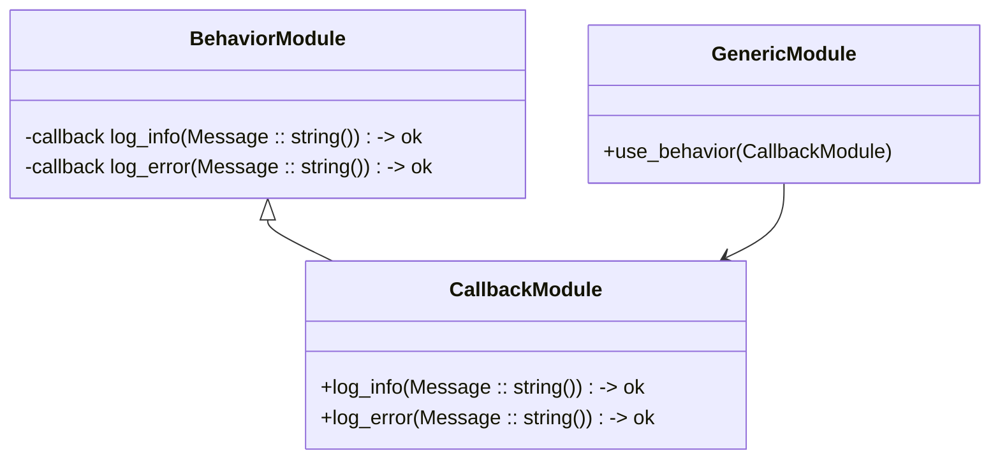

## 7.14 Using Behaviors for Code Reuse

In Erlang, behaviors are a powerful tool for promoting code reuse and enforcing consistent patterns across modules. They provide a way to define a set of functions that a module must implement, ensuring that different modules adhere to a common interface. This section will delve into the concept of behaviors, how to define custom behaviors, and the advantages of using them in your Erlang applications.

### Understanding Behaviors in Erlang

Behaviors in Erlang are akin to interfaces in object-oriented programming languages. They define a set of callback functions that a module must implement. This allows developers to create generic components that can be customized by implementing specific behaviors.

#### Key Concepts

- **Callback Module**: A module that implements the functions specified by a behavior.
- **Behavior Module**: A module that defines the behavior, including the list of callback functions.
- **Generic Module**: A module that uses the behavior to perform operations, relying on the callback module for specific implementations.

### Defining Custom Behaviors

To define a custom behavior in Erlang, you need to create a behavior module that specifies the required callback functions. Here's a step-by-step guide:

1. **Define the Behavior Module**: Create a module that specifies the callback functions using the `-callback` attribute.

2. **Implement the Callback Module**: Create a module that implements the functions defined in the behavior.

3. **Use the Behavior**: In the callback module, specify the behavior using the `-behaviour` attribute.

#### Example: Creating a Custom Logger Behavior

Let's create a custom logger behavior that requires two functions: `log_info/1` and `log_error/1`.

```erlang
%% logger.erl
-module(logger).
-behaviour_info(callbacks) -> [{log_info, 1}, {log_error, 1}].

%% Define the behavior
-callback log_info(Message :: string()) -> ok.
-callback log_error(Message :: string()) -> ok.
```

Now, let's implement a module that uses this behavior:

```erlang
%% console_logger.erl
-module(console_logger).
-behaviour(logger).

%% Implement the callback functions
-export([log_info/1, log_error/1]).

log_info(Message) ->
    io:format("INFO: ~s~n", [Message]).

log_error(Message) ->
    io:format("ERROR: ~s~n", [Message]).
```

### Enforcing Callback Interfaces

Behaviors enforce callback interfaces by requiring that all specified functions are implemented in the callback module. This ensures consistency and reduces errors, as the compiler will generate warnings if any required function is missing.

#### Benefits of Using Behaviors

- **Consistency**: Behaviors ensure that all modules implementing the behavior adhere to the same interface.
- **Code Reuse**: By defining common patterns as behaviors, you can reuse code across different modules.
- **Maintainability**: Changes to the behavior interface are automatically propagated to all implementing modules.

### Encouraging Consistent Patterns Across Modules

Behaviors are particularly useful for implementing consistent patterns across modules. For example, in a web server application, you might define a behavior for handling HTTP requests, ensuring that all request handlers implement the same set of functions.

#### Example: HTTP Request Handler Behavior

```erlang
%% http_handler.erl
-module(http_handler).
-behaviour_info(callbacks) -> [{handle_request, 1}].

%% Define the behavior
-callback handle_request(Request :: map()) -> Response :: map().
```

Implementing a module that uses this behavior:

```erlang
%% my_http_handler.erl
-module(my_http_handler).
-behaviour(http_handler).

%% Implement the callback function
-export([handle_request/1]).

handle_request(Request) ->
    % Process the request and return a response
    #{status => 200, body => <<"Hello, World!">>}.
```

### Visualizing Behaviors in Erlang

To better understand how behaviors work, let's visualize the relationship between behavior modules, callback modules, and generic modules using a Mermaid.js diagram.



### Try It Yourself

To get hands-on experience with behaviors, try modifying the `console_logger` module to log messages to a file instead of the console. This exercise will help you understand how behaviors promote code reuse and flexibility.

### References and Further Reading

- [Erlang Behaviors Documentation](https://www.erlang.org/doc/design_principles/des_princ.html)
- [Erlang Programming: A Concurrent Approach to Software Development](https://www.amazon.com/Erlang-Programming-Francesco-Cesarini/dp/0596518188)

### Knowledge Check

- What is the primary purpose of behaviors in Erlang?
- How do behaviors enforce callback interfaces?
- What are the benefits of using behaviors for code reuse?

### Summary

Behaviors in Erlang are a powerful tool for promoting code reuse and enforcing consistent patterns across modules. By defining a set of callback functions, behaviors ensure that different modules adhere to a common interface, improving maintainability and reducing errors. As you continue to develop Erlang applications, consider using behaviors to create reusable and consistent components.

## Quiz: Using Behaviors for Code Reuse



### What is the primary purpose of behaviors in Erlang?

- [x] To enforce a common interface across modules
- [ ] To optimize performance
- [ ] To manage memory usage
- [ ] To handle concurrency

> **Explanation:** Behaviors enforce a common interface across modules by defining a set of callback functions that must be implemented.

### How do behaviors enforce callback interfaces?

- [x] By requiring modules to implement specified functions
- [ ] By optimizing code execution
- [ ] By managing memory allocation
- [ ] By handling process communication

> **Explanation:** Behaviors enforce callback interfaces by requiring that all specified functions are implemented in the callback module.

### What is a callback module in Erlang?

- [x] A module that implements the functions specified by a behavior
- [ ] A module that defines the behavior
- [ ] A module that manages process communication
- [ ] A module that handles memory allocation

> **Explanation:** A callback module implements the functions specified by a behavior, adhering to the defined interface.

### What is a behavior module in Erlang?

- [x] A module that defines the behavior and its callback functions
- [ ] A module that implements the behavior
- [ ] A module that manages process communication
- [ ] A module that handles memory allocation

> **Explanation:** A behavior module defines the behavior, including the list of callback functions that must be implemented.

### What are the benefits of using behaviors for code reuse?

- [x] Consistency across modules
- [x] Improved maintainability
- [ ] Increased memory usage
- [ ] Reduced concurrency

> **Explanation:** Behaviors promote consistency across modules and improve maintainability by enforcing a common interface.

### How can behaviors reduce errors in Erlang applications?

- [x] By ensuring all required functions are implemented
- [ ] By optimizing code execution
- [ ] By managing memory allocation
- [ ] By handling process communication

> **Explanation:** Behaviors reduce errors by ensuring that all required functions are implemented, preventing missing or incorrect implementations.

### What is a generic module in Erlang?

- [x] A module that uses the behavior to perform operations
- [ ] A module that defines the behavior
- [ ] A module that implements the behavior
- [ ] A module that manages process communication

> **Explanation:** A generic module uses the behavior to perform operations, relying on the callback module for specific implementations.

### How do behaviors promote code reuse?

- [x] By defining common patterns as behaviors
- [ ] By optimizing code execution
- [ ] By managing memory allocation
- [ ] By handling process communication

> **Explanation:** Behaviors promote code reuse by defining common patterns that can be implemented across different modules.

### What is the role of the `-behaviour` attribute in Erlang?

- [x] To specify the behavior a module implements
- [ ] To define the behavior
- [ ] To manage process communication
- [ ] To handle memory allocation

> **Explanation:** The `-behaviour` attribute specifies the behavior that a module implements, ensuring it adheres to the defined interface.

### True or False: Behaviors in Erlang are similar to interfaces in object-oriented programming.

- [x] True
- [ ] False

> **Explanation:** True. Behaviors in Erlang are similar to interfaces in object-oriented programming, as they define a set of functions that must be implemented.



Remember, this is just the beginning. As you progress, you'll discover more ways to leverage behaviors for creating robust and maintainable Erlang applications. Keep experimenting, stay curious, and enjoy the journey!
