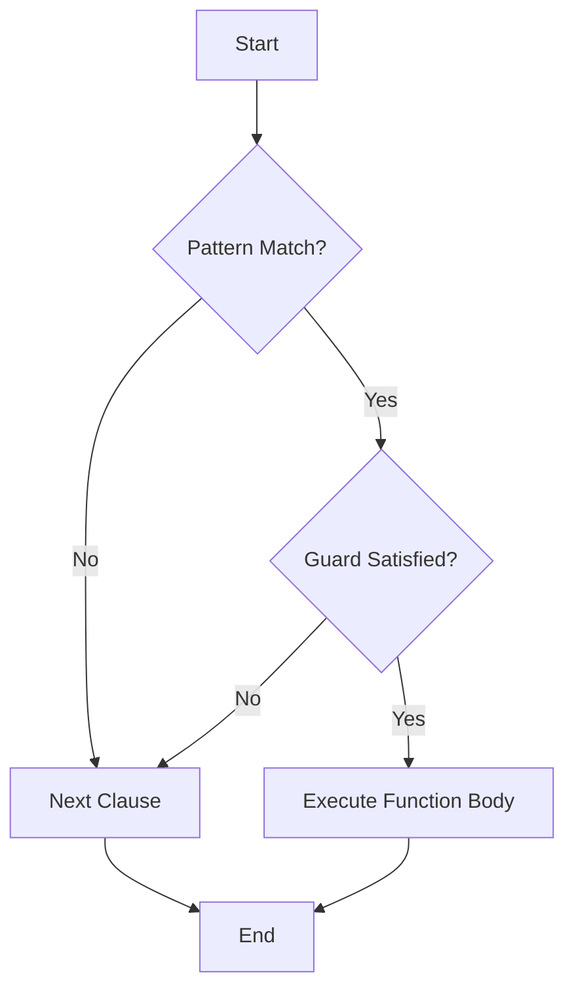

## 7.3 Utilizing Guards for Increased Clarity

In Erlang, pattern matching is a powerful feature that allows developers to destructure data structures and bind variables in a concise and readable manner. However, there are situations where pattern matching alone is insufficient to express complex conditions. This is where guards come into play. Guards provide a mechanism to introduce additional constraints in pattern matching, enhancing clarity and precision in your code.

### What Are Guards in Erlang?

Guards are boolean expressions used in conjunction with pattern matching to impose additional constraints on the patterns. They allow you to specify conditions that must be met for a pattern to be considered a match. Guards are used in function clauses, case expressions, and receive statements, providing a way to refine pattern matching logic.

#### Syntax of Guards

Guards are specified using the `when` keyword, followed by a boolean expression. The syntax for guards in function clauses is as follows:

```erlang
function_name(Pattern1, Pattern2) when Guard1, Guard2, ... -> 
    % Function body
```

In case expressions, guards are used like this:

```erlang
case Expression of
    Pattern1 when Guard1, Guard2, ... -> 
        % Code block
    Pattern2 -> 
        % Code block
end
```

### Using Guards in Function Clauses

Guards are particularly useful in function clauses, where they can be used to differentiate between different cases based on more than just the structure of the data. Let's explore some examples.

#### Example 1: Using Guards to Differentiate Cases

Consider a function that calculates the factorial of a number. We can use guards to ensure that the input is a non-negative integer:

```erlang
factorial(0) -> 1;
factorial(N) when N > 0, is_integer(N) -> N * factorial(N - 1).
```

In this example, the guard `N > 0, is_integer(N)` ensures that the function only matches when `N` is a positive integer. This prevents the function from being called with invalid inputs.

#### Example 2: Guards for Type Checking

Guards can also be used for type checking. Suppose we have a function that processes different types of data:

```erlang
process_data(Data) when is_list(Data) -> 
    % Process list
    lists:map(fun(X) -> X * 2 end, Data);
process_data(Data) when is_integer(Data) -> 
    % Process integer
    Data * 2;
process_data(Data) when is_float(Data) -> 
    % Process float
    Data * 2.0.
```

Here, guards like `is_list(Data)`, `is_integer(Data)`, and `is_float(Data)` are used to ensure that the function processes data according to its type.

### Using Guards in Case Expressions

Guards are equally useful in case expressions, where they allow you to refine the conditions under which different branches are executed.

#### Example 3: Guards in Case Expressions

Let's consider a case expression that handles different shapes and calculates their area:

```erlang
calculate_area(Shape) ->
    case Shape of
        {circle, Radius} when Radius > 0 -> 
            math:pi() * Radius * Radius;
        {rectangle, Width, Height} when Width > 0, Height > 0 -> 
            Width * Height;
        {triangle, Base, Height} when Base > 0, Height > 0 -> 
            0.5 * Base * Height;
        _ -> 
            error("Invalid shape")
    end.
```

In this example, guards are used to ensure that the dimensions of the shapes are positive before calculating the area.

### Common Guard Expressions

Erlang provides a variety of built-in guard expressions that can be used to perform common checks. Here are some of the most frequently used guard expressions:

- **Type Checks**: `is_atom/1`, `is_binary/1`, `is_boolean/1`, `is_float/1`, `is_function/1`, `is_integer/1`, `is_list/1`, `is_map/1`, `is_number/1`, `is_pid/1`, `is_port/1`, `is_reference/1`, `is_tuple/1`.
- **Comparison Operators**: `==`, `/=`, `=<`, `<`, `>=`, `>`.
- **Arithmetic Operators**: `+`, `-`, `*`, `/`.
- **Boolean Operators**: `and`, `or`, `not`.
- **Other Useful Guards**: `length/1`, `size/1`, `element/2`, `hd/1`, `tl/1`.

### Best Practices for Using Guards

When using guards, it's important to follow best practices to ensure that your code remains clear and maintainable.

#### Best Practice 1: Keep Guards Simple

Guards should be simple and easy to understand. Avoid complex expressions that can make the code difficult to read. If a guard becomes too complex, consider refactoring the logic into a separate function.

#### Best Practice 2: Use Guards for Validation

Guards are an excellent tool for input validation. Use them to ensure that function arguments meet the required conditions before proceeding with the function logic.

#### Best Practice 3: Combine Guards with Pattern Matching

Guards are most effective when used in combination with pattern matching. Use pattern matching to destructure data and guards to impose additional constraints.

#### Best Practice 4: Be Aware of Guard Limitations

Guards have some limitations. For example, they cannot call user-defined functions, and they are limited to a predefined set of expressions. Be mindful of these limitations when designing your code.

### Limitations of Guards

While guards are powerful, they do have some limitations that you should be aware of:

- **No User-Defined Functions**: Guards cannot call user-defined functions. They are limited to a predefined set of expressions.
- **Limited to Boolean Expressions**: Guards must evaluate to a boolean value. They cannot perform complex computations or side effects.
- **No Side Effects**: Guards cannot have side effects, such as modifying state or performing I/O operations.

### Visualizing Guards in Erlang

To better understand how guards work in Erlang, let's visualize the flow of a function with guards using a flowchart.



**Figure 1**: Flowchart illustrating the use of guards in a function clause. The function first attempts to match the pattern. If the pattern matches, it evaluates the guard. If the guard is satisfied, it executes the function body; otherwise, it moves to the next clause.

### Try It Yourself

To deepen your understanding of guards, try modifying the examples provided in this section. Experiment with different guard expressions and see how they affect the behavior of the code. For instance, try adding additional guards to the `calculate_area` function to handle more complex shapes or conditions.

### References and Further Reading

- [Erlang Guards Documentation](https://www.erlang.org/doc/reference_manual/expressions.html#guards)
- [Learn You Some Erlang for Great Good!](http://learnyousomeerlang.com/syntax-in-functions#guards)
- [Erlang Programming: A Concurrent Approach to Software Development](https://www.oreilly.com/library/view/erlang-programming/9780596518189/)

### Knowledge Check

Before moving on, let's summarize the key takeaways from this section:

- Guards are used to impose additional constraints on pattern matching.
- They are specified using the `when` keyword followed by a boolean expression.
- Guards are used in function clauses, case expressions, and receive statements.
- Common guard expressions include type checks, comparison operators, and boolean operators.
- Guards cannot call user-defined functions and are limited to boolean expressions.

Remember, mastering guards will enhance the clarity and precision of your Erlang code. Keep experimenting, stay curious, and enjoy the journey!

## Quiz: Utilizing Guards for Increased Clarity



### What is the primary purpose of guards in Erlang?

- [x] To impose additional constraints on pattern matching
- [ ] To perform complex computations
- [ ] To modify state
- [ ] To handle I/O operations

> **Explanation:** Guards are used to impose additional constraints on pattern matching, ensuring that only patterns meeting specific conditions are matched.

### Which keyword is used to specify guards in Erlang?

- [ ] if
- [x] when
- [ ] guard
- [ ] case

> **Explanation:** The `when` keyword is used to specify guards in Erlang, allowing you to add conditions to pattern matching.

### Can guards call user-defined functions in Erlang?

- [ ] Yes
- [x] No

> **Explanation:** Guards cannot call user-defined functions. They are limited to a predefined set of expressions.

### What type of expressions can be used in guards?

- [x] Boolean expressions
- [ ] Complex computations
- [ ] Side-effect operations
- [ ] I/O operations

> **Explanation:** Guards must evaluate to boolean expressions and cannot perform complex computations or side-effect operations.

### Which of the following is a common guard expression for type checking?

- [x] is_integer/1
- [ ] length/1
- [ ] element/2
- [ ] hd/1

> **Explanation:** `is_integer/1` is a common guard expression used for type checking in Erlang.

### What happens if a guard condition is not satisfied in a function clause?

- [ ] The function returns an error
- [ ] The function executes with default values
- [x] The next clause is evaluated
- [ ] The function terminates

> **Explanation:** If a guard condition is not satisfied, the next clause is evaluated to find a matching pattern.

### Can guards have side effects, such as modifying state or performing I/O operations?

- [ ] Yes
- [x] No

> **Explanation:** Guards cannot have side effects. They are limited to boolean expressions without side effects.

### Which of the following is a limitation of guards in Erlang?

- [x] They cannot call user-defined functions
- [ ] They can perform complex computations
- [ ] They can modify state
- [ ] They can handle I/O operations

> **Explanation:** A limitation of guards is that they cannot call user-defined functions.

### What is the result of using a guard that evaluates to false in a case expression?

- [ ] The case expression returns an error
- [ ] The case expression executes with default values
- [x] The next pattern is evaluated
- [ ] The case expression terminates

> **Explanation:** If a guard evaluates to false in a case expression, the next pattern is evaluated.

### True or False: Guards can be used in receive statements in Erlang.

- [x] True
- [ ] False

> **Explanation:** Guards can be used in receive statements to impose additional constraints on message patterns.


