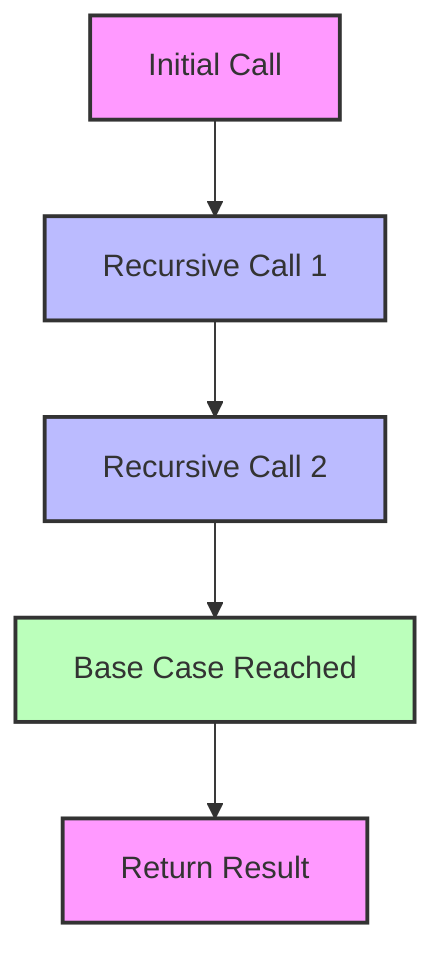

## 7.4 Tail Call Optimization in Recursive Functions

In the world of functional programming, recursion is a fundamental concept. Erlang, being a functional language, heavily relies on recursion for iteration. However, recursion can lead to stack overflow if not handled properly. This is where **Tail Call Optimization (TCO)** comes into play. In this section, we will delve into the intricacies of TCO, explore advanced examples of tail-recursive functions, and learn how to refactor non-tail-recursive code into tail-recursive form. We'll also highlight the performance benefits and stack safety that TCO provides.

### Understanding Tail Call Optimization

**Tail Call Optimization** is a technique used by compilers and interpreters to optimize recursive function calls. A **tail call** occurs when a function calls another function as its last action before returning a result. In such cases, the current function's stack frame is no longer needed, and it can be replaced by the called function's stack frame. This optimization allows recursive functions to execute in constant stack space, preventing stack overflow and improving performance.

#### Key Concepts

- **Tail Call**: A function call is a tail call if it is the last operation performed before the function returns.
- **Tail Recursion**: A recursive function is tail-recursive if the recursive call is a tail call.
- **Stack Frame**: A data structure that contains information about function calls, including local variables and return addresses.

### Why Tail Call Optimization Matters

Tail call optimization is crucial for writing efficient recursive functions in Erlang. Without TCO, each recursive call would add a new stack frame, leading to increased memory usage and potential stack overflow. TCO allows recursive functions to run in constant stack space, making them as efficient as iterative loops.

### Advanced Examples of Tail-Recursive Functions

Let's explore some advanced examples of tail-recursive functions in Erlang. We'll start with a simple example and gradually move to more complex scenarios.

#### Example 1: Calculating Factorials

A classic example of recursion is calculating the factorial of a number. Here's how you can implement a tail-recursive version of the factorial function in Erlang:

```erlang
-module(factorial).
-export([factorial/1]).

factorial(N) ->
    factorial(N, 1).

factorial(0, Acc) ->
    Acc;
factorial(N, Acc) when N > 0 ->
    factorial(N - 1, N * Acc).
```

**Explanation**:
- We use an accumulator (`Acc`) to store the intermediate results.
- The recursive call `factorial(N - 1, N * Acc)` is a tail call because it's the last operation before returning.

#### Example 2: Fibonacci Sequence

The Fibonacci sequence is another common example. Here's a tail-recursive version:

```erlang
-module(fibonacci).
-export([fibonacci/1]).

fibonacci(N) ->
    fibonacci(N, 0, 1).

fibonacci(0, A, _) ->
    A;
fibonacci(N, A, B) when N > 0 ->
    fibonacci(N - 1, B, A + B).
```

**Explanation**:
- We use two accumulators (`A` and `B`) to store the last two Fibonacci numbers.
- The recursive call `fibonacci(N - 1, B, A + B)` is a tail call.

### Refactoring Non-Tail-Recursive Code

Not all recursive functions are tail-recursive by default. Let's learn how to refactor non-tail-recursive code into tail-recursive form.

#### Example: Sum of a List

Consider a non-tail-recursive function that calculates the sum of a list:

```erlang
sum([]) -> 0;
sum([H | T]) -> H + sum(T).
```

This function is not tail-recursive because the addition operation `H + sum(T)` is performed after the recursive call. Let's refactor it into a tail-recursive version:

```erlang
sum(List) ->
    sum(List, 0).

sum([], Acc) ->
    Acc;
sum([H | T], Acc) ->
    sum(T, Acc + H).
```

**Explanation**:
- We introduce an accumulator (`Acc`) to store the intermediate sum.
- The recursive call `sum(T, Acc + H)` is a tail call.

### Performance Benefits and Stack Safety

Tail call optimization provides significant performance benefits and ensures stack safety:

- **Constant Stack Space**: Tail-recursive functions use constant stack space, preventing stack overflow.
- **Improved Performance**: By eliminating unnecessary stack frames, TCO reduces memory usage and improves execution speed.
- **Scalability**: Tail-recursive functions can handle large inputs without running into stack limitations.

### Visualizing Tail Call Optimization

To better understand how tail call optimization works, let's visualize the process using a diagram.



**Diagram Explanation**:
- The diagram illustrates the flow of a tail-recursive function.
- Each recursive call replaces the previous stack frame, maintaining constant stack space.

### Try It Yourself

Now that we've explored tail call optimization, it's time to experiment with the code examples. Try modifying the functions to handle different scenarios or inputs. For instance, you can:

- Implement a tail-recursive version of a function that calculates the greatest common divisor (GCD) of two numbers.
- Refactor a non-tail-recursive function that reverses a list into a tail-recursive form.

### Knowledge Check

Before we conclude, let's reinforce our understanding with a few questions:

- What is a tail call, and why is it important for recursion?
- How does tail call optimization improve performance and stack safety?
- Can you identify a non-tail-recursive function and refactor it into a tail-recursive form?

### Embrace the Journey

Remember, mastering tail call optimization is just one step in your Erlang journey. As you continue to explore functional programming, you'll discover more powerful techniques and patterns. Keep experimenting, stay curious, and enjoy the process!

### Summary

In this section, we've explored the importance of tail call optimization in Erlang. We've learned how to implement tail-recursive functions, refactor non-tail-recursive code, and understand the performance benefits of TCO. By leveraging tail call optimization, you can write efficient, scalable, and stack-safe recursive functions in Erlang.

## Quiz: Tail Call Optimization in Recursive Functions



### What is a tail call in the context of recursion?

- [x] A function call that is the last operation before returning a result
- [ ] A function call that occurs at the beginning of a function
- [ ] A function call that is nested within another function call
- [ ] A function call that does not return any value

> **Explanation:** A tail call is a function call that is the last operation performed before the function returns a result, allowing for tail call optimization.

### Why is tail call optimization important in Erlang?

- [x] It allows recursive functions to execute in constant stack space
- [ ] It increases the number of stack frames used by a function
- [ ] It makes functions run slower
- [ ] It is not important in Erlang

> **Explanation:** Tail call optimization allows recursive functions to run in constant stack space, preventing stack overflow and improving performance.

### How can you refactor a non-tail-recursive function into a tail-recursive form?

- [x] By introducing an accumulator to store intermediate results
- [ ] By removing all recursive calls
- [ ] By adding more stack frames
- [ ] By using global variables

> **Explanation:** Introducing an accumulator helps store intermediate results, making the recursive call a tail call.

### What is the primary benefit of tail call optimization?

- [x] Preventing stack overflow
- [ ] Increasing memory usage
- [ ] Slowing down function execution
- [ ] Adding more complexity to the code

> **Explanation:** Tail call optimization prevents stack overflow by allowing recursive functions to execute in constant stack space.

### Which of the following is a tail-recursive version of the sum function?

- [x] `sum([], Acc) -> Acc; sum([H | T], Acc) -> sum(T, Acc + H).`
- [ ] `sum([]) -> 0; sum([H | T]) -> H + sum(T).`
- [ ] `sum(List) -> lists:sum(List).`
- [ ] `sum([H | T]) -> sum(T) + H.`

> **Explanation:** The first option is a tail-recursive version using an accumulator to store the intermediate sum.

### What is a stack frame?

- [x] A data structure containing information about function calls
- [ ] A function that executes in constant time
- [ ] A variable used to store intermediate results
- [ ] A loop that iterates over a list

> **Explanation:** A stack frame is a data structure that contains information about function calls, including local variables and return addresses.

### How does tail call optimization affect memory usage?

- [x] It reduces memory usage by eliminating unnecessary stack frames
- [ ] It increases memory usage by adding more stack frames
- [ ] It has no effect on memory usage
- [ ] It doubles the memory usage

> **Explanation:** Tail call optimization reduces memory usage by eliminating unnecessary stack frames, allowing recursive functions to run efficiently.

### What is the role of an accumulator in a tail-recursive function?

- [x] To store intermediate results and make the recursive call a tail call
- [ ] To increase the number of recursive calls
- [ ] To slow down the function execution
- [ ] To add more complexity to the code

> **Explanation:** An accumulator stores intermediate results, making the recursive call a tail call and enabling tail call optimization.

### Can tail call optimization be applied to non-recursive functions?

- [ ] Yes
- [x] No

> **Explanation:** Tail call optimization is specifically used for optimizing recursive functions by replacing stack frames.

### True or False: Tail call optimization is only applicable to functional programming languages.

- [ ] True
- [x] False

> **Explanation:** While tail call optimization is common in functional programming languages, it can also be applied in other languages that support it.




