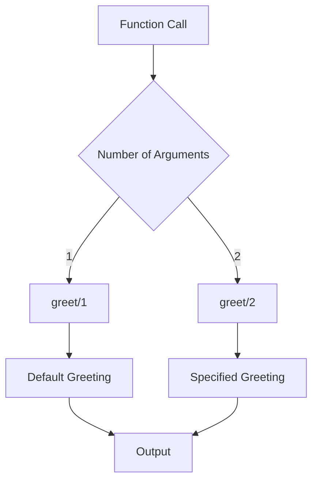

## 7.5 Default Arguments and Optional Parameters

In this section, we delve into the concept of default arguments and optional parameters in Erlang. While Erlang does not natively support default arguments as seen in some other programming languages, we can employ idiomatic patterns to achieve similar functionality. This guide will walk you through the techniques to simulate default arguments, handle variable numbers of arguments, and discuss the implications for function interfaces and documentation.

### Understanding the Challenge

Erlang, being a functional programming language, does not provide built-in support for default arguments in the way that languages like Python or JavaScript do. In those languages, you can specify default values for function parameters directly in the function signature. However, in Erlang, we need to use different strategies to achieve similar behavior.

### Simulating Default Arguments with Function Overloading

One of the most common patterns to simulate default arguments in Erlang is through function overloading. By defining multiple versions of a function with different arities, we can provide default values for some parameters.

#### Example: Function Overloading for Default Arguments

Let's consider a simple example where we want to define a function `greet/2` that takes a name and a greeting message. We want the greeting message to default to "Hello" if not provided.

```erlang
-module(default_args).
-export([greet/1, greet/2]).

% Function with default greeting
greet(Name) ->
    greet(Name, "Hello").

% Function with specified greeting
greet(Name, Greeting) ->
    io:format("~s, ~s!~n", [Greeting, Name]).
```

In this example, we define two versions of the `greet` function. The `greet/1` function calls `greet/2` with a default greeting message. This pattern allows us to simulate default arguments by providing a fallback implementation.

### Handling Variable Numbers of Arguments

Erlang's pattern matching capabilities make it well-suited for handling functions with variable numbers of arguments. By using lists or tuples, we can pass a varying number of parameters to a function.

#### Example: Using Lists for Variable Arguments

Suppose we want to create a function `sum/1` that can take any number of integers and return their sum. We can achieve this using a list to represent the arguments.

```erlang
-module(variable_args).
-export([sum/1]).

% Sum a list of numbers
sum(Numbers) when is_list(Numbers) ->
    lists:sum(Numbers).
```

In this example, the `sum/1` function takes a list of numbers and uses the `lists:sum/1` function to calculate their sum. This approach allows us to handle a variable number of arguments by encapsulating them in a list.

### Implications for Function Interfaces and Documentation

When simulating default arguments and handling variable numbers of arguments, it's crucial to consider the implications for function interfaces and documentation. Clear and consistent documentation is essential to ensure that users of your functions understand how to use them correctly.

#### Documenting Function Interfaces

When documenting functions with simulated default arguments, it's important to specify the behavior of each version of the function. This includes detailing the default values and any constraints on the arguments.

For example, in the `greet/2` function, you should document that the `Greeting` parameter defaults to "Hello" if not provided. This helps users understand the expected behavior and avoid potential confusion.

#### Considerations for Function Interfaces

When designing function interfaces with optional parameters, consider the following:

- **Clarity**: Ensure that the function's behavior is clear and intuitive. Avoid overly complex interfaces that may confuse users.
- **Consistency**: Maintain consistency in how default arguments are handled across your codebase. This helps users develop a mental model of how your functions work.
- **Error Handling**: Consider how your functions handle invalid or unexpected input. Provide meaningful error messages or fallbacks where appropriate.

### Advanced Techniques for Default Arguments

Beyond function overloading and variable arguments, there are more advanced techniques for simulating default arguments in Erlang. These techniques can provide additional flexibility and control over function behavior.

#### Using Records for Default Values

Records in Erlang can be used to encapsulate default values for function parameters. By defining a record with default values, you can easily create functions that accept optional parameters.

```erlang
-module(record_defaults).
-export([create_user/1, create_user/2]).

-record(user, {name, age = 18}).

% Create a user with default age
create_user(Name) ->
    create_user(Name, #user{}).

% Create a user with specified age
create_user(Name, #user{age = Age}) ->
    #user{name = Name, age = Age}.
```

In this example, we define a `user` record with a default age of 18. The `create_user/1` function creates a user with the default age, while `create_user/2` allows specifying a custom age.

#### Using Maps for Flexible Parameter Passing

Maps in Erlang provide a flexible way to pass optional parameters to functions. By using maps, you can specify only the parameters you want to override, leaving others at their default values.

```erlang
-module(map_defaults).
-export([configure/1]).

% Configure system with optional parameters
configure(Options) ->
    Defaults = #{timeout => 5000, retries => 3},
    Config = maps:merge(Defaults, Options),
    io:format("Configuration: ~p~n", [Config]).
```

In this example, the `configure/1` function takes a map of options and merges it with a map of default values. This allows users to specify only the options they want to change, providing a flexible way to handle optional parameters.

### Visualizing Function Overloading and Default Arguments

To better understand how function overloading and default arguments work in Erlang, let's visualize the process using a flowchart.



**Figure 1**: This flowchart illustrates how the `greet` function handles different numbers of arguments. If one argument is provided, the default greeting is used. If two arguments are provided, the specified greeting is used.

### Try It Yourself

Now that we've explored various techniques for simulating default arguments and optional parameters in Erlang, it's time to try it yourself. Experiment with the code examples provided and consider the following challenges:

- Modify the `greet` function to include an optional language parameter that defaults to "English".
- Extend the `sum` function to handle both lists and tuples of numbers.
- Create a new function that uses maps to accept optional configuration parameters and print a summary of the configuration.

### Summary and Key Takeaways

In this section, we've explored how to simulate default arguments and optional parameters in Erlang using idiomatic patterns. Key takeaways include:

- Erlang does not natively support default arguments, but we can simulate them using function overloading and other techniques.
- Function overloading allows us to define multiple versions of a function with different arities to provide default values.
- Lists and maps provide flexible ways to handle variable numbers of arguments and optional parameters.
- Clear documentation and consistent function interfaces are crucial for maintaining code clarity and usability.

### References and Further Reading

For more information on Erlang programming and design patterns, consider the following resources:

- [Erlang Programming Language](https://www.erlang.org/)
- [Learn You Some Erlang for Great Good!](http://learnyousomeerlang.com/)
- [Erlang and OTP in Action](https://www.manning.com/books/erlang-and-otp-in-action)

## Quiz: Default Arguments and Optional Parameters



### Which of the following is a common pattern to simulate default arguments in Erlang?

- [x] Function overloading
- [ ] Using default keyword
- [ ] Inline default values
- [ ] Using macros

> **Explanation:** Function overloading is a common pattern in Erlang to simulate default arguments by defining multiple versions of a function with different arities.

### How can you handle a variable number of arguments in Erlang?

- [x] Using lists
- [ ] Using tuples
- [ ] Using macros
- [ ] Using default keyword

> **Explanation:** Lists are commonly used in Erlang to handle a variable number of arguments by encapsulating them in a list.

### What is a key consideration when documenting functions with simulated default arguments?

- [x] Specifying default values and behavior
- [ ] Using complex interfaces
- [ ] Avoiding error handling
- [ ] Using macros

> **Explanation:** When documenting functions with simulated default arguments, it's important to specify the default values and behavior to ensure clarity for users.

### Which data structure can be used in Erlang to encapsulate default values for function parameters?

- [x] Records
- [ ] Lists
- [ ] Tuples
- [ ] Atoms

> **Explanation:** Records can be used in Erlang to encapsulate default values for function parameters, providing a structured way to manage defaults.

### What is the purpose of using maps for parameter passing in Erlang?

- [x] To provide flexible parameter passing
- [ ] To enforce strict parameter types
- [ ] To avoid using lists
- [ ] To simplify function signatures

> **Explanation:** Maps provide a flexible way to pass optional parameters to functions, allowing users to specify only the parameters they want to override.

### True or False: Erlang natively supports default arguments in function signatures.

- [ ] True
- [x] False

> **Explanation:** Erlang does not natively support default arguments in function signatures; instead, we use patterns like function overloading to simulate them.

### Which of the following is NOT a technique for simulating default arguments in Erlang?

- [ ] Function overloading
- [ ] Using records
- [ ] Using maps
- [x] Using default keyword

> **Explanation:** Erlang does not have a default keyword for arguments; instead, we use techniques like function overloading, records, and maps.

### What should be considered when designing function interfaces with optional parameters?

- [x] Clarity and consistency
- [ ] Complexity and obfuscation
- [ ] Avoiding documentation
- [ ] Using macros

> **Explanation:** When designing function interfaces with optional parameters, clarity and consistency are important to ensure usability and understanding.

### Which Erlang feature allows merging of default values with user-specified options?

- [x] Maps
- [ ] Lists
- [ ] Tuples
- [ ] Atoms

> **Explanation:** Maps in Erlang allow merging of default values with user-specified options, providing a flexible way to handle optional parameters.

### What is the benefit of using function overloading for default arguments?

- [x] It allows defining multiple versions of a function with different arities.
- [ ] It simplifies function signatures.
- [ ] It enforces strict parameter types.
- [ ] It avoids using lists.

> **Explanation:** Function overloading allows defining multiple versions of a function with different arities, enabling the simulation of default arguments.



Remember, this is just the beginning. As you progress, you'll build more complex and interactive Erlang applications. Keep experimenting, stay curious, and enjoy the journey!
