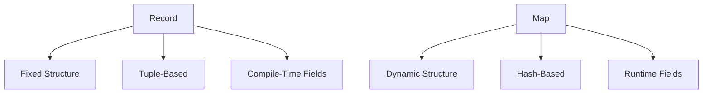

## 7.6 Proper Use of Records and Maps

In Erlang, managing structured data efficiently is crucial for building robust applications. Two primary constructs for handling structured data are records and maps. Understanding when and how to use these constructs can significantly impact the performance and maintainability of your code. In this section, we will delve into the idiomatic use of records and maps, comparing their use cases, providing examples, and discussing best practices.

### Understanding Records and Maps

#### Records

Records in Erlang are a way to define fixed-structure data types. They are essentially syntactic sugar over tuples, providing a convenient way to access tuple elements by name rather than by position. This makes records particularly useful for representing data with a known, fixed structure.

**Defining a Record:**

To define a record, you use the `-record` directive. Here's an example of defining a record for a `person`:

```erlang
-record(person, {name, age, email}).
```

**Accessing Record Fields:**

Once a record is defined, you can create instances of it and access its fields using the `#` operator:

```erlang
% Creating a record instance
Person = #person{name="Alice", age=30, email="alice@example.com"}.

% Accessing fields
Name = Person#person.name,
Age = Person#person.age.
```

**Updating Record Fields:**

Updating a record involves creating a new record with the desired changes:

```erlang
% Updating the age field
UpdatedPerson = Person#person{age=31}.
```

#### Maps

Maps, introduced in Erlang 17, are a more flexible data structure that allows for dynamic key-value associations. Unlike records, maps do not require a predefined structure, making them ideal for scenarios where the data structure may change over time or is not known in advance.

**Creating a Map:**

Maps are created using the `#{}` syntax:

```erlang
% Creating a map
PersonMap = #{name => "Alice", age => 30, email => "alice@example.com"}.
```

**Accessing Map Fields:**

You can access map fields using the `=>` operator:

```erlang
% Accessing fields
Name = maps:get(name, PersonMap),
Age = maps:get(age, PersonMap).
```

**Updating Map Fields:**

Maps can be updated by creating a new map with the desired changes:

```erlang
% Updating the age field
UpdatedPersonMap = PersonMap#{age => 31}.
```

### Comparing Records and Maps

#### Use Cases

- **Records** are best suited for fixed-structure data where the fields are known at compile time. They are efficient in terms of memory and access speed due to their tuple-based implementation.
- **Maps** are ideal for dynamic data where the structure may change or is not known until runtime. They provide flexibility at the cost of slightly higher memory usage and access time compared to records.

#### Performance Considerations

- **Records** offer faster access and update times because they are implemented as tuples. However, this speed comes with the limitation of requiring a fixed structure.
- **Maps** provide more flexibility but have a slightly higher overhead due to their hash-based implementation.

### Best Practices for Choosing Between Records and Maps

1. **Use Records for Fixed Structures:**
   - When the data structure is known and unlikely to change, prefer records for their efficiency and clarity.
   - Example: Use records for configuration settings or protocol messages where the fields are predefined.

2. **Use Maps for Dynamic Data:**
   - When dealing with data that may have optional fields or varying structures, maps are the better choice.
   - Example: Use maps for JSON-like data or when interfacing with external APIs where the response structure may vary.

3. **Consider Future Changes:**
   - If you anticipate changes to the data structure, maps offer the flexibility to adapt without requiring code changes.

4. **Leverage Pattern Matching:**
   - Both records and maps support pattern matching, which can be a powerful tool for extracting and manipulating data.

### Code Examples

Let's explore some practical examples to solidify our understanding of records and maps.

**Example 1: Using Records for Fixed Data**

```erlang
-module(person_record).
-export([create_person/3, update_age/2, get_email/1]).

-record(person, {name, age, email}).

create_person(Name, Age, Email) ->
    #person{name=Name, age=Age, email=Email}.

update_age(Person, NewAge) ->
    Person#person{age=NewAge}.

get_email(Person) ->
    Person#person.email.
```

**Example 2: Using Maps for Dynamic Data**

```erlang
-module(person_map).
-export([create_person/3, update_age/2, get_email/1]).

create_person(Name, Age, Email) ->
    #{name => Name, age => Age, email => Email}.

update_age(PersonMap, NewAge) ->
    PersonMap#{age => NewAge}.

get_email(PersonMap) ->
    maps:get(email, PersonMap).
```

### Visualizing the Differences

To better understand the differences between records and maps, let's visualize their structures using a diagram.



**Diagram Explanation:**
- **Records** are depicted as having a fixed structure, tuple-based implementation, and compile-time fields.
- **Maps** are shown as having a dynamic structure, hash-based implementation, and runtime fields.

### Try It Yourself

To deepen your understanding, try modifying the code examples:

- **Experiment with Records:** Add a new field to the `person` record and update the functions to handle it.
- **Experiment with Maps:** Add a new key-value pair to the `PersonMap` and update the functions to access it.

### Knowledge Check

- **Question:** When should you use records over maps?
- **Exercise:** Create a record and a map for a `car` entity with fields like `make`, `model`, and `year`. Update the `year` field and print the updated values.

### Embrace the Journey

Remember, mastering records and maps is just the beginning. As you progress, you'll find more complex scenarios where these constructs play a crucial role. Keep experimenting, stay curious, and enjoy the journey!

### References and Links

- [Erlang Documentation on Records](https://www.erlang.org/doc/reference_manual/records.html)
- [Erlang Documentation on Maps](https://www.erlang.org/doc/man/maps.html)

## Quiz: Proper Use of Records and Maps



### When should you prefer using records over maps in Erlang?

- [x] When the data structure is fixed and known at compile time.
- [ ] When the data structure is dynamic and changes frequently.
- [ ] When you need to store large amounts of data.
- [ ] When you want to use key-value pairs.

> **Explanation:** Records are best suited for fixed structures known at compile time due to their efficient tuple-based implementation.

### What is a key advantage of using maps in Erlang?

- [ ] Faster access time compared to records.
- [x] Flexibility to handle dynamic data structures.
- [ ] Lower memory usage than records.
- [ ] Compile-time field checking.

> **Explanation:** Maps offer flexibility for dynamic data structures, allowing fields to be added or removed at runtime.

### How do you access a field in a record?

- [x] Using the `#` operator with the record name.
- [ ] Using the `=>` operator with the field name.
- [ ] Using the `.` operator with the field name.
- [ ] Using the `:` operator with the record name.

> **Explanation:** The `#` operator is used to access fields in a record by specifying the record name and field.

### How do you update a field in a map?

- [ ] Directly modify the field in place.
- [x] Create a new map with the updated field.
- [ ] Use the `#` operator to update the field.
- [ ] Use the `.` operator to update the field.

> **Explanation:** Maps are immutable, so updating a field involves creating a new map with the desired changes.

### Which of the following is true about records?

- [x] They are syntactic sugar over tuples.
- [ ] They are implemented as hash tables.
- [ ] They allow dynamic field addition.
- [ ] They are slower than maps for access.

> **Explanation:** Records are syntactic sugar over tuples, providing named access to tuple elements.

### What is the syntax to define a record in Erlang?

- [x] `-record(name, {field1, field2}).`
- [ ] `record(name, {field1, field2}).`
- [ ] `-map(name, {field1, field2}).`
- [ ] `map(name, {field1, field2}).`

> **Explanation:** The `-record` directive is used to define a record in Erlang.

### How do you create a map in Erlang?

- [ ] Using the `#` operator.
- [ ] Using the `.` operator.
- [x] Using the `#{}` syntax.
- [ ] Using the `:` operator.

> **Explanation:** Maps are created using the `#{}` syntax, which allows for key-value associations.

### What is a disadvantage of using maps?

- [ ] They are less flexible than records.
- [ ] They require compile-time field definitions.
- [x] They have slightly higher memory usage than records.
- [ ] They cannot handle dynamic data.

> **Explanation:** Maps have slightly higher memory usage due to their hash-based implementation, but they offer flexibility for dynamic data.

### Can you use pattern matching with maps?

- [x] True
- [ ] False

> **Explanation:** Pattern matching is supported with maps, allowing for extraction and manipulation of data.

### Which data structure is more suitable for JSON-like data?

- [ ] Records
- [x] Maps

> **Explanation:** Maps are more suitable for JSON-like data due to their flexibility and ability to handle dynamic structures.




