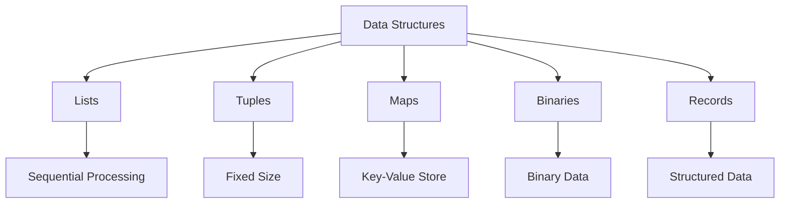

## 7.8 Selecting Appropriate Data Structures

In the world of Erlang, selecting the appropriate data structure is crucial for building efficient and scalable applications. The choice of data structure can significantly impact the performance and readability of your code. In this section, we will explore the characteristics of various data structures available in Erlang, discuss their use cases, and provide guidance on when to use each one.

### Understanding Erlang's Data Structures

Erlang offers a variety of data structures, each with its own strengths and weaknesses. The most commonly used data structures in Erlang include lists, tuples, maps, binaries, and records. Understanding the characteristics of these data structures will help you make informed decisions when designing your applications.

#### Lists

Lists are one of the most fundamental data structures in Erlang. They are ordered collections of elements and are particularly useful for sequential data processing.

- **Characteristics**:
  - Lists are linked lists, meaning each element points to the next.
  - They are dynamic in size, allowing easy addition and removal of elements.
  - Lists are ideal for scenarios where you need to frequently traverse or modify the sequence of elements.

- **Use Cases**:
  - **Sequential Processing**: Lists are perfect for operations that require processing elements in order, such as map, filter, and fold operations.
  - **Pattern Matching**: Lists work well with pattern matching, allowing you to destructure data easily.

- **Performance Considerations**:
  - Accessing the head of a list is O(1), but accessing the tail or any other element is O(n).
  - Lists are not suitable for random access due to their linear nature.

```erlang
% Example: Using lists for sequential processing
List = [1, 2, 3, 4, 5],
SquaredList = [X * X || X <- List], % List comprehension to square each element
io:format("Squared List: ~p~n", [SquaredList]).
```

#### Tuples

Tuples are fixed-size collections of elements, often used to group related data together.

- **Characteristics**:
  - Tuples have a fixed size, meaning you cannot add or remove elements once they are created.
  - They are suitable for storing heterogeneous data, such as records or small collections of related values.

- **Use Cases**:
  - **Data Grouping**: Tuples are ideal for grouping related data, such as coordinates (X, Y) or RGB color values (R, G, B).
  - **Return Multiple Values**: Functions often use tuples to return multiple values.

- **Performance Considerations**:
  - Accessing elements in a tuple is O(1), making them efficient for fixed-size collections.
  - Modifying a tuple requires creating a new tuple, which can be costly for large tuples.

```erlang
% Example: Using tuples to group related data
Coordinate = {10, 20},
{X, Y} = Coordinate,
io:format("X: ~p, Y: ~p~n", [X, Y]).
```

#### Maps

Maps are key-value stores that provide efficient access to elements based on keys.

- **Characteristics**:
  - Maps are dynamic in size and allow for efficient key-based access.
  - They are unordered, meaning the order of elements is not guaranteed.

- **Use Cases**:
  - **Associative Arrays**: Maps are perfect for scenarios where you need to associate values with keys, such as configuration settings or user profiles.
  - **Dynamic Data**: Maps are suitable for data that changes frequently, as they allow for efficient updates.

- **Performance Considerations**:
  - Accessing, adding, or updating elements in a map is generally O(log n).
  - Maps are more memory-efficient than lists for large collections of key-value pairs.

```erlang
% Example: Using maps for key-value storage
UserProfile = #{name => "Alice", age => 30, city => "New York"},
Name = maps:get(name, UserProfile),
io:format("Name: ~p~n", [Name]).
```

#### Binaries

Binaries are used for handling binary data efficiently, such as files or network packets.

- **Characteristics**:
  - Binaries are sequences of bytes and are suitable for handling large amounts of binary data.
  - They are immutable, meaning once created, they cannot be changed.

- **Use Cases**:
  - **File I/O**: Binaries are ideal for reading and writing binary files.
  - **Network Communication**: Use binaries for encoding and decoding network packets.

- **Performance Considerations**:
  - Binaries are memory-efficient and provide fast access to binary data.
  - They are not suitable for operations that require frequent modifications.

```erlang
% Example: Using binaries for file I/O
FileData = <<"Hello, World!">>,
io:format("File Data: ~p~n", [FileData]).
```

#### Records

Records are syntactic sugar for tuples, providing a way to define structured data types.

- **Characteristics**:
  - Records are defined using the `-record` directive and are essentially tuples with named fields.
  - They provide a way to access tuple elements by name, improving code readability.

- **Use Cases**:
  - **Structured Data**: Use records to define structured data types, such as user profiles or configuration settings.

- **Performance Considerations**:
  - Records have the same performance characteristics as tuples, with O(1) access time.
  - Modifying a record requires creating a new tuple, similar to tuples.

```erlang
% Example: Using records for structured data
-record(user, {name, age, city}).
User = #user{name="Alice", age=30, city="New York"},
Name = User#user.name,
io:format("Name: ~p~n", [Name]).
```

### Choosing the Right Data Structure

Selecting the appropriate data structure depends on the specific requirements of your application. Consider the following factors when making your decision:

1. **Access Patterns**: Determine how you will access the data. If you need fast random access, consider using tuples or maps. For sequential processing, lists are more suitable.

2. **Mutability**: Consider whether the data will change frequently. Maps and lists are dynamic and allow for easy modifications, while tuples and binaries are immutable.

3. **Memory Usage**: Evaluate the memory footprint of each data structure. Maps and binaries are generally more memory-efficient for large datasets.

4. **Performance**: Analyze the performance characteristics of each data structure. Tuples provide fast access but are costly to modify, while maps offer efficient key-based access.

5. **Readability**: Consider the readability and maintainability of your code. Records provide named fields, improving code clarity.

### Practical Scenarios

Let's explore some practical scenarios to illustrate the selection of appropriate data structures:

#### Scenario 1: Configuration Settings

For storing configuration settings, maps are an excellent choice due to their key-value nature and dynamic size. They allow you to easily update settings and access them by key.

```erlang
% Example: Configuration settings using maps
Config = #{database => "mydb", host => "localhost", port => 5432},
Database = maps:get(database, Config),
io:format("Database: ~p~n", [Database]).
```

#### Scenario 2: Processing a List of Items

When processing a list of items, such as a collection of user data, lists are ideal due to their sequential nature and ease of traversal.

```erlang
% Example: Processing a list of user data
Users = [{"Alice", 30}, {"Bob", 25}, {"Charlie", 35}],
Ages = [Age || {_, Age} <- Users],
io:format("Ages: ~p~n", [Ages]).
```

#### Scenario 3: Network Packet Handling

For handling network packets, binaries are the preferred choice due to their efficiency in managing binary data.

```erlang
% Example: Handling network packets with binaries
Packet = <<1, 2, 3, 4, 5>>,
io:format("Packet: ~p~n", [Packet]).
```

### Visualizing Data Structures

To better understand the relationships and characteristics of Erlang's data structures, let's visualize them using a diagram.



**Diagram Description**: This diagram illustrates the hierarchy and characteristics of Erlang's data structures. Each data structure has unique properties that make it suitable for specific use cases.

### Try It Yourself

Experiment with the code examples provided in this section. Try modifying the data structures to see how they behave in different scenarios. For instance, change the list of users to a map and observe how it affects the access patterns.

### Knowledge Check

- What are the key characteristics of lists in Erlang?
- When should you use tuples over lists?
- How do maps differ from records in terms of structure and usage?
- What are the performance considerations when using binaries for file I/O?
- How can you improve code readability using records?

### Summary

Selecting the appropriate data structure in Erlang is a critical decision that impacts the performance and maintainability of your application. By understanding the characteristics and use cases of lists, tuples, maps, binaries, and records, you can make informed choices that align with your application's requirements. Remember, the right data structure can make all the difference in building efficient and scalable Erlang applications.

## Quiz: Selecting Appropriate Data Structures



### What is the primary characteristic of lists in Erlang?

- [x] They are linked lists, allowing dynamic size changes.
- [ ] They are fixed-size collections.
- [ ] They provide fast random access.
- [ ] They are used for binary data.

> **Explanation:** Lists in Erlang are linked lists, which means they can dynamically change size by adding or removing elements.

### When is it most appropriate to use tuples in Erlang?

- [x] When you need a fixed-size collection of related values.
- [ ] When you need dynamic key-value storage.
- [ ] When handling large binary data.
- [ ] When processing sequential data.

> **Explanation:** Tuples are best used for fixed-size collections of related values, such as coordinates or RGB values.

### How do maps differ from records in Erlang?

- [x] Maps are dynamic key-value stores, while records are fixed-size tuples with named fields.
- [ ] Maps are used for binary data, while records are for sequential data.
- [ ] Maps provide fast random access, while records do not.
- [ ] Maps are immutable, while records are mutable.

> **Explanation:** Maps are dynamic and allow key-value storage, whereas records are syntactic sugar for tuples with named fields.

### What is a key performance consideration when using binaries in Erlang?

- [x] Binaries are efficient for handling large amounts of binary data.
- [ ] Binaries allow fast random access to elements.
- [ ] Binaries are mutable and can be modified easily.
- [ ] Binaries are suitable for sequential data processing.

> **Explanation:** Binaries are efficient for handling large binary data, such as files or network packets, due to their memory efficiency.

### Which data structure is most suitable for storing configuration settings?

- [x] Maps
- [ ] Lists
- [ ] Tuples
- [ ] Binaries

> **Explanation:** Maps are ideal for storing configuration settings due to their key-value nature and dynamic size.

### What is the access time complexity for elements in a tuple?

- [x] O(1)
- [ ] O(n)
- [ ] O(log n)
- [ ] O(n^2)

> **Explanation:** Accessing elements in a tuple is O(1), making it efficient for fixed-size collections.

### Which data structure should you use for processing a list of items sequentially?

- [x] Lists
- [ ] Maps
- [ ] Tuples
- [ ] Binaries

> **Explanation:** Lists are ideal for sequential processing due to their ordered nature and ease of traversal.

### What is a key advantage of using records in Erlang?

- [x] They provide named fields, improving code readability.
- [ ] They allow dynamic size changes.
- [ ] They are efficient for binary data handling.
- [ ] They provide fast random access.

> **Explanation:** Records provide named fields, which improve code readability and make it easier to access tuple elements.

### How do you access a value in a map by its key?

- [x] Using the `maps:get(Key, Map)` function.
- [ ] Using the `lists:get(Key, Map)` function.
- [ ] Using the `tuples:get(Key, Map)` function.
- [ ] Using the `binaries:get(Key, Map)` function.

> **Explanation:** The `maps:get(Key, Map)` function is used to access a value in a map by its key.

### True or False: Binaries in Erlang are mutable and can be modified after creation.

- [ ] True
- [x] False

> **Explanation:** Binaries in Erlang are immutable, meaning they cannot be modified after creation.



Remember, selecting the right data structure is just the beginning. As you continue your journey in Erlang, you'll discover more ways to optimize and enhance your applications. Keep experimenting, stay curious, and enjoy the process!
