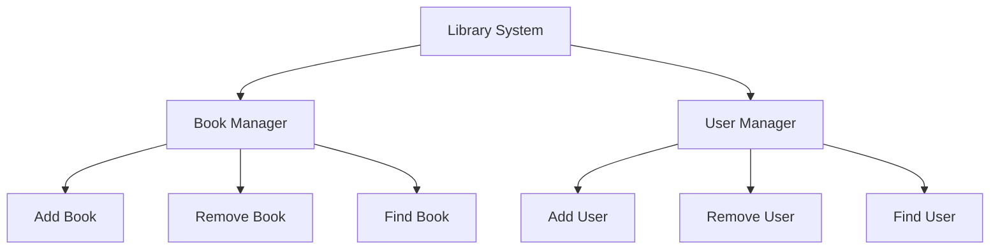

## 7.9 The Single Responsibility Principle in Erlang Modules

In this section, we delve into the Single Responsibility Principle (SRP) and its application within Erlang modules. The SRP is a fundamental concept in software design that promotes modularity and clarity, which are crucial for building maintainable and testable systems. Let's explore how Erlang, with its unique features, can effectively adhere to this principle.

### Understanding the Single Responsibility Principle

The Single Responsibility Principle is one of the five SOLID principles of object-oriented design, but its application is equally relevant in functional programming. The SRP states that a module or class should have one, and only one, reason to change. In simpler terms, each module should focus on a single part of the functionality provided by the software, encapsulating all the necessary operations related to that responsibility.

#### Importance of SRP

- **Maintainability**: By limiting a module's responsibility, changes in requirements affect fewer modules, making the system easier to maintain.
- **Testability**: Modules with a single responsibility are easier to test because they have fewer dependencies and a clearer purpose.
- **Reusability**: Focused modules can be reused across different parts of the application or even in different projects.
- **Clarity**: Code becomes more understandable when each module has a clear and distinct purpose.

### Applying SRP in Erlang Modules

Erlang's module system naturally supports the SRP due to its functional nature. Each module can be designed to encapsulate a specific piece of functionality, leveraging Erlang's strengths in concurrency and fault tolerance.

#### Designing Modules with SRP

1. **Identify Responsibilities**: Start by identifying distinct responsibilities within your application. Each responsibility should be encapsulated within its own module.
2. **Limit Module Scope**: Ensure that each module only contains functions related to its specific responsibility. Avoid mixing unrelated functionalities.
3. **Use Descriptive Names**: Name modules and functions clearly to reflect their responsibilities. This enhances readability and understanding.
4. **Encapsulate Data**: Keep data structures and operations that manipulate them within the same module to maintain cohesion.

### Example: Well-Structured Erlang Modules

Let's consider a simple example of a library management system. We'll design modules adhering to the SRP.

#### Module: `book_manager.erl`

This module handles operations related to books, such as adding, removing, and searching for books.

```erlang
-module(book_manager).
-export([add_book/2, remove_book/2, find_book/2]).

%% Adds a book to the library
-spec add_book(Book :: map(), Library :: list()) -> list().
add_book(Book, Library) ->
    [Book | Library].

%% Removes a book from the library
-spec remove_book(BookId :: integer(), Library :: list()) -> list().
remove_book(BookId, Library) ->
    lists:filter(fun(Book) -> maps:get(id, Book) =/= BookId end, Library).

%% Finds a book by its ID
-spec find_book(BookId :: integer(), Library :: list()) -> map() | undefined.
find_book(BookId, Library) ->
    lists:keyfind(BookId, 1, Library).
```

#### Module: `user_manager.erl`

This module manages user-related operations, such as adding and removing users.

```erlang
-module(user_manager).
-export([add_user/2, remove_user/2, find_user/2]).

%% Adds a user to the system
-spec add_user(User :: map(), Users :: list()) -> list().
add_user(User, Users) ->
    [User | Users].

%% Removes a user from the system
-spec remove_user(UserId :: integer(), Users :: list()) -> list().
remove_user(UserId, Users) ->
    lists:filter(fun(User) -> maps:get(id, User) =/= UserId end, Users).

%% Finds a user by their ID
-spec find_user(UserId :: integer(), Users :: list()) -> map() | undefined.
find_user(UserId, Users) ->
    lists:keyfind(UserId, 1, Users).
```

### Encouraging Modular Design

To adhere to the SRP, it's essential to embrace modular design principles:

- **Decompose Complex Systems**: Break down complex systems into smaller, manageable modules, each with a single responsibility.
- **Use Interfaces**: Define clear interfaces for modules to interact with each other. This promotes loose coupling and enhances flexibility.
- **Refactor Regularly**: Continuously refactor code to ensure modules remain focused and responsibilities do not drift over time.

### Visualizing Module Responsibilities

To better understand how modules can be organized around responsibilities, let's visualize the relationships between modules in our library management system.



*Figure 1: Visualization of Module Responsibilities in a Library Management System*

### Erlang Unique Features

Erlang's functional nature and its emphasis on processes make it particularly well-suited for adhering to the SRP:

- **Processes as Modules**: In Erlang, processes can be thought of as modules with a single responsibility, handling specific tasks concurrently.
- **Fault Tolerance**: By isolating responsibilities, failures in one module do not affect others, aligning with Erlang's "let it crash" philosophy.
- **Concurrency**: Erlang's lightweight processes allow for concurrent execution of modules, each handling its own responsibility.

### Differences and Similarities with Other Languages

While the SRP is a universal principle, its application can vary between languages:

- **Object-Oriented Languages**: In OO languages, SRP is often applied to classes. In Erlang, it applies to modules and processes.
- **Functional Languages**: Similar to other functional languages, Erlang emphasizes pure functions and immutability, which naturally align with SRP.

### Design Considerations

When applying the SRP in Erlang, consider the following:

- **Granularity**: Determine the appropriate level of granularity for responsibilities. Too granular can lead to excessive modules, while too broad can dilute the SRP.
- **Dependencies**: Minimize dependencies between modules to maintain independence and flexibility.
- **Documentation**: Clearly document the purpose and responsibilities of each module to aid understanding and maintenance.

### Try It Yourself

Experiment with the provided code examples by:

- Adding new functionalities to the `book_manager` or `user_manager` modules.
- Creating a new module for managing library loans, adhering to the SRP.
- Refactoring existing modules to ensure they have a single responsibility.

### Knowledge Check

- What is the Single Responsibility Principle and why is it important?
- How can Erlang modules adhere to the SRP?
- What are the benefits of modular design in Erlang?

### Embrace the Journey

Remember, applying the SRP is a continuous process. As you develop and maintain your Erlang applications, regularly revisit your modules to ensure they remain focused and aligned with their intended responsibilities. Keep experimenting, stay curious, and enjoy the journey of building robust and maintainable systems!

## Quiz: The Single Responsibility Principle in Erlang Modules



### What does the Single Responsibility Principle (SRP) state?

- [x] A module should have only one reason to change.
- [ ] A module should handle multiple responsibilities.
- [ ] A module should be as large as possible.
- [ ] A module should never change.

> **Explanation:** The SRP states that a module should have only one reason to change, meaning it should focus on a single responsibility.

### How does SRP benefit software design?

- [x] It enhances maintainability and testability.
- [ ] It makes modules larger and more complex.
- [ ] It reduces code readability.
- [ ] It increases the number of dependencies.

> **Explanation:** SRP enhances maintainability and testability by ensuring modules have a clear and focused purpose.

### How can Erlang modules adhere to SRP?

- [x] By encapsulating a specific piece of functionality.
- [ ] By handling multiple unrelated tasks.
- [ ] By having no clear purpose.
- [ ] By mixing data and logic from different domains.

> **Explanation:** Erlang modules can adhere to SRP by encapsulating a specific piece of functionality and maintaining a clear focus.

### What is a key feature of Erlang that supports SRP?

- [x] Lightweight processes.
- [ ] Object-oriented classes.
- [ ] Global variables.
- [ ] Inheritance.

> **Explanation:** Erlang's lightweight processes allow for concurrent execution of modules, each handling its own responsibility.

### Which of the following is NOT a benefit of SRP?

- [ ] Maintainability
- [ ] Testability
- [ ] Reusability
- [x] Increased complexity

> **Explanation:** SRP aims to reduce complexity by ensuring modules have a single responsibility.

### What should you consider when applying SRP in Erlang?

- [x] Granularity of responsibilities.
- [ ] Making modules as large as possible.
- [ ] Ignoring dependencies.
- [ ] Avoiding documentation.

> **Explanation:** Consider the granularity of responsibilities to ensure modules are neither too granular nor too broad.

### How can you ensure a module adheres to SRP?

- [x] By limiting its scope to a single responsibility.
- [ ] By including as many functions as possible.
- [ ] By mixing unrelated functionalities.
- [ ] By avoiding refactoring.

> **Explanation:** Limiting a module's scope to a single responsibility ensures adherence to SRP.

### What is a common pitfall when applying SRP?

- [x] Creating too many small modules.
- [ ] Combining unrelated functionalities.
- [ ] Ignoring module dependencies.
- [ ] Avoiding documentation.

> **Explanation:** A common pitfall is creating too many small modules, which can lead to excessive complexity.

### How does SRP relate to Erlang's "let it crash" philosophy?

- [x] Isolating responsibilities aligns with fault tolerance.
- [ ] SRP contradicts the "let it crash" philosophy.
- [ ] SRP encourages shared mutable state.
- [ ] SRP discourages process isolation.

> **Explanation:** Isolating responsibilities aligns with Erlang's fault tolerance and "let it crash" philosophy.

### True or False: SRP is only applicable to object-oriented programming.

- [ ] True
- [x] False

> **Explanation:** SRP is applicable to both object-oriented and functional programming, including Erlang.


