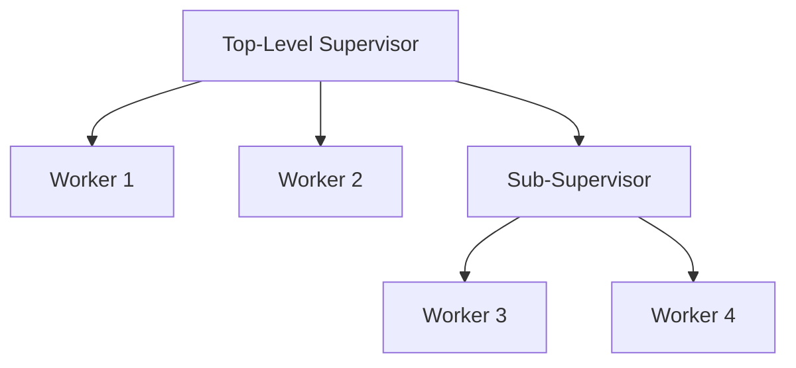

## 8.10 The Supervisor Pattern in OTP

In the world of Erlang, the Supervisor pattern is a fundamental concept that plays a pivotal role in building robust, fault-tolerant systems. Supervisors are part of the Open Telecom Platform (OTP) framework, which provides a set of libraries and design principles for building concurrent and distributed systems. In this section, we will delve into the Supervisor pattern, exploring its functionality, how it fits into creational design patterns, and strategies for managing complex process hierarchies.

### Understanding the Supervisor Pattern

The Supervisor pattern is a design pattern used to manage the lifecycle of processes in Erlang. Supervisors are responsible for starting, stopping, and monitoring child processes. They are designed to ensure that if a child process crashes, it can be restarted according to a predefined strategy. This is a key component of Erlang's "let it crash" philosophy, which emphasizes building systems that can recover from failures automatically.

#### Key Concepts

- **Supervision Tree**: A hierarchical structure where supervisors manage worker processes and other supervisors. This tree structure allows for organized and efficient process management.
- **Child Specification**: Defines how a child process should be started, stopped, and restarted. It includes details such as the module, function, arguments, and restart strategy.
- **Restart Strategies**: Determine how supervisors handle child process failures. Common strategies include `one_for_one`, `one_for_all`, `rest_for_one`, and `simple_one_for_one`.

### Supervisors as Creational Patterns

In the context of creational design patterns, supervisors are responsible for the creation and management of processes. They encapsulate the logic for starting and stopping processes, ensuring that the system can dynamically adjust to changes in process state. This aligns with the creational pattern's goal of managing object (or process) creation in a controlled manner.

#### Process Creation and Management

Supervisors manage the creation of processes through child specifications. Each child specification includes:

- **Module**: The module where the process logic is defined.
- **Function**: The function to call to start the process.
- **Arguments**: The arguments to pass to the function.
- **Restart Strategy**: The strategy to use if the process crashes.

### Example: Creating a Simple Supervisor

Let's start with a simple example of creating a supervisor in Erlang. We'll define a supervisor that manages a single worker process.

```erlang
-module(simple_supervisor).
-behaviour(supervisor).

%% API
-export([start_link/0]).

%% Supervisor callbacks
-export([init/1]).

start_link() ->
    supervisor:start_link({local, ?MODULE}, ?MODULE, []).

init([]) ->
    %% Define the child process
    ChildSpec = {
        worker_process,
        {worker_process, start_link, []},
        permanent,
        5000,
        worker,
        [worker_process]
    },
    %% Define the supervision strategy
    {ok, {{one_for_one, 5, 10}, [ChildSpec]}}.
```

In this example, we define a supervisor module `simple_supervisor` that implements the `supervisor` behavior. The `init/1` function specifies a single child process `worker_process` with a `one_for_one` restart strategy. This means if the worker process crashes, only that process will be restarted.

### Complex Process Hierarchies

In real-world applications, supervisors often manage complex hierarchies of processes. These hierarchies can include multiple layers of supervisors, each responsible for a subset of processes. This allows for fine-grained control over process management and fault tolerance.

#### Example: Building a Supervision Tree

Consider a scenario where we have a top-level supervisor managing two worker processes and a second-level supervisor. The second-level supervisor manages additional worker processes.

```erlang
-module(complex_supervisor).
-behaviour(supervisor).

%% API
-export([start_link/0]).

%% Supervisor callbacks
-export([init/1]).

start_link() ->
    supervisor:start_link({local, ?MODULE}, ?MODULE, []).

init([]) ->
    %% Define first-level child processes
    Worker1 = {
        worker1,
        {worker_module, start_link, []},
        permanent,
        5000,
        worker,
        [worker_module]
    },
    Worker2 = {
        worker2,
        {worker_module, start_link, []},
        permanent,
        5000,
        worker,
        [worker_module]
    },
    %% Define second-level supervisor
    SubSupervisor = {
        sub_supervisor,
        {sub_supervisor, start_link, []},
        permanent,
        5000,
        supervisor,
        [sub_supervisor]
    },
    %% Define the supervision strategy
    {ok, {{one_for_one, 5, 10}, [Worker1, Worker2, SubSupervisor]}}.
```

In this example, `complex_supervisor` manages two worker processes and a `sub_supervisor`. The `sub_supervisor` can further manage its own set of worker processes, creating a hierarchical supervision tree.

### Dynamic Child Process Management

In some cases, the number of child processes may need to change dynamically based on runtime conditions. Erlang's supervisors support dynamic child process management, allowing processes to be added or removed at runtime.

#### Strategies for Dynamic Management

- **Dynamic Child Specifications**: Use the `simple_one_for_one` strategy to manage a dynamic number of identical worker processes.
- **Adding and Removing Children**: Use `supervisor:start_child/2` and `supervisor:terminate_child/2` to add or remove child processes dynamically.

#### Example: Dynamic Child Management

```erlang
-module(dynamic_supervisor).
-behaviour(supervisor).

%% API
-export([start_link/0, add_worker/0, remove_worker/1]).

%% Supervisor callbacks
-export([init/1]).

start_link() ->
    supervisor:start_link({local, ?MODULE}, ?MODULE, []).

init([]) ->
    %% Define a simple_one_for_one strategy
    {ok, {{simple_one_for_one, 5, 10}, []}}.

add_worker() ->
    %% Add a new worker process
    supervisor:start_child(?MODULE, []).

remove_worker(Pid) ->
    %% Remove a worker process
    supervisor:terminate_child(?MODULE, Pid).
```

In this example, `dynamic_supervisor` uses the `simple_one_for_one` strategy, allowing for dynamic addition and removal of worker processes. The `add_worker/0` function starts a new worker process, while `remove_worker/1` terminates an existing process.

### Visualizing Supervision Trees

To better understand the structure of supervision trees, let's visualize a simple supervision tree using Mermaid.js.



In this diagram, the top-level supervisor manages two worker processes and a sub-supervisor. The sub-supervisor, in turn, manages two additional worker processes.

### Design Considerations

When designing systems with supervisors, consider the following:

- **Restart Strategies**: Choose the appropriate restart strategy based on the relationships between processes. For example, use `one_for_all` if processes are interdependent.
- **Supervision Depth**: Limit the depth of supervision trees to avoid complexity and ensure maintainability.
- **Dynamic Management**: Use dynamic child management for processes that need to scale based on runtime conditions.

### Erlang Unique Features

Erlang's lightweight processes and message-passing model make it uniquely suited for implementing the Supervisor pattern. The ability to create thousands of processes with minimal overhead allows for fine-grained control over process management.

### Differences and Similarities

The Supervisor pattern in Erlang is similar to other creational patterns in that it manages the creation and lifecycle of objects (processes). However, it is unique in its focus on fault tolerance and recovery, which is a hallmark of Erlang's design philosophy.

### Try It Yourself

Experiment with the examples provided by modifying the child specifications and restart strategies. Try adding new worker processes or changing the supervision hierarchy to see how the system behaves.

### Knowledge Check

- What are the key components of a supervisor in Erlang?
- How does the `one_for_one` strategy differ from `one_for_all`?
- What is the purpose of a supervision tree?
- How can you dynamically add or remove child processes in a supervisor?

### Summary

The Supervisor pattern in OTP is a powerful tool for managing process creation and lifecycle in Erlang. By understanding and leveraging this pattern, you can build robust, fault-tolerant systems that can recover from failures automatically. Remember, this is just the beginning. As you progress, you'll build more complex and interactive systems. Keep experimenting, stay curious, and enjoy the journey!

## Quiz: The Supervisor Pattern in OTP



### What is the primary role of a supervisor in Erlang?

- [x] To manage the lifecycle of processes
- [ ] To handle user input
- [ ] To perform data serialization
- [ ] To manage network connections

> **Explanation:** Supervisors are responsible for managing the lifecycle of processes, including starting, stopping, and monitoring them.

### Which restart strategy restarts only the crashed process?

- [x] one_for_one
- [ ] one_for_all
- [ ] rest_for_one
- [ ] simple_one_for_one

> **Explanation:** The `one_for_one` strategy restarts only the crashed process, leaving other processes unaffected.

### How can you dynamically add a child process to a supervisor?

- [x] Use supervisor:start_child/2
- [ ] Use supervisor:stop_child/2
- [ ] Use supervisor:restart_child/2
- [ ] Use supervisor:delete_child/2

> **Explanation:** The `supervisor:start_child/2` function is used to dynamically add a child process to a supervisor.

### What is a supervision tree?

- [x] A hierarchical structure of supervisors and worker processes
- [ ] A data structure for storing process states
- [ ] A method for serializing data
- [ ] A network topology diagram

> **Explanation:** A supervision tree is a hierarchical structure where supervisors manage worker processes and other supervisors.

### Which strategy should you use if processes are interdependent?

- [x] one_for_all
- [ ] one_for_one
- [ ] rest_for_one
- [ ] simple_one_for_one

> **Explanation:** The `one_for_all` strategy restarts all child processes if one crashes, which is suitable for interdependent processes.

### What is the "let it crash" philosophy?

- [x] A design principle that emphasizes automatic recovery from failures
- [ ] A method for optimizing code performance
- [ ] A strategy for data serialization
- [ ] A technique for managing network connections

> **Explanation:** The "let it crash" philosophy is a design principle that emphasizes building systems that can recover from failures automatically.

### How does the `simple_one_for_one` strategy differ from other strategies?

- [x] It is used for managing a dynamic number of identical worker processes
- [ ] It restarts all processes when one crashes
- [ ] It is used for managing interdependent processes
- [ ] It is used for managing a fixed number of processes

> **Explanation:** The `simple_one_for_one` strategy is used for managing a dynamic number of identical worker processes.

### What is the purpose of a child specification?

- [x] To define how a child process should be started, stopped, and restarted
- [ ] To store process state information
- [ ] To manage network connections
- [ ] To handle user input

> **Explanation:** A child specification defines how a child process should be started, stopped, and restarted.

### What is a key benefit of using supervisors in Erlang?

- [x] Fault tolerance and automatic recovery
- [ ] Improved data serialization
- [ ] Enhanced user interface design
- [ ] Faster network connections

> **Explanation:** Supervisors provide fault tolerance and automatic recovery, which are key benefits in Erlang systems.

### True or False: Supervisors can only manage worker processes.

- [ ] True
- [x] False

> **Explanation:** Supervisors can manage both worker processes and other supervisors, allowing for complex supervision trees.




