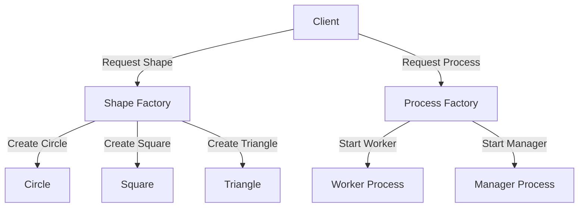

## 8.2 Factory Pattern with Functions and Modules

In this section, we delve into the Factory Pattern, a creational design pattern that provides an interface for creating objects in a superclass but allows subclasses to alter the type of objects that will be created. In Erlang, we leverage functions and modules to implement this pattern, enabling efficient creation and management of data structures and processes.

### Intent of the Factory Pattern

The Factory Pattern's primary intent is to define an interface for creating an object, but let subclasses decide which class to instantiate. This pattern promotes loose coupling by eliminating the need to bind application-specific classes into the code. The Factory Pattern is particularly useful in scenarios where the exact types and dependencies of the objects are not known until runtime.

### Key Participants

- **Factory**: The module or function responsible for creating objects.
- **Product**: The object or data structure created by the factory.
- **Client**: The code that uses the factory to create objects.

### Applicability

Use the Factory Pattern when:
- You need to manage or manipulate collections of objects that share a common interface.
- You want to provide a library of objects without exposing the instantiation logic to the client.
- You need to decouple the creation of objects from their usage.

### Implementing the Factory Pattern in Erlang

In Erlang, the Factory Pattern can be implemented using functions and modules. Let's explore how to create factory functions that return different types of data structures and processes.

#### Creating Factory Functions

Factory functions in Erlang can be used to create and return different types of data structures. These functions encapsulate the logic required to instantiate and configure the objects.

```erlang
-module(shape_factory).
-export([create_shape/1]).

% Factory function to create different shapes
create_shape(circle) ->
    {circle, 0, 0, 5}; % Example: Circle with center (0,0) and radius 5
create_shape(square) ->
    {square, 0, 0, 10}; % Example: Square with top-left corner (0,0) and side length 10
create_shape(triangle) ->
    {triangle, {0, 0}, {5, 0}, {2.5, 5}}. % Example: Triangle with vertices at specified points
```

In this example, the `create_shape/1` function acts as a factory, returning different tuples representing shapes based on the input parameter.

#### Selecting Modules or Processes

Erlang's module system allows us to create factories that select and instantiate different modules or processes. This is particularly useful in concurrent applications where processes need to be dynamically created and managed.

```erlang
-module(process_factory).
-export([start_process/1]).

% Factory function to start different processes
start_process(worker) ->
    spawn(fun worker_process/0);
start_process(manager) ->
    spawn(fun manager_process/0).

worker_process() ->
    receive
        {work, Task} ->
            io:format("Worker processing task: ~p~n", [Task]),
            worker_process();
        stop ->
            io:format("Worker stopping.~n")
    end.

manager_process() ->
    receive
        {assign, Task} ->
            io:format("Manager assigning task: ~p~n", [Task]),
            manager_process();
        stop ->
            io:format("Manager stopping.~n")
    end.
```

Here, the `start_process/1` function acts as a factory, spawning different processes based on the input parameter. Each process has its own behavior defined in separate functions.

### Use Cases for Factory Pattern

The Factory Pattern is beneficial in various scenarios, such as:

- **Dynamic Object Creation**: When the type of object to be created is determined at runtime.
- **Decoupling Code**: When you want to separate the instantiation logic from the usage logic.
- **Managing Complexity**: When dealing with complex object creation logic that can be encapsulated within factory functions.

### Design Considerations

- **Simplicity**: Ensure that the factory functions remain simple and focused on object creation.
- **Flexibility**: Design factories to be easily extendable to accommodate new types of objects.
- **Performance**: Consider the overhead of dynamic object creation and optimize where necessary.

### Erlang Unique Features

Erlang's concurrency model and lightweight processes make it uniquely suited for implementing the Factory Pattern in scenarios involving process creation and management. The ability to spawn processes dynamically and manage them through factory functions is a powerful feature that Erlang offers.

### Differences and Similarities

The Factory Pattern in Erlang shares similarities with its implementation in other languages, such as Java or C++, in terms of intent and structure. However, Erlang's functional nature and concurrency model introduce unique considerations, such as using functions and modules instead of classes and objects.

### Try It Yourself

To deepen your understanding, try modifying the code examples to create additional shapes or processes. Experiment with different parameters and observe how the factory functions handle these variations.

### Visualizing the Factory Pattern

Below is a diagram illustrating the flow of the Factory Pattern in Erlang, showing how the factory function interacts with different modules or processes.



This diagram shows the client interacting with the factory functions to create different shapes or start different processes.

### Knowledge Check

- What is the primary intent of the Factory Pattern?
- How does Erlang's concurrency model enhance the implementation of the Factory Pattern?
- Why is it beneficial to decouple object creation from usage?

### Summary

In this section, we've explored the Factory Pattern in Erlang, focusing on using functions and modules to create and manage data structures and processes. By leveraging Erlang's unique features, such as its concurrency model, we can implement this pattern effectively in various scenarios.

Remember, the Factory Pattern is a powerful tool for managing object creation, promoting loose coupling, and enhancing code flexibility. Keep experimenting and applying these concepts to your projects!

## Quiz: Factory Pattern with Functions and Modules



### What is the primary intent of the Factory Pattern?

- [x] To define an interface for creating an object, but let subclasses decide which class to instantiate.
- [ ] To create a single instance of a class.
- [ ] To provide a way to access the elements of an aggregate object sequentially.
- [ ] To define a family of algorithms, encapsulate each one, and make them interchangeable.

> **Explanation:** The Factory Pattern's primary intent is to define an interface for creating an object, but let subclasses decide which class to instantiate.

### How does Erlang's concurrency model enhance the implementation of the Factory Pattern?

- [x] By allowing dynamic creation and management of processes.
- [ ] By providing a class-based object-oriented model.
- [ ] By enforcing strict type checking at compile time.
- [ ] By supporting inheritance and polymorphism.

> **Explanation:** Erlang's concurrency model enhances the Factory Pattern by allowing dynamic creation and management of processes, which is a key feature in concurrent applications.

### Why is it beneficial to decouple object creation from usage?

- [x] It promotes loose coupling and flexibility.
- [ ] It makes the code more complex and harder to maintain.
- [ ] It reduces the number of lines of code.
- [ ] It enforces strict type checking.

> **Explanation:** Decoupling object creation from usage promotes loose coupling and flexibility, making the code easier to maintain and extend.

### What is a key participant in the Factory Pattern?

- [x] Factory
- [ ] Singleton
- [ ] Iterator
- [ ] Decorator

> **Explanation:** The Factory is a key participant in the Factory Pattern, responsible for creating objects.

### In Erlang, what can factory functions be used to create?

- [x] Different types of data structures and processes.
- [ ] Only single instances of a module.
- [ ] Only sequential access to elements.
- [ ] Only static data types.

> **Explanation:** In Erlang, factory functions can be used to create different types of data structures and processes, leveraging Erlang's functional and concurrent capabilities.

### What is a benefit of using factory functions in Erlang?

- [x] They encapsulate the logic required to instantiate and configure objects.
- [ ] They enforce strict type checking.
- [ ] They reduce the need for error handling.
- [ ] They eliminate the need for modules.

> **Explanation:** Factory functions encapsulate the logic required to instantiate and configure objects, simplifying the creation process.

### What is a common use case for the Factory Pattern?

- [x] Dynamic object creation at runtime.
- [ ] Static object creation at compile time.
- [ ] Sequential access to elements.
- [ ] Enforcing strict type checking.

> **Explanation:** A common use case for the Factory Pattern is dynamic object creation at runtime, allowing for flexibility and adaptability.

### How can you extend a factory function to accommodate new types of objects?

- [x] By adding new cases or clauses to the function.
- [ ] By rewriting the entire function.
- [ ] By removing existing cases.
- [ ] By enforcing strict type checking.

> **Explanation:** You can extend a factory function to accommodate new types of objects by adding new cases or clauses to the function, enhancing its flexibility.

### True or False: The Factory Pattern in Erlang is implemented using classes and objects.

- [ ] True
- [x] False

> **Explanation:** False. The Factory Pattern in Erlang is implemented using functions and modules, not classes and objects, due to Erlang's functional nature.



Remember, this is just the beginning. As you progress, you'll build more complex and interactive systems. Keep experimenting, stay curious, and enjoy the journey!
