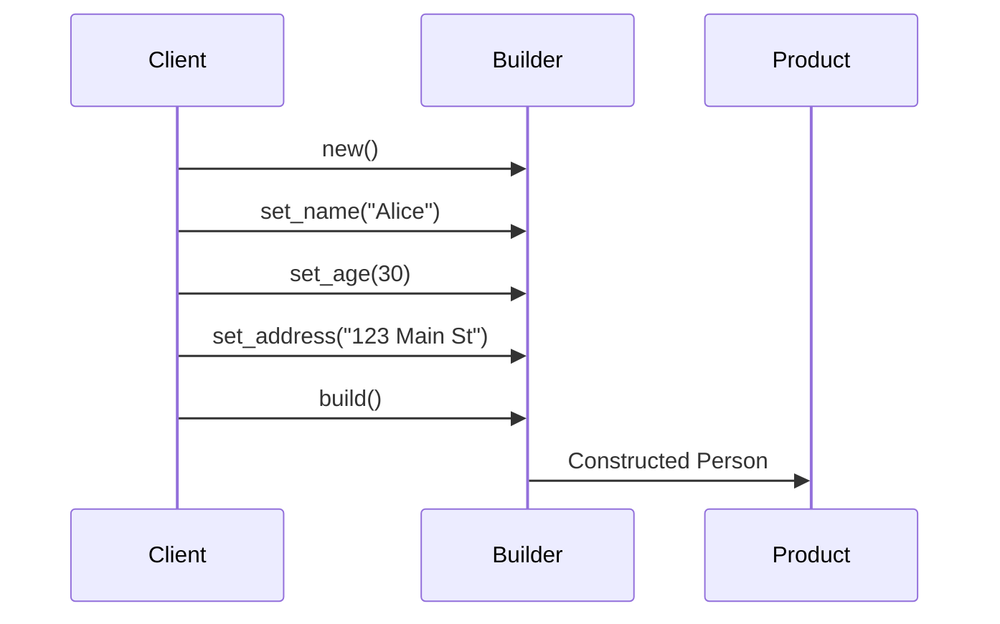

## 8.3 Builder Pattern Using Functional Approaches

In this section, we delve into the Builder pattern, a creational design pattern that is particularly useful for constructing complex objects step by step. We will explore how this pattern can be implemented in Erlang using functional programming techniques, such as chained function calls and accumulators. This approach not only enhances code readability but also provides flexibility in constructing nested data structures.

### Understanding the Builder Pattern

#### Intent

The Builder pattern is designed to separate the construction of a complex object from its representation. By doing so, the same construction process can create different representations. This pattern is particularly useful when an object needs to be created with many optional components or configurations.

#### Key Participants

- **Builder**: Defines the interface for creating parts of a complex object.
- **Concrete Builder**: Implements the Builder interface and constructs the parts of the product.
- **Director**: Constructs an object using the Builder interface.
- **Product**: Represents the complex object being built.

### Implementing the Builder Pattern in Erlang

In Erlang, we can implement the Builder pattern using functional approaches, such as chained function calls or accumulators. Let's explore these techniques in detail.

#### Chained Function Calls

Chained function calls allow us to build complex data structures by successively applying functions that modify the state of the object being constructed. This approach is akin to method chaining in object-oriented languages.

```erlang
-module(builder_example).
-export([new/0, set_name/2, set_age/2, set_address/2, build/1]).

-record(person, {name, age, address}).

% Initialize a new builder
new() ->
    #person{}.

% Set the name field
set_name(Person, Name) ->
    Person#person{name = Name}.

% Set the age field
set_age(Person, Age) ->
    Person#person{age = Age}.

% Set the address field
set_address(Person, Address) ->
    Person#person{address = Address}.

% Build the final person record
build(Person) ->
    Person.
```

In this example, we define a series of functions that modify a `#person` record. Each function returns a new record with the updated field, allowing us to chain these calls together.

#### Using Accumulators

Accumulators provide another way to implement the Builder pattern in Erlang. By passing an accumulator through a series of functions, we can build up the state of the object incrementally.

```erlang
-module(builder_with_accumulator).
-export([build_person/1]).

-record(person, {name, age, address}).

% Build a person using an accumulator
build_person(Attributes) ->
    lists:foldl(fun set_attribute/2, #person{}, Attributes).

% Set each attribute on the person record
set_attribute({name, Name}, Person) ->
    Person#person{name = Name};
set_attribute({age, Age}, Person) ->
    Person#person{age = Age};
set_attribute({address, Address}, Person) ->
    Person#person{address = Address}.
```

Here, we use `lists:foldl/3` to iterate over a list of attributes, applying each one to the `#person` record. This approach is flexible and allows for dynamic construction based on the input list.

### Building Nested Data Structures

The Builder pattern is particularly powerful when constructing nested data structures. Let's consider an example where we build a complex configuration object.

```erlang
-module(nested_builder).
-export([new/0, add_database/2, add_cache/2, build/1]).

-record(config, {databases = [], caches = []}).

% Initialize a new configuration
new() ->
    #config{}.

% Add a database configuration
add_database(Config, DbConfig) ->
    Config#config{databases = [DbConfig | Config#config.databases]}.

% Add a cache configuration
add_cache(Config, CacheConfig) ->
    Config#config{caches = [CacheConfig | Config#config.caches]}.

% Build the final configuration
build(Config) ->
    Config.
```

In this example, we construct a configuration object with nested lists of database and cache configurations. The Builder pattern allows us to add components incrementally, providing flexibility in the construction process.

### Benefits of the Builder Pattern

Implementing the Builder pattern using functional approaches in Erlang offers several benefits:

- **Improved Readability**: Chained function calls and accumulators make the construction process clear and easy to follow.
- **Flexibility**: The pattern allows for dynamic construction of objects, accommodating optional components and configurations.
- **Separation of Concerns**: The construction logic is separated from the representation, making the code more modular and maintainable.

### Visualizing the Builder Pattern

To better understand the flow of the Builder pattern, let's visualize the process using a sequence diagram.



This diagram illustrates the sequence of interactions between the client, builder, and product. The client initiates the construction process by calling the builder's methods, which in turn constructs the final product.

### Try It Yourself

Experiment with the provided code examples by modifying the attributes or adding new fields to the records. Try constructing different configurations and observe how the Builder pattern facilitates this process.

### Knowledge Check

- What are the key participants in the Builder pattern?
- How does the Builder pattern improve code readability and flexibility?
- What are the benefits of using accumulators in the Builder pattern?

### Conclusion

The Builder pattern is a powerful tool for constructing complex objects in Erlang. By leveraging functional programming techniques, we can implement this pattern in a way that enhances code readability and flexibility. As you continue to explore design patterns in Erlang, consider how the Builder pattern can be applied to your own projects to improve the construction process.

## Quiz: Builder Pattern Using Functional Approaches



### What is the primary intent of the Builder pattern?

- [x] To separate the construction of a complex object from its representation
- [ ] To encapsulate a request as an object
- [ ] To define a family of algorithms
- [ ] To provide a way to access the elements of an aggregate object sequentially

> **Explanation:** The Builder pattern's primary intent is to separate the construction of a complex object from its representation, allowing the same construction process to create different representations.

### Which Erlang feature is commonly used to implement the Builder pattern?

- [x] Chained function calls
- [ ] GenServer
- [ ] ETS tables
- [ ] List comprehensions

> **Explanation:** Chained function calls are commonly used in Erlang to implement the Builder pattern, allowing for a clear and flexible construction process.

### How does using accumulators benefit the Builder pattern in Erlang?

- [x] They allow for dynamic construction based on input
- [ ] They improve the performance of the code
- [ ] They reduce the memory usage
- [ ] They simplify error handling

> **Explanation:** Accumulators allow for dynamic construction based on input, making the Builder pattern flexible and adaptable to different configurations.

### What is a key advantage of the Builder pattern?

- [x] Improved code readability
- [ ] Faster execution time
- [ ] Reduced code size
- [ ] Simplified error handling

> **Explanation:** The Builder pattern improves code readability by clearly separating the construction process from the representation of the object.

### In the provided code examples, what data structure is used to represent a person?

- [x] A record
- [ ] A tuple
- [ ] A list
- [ ] A map

> **Explanation:** A record is used to represent a person in the provided code examples, allowing for structured data storage.

### What is the role of the Director in the Builder pattern?

- [x] Constructs an object using the Builder interface
- [ ] Defines the interface for creating parts of a complex object
- [ ] Implements the Builder interface
- [ ] Represents the complex object being built

> **Explanation:** The Director constructs an object using the Builder interface, orchestrating the construction process.

### How can the Builder pattern be visualized?

- [x] Using a sequence diagram
- [ ] Using a class diagram
- [ ] Using a flowchart
- [ ] Using a state diagram

> **Explanation:** A sequence diagram can be used to visualize the interactions between the client, builder, and product in the Builder pattern.

### What is a common use case for the Builder pattern?

- [x] Constructing objects with many optional components
- [ ] Implementing state machines
- [ ] Managing concurrent processes
- [ ] Handling error propagation

> **Explanation:** The Builder pattern is commonly used for constructing objects with many optional components, providing flexibility in the construction process.

### What is the benefit of separating construction logic from representation?

- [x] It makes the code more modular and maintainable
- [ ] It improves the performance of the application
- [ ] It reduces the memory footprint
- [ ] It simplifies error handling

> **Explanation:** Separating construction logic from representation makes the code more modular and maintainable, as changes to one do not affect the other.

### True or False: The Builder pattern is only applicable in object-oriented programming.

- [ ] True
- [x] False

> **Explanation:** False. The Builder pattern can be applied in functional programming languages like Erlang, using techniques such as chained function calls and accumulators.



Remember, this is just the beginning. As you progress, you'll build more complex and interactive systems using the Builder pattern in Erlang. Keep experimenting, stay curious, and enjoy the journey!
