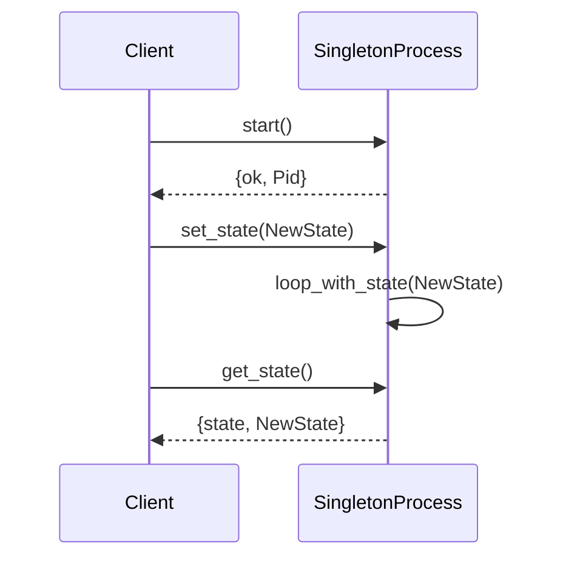

## 8.4 Singleton Pattern and Application Environment

In this section, we delve into the Singleton pattern within the context of Erlang, a language renowned for its concurrency and fault-tolerant capabilities. The Singleton pattern is a creational design pattern that ensures a class has only one instance and provides a global point of access to it. While this pattern is prevalent in object-oriented programming, its application in Erlang requires a different approach due to the language's functional and concurrent nature.

### Understanding the Singleton Pattern

**Intent**: The Singleton pattern restricts the instantiation of a class to a single object. This is useful when exactly one object is needed to coordinate actions across the system.

**Key Participants**:
- **Singleton**: The class that is responsible for ensuring that only one instance exists.
- **Client**: The code that accesses the Singleton instance.

### Why Singleton is Less Common in Erlang

Erlang's concurrency model, based on lightweight processes and message passing, naturally discourages the use of global state. Instead of relying on shared state, Erlang promotes isolated processes that communicate through messages. This paradigm shift makes the Singleton pattern less common, as the need for a single global instance is often replaced by process-based solutions.

### Leveraging the Application Environment

In Erlang, the application environment is a mechanism for storing configuration data that can be accessed globally across the application. This is akin to using a Singleton for configuration purposes.

#### Using `application:get_env/1`

The `application:get_env/1` function allows you to retrieve configuration parameters defined in your application's environment. This is particularly useful for settings that need to be accessed globally.

```erlang
% Define a configuration parameter in your .app file
{env, [{my_config, "default_value"}]}.

% Retrieve the configuration parameter
get_my_config() ->
    case application:get_env(my_config) of
        {ok, Value} -> Value;
        undefined -> "default_value"
    end.
```

In this example, `get_my_config/0` retrieves the value of `my_config` from the application environment. If the parameter is not set, it defaults to `"default_value"`.

### Using a Registered Process as a Singleton

Another approach to implementing a Singleton in Erlang is through a registered process. By registering a process with a unique name, you ensure that there is only one instance of that process running at any given time.

#### Example: Singleton Process

```erlang
-module(singleton).
-export([start/0, get_state/0, set_state/1]).

% Start the singleton process
start() ->
    case whereis(singleton_process) of
        undefined ->
            Pid = spawn(fun loop/0),
            register(singleton_process, Pid),
            {ok, Pid};
        Pid ->
            {error, already_started}
    end.

% Process loop
loop() ->
    receive
        {get_state, Caller} ->
            Caller ! {state, self()},
            loop();
        {set_state, NewState} ->
            loop_with_state(NewState)
    end.

% Loop with state
loop_with_state(State) ->
    receive
        {get_state, Caller} ->
            Caller ! {state, State},
            loop_with_state(State);
        {set_state, NewState} ->
            loop_with_state(NewState)
    end.

% Get the current state
get_state() ->
    singleton_process ! {get_state, self()},
    receive
        {state, State} -> State
    end.

% Set a new state
set_state(NewState) ->
    singleton_process ! {set_state, NewState}.
```

In this example, we define a module `singleton` that manages a singleton process. The process is registered under the name `singleton_process`, ensuring only one instance exists. The process can handle messages to get and set its state.

### Considerations and Potential Issues with Singletons

While singletons can be useful, they come with potential pitfalls:

- **Global State**: Singletons introduce global state, which can lead to hidden dependencies and make testing difficult.
- **Concurrency**: In a concurrent environment like Erlang, ensuring thread safety and avoiding race conditions can be challenging.
- **Scalability**: Singletons can become bottlenecks if they are accessed frequently, as they serialize access to the shared resource.

### Erlang Unique Features

Erlang's process model provides a unique way to implement singletons through registered processes. This approach leverages Erlang's strengths in concurrency and fault tolerance, allowing the singleton process to be restarted by a supervisor if it crashes.

### Differences and Similarities

The Singleton pattern in Erlang differs from its implementation in object-oriented languages due to the absence of classes and objects. Instead, Erlang uses processes and message passing to achieve similar functionality. This approach aligns with Erlang's design philosophy of building robust, concurrent systems.

### Try It Yourself

Experiment with the provided code examples by modifying the state management logic or adding new message types. Consider how you might handle errors or implement additional functionality within the singleton process.

### Visualizing Singleton in Erlang



This sequence diagram illustrates the interaction between a client and the singleton process. The client starts the process, sets a new state, and retrieves the current state.

### Knowledge Check

- What are the key differences between implementing a Singleton in Erlang versus an object-oriented language?
- How does Erlang's concurrency model influence the use of singletons?
- What are some potential issues with using singletons in a concurrent system?

### Summary

In this section, we've explored the Singleton pattern in Erlang, focusing on the use of the application environment and registered processes. While singletons are less common in Erlang due to its concurrency model, they can still be useful for managing global configuration and state. By understanding the unique features of Erlang, we can implement singletons in a way that aligns with the language's strengths.

Remember, this is just the beginning. As you progress, you'll discover more patterns and techniques that leverage Erlang's powerful concurrency model. Keep experimenting, stay curious, and enjoy the journey!

## Quiz: Singleton Pattern and Application Environment



### What is the primary purpose of the Singleton pattern?

- [x] To ensure a class has only one instance
- [ ] To allow multiple instances of a class
- [ ] To provide a way to create objects
- [ ] To manage memory allocation

> **Explanation:** The Singleton pattern ensures that a class has only one instance and provides a global point of access to it.

### Why is the Singleton pattern less common in Erlang?

- [x] Because of Erlang's concurrency model
- [ ] Because Erlang does not support object-oriented programming
- [ ] Because singletons are not useful in functional programming
- [ ] Because Erlang lacks global variables

> **Explanation:** Erlang's concurrency model, which emphasizes isolated processes and message passing, makes the Singleton pattern less common.

### How can you retrieve a configuration parameter from the application environment in Erlang?

- [x] Using `application:get_env/1`
- [ ] Using `get_config/1`
- [ ] Using `config:get/1`
- [ ] Using `env:get/1`

> **Explanation:** The `application:get_env/1` function is used to retrieve configuration parameters from the application environment in Erlang.

### What is a potential issue with using singletons in a concurrent system?

- [x] They can become bottlenecks
- [ ] They are too complex to implement
- [ ] They require too much memory
- [ ] They are not thread-safe

> **Explanation:** Singletons can become bottlenecks if they serialize access to a shared resource in a concurrent system.

### How does Erlang's process model help implement singletons?

- [x] By using registered processes
- [ ] By using global variables
- [ ] By using shared memory
- [ ] By using object-oriented techniques

> **Explanation:** Erlang's process model allows for the implementation of singletons through registered processes, ensuring only one instance exists.

### What function is used to register a process in Erlang?

- [x] `register/2`
- [ ] `spawn/1`
- [ ] `start/1`
- [ ] `init/1`

> **Explanation:** The `register/2` function is used to register a process with a unique name in Erlang.

### What is a benefit of using the application environment for configuration?

- [x] It provides global access to configuration data
- [ ] It allows for dynamic type checking
- [ ] It improves performance
- [ ] It simplifies error handling

> **Explanation:** The application environment provides a way to store and access configuration data globally across an Erlang application.

### What is a key feature of Erlang's concurrency model?

- [x] Lightweight processes and message passing
- [ ] Shared memory and locks
- [ ] Global variables and threads
- [ ] Object-oriented classes and inheritance

> **Explanation:** Erlang's concurrency model is based on lightweight processes and message passing, which promotes isolated state and communication.

### True or False: Singletons in Erlang are implemented using classes.

- [ ] True
- [x] False

> **Explanation:** Erlang does not use classes; instead, singletons are implemented using processes and message passing.

### What is the role of the `whereis/1` function in the singleton process example?

- [x] To check if a process is already registered
- [ ] To start a new process
- [ ] To send a message to a process
- [ ] To terminate a process

> **Explanation:** The `whereis/1` function is used to check if a process is already registered under a specific name in Erlang.


