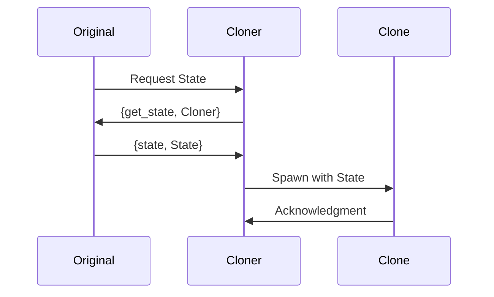

## 8.5 Prototype Pattern through Process Cloning

In this section, we delve into the Prototype Pattern, a creational design pattern that is particularly useful in Erlang's concurrent programming environment. We will explore how this pattern can be implemented through process cloning, providing a flexible and efficient way to manage processes and data structures.

### Understanding the Prototype Pattern

The Prototype Pattern is a creational design pattern that allows objects to be cloned, creating new instances based on a prototype. This pattern is particularly useful when the cost of creating a new instance is more expensive than copying an existing one. In the context of Erlang, this pattern can be applied to processes, allowing us to clone existing processes to create new ones with similar behavior and state.

#### Intent

The intent of the Prototype Pattern is to:

- **Reduce the cost of creating objects** by cloning existing ones.
- **Provide flexibility** in creating new instances with varying configurations.
- **Simplify the creation of complex objects** by reusing existing prototypes.

### Cloning in Erlang: Processes and Data

In Erlang, cloning can be applied to both processes and data structures. Let's explore how each can be achieved:

#### Cloning Processes

Erlang's lightweight process model makes it an ideal candidate for process cloning. By cloning a process, we can create a new process that inherits the state and behavior of the original. This is particularly useful in scenarios where processes need to be replicated with slight variations.

**Example: Cloning a Process**

```erlang
-module(process_cloner).
-export([start/0, clone_process/1, process_behavior/1]).

start() ->
    % Start the original process
    Pid = spawn(?MODULE, process_behavior, ["Original"]),
    % Clone the process
    clone_process(Pid).

clone_process(OriginalPid) ->
    % Retrieve the state from the original process
    State = get_state(OriginalPid),
    % Spawn a new process with the same state
    spawn(?MODULE, process_behavior, [State]).

process_behavior(State) ->
    receive
        {get_state, From} ->
            From ! {state, State},
            process_behavior(State);
        stop ->
            ok
    end.

get_state(Pid) ->
    Pid ! {get_state, self()},
    receive
        {state, State} -> State
    end.
```

In this example, we define a module `process_cloner` that can clone a process. The `start/0` function spawns an original process and then clones it using `clone_process/1`. The `process_behavior/1` function defines the behavior of the process, which can handle messages to retrieve its state or stop execution.

#### Cloning Data Structures

While Erlang's immutable data structures do not require cloning in the traditional sense, we can create new instances based on existing ones by copying and modifying data.

**Example: Cloning a Data Structure**

```erlang
-module(data_cloner).
-export([clone_map/1]).

clone_map(Map) ->
    % Create a new map based on the existing one
    NewMap = maps:merge(Map, #{new_key => new_value}),
    NewMap.
```

In this example, we demonstrate how to clone a map by merging it with a new key-value pair. This creates a new map instance based on the original.

### Scenarios for Cloning

Cloning processes and data structures can be beneficial in various scenarios:

- **Load Balancing**: Cloning processes can help distribute workload across multiple processes, improving system performance.
- **Fault Tolerance**: By maintaining clones of critical processes, systems can quickly recover from failures.
- **Configuration Management**: Cloning allows for easy creation of processes with different configurations, facilitating testing and deployment.

### Visualizing Process Cloning

To better understand the concept of process cloning, let's visualize the process using a sequence diagram.



This diagram illustrates the interaction between the original process, the cloner, and the clone. The cloner requests the state from the original process, then spawns a new process with the retrieved state.

### Erlang's Unique Features

Erlang's concurrency model and lightweight processes make it uniquely suited for implementing the Prototype Pattern through process cloning. The ability to spawn thousands of processes with minimal overhead allows developers to efficiently manage and replicate processes as needed.

### Design Considerations

When implementing the Prototype Pattern in Erlang, consider the following:

- **State Management**: Ensure that the state of the original process is accurately captured and transferred to the clone.
- **Process Communication**: Maintain clear communication channels between processes to avoid message loss or duplication.
- **Resource Management**: Monitor system resources to prevent excessive process creation that could lead to performance degradation.

### Differences and Similarities

The Prototype Pattern in Erlang shares similarities with other creational patterns, such as the Factory Pattern, in that it provides a mechanism for creating new instances. However, it differs in its focus on cloning existing instances rather than constructing new ones from scratch.

### Try It Yourself

To deepen your understanding of process cloning, try modifying the provided code examples:

- **Experiment with Different States**: Change the state of the original process and observe how it affects the clone.
- **Implement Additional Behaviors**: Add new message handlers to the process behavior and see how they are inherited by the clone.
- **Create Multiple Clones**: Spawn multiple clones from the original process and test their interactions.

### Knowledge Check

Before we conclude, let's reinforce what we've learned:

- **What is the primary benefit of the Prototype Pattern?**
- **How does Erlang's concurrency model facilitate process cloning?**
- **In what scenarios might process cloning be particularly useful?**

### Conclusion

The Prototype Pattern through process cloning is a powerful tool in Erlang's design pattern arsenal. By leveraging Erlang's unique features, developers can efficiently manage processes and data structures, enhancing the flexibility and performance of their applications. Remember, this is just the beginning. As you progress, you'll discover more ways to apply these concepts in your projects. Keep experimenting, stay curious, and enjoy the journey!

## Quiz: Prototype Pattern through Process Cloning



### What is the primary benefit of the Prototype Pattern?

- [x] Reducing the cost of creating objects by cloning existing ones
- [ ] Increasing the complexity of object creation
- [ ] Simplifying the destruction of objects
- [ ] Enhancing the security of object creation

> **Explanation:** The Prototype Pattern reduces the cost of creating objects by allowing existing ones to be cloned, which is more efficient than creating new instances from scratch.

### How does Erlang's concurrency model facilitate process cloning?

- [x] By allowing lightweight processes to be spawned with minimal overhead
- [ ] By requiring heavy synchronization between processes
- [ ] By limiting the number of processes that can be created
- [ ] By enforcing strict memory management

> **Explanation:** Erlang's concurrency model supports lightweight processes, enabling efficient process cloning with minimal overhead.

### In what scenarios might process cloning be particularly useful?

- [x] Load balancing and fault tolerance
- [ ] Reducing code readability
- [ ] Increasing system complexity
- [ ] Limiting process communication

> **Explanation:** Process cloning is useful in scenarios like load balancing and fault tolerance, where replicating processes can enhance system performance and reliability.

### What is a key consideration when implementing the Prototype Pattern in Erlang?

- [x] Accurate state management and transfer
- [ ] Increasing the number of processes indefinitely
- [ ] Reducing process communication
- [ ] Limiting process spawning

> **Explanation:** Accurate state management and transfer are crucial when implementing the Prototype Pattern to ensure that clones function correctly.

### What is a unique feature of Erlang that supports the Prototype Pattern?

- [x] Lightweight process model
- [ ] Heavyweight process model
- [ ] Strict typing system
- [ ] Object-oriented programming

> **Explanation:** Erlang's lightweight process model supports the Prototype Pattern by allowing efficient process cloning.

### How can process cloning aid in configuration management?

- [x] By creating processes with different configurations easily
- [ ] By limiting the number of configurations available
- [ ] By enforcing a single configuration for all processes
- [ ] By reducing the flexibility of configuration changes

> **Explanation:** Process cloning allows for easy creation of processes with different configurations, facilitating testing and deployment.

### What is a potential pitfall of excessive process creation?

- [x] Performance degradation due to resource exhaustion
- [ ] Improved system performance
- [ ] Increased code readability
- [ ] Enhanced security

> **Explanation:** Excessive process creation can lead to performance degradation due to resource exhaustion.

### How can you experiment with the provided code examples?

- [x] By changing the state of the original process and observing the clone
- [ ] By deleting the original process
- [ ] By reducing the number of message handlers
- [ ] By limiting the number of clones

> **Explanation:** Experimenting with different states in the original process can help understand how it affects the clone.

### What is a similarity between the Prototype Pattern and the Factory Pattern?

- [x] Both provide mechanisms for creating new instances
- [ ] Both focus on destroying existing instances
- [ ] Both enhance object security
- [ ] Both limit object creation

> **Explanation:** Both the Prototype Pattern and the Factory Pattern provide mechanisms for creating new instances, though they differ in their approaches.

### True or False: The Prototype Pattern in Erlang is primarily used for destroying processes.

- [ ] True
- [x] False

> **Explanation:** False. The Prototype Pattern is used for cloning processes, not destroying them.


