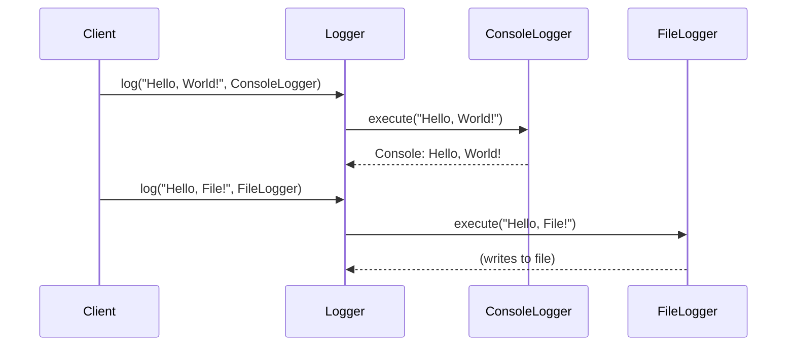

## 8.6 Dependency Injection via Parameters and Behaviors

In this section, we delve into the concept of dependency injection (DI) in Erlang, focusing on how it can be achieved through function parameters and behaviors. Dependency injection is a design pattern that helps in creating loosely coupled systems, making them easier to test, maintain, and extend.

### Understanding Dependency Injection

**Dependency Injection** is a technique where an object or function receives its dependencies from an external source rather than creating them internally. This approach promotes separation of concerns and enhances modularity. The primary goals of dependency injection are:

- **Decoupling**: Reduce the tight coupling between components, allowing them to evolve independently.
- **Testability**: Facilitate unit testing by enabling the use of mock objects or stubs.
- **Flexibility**: Allow easy swapping of components or services without modifying the dependent code.

### Dependency Injection in Erlang

Erlang, being a functional language, approaches dependency injection differently compared to object-oriented languages. Instead of injecting objects, we inject functions or modules. Erlang's functional nature, along with its powerful concurrency model, provides unique ways to implement DI.

#### Passing Dependencies as Parameters

One of the simplest ways to achieve dependency injection in Erlang is by passing dependencies as parameters to functions or modules. This method allows you to inject different implementations of a dependency at runtime.

**Example:**

Let's consider a simple logging system where we want to inject different logging strategies.

```erlang
-module(logger).
-export([log/2]).

log(Message, LogFunction) ->
    LogFunction(Message).
```

In this example, `log/2` takes a `Message` and a `LogFunction`. The `LogFunction` is a higher-order function that defines how the message should be logged.

**Usage:**

```erlang
1> ConsoleLogger = fun(Message) -> io:format("Console: ~s~n", [Message]) end.
2> FileLogger = fun(Message) -> file:write_file("log.txt", Message ++ "\n", [append]) end.
3> logger:log("Hello, World!", ConsoleLogger).
Console: Hello, World!
4> logger:log("Hello, File!", FileLogger).
```

In this example, we define two logging strategies: `ConsoleLogger` and `FileLogger`. We can inject either of these into the `log/2` function, demonstrating the flexibility of passing dependencies as parameters.

#### Using Behaviors to Abstract Dependencies

Erlang's behaviors provide a way to define a common interface for different modules. By using behaviors, we can abstract dependencies and ensure that different implementations conform to the same contract.

**Example:**

Suppose we have a payment processing system with different payment gateways. We can define a behavior for the payment gateway interface.

```erlang
-module(payment_gateway).
-export([process_payment/2]).

-callback process_payment(Amount, Currency) -> ok | {error, Reason}.
```

Each payment gateway module must implement the `process_payment/2` function.

**Stripe Payment Gateway:**

```erlang
-module(stripe_gateway).
-behavior(payment_gateway).
-export([process_payment/2]).

process_payment(Amount, Currency) ->
    % Stripe-specific implementation
    io:format("Processing Stripe payment of ~p ~s~n", [Amount, Currency]),
    ok.
```

**PayPal Payment Gateway:**

```erlang
-module(paypal_gateway).
-behavior(payment_gateway).
-export([process_payment/2]).

process_payment(Amount, Currency) ->
    % PayPal-specific implementation
    io:format("Processing PayPal payment of ~p ~s~n", [Amount, Currency]),
    ok.
```

**Usage:**

```erlang
1> stripe_gateway:process_payment(100, "USD").
Processing Stripe payment of 100 USD
ok
2> paypal_gateway:process_payment(200, "EUR").
Processing PayPal payment of 200 EUR
ok
```

By using behaviors, we ensure that both `stripe_gateway` and `paypal_gateway` conform to the `payment_gateway` interface, allowing us to swap implementations easily.

### Decoupling Modules with Dependency Injection

Decoupling modules is a key benefit of dependency injection. By injecting dependencies, we can separate concerns and allow modules to focus on their primary responsibilities.

**Example:**

Consider a notification system that can send notifications via email or SMS. We can decouple the notification sending logic from the notification creation logic.

**Notification Module:**

```erlang
-module(notification).
-export([send_notification/3]).

send_notification(User, Message, SendFunction) ->
    SendFunction(User, Message).
```

**Email Sender:**

```erlang
-module(email_sender).
-export([send/2]).

send(User, Message) ->
    io:format("Sending email to ~s: ~s~n", [User, Message]).
```

**SMS Sender:**

```erlang
-module(sms_sender).
-export([send/2]).

send(User, Message) ->
    io:format("Sending SMS to ~s: ~s~n", [User, Message]).
```

**Usage:**

```erlang
1> notification:send_notification("alice@example.com", "Hello, Alice!", fun email_sender:send/2).
Sending email to alice@example.com: Hello, Alice!
2> notification:send_notification("1234567890", "Hello, Bob!", fun sms_sender:send/2).
Sending SMS to 1234567890: Hello, Bob!
```

In this example, the `notification` module is decoupled from the actual sending mechanism, allowing us to inject different sending strategies.

### Visualizing Dependency Injection in Erlang

To better understand how dependency injection works in Erlang, let's visualize the process using a sequence diagram.



**Diagram Description:**

- The `Client` calls the `Logger` with a message and a logging strategy.
- The `Logger` delegates the logging task to the injected strategy (`ConsoleLogger` or `FileLogger`).
- Each strategy handles the message according to its implementation.

### Design Considerations

When implementing dependency injection in Erlang, consider the following:

- **Interface Consistency**: Ensure that all implementations conform to the expected interface, especially when using behaviors.
- **Performance**: Passing functions as parameters can introduce overhead. Evaluate the performance implications in performance-critical applications.
- **Complexity**: While DI promotes flexibility, it can also introduce complexity. Use it judiciously to avoid over-engineering.

### Erlang Unique Features

Erlang's functional nature and concurrency model offer unique advantages for dependency injection:

- **Higher-Order Functions**: Erlang's support for higher-order functions makes it easy to pass functions as dependencies.
- **Behaviors**: Erlang's behavior mechanism provides a powerful way to define and enforce interfaces, promoting consistency across implementations.
- **Concurrency**: Erlang's lightweight processes allow for concurrent execution of different strategies, enhancing performance in distributed systems.

### Differences and Similarities

Dependency injection in Erlang differs from object-oriented languages in that it focuses on injecting functions or modules rather than objects. However, the core principles of decoupling and flexibility remain the same.

### Try It Yourself

Experiment with the code examples provided in this section. Try creating your own logging strategies or payment gateways. Modify the implementations to see how easily you can swap dependencies without changing the core logic.

### Knowledge Check

- What are the primary goals of dependency injection?
- How does Erlang's functional nature influence its approach to dependency injection?
- What are the benefits of using behaviors for dependency injection in Erlang?

### Embrace the Journey

Remember, this is just the beginning. As you progress, you'll discover more ways to leverage dependency injection to build flexible and maintainable systems. Keep experimenting, stay curious, and enjoy the journey!

## Quiz: Dependency Injection via Parameters and Behaviors



### What is the primary goal of dependency injection?

- [x] To decouple components and enhance flexibility
- [ ] To increase code complexity
- [ ] To reduce performance
- [ ] To enforce strict coupling

> **Explanation:** Dependency injection aims to decouple components, making them more flexible and easier to maintain.

### How does Erlang achieve dependency injection?

- [x] By passing functions or modules as parameters
- [ ] By using classes and objects
- [ ] By enforcing strict type checking
- [ ] By using global variables

> **Explanation:** Erlang achieves dependency injection by passing functions or modules as parameters, leveraging its functional nature.

### What is a behavior in Erlang?

- [x] A way to define a common interface for modules
- [ ] A global variable
- [ ] A type of process
- [ ] A data structure

> **Explanation:** A behavior in Erlang defines a common interface that modules must implement, promoting consistency.

### What is a benefit of using behaviors for dependency injection?

- [x] Ensures interface consistency across implementations
- [ ] Increases code complexity
- [ ] Reduces flexibility
- [ ] Enforces strict coupling

> **Explanation:** Behaviors ensure that all implementations conform to a consistent interface, enhancing flexibility and consistency.

### Which of the following is a unique feature of Erlang that aids in dependency injection?

- [x] Higher-order functions
- [ ] Classes and objects
- [ ] Global variables
- [ ] Strict type checking

> **Explanation:** Erlang's support for higher-order functions allows for easy passing of functions as dependencies.

### What is a potential drawback of dependency injection?

- [x] Increased complexity
- [ ] Reduced flexibility
- [ ] Strict coupling
- [ ] Decreased testability

> **Explanation:** While DI promotes flexibility, it can also introduce complexity if not used judiciously.

### How can you inject different implementations in Erlang?

- [x] By passing different functions or modules as parameters
- [ ] By using global variables
- [ ] By modifying the core logic
- [ ] By using inheritance

> **Explanation:** Different implementations can be injected by passing different functions or modules as parameters.

### What is the role of a higher-order function in dependency injection?

- [x] To allow functions to be passed as parameters
- [ ] To enforce strict type checking
- [ ] To increase code complexity
- [ ] To reduce flexibility

> **Explanation:** Higher-order functions enable functions to be passed as parameters, facilitating dependency injection.

### Which of the following is NOT a benefit of dependency injection?

- [ ] Decoupling components
- [ ] Enhancing testability
- [ ] Increasing flexibility
- [x] Enforcing strict coupling

> **Explanation:** Dependency injection aims to decouple components, not enforce strict coupling.

### True or False: Dependency injection in Erlang focuses on injecting objects.

- [ ] True
- [x] False

> **Explanation:** Dependency injection in Erlang focuses on injecting functions or modules, not objects.


