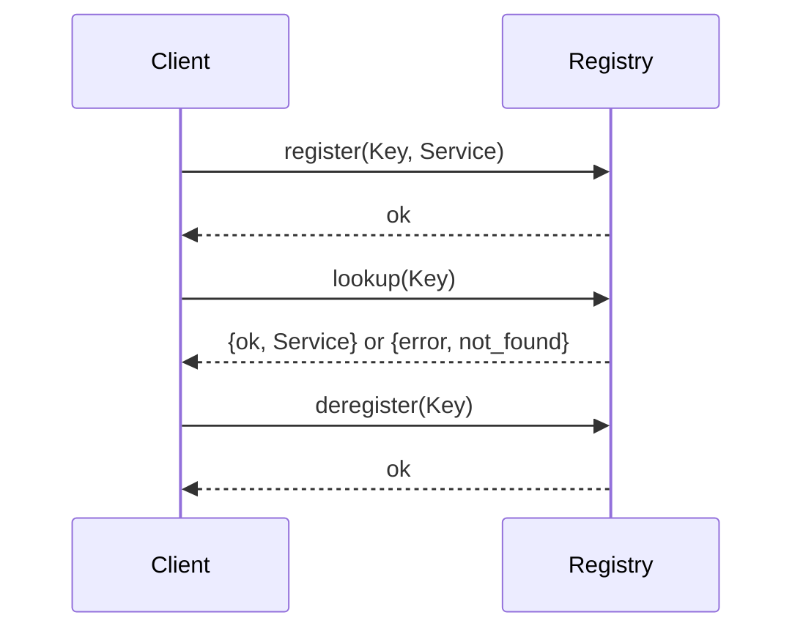

## 8.7 Registry Pattern with Erlang Processes

In this section, we delve into the Registry Pattern, a crucial design pattern in Erlang that leverages processes to efficiently manage and track services or objects. This pattern is particularly useful in concurrent and distributed systems, where maintaining a centralized registry can simplify the management of various components.

### Understanding the Registry Pattern

The Registry Pattern is a structural design pattern that provides a centralized location for storing and retrieving instances of objects or services. In Erlang, this pattern is implemented using processes, which act as registries to keep track of these instances. The primary purpose of the Registry Pattern is to facilitate easy access to shared resources, ensuring that they can be efficiently located and utilized by different parts of an application.

#### Intent

- **Centralized Management**: Provide a single point of access for managing and retrieving services or objects.
- **Decoupling**: Reduce dependencies between components by using a registry to manage interactions.
- **Scalability**: Enhance the scalability of applications by efficiently managing resources in a concurrent environment.

### Key Participants

- **Registry Process**: A dedicated Erlang process that maintains a mapping of keys to services or objects.
- **Clients**: Processes that interact with the registry to register, deregister, or look up services.
- **Services/Objects**: The actual instances being managed by the registry.

### Applicability

The Registry Pattern is applicable in scenarios where:

- You need a centralized mechanism to manage and access shared resources.
- There is a requirement to decouple service discovery from service usage.
- You are building a system that requires dynamic registration and lookup of services.

### Implementing the Registry Pattern in Erlang

To implement the Registry Pattern in Erlang, we use a dedicated process to act as the registry. This process maintains a mapping of keys to services or objects, allowing other processes to register, deregister, and look up these services.

#### Sample Code Snippet

Let's explore a simple implementation of the Registry Pattern in Erlang:

```erlang
-module(registry).
-export([start/0, register/2, lookup/1, deregister/1]).

%% Start the registry process
start() ->
    spawn(fun() -> loop(#{}). end).

%% Register a service with a given key
register(Key, Service) ->
    registry ! {register, Key, Service}.

%% Lookup a service by key
lookup(Key) ->
    registry ! {lookup, Key, self()},
    receive
        {ok, Service} -> {ok, Service};
        {error, Reason} -> {error, Reason}
    end.

%% Deregister a service by key
deregister(Key) ->
    registry ! {deregister, Key}.

%% Internal loop to handle messages
loop(Registry) ->
    receive
        {register, Key, Service} ->
            NewRegistry = maps:put(Key, Service, Registry),
            loop(NewRegistry);
        {lookup, Key, Caller} ->
            case maps:find(Key, Registry) of
                {ok, Service} -> Caller ! {ok, Service};
                error -> Caller ! {error, not_found}
            end,
            loop(Registry);
        {deregister, Key} ->
            NewRegistry = maps:remove(Key, Registry),
            loop(NewRegistry)
    end.
```

#### Explanation

- **Registry Process**: The `start/0` function spawns a new process that runs the `loop/1` function, which maintains the registry state.
- **Registering Services**: The `register/2` function sends a message to the registry process to add a new service.
- **Looking Up Services**: The `lookup/1` function sends a lookup request and waits for a response from the registry process.
- **Deregistering Services**: The `deregister/1` function sends a message to remove a service from the registry.

### Thread Safety and Concurrency Considerations

Erlang's actor model inherently provides thread safety, as each process has its own memory space and communicates with other processes via message passing. This makes the Registry Pattern naturally thread-safe in Erlang. However, there are still some considerations to keep in mind:

- **Concurrency**: Ensure that the registry process can handle concurrent requests efficiently. This can be achieved by optimizing the message handling loop and using efficient data structures like maps.
- **Fault Tolerance**: Implement mechanisms to handle process crashes and ensure that the registry can recover gracefully. This can be done using Erlang's supervision trees.
- **Scalability**: Consider the scalability of the registry process. For large-scale systems, you might need to implement distributed registries or partition the registry data.

### Visualizing the Registry Pattern

To better understand the flow of the Registry Pattern, let's visualize the interactions between the registry process and client processes using a sequence diagram.



**Diagram Description**: This sequence diagram illustrates the interactions between a client process and the registry process. The client can register, lookup, and deregister services, with the registry process responding accordingly.

### Erlang Unique Features

Erlang's unique features, such as lightweight processes, message passing, and fault tolerance, make it an ideal language for implementing the Registry Pattern. The ability to spawn thousands of processes allows for efficient management of services, while the actor model ensures thread safety and concurrency.

### Differences and Similarities

The Registry Pattern in Erlang shares similarities with service registries in other languages, but it leverages Erlang's process model for implementation. Unlike object-oriented languages where registries might be implemented as singleton classes, Erlang uses processes to achieve the same functionality, providing better concurrency and fault tolerance.

### Design Considerations

When implementing the Registry Pattern in Erlang, consider the following:

- **Process Naming**: Use meaningful names for registry processes to simplify debugging and maintenance.
- **Error Handling**: Implement robust error handling to manage unexpected failures.
- **Performance**: Optimize the registry process for performance, especially in high-load scenarios.

### Try It Yourself

To gain a deeper understanding of the Registry Pattern, try modifying the code example to add features such as:

- **Timeouts**: Implement timeouts for lookup requests to handle unresponsive services.
- **Logging**: Add logging to track registry operations and monitor performance.
- **Distributed Registry**: Extend the implementation to support a distributed registry across multiple nodes.

### Knowledge Check

- What is the primary purpose of the Registry Pattern?
- How does Erlang's actor model contribute to thread safety in the Registry Pattern?
- What are some considerations for implementing a scalable registry in Erlang?

### Embrace the Journey

Remember, mastering design patterns in Erlang is a journey. As you explore the Registry Pattern, you'll gain insights into managing services and objects efficiently in a concurrent environment. Keep experimenting, stay curious, and enjoy the process of learning and applying these concepts in your projects!

## Quiz: Registry Pattern with Erlang Processes



### What is the primary purpose of the Registry Pattern?

- [x] To provide a centralized location for storing and retrieving instances of objects or services.
- [ ] To manage database connections.
- [ ] To handle user authentication.
- [ ] To optimize memory usage.

> **Explanation:** The Registry Pattern is designed to centralize the management of services or objects, making them easily accessible.

### How does Erlang's actor model contribute to thread safety in the Registry Pattern?

- [x] By ensuring each process has its own memory space and communicates via message passing.
- [ ] By using global variables.
- [ ] By locking shared resources.
- [ ] By using mutexes.

> **Explanation:** Erlang's actor model provides thread safety through isolated processes and message passing, eliminating the need for locks.

### Which data structure is commonly used in Erlang to implement the registry?

- [x] Maps
- [ ] Lists
- [ ] Tuples
- [ ] Arrays

> **Explanation:** Maps are used for their efficiency in storing key-value pairs, making them ideal for registries.

### What is a key consideration when implementing a scalable registry in Erlang?

- [x] Optimizing the registry process for performance.
- [ ] Using global variables.
- [ ] Implementing complex algorithms.
- [ ] Avoiding message passing.

> **Explanation:** Performance optimization is crucial for handling high-load scenarios in a scalable registry.

### What is a potential extension to the basic registry implementation?

- [x] Distributed Registry
- [ ] Global Variables
- [ ] Singleton Pattern
- [ ] Complex Algorithms

> **Explanation:** A distributed registry can enhance scalability and fault tolerance across multiple nodes.

### What is the role of the registry process in the Registry Pattern?

- [x] To maintain a mapping of keys to services or objects.
- [ ] To handle user authentication.
- [ ] To manage database connections.
- [ ] To optimize memory usage.

> **Explanation:** The registry process is responsible for managing the mapping of keys to services or objects.

### How can you handle unresponsive services in the registry?

- [x] Implement timeouts for lookup requests.
- [ ] Use global variables.
- [ ] Lock shared resources.
- [ ] Avoid message passing.

> **Explanation:** Implementing timeouts ensures that unresponsive services do not block the registry process.

### What is a benefit of using Erlang's processes for the Registry Pattern?

- [x] Lightweight and efficient management of services.
- [ ] Complex algorithms.
- [ ] Global variables.
- [ ] Singleton classes.

> **Explanation:** Erlang's lightweight processes allow for efficient management of services in the registry.

### What is a common pitfall when implementing the Registry Pattern?

- [x] Not optimizing the registry process for performance.
- [ ] Using global variables.
- [ ] Implementing complex algorithms.
- [ ] Avoiding message passing.

> **Explanation:** Failing to optimize the registry process can lead to performance issues in high-load scenarios.

### True or False: The Registry Pattern in Erlang is implemented using singleton classes.

- [ ] True
- [x] False

> **Explanation:** In Erlang, the Registry Pattern is implemented using processes, not singleton classes, leveraging the actor model for concurrency.


