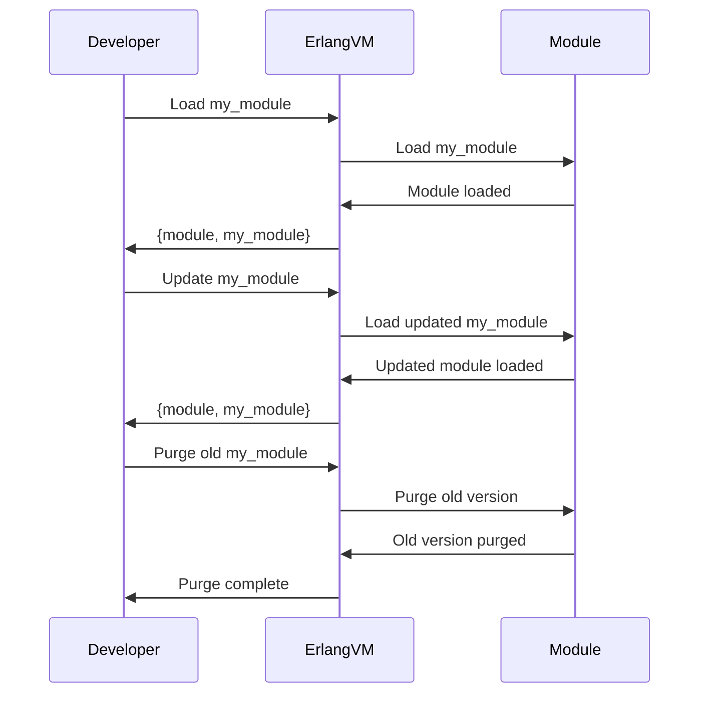

## 8.8 Dynamic Module Loading and Code Updates

Dynamic module loading and code updates are powerful features of Erlang that enable developers to modify and extend applications without stopping them. This capability is crucial for systems requiring high availability and minimal downtime, such as telecommunications and financial services. In this section, we will explore how Erlang supports dynamic module loading and code updates, the implications for system design and maintenance, and best practices for managing dynamic code.

### Understanding Dynamic Module Loading

Dynamic module loading in Erlang allows you to load a module into the system at runtime. This feature is particularly useful for deploying updates or adding new functionality without restarting the application. Erlang's runtime system manages modules, ensuring that the latest version of a module is used whenever it is called.

#### Key Concepts

- **Module**: A module in Erlang is a collection of functions grouped together, typically in a single file. Modules are the building blocks of Erlang applications.
- **Dynamic Loading**: The process of loading a module into the Erlang runtime system while the application is running.
- **Code Server**: A component of the Erlang runtime system responsible for managing modules, including loading, reloading, and purging them.

### Loading Modules at Runtime

To load a module dynamically, you can use the `code:load_file/1` function. This function takes the name of the module (without the `.erl` extension) and loads it into the system.

```erlang
% Load the module 'my_module' at runtime
{module, my_module} = code:load_file(my_module).
```

In this example, the `my_module` is loaded into the system, and the latest version of the module is now available for use.

#### Code Example: Dynamic Loading

Let's consider a simple example where we dynamically load a module that provides a greeting function.

```erlang
% my_module.erl
-module(my_module).
-export([greet/0]).

greet() ->
    io:format("Hello, world!~n").
```

To load this module dynamically, you would use:

```erlang
% Load the module
{module, my_module} = code:load_file(my_module).

% Call the greet function
my_module:greet().
```

### Updating Modules at Runtime

Erlang's ability to update modules at runtime is a cornerstone of its support for high-availability systems. When a module is updated, the new version is loaded into the system, and existing processes can continue to use the old version until they are ready to switch to the new one.

#### Code Example: Updating a Module

Suppose we have an updated version of `my_module` with an enhanced greeting function:

```erlang
% my_module.erl (updated)
-module(my_module).
-export([greet/0]).

greet() ->
    io:format("Hello, Erlang world!~n").
```

To update the module, you would recompile it and load the new version:

```erlang
% Recompile and load the updated module
c(my_module).

% Call the updated greet function
my_module:greet().
```

### Purging Old Code

When a module is updated, the old version remains in memory until it is explicitly purged. This allows running processes to finish using the old version before switching to the new one. The `code:purge/1` function is used to remove the old version of a module from memory.

```erlang
% Purge the old version of the module
code:purge(my_module).
```

### Implications for System Design and Maintenance

Dynamic module loading and code updates have significant implications for system design and maintenance:

- **High Availability**: Systems can remain operational while updates are applied, minimizing downtime.
- **Flexibility**: New features can be deployed without requiring a full system restart.
- **Complexity**: Managing multiple versions of a module can increase system complexity, requiring careful planning and testing.

### Best Practices for Dynamic Code Management

1. **Version Control**: Use version control systems to manage different versions of your modules and ensure consistency across deployments.
2. **Testing**: Thoroughly test new versions of modules in a staging environment before deploying them to production.
3. **Documentation**: Maintain clear documentation of module versions and changes to facilitate troubleshooting and maintenance.
4. **Monitoring**: Implement monitoring to detect issues related to dynamic code updates, such as memory leaks or performance degradation.
5. **Fallback Mechanisms**: Design your system with fallback mechanisms to revert to a previous version if an update causes issues.

### Visualizing Dynamic Module Loading and Code Updates

To better understand the process of dynamic module loading and code updates, let's visualize it using a sequence diagram.



This diagram illustrates the interaction between the developer, the Erlang virtual machine, and the module during the loading, updating, and purging processes.

### Try It Yourself

To gain hands-on experience with dynamic module loading and code updates, try the following exercises:

1. **Modify the Greeting**: Update the `greet/0` function in `my_module` to include the current date and time. Load the updated module and verify the changes.
2. **Add a New Function**: Add a new function to `my_module` that returns a personalized greeting. Load the module and test the new function.
3. **Simulate a Rollback**: After updating `my_module`, simulate a rollback by reloading the previous version and purging the updated version.

### Knowledge Check

- What are the benefits of dynamic module loading in Erlang?
- How does Erlang handle multiple versions of a module during an update?
- What are some best practices for managing dynamic code updates?

### Conclusion

Dynamic module loading and code updates are powerful features of Erlang that enable developers to maintain high availability and flexibility in their applications. By understanding the process and following best practices, you can effectively manage dynamic code and ensure the reliability of your systems.

Remember, this is just the beginning. As you progress, you'll build more complex and interactive applications. Keep experimenting, stay curious, and enjoy the journey!

## Quiz: Dynamic Module Loading and Code Updates



### What is the primary benefit of dynamic module loading in Erlang?

- [x] High availability with minimal downtime
- [ ] Improved performance
- [ ] Simplified code structure
- [ ] Enhanced security

> **Explanation:** Dynamic module loading allows updates without stopping the application, ensuring high availability.

### Which function is used to load a module at runtime in Erlang?

- [x] `code:load_file/1`
- [ ] `code:purge/1`
- [ ] `code:compile/1`
- [ ] `code:reload/1`

> **Explanation:** `code:load_file/1` is used to load a module into the system at runtime.

### What does the `code:purge/1` function do?

- [x] Removes the old version of a module from memory
- [ ] Compiles a module
- [ ] Loads a module into the system
- [ ] Updates a module to the latest version

> **Explanation:** `code:purge/1` is used to remove the old version of a module from memory.

### Why is testing important before deploying a new module version?

- [x] To ensure the new version works correctly and does not introduce issues
- [ ] To improve performance
- [ ] To simplify the code
- [ ] To enhance security

> **Explanation:** Testing ensures that the new version functions as expected and does not cause problems.

### What is a potential downside of dynamic module updates?

- [x] Increased system complexity
- [ ] Reduced performance
- [ ] Simplified code management
- [ ] Enhanced security

> **Explanation:** Managing multiple versions of a module can increase system complexity.

### How can you revert to a previous module version after an update?

- [x] Reload the previous version and purge the updated version
- [ ] Use `code:compile/1`
- [ ] Use `code:reload/1`
- [ ] Use `code:purge/1`

> **Explanation:** Reloading the previous version and purging the updated version can revert changes.

### What is a best practice for managing dynamic code updates?

- [x] Implement monitoring to detect issues
- [ ] Avoid using version control
- [ ] Skip testing in staging environments
- [ ] Use complex code structures

> **Explanation:** Monitoring helps detect issues related to dynamic code updates.

### Which component of the Erlang runtime system manages modules?

- [x] Code Server
- [ ] Process Scheduler
- [ ] Memory Manager
- [ ] Network Interface

> **Explanation:** The Code Server is responsible for managing modules in Erlang.

### What should you do after updating a module to ensure the old version is not used?

- [x] Purge the old version using `code:purge/1`
- [ ] Reload the module using `code:reload/1`
- [ ] Compile the module using `code:compile/1`
- [ ] Load the module using `code:load_file/1`

> **Explanation:** Purging the old version ensures it is not used by the system.

### True or False: Dynamic module loading can improve system security.

- [ ] True
- [x] False

> **Explanation:** Dynamic module loading primarily improves availability and flexibility, not security.


