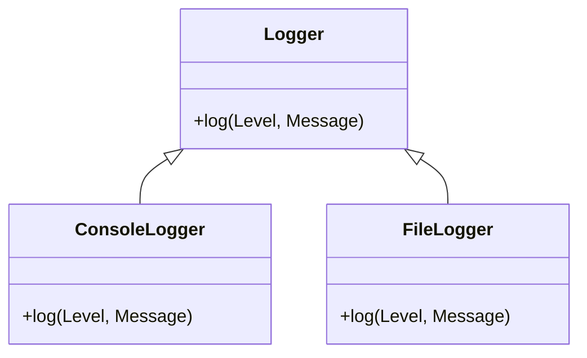

## 8.9 Using Behaviors for Polymorphism

In this section, we delve into the concept of polymorphism in Erlang, particularly through the use of behaviors. Behaviors in Erlang provide a powerful mechanism for defining polymorphic interfaces, allowing different modules to implement a common set of functions. This approach not only enhances code extensibility but also simplifies maintenance, making it a cornerstone of robust Erlang applications.

### Understanding Polymorphism in Erlang

Polymorphism is a fundamental concept in programming that allows entities such as functions or objects to take on multiple forms. In the context of Erlang, polymorphism is achieved through behaviors, which define a set of function signatures that different modules can implement. This allows for interchangeable modules that adhere to a common interface, facilitating flexible and scalable software design.

### Defining Behaviors in Erlang

A behavior in Erlang is essentially a design pattern that provides a template for modules. It specifies a set of callback functions that must be implemented by any module claiming to adhere to that behavior. This is akin to interfaces in object-oriented programming languages, but with a functional twist.

#### Creating a Behavior

To define a behavior, you need to specify the required callback functions. This is typically done in a separate module, often referred to as the behavior module. Here's a simple example:

```erlang
-module(my_behavior).
-export([callback_function/1]).

-callback callback_function(Arg :: any()) -> any().
```

In this example, `my_behavior` defines a single callback function, `callback_function/1`, which any implementing module must provide.

#### Implementing a Behavior

Once a behavior is defined, different modules can implement it by defining the required callback functions. Here's how you might implement `my_behavior` in two different modules:

```erlang
-module(module_one).
-behaviour(my_behavior).

-export([callback_function/1]).

callback_function(Arg) ->
    io:format("Module One: ~p~n", [Arg]).
```

```erlang
-module(module_two).
-behaviour(my_behavior).

-export([callback_function/1]).

callback_function(Arg) ->
    io:format("Module Two: ~p~n", [Arg]).
```

Both `module_one` and `module_two` implement the `callback_function/1` required by `my_behavior`. This allows them to be used interchangeably wherever `my_behavior` is expected.

### Benefits of Using Behaviors for Polymorphism

Using behaviors to achieve polymorphism in Erlang offers several advantages:

1. **Code Extensibility**: By defining a common interface, behaviors make it easy to add new modules without modifying existing code. This is particularly useful in large systems where new functionality needs to be integrated seamlessly.

2. **Code Maintenance**: Behaviors enforce a consistent interface across modules, reducing the likelihood of errors and simplifying maintenance. Changes to the interface can be propagated across all implementing modules, ensuring consistency.

3. **Interchangeability**: Modules implementing the same behavior can be swapped out without affecting the rest of the system. This is ideal for scenarios where different implementations are needed for different environments or configurations.

4. **Encapsulation**: Behaviors encapsulate the details of different implementations, exposing only the necessary interface. This abstraction simplifies the overall system design and enhances modularity.

### Practical Example: Implementing a Behavior

Let's consider a more practical example where we define a behavior for a simple logging system. The behavior will specify a `log/2` function that logs messages with a given severity level.

#### Defining the Logging Behavior

```erlang
-module(logger).
-export([log/2]).

-callback log(Level :: atom(), Message :: string()) -> ok.
```

#### Implementing the Console Logger

```erlang
-module(console_logger).
-behaviour(logger).

-export([log/2]).

log(Level, Message) ->
    io:format("[~p] ~s~n", [Level, Message]).
```

#### Implementing the File Logger

```erlang
-module(file_logger).
-behaviour(logger).

-export([log/2]).

log(Level, Message) ->
    {ok, File} = file:open("log.txt", [append]),
    io:format(File, "[~p] ~s~n", [Level, Message]),
    file:close(File).
```

In this example, both `console_logger` and `file_logger` implement the `logger` behavior. They provide different logging mechanisms—one outputs to the console, while the other writes to a file. This allows for flexible logging strategies that can be easily swapped or extended.

### Visualizing Behavior Implementation

To better understand how behaviors facilitate polymorphism, let's visualize the relationship between the behavior and its implementing modules using a class diagram.



**Diagram Description**: This diagram illustrates the `Logger` behavior and its implementations, `ConsoleLogger` and `FileLogger`. Both classes implement the `log` function, adhering to the `Logger` interface.

### Design Considerations

When using behaviors for polymorphism, consider the following:

- **Interface Stability**: Ensure that the behavior's interface is stable and well-defined, as changes can affect all implementing modules.
- **Documentation**: Clearly document the expected behavior and the purpose of each callback function to aid developers in implementing the behavior correctly.
- **Testing**: Implement comprehensive tests for each module to ensure they adhere to the behavior's contract and function as expected.

### Erlang Unique Features

Erlang's concurrency model and lightweight processes make behaviors particularly powerful. They allow for concurrent implementations of the same behavior, enabling scalable and fault-tolerant systems. Additionally, Erlang's pattern matching and functional paradigm enhance the expressiveness and flexibility of behaviors.

### Differences and Similarities

Behaviors in Erlang are similar to interfaces in object-oriented languages but are more flexible due to Erlang's dynamic nature. Unlike interfaces, behaviors do not enforce type constraints, allowing for more dynamic and adaptable implementations.

### Try It Yourself

To deepen your understanding, try modifying the logging example:

- **Add a new logger**: Implement a new module that logs messages to a database or a remote server.
- **Enhance functionality**: Extend the `log` function to include timestamps or additional metadata.
- **Experiment with concurrency**: Implement a logger that logs messages concurrently using Erlang processes.

### Summary

Behaviors in Erlang provide a robust mechanism for achieving polymorphism, enabling interchangeable modules that adhere to a common interface. This approach enhances code extensibility, maintenance, and modularity, making it a vital tool in the Erlang developer's toolkit.

## Quiz: Using Behaviors for Polymorphism



### What is the primary purpose of behaviors in Erlang?

- [x] To define a common interface for different modules
- [ ] To enforce type constraints on functions
- [ ] To provide a mechanism for error handling
- [ ] To optimize performance

> **Explanation:** Behaviors define a set of function signatures that different modules can implement, allowing for polymorphic interfaces.

### How do behaviors enhance code extensibility?

- [x] By allowing new modules to be added without modifying existing code
- [ ] By enforcing strict type checking
- [ ] By reducing the number of lines of code
- [ ] By optimizing memory usage

> **Explanation:** Behaviors provide a common interface, enabling new modules to be integrated seamlessly without altering existing implementations.

### Which of the following is a benefit of using behaviors?

- [x] Interchangeability of modules
- [ ] Increased memory usage
- [ ] Reduced code readability
- [ ] Enforced type constraints

> **Explanation:** Modules implementing the same behavior can be swapped out without affecting the rest of the system, enhancing flexibility.

### What must a module do to implement a behavior?

- [x] Define all the callback functions specified by the behavior
- [ ] Use the `-export` attribute for all functions
- [ ] Implement a `main/0` function
- [ ] Use the `-include` directive

> **Explanation:** A module must define all the callback functions required by the behavior to adhere to its interface.

### Which of the following is NOT a characteristic of Erlang behaviors?

- [ ] They define a common interface
- [ ] They allow for polymorphic implementations
- [x] They enforce type constraints
- [ ] They enhance code modularity

> **Explanation:** Behaviors do not enforce type constraints; they define a set of function signatures for modules to implement.

### How can behaviors improve code maintenance?

- [x] By enforcing a consistent interface across modules
- [ ] By reducing the number of modules
- [ ] By increasing the complexity of the code
- [ ] By limiting the use of pattern matching

> **Explanation:** Behaviors ensure that all implementing modules adhere to a consistent interface, simplifying maintenance and reducing errors.

### What is a key difference between behaviors and interfaces in object-oriented languages?

- [x] Behaviors do not enforce type constraints
- [ ] Behaviors require inheritance
- [ ] Behaviors are only used for error handling
- [ ] Behaviors are static and cannot be changed

> **Explanation:** Unlike interfaces, behaviors do not enforce type constraints, allowing for more dynamic implementations.

### What is required to define a behavior in Erlang?

- [x] Specifying the required callback functions
- [ ] Implementing a `main/0` function
- [ ] Using the `-include` directive
- [ ] Defining a `start/0` function

> **Explanation:** A behavior is defined by specifying the callback functions that implementing modules must provide.

### In the logging example, what is the purpose of the `log/2` function?

- [x] To log messages with a given severity level
- [ ] To initialize the logging system
- [ ] To handle errors in the logging process
- [ ] To optimize logging performance

> **Explanation:** The `log/2` function logs messages with a specified severity level, as defined by the `logger` behavior.

### True or False: Behaviors in Erlang can only be used for logging systems.

- [ ] True
- [x] False

> **Explanation:** Behaviors can be used for a wide range of applications, not just logging systems, wherever a common interface is needed.



Remember, this is just the beginning. As you progress, you'll build more complex and interactive systems using Erlang's powerful features. Keep experimenting, stay curious, and enjoy the journey!
