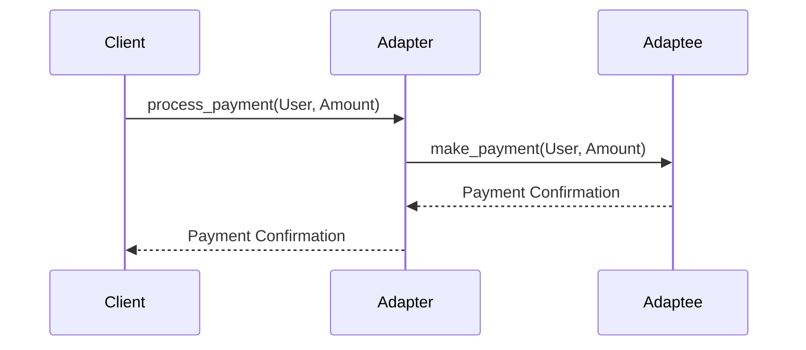

## 9.1 Adapter Pattern with Behaviors

In the world of software development, we often encounter situations where we need to integrate systems or components with incompatible interfaces. The Adapter Pattern is a structural design pattern that allows us to bridge these differences, enabling disparate systems to work together seamlessly. In Erlang, we can leverage behaviors to define target interfaces and create adapter modules that wrap existing modules, making them compatible with the desired interface.

### Understanding the Adapter Pattern

**Intent**: The Adapter Pattern allows objects with incompatible interfaces to collaborate. It acts as a bridge between two incompatible interfaces, enabling them to work together without modifying their existing code.

#### Key Participants

- **Target Interface**: The interface that the client expects.
- **Adapter**: The class or module that implements the target interface and adapts the interface of the Adaptee to the Target Interface.
- **Adaptee**: The existing class or module with an interface that needs adapting.
- **Client**: The entity that interacts with the Target Interface.

### The Role of Behaviors in Erlang

In Erlang, behaviors are a powerful abstraction that define a set of callback functions that a module must implement. They provide a way to define a common interface that multiple modules can adhere to, making them ideal for implementing the Adapter Pattern.

#### Defining a Target Interface with Behaviors

To define a target interface using behaviors, we create a behavior module that specifies the callback functions that any implementing module must provide. This ensures that all adapters conform to the expected interface.

```erlang
-module(my_behavior).
-behaviour_info(callbacks) -> [{do_something, 1}, {do_another_thing, 2}].
```

### Implementing the Adapter Pattern in Erlang

Let's walk through an example to illustrate how we can implement the Adapter Pattern using behaviors in Erlang.

#### Scenario: Adapting a Legacy Payment System

Imagine we have a legacy payment system with an interface that doesn't match the modern payment processing interface we want to use. We'll create an adapter to bridge this gap.

##### Step 1: Define the Target Interface

First, we define the target interface using a behavior module.

```erlang
-module(payment_behavior).
-behaviour_info(callbacks) -> [{process_payment, 2}, {refund_payment, 2}].
```

##### Step 2: Implement the Adapter Module

Next, we create an adapter module that implements the behavior and adapts the legacy system's interface.

```erlang
-module(legacy_payment_adapter).
-behaviour(payment_behavior).

-export([process_payment/2, refund_payment/2]).

% Adaptee: Legacy payment system
process_payment(User, Amount) ->
    legacy_payment_system:make_payment(User, Amount).

refund_payment(User, Amount) ->
    legacy_payment_system:process_refund(User, Amount).
```

##### Step 3: Use the Adapter in the Client

Finally, we use the adapter in the client code, interacting with the target interface.

```erlang
-module(payment_client).

-export([execute_payment/2, execute_refund/2]).

execute_payment(User, Amount) ->
    legacy_payment_adapter:process_payment(User, Amount).

execute_refund(User, Amount) ->
    legacy_payment_adapter:refund_payment(User, Amount).
```

### Visualizing the Adapter Pattern

To better understand the flow of the Adapter Pattern, let's visualize it using a sequence diagram.



### When to Use the Adapter Pattern

The Adapter Pattern is particularly useful in the following scenarios:

- **Integrating Legacy Systems**: When you need to integrate a legacy system with a new system that has a different interface.
- **Third-Party Libraries**: When using third-party libraries with interfaces that don't match your application's requirements.
- **Interface Standardization**: When you want to standardize interfaces across different modules or components.

### Design Considerations

- **Performance Overhead**: Consider the potential performance overhead introduced by the adapter layer.
- **Complexity**: Avoid unnecessary complexity by using the Adapter Pattern only when truly needed.
- **Maintainability**: Ensure that the adapter code is well-documented and maintainable.

### Erlang Unique Features

Erlang's concurrency model and fault-tolerant design make it uniquely suited for implementing the Adapter Pattern in distributed systems. The use of behaviors ensures that adapters conform to a consistent interface, promoting reliability and maintainability.

### Differences and Similarities

The Adapter Pattern is often confused with the Decorator Pattern. While both involve wrapping objects, the Adapter Pattern focuses on interface compatibility, whereas the Decorator Pattern adds new functionality to an object.

### Try It Yourself

To deepen your understanding, try modifying the adapter to handle additional payment methods or integrate a different legacy system. Experiment with different scenarios to see how the Adapter Pattern can be applied in various contexts.

### Knowledge Check

- **Question**: What is the primary purpose of the Adapter Pattern?
- **Exercise**: Implement an adapter for a different legacy system using the principles outlined in this section.

### Summary

The Adapter Pattern is a powerful tool for bridging incompatible interfaces, enabling seamless integration between disparate systems. By leveraging Erlang's behaviors, we can define target interfaces and create adapters that ensure compatibility and maintainability.

## Quiz: Adapter Pattern with Behaviors



### What is the primary purpose of the Adapter Pattern?

- [x] To allow objects with incompatible interfaces to work together
- [ ] To add new functionality to an object
- [ ] To create a new interface for an existing object
- [ ] To simplify complex interfaces

> **Explanation:** The Adapter Pattern allows objects with incompatible interfaces to collaborate by acting as a bridge between them.

### How do behaviors in Erlang help implement the Adapter Pattern?

- [x] By defining a set of callback functions that ensure interface consistency
- [ ] By adding new functionality to existing modules
- [ ] By simplifying the implementation of complex interfaces
- [ ] By providing a way to create new interfaces

> **Explanation:** Behaviors in Erlang define a set of callback functions that any implementing module must provide, ensuring consistency in the interface.

### In the Adapter Pattern, what role does the Adaptee play?

- [x] The existing class or module with an interface that needs adapting
- [ ] The class or module that implements the target interface
- [ ] The interface that the client expects
- [ ] The entity that interacts with the target interface

> **Explanation:** The Adaptee is the existing class or module with an interface that needs to be adapted to the target interface.

### When is the Adapter Pattern particularly useful?

- [x] When integrating legacy systems with new systems
- [ ] When adding new functionality to an object
- [ ] When creating new interfaces for existing objects
- [ ] When simplifying complex interfaces

> **Explanation:** The Adapter Pattern is useful when integrating legacy systems with new systems that have different interfaces.

### What is a potential drawback of using the Adapter Pattern?

- [x] Performance overhead introduced by the adapter layer
- [ ] Inability to add new functionality to an object
- [ ] Difficulty in creating new interfaces
- [ ] Complexity in simplifying interfaces

> **Explanation:** The Adapter Pattern can introduce performance overhead due to the additional layer of abstraction.

### How can you visualize the flow of the Adapter Pattern?

- [x] Using a sequence diagram
- [ ] Using a class diagram
- [ ] Using a flowchart
- [ ] Using a state diagram

> **Explanation:** A sequence diagram can effectively visualize the flow of interactions in the Adapter Pattern.

### What is the difference between the Adapter Pattern and the Decorator Pattern?

- [x] The Adapter Pattern focuses on interface compatibility, while the Decorator Pattern adds new functionality
- [ ] The Adapter Pattern adds new functionality, while the Decorator Pattern focuses on interface compatibility
- [ ] Both patterns focus on interface compatibility
- [ ] Both patterns add new functionality

> **Explanation:** The Adapter Pattern focuses on making interfaces compatible, while the Decorator Pattern adds new functionality to an object.

### What is a key benefit of using behaviors in Erlang for the Adapter Pattern?

- [x] Ensuring that adapters conform to a consistent interface
- [ ] Simplifying the implementation of complex interfaces
- [ ] Adding new functionality to existing modules
- [ ] Creating new interfaces for existing objects

> **Explanation:** Behaviors ensure that adapters conform to a consistent interface, promoting reliability and maintainability.

### What should you consider when using the Adapter Pattern?

- [x] Performance overhead and maintainability
- [ ] Adding new functionality to objects
- [ ] Simplifying complex interfaces
- [ ] Creating new interfaces for existing objects

> **Explanation:** Consider the potential performance overhead and ensure that the adapter code is maintainable.

### True or False: The Adapter Pattern is only useful for integrating legacy systems.

- [ ] True
- [x] False

> **Explanation:** While the Adapter Pattern is useful for integrating legacy systems, it can also be applied in other scenarios where interface compatibility is needed.



Remember, this is just the beginning. As you progress, you'll discover more ways to apply the Adapter Pattern and other design patterns in Erlang. Keep experimenting, stay curious, and enjoy the journey!
